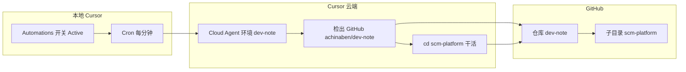

# Cursor Agent 自动化流程：SCM 波次自动推进（Automation + Cloud Agent）

> 本文档说明如何用 **Cursor Automations（定时自动化）** + **Cloud Agent（云端 Agent）** 每分钟推进 `scm-platform` 波次开发，无需在聊天里反复说「继续」。

---

## 1. 你要达成什么

| 目标 | 说明 |
|------|------|
| 定时推进 | 每 **1 分钟** 自动跑一轮，做 W37/W38… 中的一条任务 |
| 工作范围 | 只改 **scm-platform** 子目录（Java 供应链四服务） |
| 记录进度 | 更新 **progress.md**、必要时 **AGENTS.md** |
| 质量门禁 | 改代码后在 `scm-platform` 下跑 `mvn test`（可单模块） |
| 禁止项 | 不改 **业务方案/ai-dev/contracts** 契约字段 |
| Git | **仅** 固定分支 **`cursor/scm-wave`**；禁止一 Run 一个 `cursor/agent-*`；禁止 Automation push `main` |

---

## 2. 整体架构（两张图）



**要点：**

- **Automation** = 闹钟（每分钟叫醒一次 Cloud Agent）。
- **Cloud Agent** = 在云端克隆仓库、改代码、测试、推送。
- 代码在 GitHub 仓库 **`achinaben/dev-note`**，业务代码在子目录 **`scm-platform/`**，不是单独一个 scm-platform 仓库。

---

## 3. 前置条件清单

按顺序打勾，缺一项都会导致「触发了但什么都没做」。

### 3.1 GitHub

- [ ] 仓库 **`achinaben/dev-note`** 在 GitHub 上**不是空仓库**（`main` 上有提交）。
- [ ] 本机已推送：`git push -u origin main` 成功。
- [ ] 推送方式二选一：
  - **SSH**：公钥已加到 GitHub → Settings → SSH keys；
  - **HTTPS**：`git remote set-url origin https://github.com/achinaben/dev-note.git`，用 Personal Access Token 当密码。

### 3.2 Cloud Agents 仪表盘（网页）

打开：https://cursor.com/dashboard?tab=cloud-agents

- [ ] **Environments**：已完成 **Development environment setup**（显示 environment saved，不是 No environments）。
- [ ] **Defaults → Default Repository**：**`achinaben/dev-note`**。
- [ ] **Defaults → Base Branch**：`main` 或留空（PR 对比基准，**不是** Agent push 的工作分支）。

首次建环境若报错 **Git Repository is empty**：先完成 3.1 推送，再点 **Start Agent**。

### 3.3 本地 Cursor 设置

- [ ] **文件 → 打开文件夹** → 整仓根目录（含 `.git` 的那一层，例如 `E:\note\开发-note`）。
- [ ] 左侧 **源代码管理** 能显示 Git 分支。
- [ ] **设置 → Cloud Agents** 不再提示「必须打开含 Git 的文件夹」。
- [ ] **隐私模式**：不要用 **Privacy Mode (Legacy)**（会提示 Cloud agent 不可用）；允许 Cloud Agent。
- [ ] **Pro + Cloud Agent** 已开启。

### 3.4 Automations（IDE 内）

- [ ] 新建/编辑自动化，名称建议：**SCM 波次推进**。
- [ ] 开关：**Active（绿色）**。
- [ ] 触发器：**Custom schedule**，Cron：**`* * * * *`**（每分钟）。
- [ ] **Repository**：**`achinaben/dev-note`**（不能是 No Repository）。
- [ ] **Branch**：**`cursor/scm-wave`**（须先在 GitHub 从 `main` 建好；见分支专题笔记 **2.6 节**）。
- [ ] **Work on current branch**：**开启**（若无此项见 2.6 节验收）。
- [ ] **Tools → Open or update PRs**：**关闭**（波次结束再手动开 1 个 PR）。
- [ ] **Environment**：选已保存的 **dev-note** 环境。
- [ ] **Agent Instructions**：粘贴下文「第 5 节」全文。

---

## 4. 仓库目录结构（必读）

```
dev-note/                    ← Git 根目录（Cloud 检出这一层）
├── scm-platform/            ← Agent 工作目录（必须先 cd 进来）
│   ├── AGENTS.md            ← 当前波次与下一步
│   ├── progress.md          ← 自动化进度与运行日志
│   ├── pom.xml
│   └── ...
├── 业务方案/
├── 提示词/
└── .cursor/automations/     ← 指令草稿（不会自动生效，需复制到 Automations UI）
```

---

## 5. Agent Instructions（复制到 Automations）

将下面整段粘贴到 Automations 的 **Agent Instructions** 框：

```
你是 scm-platform 实现 Agent。本 Automation 每分钟触发，每轮一条任务，不要问我是否继续。

## 云端工作区（必须先做，解决 /agent 空目录）
0. 本任务绑定 GitHub 仓库 achinaben/dev-note（整仓），代码在子目录 scm-platform/。
1. 启动后立刻执行：pwd && ls -la；若当前目录为空或没有 scm-platform，说明未检出仓库——只写 progress 阻塞项「云端未检出 dev-note」后结束，不要用 gh 命令。
2. 进入工作目录：cd scm-platform（若不存在则 find / -maxdepth 4 -type d -name scm-platform 2>/dev/null | head -1 再 cd）。
3. 禁止依赖 gh CLI；不要执行 gh auth / gh repo view。

## 防重 / 空转
4. 读 progress.md 与 AGENTS.md（先 cd scm-platform 再读）。
5. 若运行日志最后一条在 2 分钟内且仅为「跳过」、本轮无变更：追加「跳过：距上轮过近」后结束。
6. 跟 AGENTS.md「下一步」做当前波次；勿因旧波次已完成就停。

## 执行
7. 本轮只做一条未完成项；禁止改 业务方案/ai-dev/contracts 字段。
8. 在 scm-platform 目录执行 mvn test（可 -pl 单模块）；未全绿则修或写阻塞项。
9. 更新 progress.md 运行日志；commit 后 push（见 Git 节）。

## Git（固定工作分支，与个人分支一致）
- 工作分支：cursor/scm-wave（全波次共用；不要每 Run 新建 cursor/agent-*）。
- 每轮成功：push 到 cursor/scm-wave；禁止 push/merge 到 main。

## 结束
10. 中文 3～5 条 bullet：完成项/跳过原因、测试情况、下次从哪项继续。
```

**Cloud 仪表盘须配合：** `workOnCurrentBranch: true`，起始分支 `cursor/scm-wave`（先在 GitHub 从 main 创建）。仅改 Instructions 而仪表盘仍为默认时，仍可能每 Run 一条 `cursor/agent-*`。

---

## 6. 如何确认「真的在跑」

| 检查点 | 正常表现 |
|--------|----------|
| Automations → Run History | 每分钟有新记录 |
| Run 日志 | 出现 `cd scm-platform`、`mvn test`、改文件等 |
| progress.md | 底部「运行日志」有新时间戳一行 |
| GitHub | 仅 **`cursor/scm-wave`** 应长高；合并到 `main` 后本机 `git pull` |

**不正常表现与处理：**

| 现象 | 原因 | 处理 |
|------|------|------|
| 完全没有 Run | 开关未开 / Cloud 未启用 | 见第 3 节 |
| `/agent` 空、找不到 scm-platform | 未绑定 dev-note 仓库 | Repository 选 achinaben/dev-note |
| Git Repository is empty | GitHub 未推送 | `git push -u origin main` |
| Cloud agent + Privacy Legacy | 隐私模式 | 改掉 Legacy，允许 Cloud Agent |
| 每轮只写「跳过」 | 2 分钟内重复触发 | 正常防重；等 2 分钟再看是否有实活 |
| mvn test 全挂 TMS WireMock | Jetty 依赖冲突（老问题） | 可 `-pl` 单模块测；不阻断文档/compose/其他模块 |

---

## 7. Git 分支：仅「个人工作分支」模式（禁止一 Run 一分支）

本项目 **只** 使用固定分支 **`cursor/scm-wave`**，与以前本机「从 main 拉自己的分支、写完再合 main」相同。不采用 `cursor/agent-*` 每 Run 新分支。

### 7.1 和以前本机开发一样

| 以前本机 | 云端应对齐为 |
|----------|--------------|
| 从 `main` 拉 **自己的分支** | 固定 **`cursor/scm-wave`**（名称可自定） |
| 在分支上多次写代码、多次 commit | 多个 **Run** = 多轮 commit，**同一分支** |
| push 到自己的分支 | 每轮成功 → **只 push 该分支**，不要每 Run 新建 `cursor/agent-*` |
| 任务做完再 merge/PR 到 `main` | 波次结束 → **你手动** 1 次 PR/merge 到 `main` |

Run History 只表示「又跑了一轮」；Git 上应 **一条工作分支变长**，不是「一个 Run 一条分支」。

### 7.2 配置要点（Cloud 仪表盘 / API）

| 项 | 推荐值 |
|----|--------|
| `workOnCurrentBranch` | **true**（在当前分支上提交，不每 Run 新建） |
| `startingRef` / 工作分支 | **`cursor/scm-wave`**（先在 GitHub 从 `main` 建好） |
| Instructions | 禁止新建 `cursor/agent-*`；禁止 push/merge 到 `main`（见 `.cursor/automations` 指令草稿） |

仅写 `gitConfig.branch: main` 且 **workOnCurrentBranch 为默认 false** 时，仍会 **每 Run 一个 `cursor/agent-*`**，不符合上表。

### 7.3 配置错误时的表现（应立刻修正）

若仍出现 **`cursor/agent-xxxx`**：说明 **Work on current branch** 未开或 Branch 仍为 `main`。按分支专题笔记 **2.6** 改仪表盘；不要用「挑 agent 分支合并」当日常流程。

更完整说明见：**SCM 波次推进：运行历史与 Git 仓库分支**（提示词目录）。

### 7.4 其他（自动进 main、只盯 PR）

- Cursor **没有**「Run 成功 → 自动 merge main」；与「波次结束再合 main」一致，**不要**指望自动合并。
- **不推荐**每分钟直接推 `main`；与「个人分支」模型不符。
- 可选：`autoCreatePR` + GitHub 检查通过后自动 merge（仍建议 PR 来自 **一条** 工作分支，而非上百条 agent 分支）。

---

## 8. 本地与云端分工

| 场景 | 用 Automation + Cloud | 用本机对话 / Loop |
|------|----------------------|-------------------|
| 无人值守每分钟推进 | 推荐 | 不推荐 |
| 立刻改一大块功能 | 可配合 | 推荐 |
| Docker/Keycloak 本机联调 | Cloud 不负责 | 本机脚本 |
| 看实时 diff | GitHub / pull 后本地看 | 直接 |

**本地 Loop 替代（Cursor 需开着）：**

```text
/loop 1m 读 scm-platform/AGENTS.md 和 progress.md，做下一步一条，mvn test，更新 progress
```

---

## 9. 常用命令速查

### 9.1 本机 Git

```powershell
cd E:\note\开发-note
git pull
git push -u origin main
```

### 9.2 本机联调（与 Automation 无关）

```powershell
cd scm-platform\scripts
.\start-all.ps1 -OmsJwt
.\start-docker-stack.ps1
.\start-edge-full.ps1
$env:SCM_GATEWAY_JWT_URL='http://localhost:8089'
.\run-e2e-gateway-jwt.ps1
```

### 9.3 云端环境初始化脚本（参考）

Cloud 环境 setup 时典型脚本：

```bash
export JAVA_HOME=/usr/lib/jvm/java-17-openjdk-amd64
export PATH="$JAVA_HOME/bin:$PATH"
cd scm-platform
mvn -q install -DskipTests
```

---

## 10. 当前波次（示例，以 AGENTS.md 为准）

推进时以 **scm-platform/AGENTS.md** 中「下一步」为准；撰写时示例为 **W37**：

1. OpenResty 内嵌 lua-resty-openidc 直连 JWKS  
2. 全栈 E2E-06（售后拦截）  
3. edge + kafka 一键脚本与 CI job  

**progress.md** 中对应清单勾选项；每轮只勾一条并写运行日志。

---

## 11. prefill 草稿（可选，用于新建 Automation）

若在 Automations 编辑器支持导入 JSON，可参考仓库内草稿（字段含义）：

| 字段 | 值 |
|------|-----|
| name | SCM 波次推进 |
| cron | `* * * * *` |
| gitConfig.repo | achinaben/dev-note |
| gitConfig.branch | **cursor/scm-wave**（勿填 main 作工作分支） |

**注意：** 仓库里的 JSON **不会自动生效**，必须在 Automations UI 保存并 **Active**。

---

## 12. 故障排查流程图

```
Automation 没反应？
  ├─ Run History 为空 → 检查 Active、Cloud Agent、隐私模式
  ├─ Run 有但 /agent 空 → Repository 选 dev-note + 粘贴第 5 节指令
  ├─ empty repository → git push main
  └─ 有改代码但本地看不到 → git pull

Run 正常但只「跳过」？
  └─ 等 2 分钟；或 progress 刚更新过（防重）

mvn test 失败？
  └─ 看模块；TMS WireMock 已知问题，可单模块或记阻塞继续其他项
```

---

## 13. 维护建议

1. **每完成一波**：更新 AGENTS.md「当前波次 / 下一步」，progress.md「目标波次」与清单。  
2. **指令变更**：改 Automations 里 Instructions，并同步更新 `.cursor/automations` 下草稿备查。  
3. **本机定期** `git pull`，避免与云端 push 冲突。  
4. **不要**把密钥写进 Instructions；用 Cloud Secrets 管理。  

---

## 14. 相关草稿位置（维护者）

| 用途 | 仓库内路径 |
|------|------------|
| 指令正文 | `.cursor/automations/scm-wave-minute.instructions.txt` |
| UI 预填 JSON | `.cursor/automations/scm-wave-minute.prefill.json` |
| 波次目标 | `scm-platform/AGENTS.md` |
| 运行日志 | `scm-platform/progress.md` |
| IDE 规则 | `.cursor/rules/scm-wave-automation.mdc` |

---

*文档版本：2026-06-02（含第 7 节个人分支模型），对应当前 dev-note + scm-platform W37 自动化实践。*
