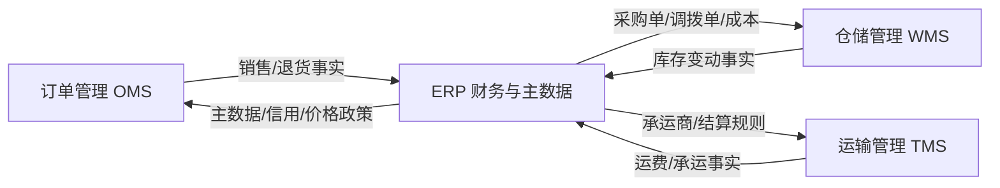
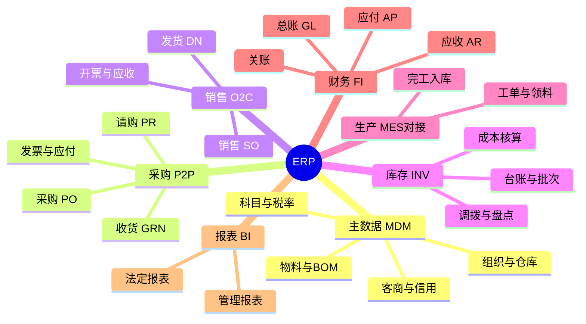
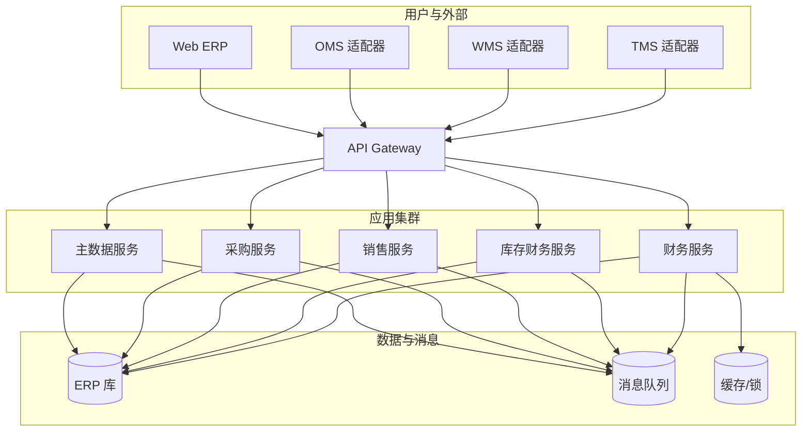
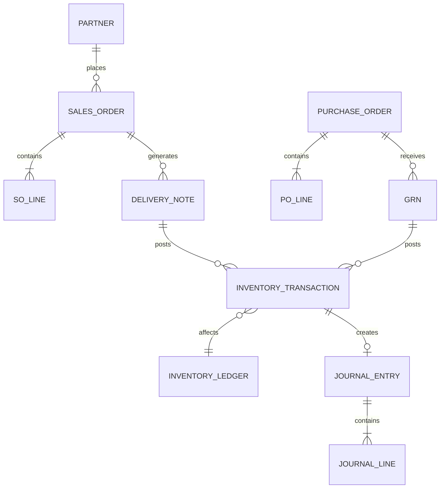
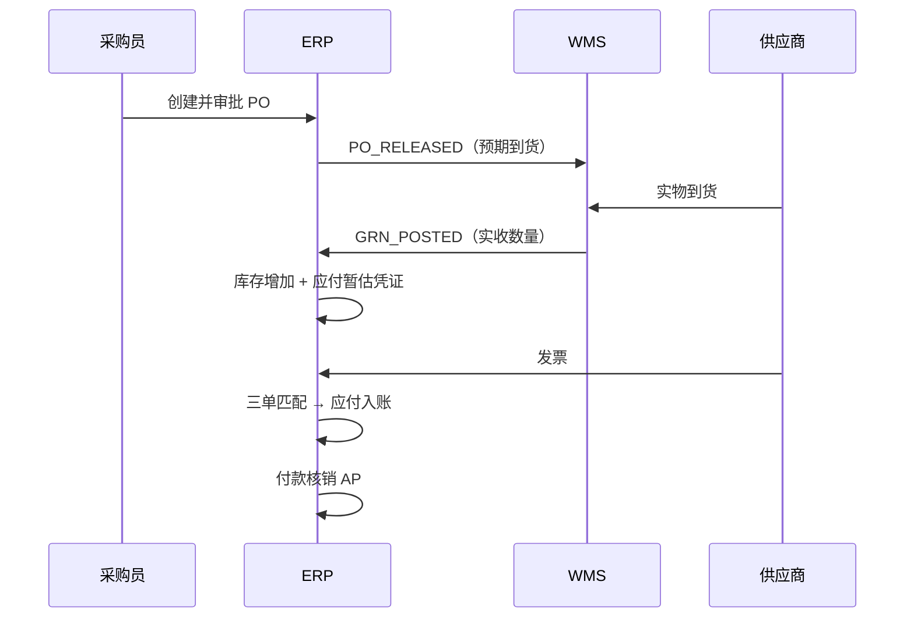
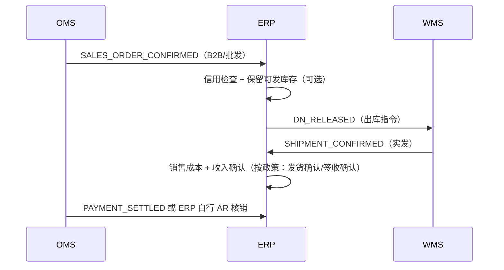
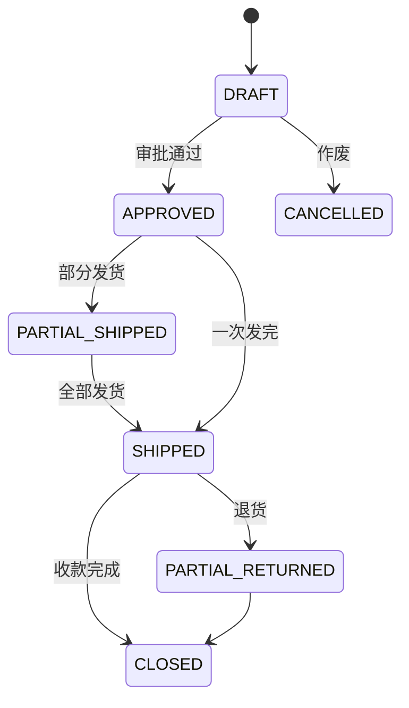
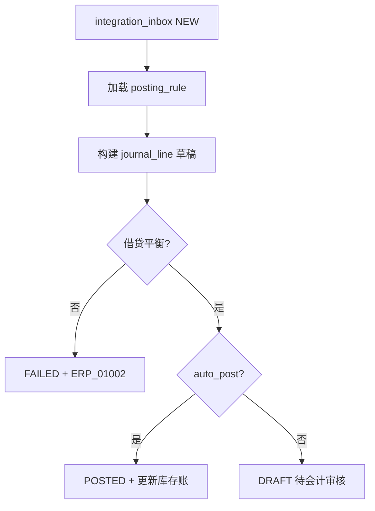
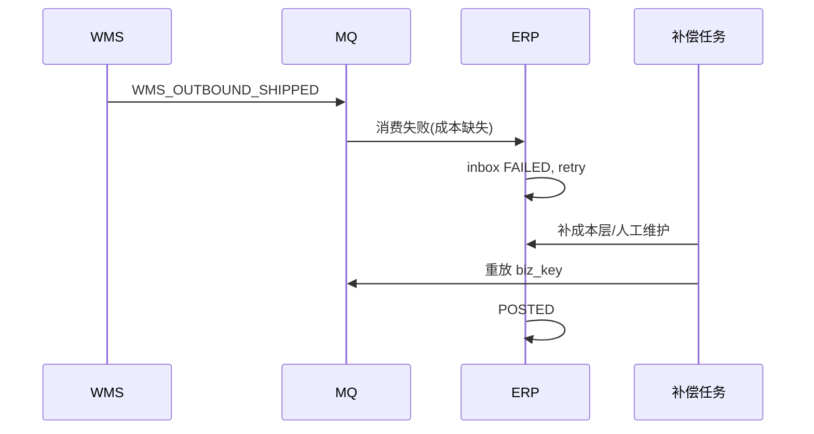

# ERP 系统详细设计（企业资源计划）

**你在做的事**：把企业「人、财、物、产、供、销」的主数据与核心单据收口到一套系统里，让采购、生产、销售、库存、财务能按同一套科目与物料口径记账、对账、关账。

**本文目标**：读完能回答——ERP 管什么、不管什么；模块怎么拆；和订单、仓储、运输系统怎么对接；主数据与财务凭证怎么落库；上线前检查什么。

**文档级别**：生产级详细设计 **v4（AI 可实施）**；机器契约与 E2E 见主题 **供应链四系统 AI 自动开发与测试手册** 及 **ai-dev 契约目录**。

**建议搭配阅读（主题关键词）**：订单管理系统（OMS）、仓储管理系统（WMS）、运输管理系统（TMS）、高并发电商交易方案、分布式事务与消息最终一致。

---

## 文前目录（速达）

- [一、系统定位与边界](#sec-1)
- [二、业务域与功能架构](#sec-2)
- [三、技术架构](#sec-3)
- [四、核心数据模型](#sec-4)
- [五、核心业务流程](#sec-5)
- [六、状态机与领域事件](#sec-6)
- [七、对外集成接口](#sec-7)
- [八、非功能需求](#sec-8)
- [九、安全、权限与审计](#sec-9)
- [十、部署、运维与对账](#sec-10)
- [十一、上线检查清单](#sec-11)
- [十二、生产级表结构设计（DDL）](#sec-12)
- [十三、过账规则与凭证模板](#sec-13)
- [十四、集成事件规范（生产级）](#sec-14)
- [十五、REST API 与错误码目录](#sec-15)
- [十六、Outbox、幂等、DLQ 与对账作业](#sec-16)
- [十七、配置项与特性开关](#sec-17)
- [十八、容量、灾备与压测基线](#sec-18)
- [十九、测试矩阵与验收用例](#sec-19)
- [二十、核心 API OpenAPI 级说明](#sec-20)
- [二十一、状态迁移全表（守卫条件）](#sec-21)
- [二十二、全量业务错误码](#sec-22)
- [二十三、过账引擎与规则配置](#sec-23)
- [二十四、集成失败 Saga 与补偿](#sec-24)
- [二十五、AI 实现模块与类清单](#sec-25)
- [二十六、完整 DDL 与 Flyway 顺序](#sec-26)
- [二十七、Gherkin 与自动化测试映射](#sec-27)
- [二十八、AI 任务拆分与验收标准](#sec-28)

---

<a id="sec-1"></a>

## 一、系统定位与边界

### 1.1 一句话定义

**ERP（Enterprise Resource Planning）** 是企业内部经营的「总账与主数据中枢」：统一物料、供应商、客户、组织、会计科目；承接采购、销售、生产、库存变动；生成应收应付与总账凭证；支撑月结、年结与经营分析。

### 1.2 在四系统中的位置

| 系统 | 核心问题 | 与 ERP 的关系 |
|------|----------|---------------|
| **OMS** | 订单怎么接、怎么拆、怎么履约 | 销售订单/退货结果回写 ERP 形成**销售出库、收入、应收** |
| **WMS** | 货在仓里怎么收、存、拣、发 | 出入库执行明细回写 ERP 形成**库存账、成本** |
| **TMS** | 货怎么运、运费怎么算 | 运单与运费分摊回写 ERP 形成**物流费用、应付** |
| **ERP** | 企业经营真相是否一致 | 接收三系统业务事实，**记账、对账、关账** |



### 1.3 范围内（In Scope）

- **主数据**：组织、仓库（逻辑仓）、物料/SKU、BOM、供应商、客户、币种、税率、会计科目、成本中心。
- **采购**：请购、采购订单、到货、采购入库、采购发票、三单匹配、应付。
- **销售（B2B/经销）**：销售订单、信用检查、发货通知、销售出库、开票、应收（与 OMS 分工见 1.4）。
- **库存（财务视角）**：库存台账、批次/序列号（若启用）、调拨、盘点损益、成本计价（移动平均/FIFO 等，按企业选型）。
- **生产（若启用制造）**：工单、领料、完工入库、工时与制造费用分摊。
- **财务**：总账、应收应付、固定资产（可选）、费用报销对接（可选）、银行对账、月结关账。
- **报表**：资产负债表、利润表、进销存、毛利分析、供应商/客户账龄。

### 1.4 范围外（Out of Scope，明确交给兄弟系统）

| 能力 | 不负责方 | 说明 |
|------|----------|------|
| C 端购物车、促销玩法、支付回调 | OMS + 支付中台 | ERP 只接收「已确认的销售事实」 |
| 波次拣货、库位、AGV 指令 | WMS | ERP 下发「要收/要发多少」，不管库位级执行 |
| 路径规划、在途轨迹、司机 App | TMS | ERP 接收运费与承运结算结果 |
| 实时秒杀库存预扣 | OMS + Redis | ERP 库存以**过账后**为准，允许 T+0/T+1 对账差 |

### 1.5 设计原则（评审口径）

1. **财务账与业务账分离**：业务单据（SO/PO/入库单）可频繁变更；过账生成不可随意删除的会计凭证，冲销用红字/反向凭证。
2. **主数据单一来源**：物料、客户、供应商以 ERP 为权威（或 MDM→ERP 同步），下游只读副本+版本号。
3. **异步集成为主**：OMS/WMS/TMS 高并发事件经 MQ 入账，接口幂等键 = `source_system + source_doc_no + event_type`。
4. **期间锁定**：月结后历史期间单据禁止改，只能调整单入新期间。

---

<a id="sec-2"></a>

## 二、业务域与功能架构

### 2.1 功能域地图



### 2.2 模块清单与优先级

| 模块 | P0（首期必上） | P1 | P2 |
|------|----------------|-----|-----|
| 主数据 | 组织、物料、客商、科目、税率 | BOM、多币种 | 多工厂、多账套 |
| 采购 | PO、GRN、库存增加、应付暂估 | 请购审批、三单匹配 | 供应商协同门户 |
| 销售 | SO、DN、出库、应收 | 信用额度 | 复杂定价引擎 |
| 库存 | 台账、调拨、盘点 | 批次/效期 | 序列号全链路 |
| 财务 | 凭证、AR/AP、月结 | 固定资产 | 合并报表 |
| 生产 | — | 简易工单 | MRP |

### 2.3 角色与典型用例

| 角色 | 典型用例 |
|------|----------|
| 采购员 | 创建 PO、跟踪到货、处理价格差异 |
| 销售内勤 | 维护 B2B SO、审核信用、下发出库指令 |
| 仓库账务 | 审核 GRN/盘点损益、确认成本 |
| 会计 | 审核凭证、对账、月结、开票 |
| 财务经理 | 关账、报表、预算对比（若上预算模块） |
| 系统管理员 | 主数据、权限、期间、接口监控 |

---

<a id="sec-3"></a>

## 三、技术架构

### 3.1 逻辑分层

| 层 | 职责 | 技术选型（常见实践，按团队调整） |
|----|------|----------------------------------|
| 接入层 | 开放 API、Webhook、文件导入 | API Gateway + OAuth2/JWT |
| 应用层 | 领域服务、单据编排、审批流 | Java Spring Boot / .NET 等 |
| 领域层 | 聚合根、状态机、过账规则 | 充血模型 + 领域事件 |
| 基础设施 | DB、缓存、MQ、任务调度 | MySQL/PostgreSQL、Redis、Kafka/RocketMQ、XXL-Job |
| 集成层 | 适配 OMS/WMS/TMS/HR/银行 | Anti-Corruption Layer + 幂等表 |

### 3.2 部署拓扑（中大型）



### 3.3 关键工程能力

- **单据编号**：`{业务前缀}{yyyyMMdd}{6位序列}`，序列用 DB segment 或 Redis INCR，禁止 UUID 直接给用户看。
- **乐观锁**：主表 `version` 字段；过账类操作额外用「期间锁」。
- **Outbox**：业务落库与 `integration_outbox` 同事务，定时投递 MQ，保证「有业务必有消息」。
- **幂等**：`idempotent_record(biz_key)` 唯一索引，`biz_key = event_type + source_doc_no`。
- **可观测**：按单据类型统计创建量、过账成功率、集成积压、月结步骤耗时。

---

<a id="sec-4"></a>

## 四、核心数据模型

### 4.1 主数据（节选）

| 实体 | 主键 | 关键字段 | 说明 |
|------|------|----------|------|
| `org` | org_id | 父组织、账套、本位币 | 公司/事业部/工厂 |
| `warehouse` | wh_id | org_id、类型（实体/虚拟） | 与 WMS 物理仓映射 |
| `material` | material_id | 编码、名称、规格、UOM、批次管理标志 | 可与 OMS SKU 1:1 或 1:N |
| `partner` | partner_id | 类型（客户/供应商）、信用额度、税号 | 客商主档 |
| `gl_account` | account_id | 科目编码、余额方向、辅助核算维度 | 总账科目 |
| `tax_code` | tax_id | 税率、税种、发票类型映射 | 与开票系统对齐 |

### 4.2 采购链

| 实体 | 状态字段 | 与库存/财务关系 |
|------|----------|-----------------|
| `purchase_requisition` | DRAFT/APPROVED/CLOSED | 可选，驱动 PO |
| `purchase_order` | DRAFT/APPROVED/PARTIAL_RECEIVED/CLOSED/CANCELLED | 批准后可下发 WMS 预期到货 |
| `grn`（收货单） | DRAFT/POSTED/CANCELLED | POSTED 增加库存、生成应付暂估 |
| `ap_invoice` | DRAFT/MATCHED/POSTED | 三单匹配 PO-GRN-Invoice |

### 4.3 销售链

| 实体 | 状态字段 | 说明 |
|------|----------|------|
| `sales_order` | 见 6.1 | B2B 或由 OMS 同步的批发单 |
| `delivery_note` | DRAFT/RELEASED/SHIPPED/CLOSED | 下发 WMS 出库依据 |
| `sales_shipment` | 来自 WMS 回传 | 过账形成销售成本与应收 |
| `ar_invoice` | DRAFT/POSTED | 开票确认收入 |

### 4.4 库存（财务账）

| 实体 | 说明 |
|------|------|
| `inventory_ledger` | 按 org+wh+material(+batch) 记录数量与金额 |
| `inventory_transaction` | 每笔增减：类型 PO_IN、SO_OUT、TRANSFER、ADJUST |
| `cost_layer` | 计价层（移动平均时每物料一行；FIFO 时多层） |

### 4.5 财务

| 实体 | 说明 |
|------|------|
| `journal_entry` | 凭证头：期间、币种、状态 DRAFT/POSTED/REVERSED |
| `journal_line` | 借方/贷方、科目、辅助核算（客户/供应商/物料/部门） |
| `ar_open_item` / `ap_open_item` | 未清项，用于核销与账龄 |

### 4.6 ER 关系（概念）



---

<a id="sec-5"></a>

## 五、核心业务流程

### 5.1 采购到付款（P2P）



**要点**：

- WMS 实收数量可以 ≠ PO 数量：ERP 按实收过账，差异走「短收/超收」审批与供应商协商。
- 暂估与发票价差：入「材料成本差异」或应付调整科目。

### 5.2 订单到收款（O2C，与 OMS 协同）



**收入确认政策（需业务拍板，写进配置）**：

| 政策 | 触发点 | 适用 |
|------|--------|------|
| 发货确认 | WMS 出库过账 | 多数 B2B |
| 签收确认 | TMS 签收事件 | 高退货率品类 |
| 开票确认 | 开具增值税发票 | 严格税法企业 |

### 5.3 库存调拨（跨组织/跨仓）

1. ERP 创建 `transfer_order`（调出仓、调入仓、明细）。
2. 调出仓 WMS 出库 → 事件 `TRANSFER_OUT_POSTED`。
3. 在途仓（可选虚拟仓）增加在途库存。
4. 调入仓 WMS 入库 → `TRANSFER_IN_POSTED`，在途清零。

### 5.4 盘点损益

1. WMS 盘点冻结库位 → 实盘数量。
2. WMS 提交 `STOCKTAKE_RESULT`。
3. ERP 生成 `inventory_adjustment`：盘盈入「待处理财产损溢」，盘亏经审批入费用/损失科目。

### 5.5 月结关账（简化 8 步）

| 步骤 | 动作 | 失败处理 |
|------|------|----------|
| 1 | 停止录入历史期间单据 | 接口返回期间已关 |
| 2 | 检查未过账业务单 | 清单导出人工处理 |
| 3 | 核对 OMS/WMS/TMS 集成差异 | 调账或补事件 |
| 4 | 计提折旧（若有） | 批任务重跑 |
| 5 | 成本重算（移动平均） | 锁库存事务表 |
| 6 | 汇兑损益（多币种） | — |
| 7 | 结转损益到本年利润 | 不可逆，仅可冲销 |
| 8 | 期间状态 → CLOSED | 开新期间 |

---

<a id="sec-6"></a>

## 六、状态机与领域事件

### 6.1 销售订单状态机（ERP 侧 B2B）



### 6.2 采购订单状态机

| 当前状态 | 事件 | 下一状态 |
|----------|------|----------|
| DRAFT | APPROVE | APPROVED |
| APPROVED | RECEIVE_PARTIAL | PARTIAL_RECEIVED |
| PARTIAL_RECEIVED | RECEIVE_COMPLETE | CLOSED |
| * | CANCEL（未收货） | CANCELLED |

### 6.3 对外发布的领域事件（ERP → 下游）

| 事件类型 | 触发时机 | 主要载荷 |
|----------|----------|----------|
| `MATERIAL_MASTER_CHANGED` | 物料主数据变更 | material_id, version, uom, batch_flag |
| `PARTNER_CREDIT_UPDATED` | 信用额度调整 | partner_id, credit_limit |
| `PO_RELEASED` | PO 审批 | po_no, lines, expected_date |
| `DN_RELEASED` | 发货单释放 | dn_no, wh_id, lines |
| `PERIOD_CLOSED` | 月结完成 | period, org_id |

### 6.4 对外订阅的事件（下游 → ERP）

| 事件类型 | 来源 | ERP 动作 |
|----------|------|----------|
| `OMS_ORDER_PAID` | OMS | 创建/更新 SO（按集成模式） |
| `WMS_GRN_POSTED` | WMS | 生成 GRN 并过账 |
| `WMS_SHIPMENT_CONFIRMED` | WMS | 销售出库过账 |
| `TMS_FREIGHT_SETTLED` | TMS | 运费入账 AP/费用 |
| `OMS_REFUND_COMPLETED` | OMS | 销售退货/red 凭证 |

---

<a id="sec-7"></a>

## 七、对外集成接口

### 7.1 集成模式

| 模式 | 场景 | 一致性 |
|------|------|--------|
| 同步 API | 主数据查询、信用检查、价格查询 | 强一致读 |
| 异步 MQ | 出入库、发货、退款事实 | 最终一致 + 幂等 + 对账 |
| 文件批导 | 期初库存、历史客商 | 人工校验后导入 |

### 7.2 REST API 契约（示例）

**信用检查（OMS 下单前）**

```
POST /api/v1/credit/check
{
  "partner_id": "C10001",
  "currency": "CNY",
  "order_amount": 50000.00
}
→ { "allowed": true, "available_credit": 120000.00 }
```

**接收 WMS 出库确认**

```
POST /api/v1/integration/wms/shipment
Idempotency-Key: WMS_SHIPMENT_CONFIRMED+OB20260531001
{
  "source_system": "WMS",
  "shipment_no": "OB20260531001",
  "dn_no": "DN20260530088",
  "lines": [{ "material_id": "M001", "qty": 10, "batch_no": "B202601" }]
}
→ { "erp_shipment_id": "ES...", "posting_status": "POSTED" }
```

### 7.3 对账任务（每日）

| 对账项 | ERP 侧 | 对方 | 差异处理 |
|--------|--------|------|----------|
| 日销售出库 | `sales_shipment` 汇总 | WMS 出库单 | 补事件或调账 |
| 日入库 | `grn` 汇总 | WMS 收货单 | 同上 |
| 库存余额 | `inventory_ledger` | WMS 库存快照 | 冻结复盘 |
| 在途 | transfer 在途科目 | TMS 运单状态 | 物流延误工单 |

---

<a id="sec-8"></a>

## 八、非功能需求

| 维度 | 目标（中型企业参考） | 手段 |
|------|----------------------|------|
| 可用性 | 99.9%（财务日 99.95%） | 多 AZ、主从、限流 |
| 性能 | 过账 API P99 < 500ms；批导 10万行/小时 | 索引、批量插入、分表 |
| 一致性 | 财务凭证强一致；集成最终一致 | 本地事务 + Outbox |
| 容量 | 5 年单据 5000 万行 | 按年分表、归档冷库 |
| RPO/RTO | RPO 15min，RTO 2h |  binlog 同步、演练 |
| 合规 | 增值税发票、审计轨迹 | 操作日志不可篡改 |

---

<a id="sec-9"></a>

## 九、安全、权限与审计

### 9.1 权限模型

- **RBAC + 数据权限**：按 org、warehouse、科目范围过滤。
- **职责分离（SoD）**：制单 ≠ 审批 ≠ 过账；供应商主数据维护 ≠ 付款执行。
- **敏感操作**：反过账、期间打开、信用额度调整 → 二次认证 + 审批流。

### 9.2 审计

- 字段级变更日志：`who/when/old/new/reason`。
- 凭证与源单据双向联查：从 `journal_entry` 追溯到 `shipment_no` / `po_no`。

---

<a id="sec-10"></a>

## 十、部署、运维与对账

### 10.1 环境划分

| 环境 | 用途 | 数据 |
|------|------|------|
| DEV | 开发联调 | 脱敏样本 |
| UAT | 业务验收 | 生产拷贝脱敏 |
| PROD | 生产 | 真实 |

### 10.2 监控告警

- 集成队列堆积 > 1000 条 5 分钟 → P2。
- 过账失败率 > 0.1% → P1。
- 月结任务失败 → P0 电话。

### 10.3 备份与演练

- 全量每日、binlog 实时；每季度做恢复演练与「月结回滚」桌面推演（非生产数据）。

---

<a id="sec-11"></a>

## 十一、上线检查清单

| # | 检查项 | 通过标准 |
|---|--------|----------|
| 1 | 主数据口径 | 物料、客商与 OMS/WMS 编码映射 100% 覆盖 |
| 2 | 科目表 | 与业务场景试算 3 笔完整凭证借贷平衡 |
| 3 | 期间 | 开账期间、默认仓库、税率生效日正确 |
| 4 | 集成幂等 | 重复推送同一 `shipment_no` 不重复过账 |
| 5 | 对账报表 | 连续 7 天 ERP vs WMS 库存差异 < 0.1% 或已解释 |
| 6 | 权限 SoD | 抽检 10 个账号无越权过账 |
| 7 | 月结彩排 | UAT 完整跑通 8 步月结 |
| 8 | 回滚预案 | 集成停服、仅记账模式开关已文档化 |

---

<a id="sec-12"></a>

## 十二、生产级表结构设计（DDL）

> 以下为 **MySQL 8.0+** 口径的生产级骨架（字段可裁剪）。金额统一 **DECIMAL(18,4)**，时间 **DATETIME(3)** 存 UTC 或统一东八区（全库一致）。所有业务表含：`created_at/updated_at/created_by/updated_by/version/is_deleted`。

### 12.1 主数据

```sql
CREATE TABLE org (
  org_id          BIGINT PRIMARY KEY,
  org_code        VARCHAR(32) NOT NULL UNIQUE,
  org_name        VARCHAR(128) NOT NULL,
  parent_org_id   BIGINT NULL,
  ledger_id       BIGINT NOT NULL COMMENT '账套',
  base_currency   CHAR(3) NOT NULL DEFAULT 'CNY',
  status          TINYINT NOT NULL DEFAULT 1,
  version         INT NOT NULL DEFAULT 0,
  KEY idx_parent (parent_org_id)
);

CREATE TABLE material (
  material_id     BIGINT PRIMARY KEY,
  material_code   VARCHAR(64) NOT NULL,
  material_name   VARCHAR(256) NOT NULL,
  uom_code        VARCHAR(16) NOT NULL,
  batch_managed   TINYINT NOT NULL DEFAULT 0,
  serial_managed  TINYINT NOT NULL DEFAULT 0,
  tax_category_id BIGINT NULL,
  status          TINYINT NOT NULL DEFAULT 1,
  mdm_version     BIGINT NOT NULL DEFAULT 1 COMMENT '主数据版本，变更+1',
  UNIQUE uk_code (material_code)
);

CREATE TABLE partner (
  partner_id      BIGINT PRIMARY KEY,
  partner_code    VARCHAR(64) NOT NULL UNIQUE,
  partner_type    VARCHAR(16) NOT NULL COMMENT 'CUSTOMER/SUPPLIER/BOTH',
  credit_limit    DECIMAL(18,4) NOT NULL DEFAULT 0,
  credit_used     DECIMAL(18,4) NOT NULL DEFAULT 0,
  tax_no          VARCHAR(64) NULL,
  status          TINYINT NOT NULL DEFAULT 1
);

CREATE TABLE material_mapping (
  id              BIGINT PRIMARY KEY AUTO_INCREMENT,
  material_id     BIGINT NOT NULL,
  external_system VARCHAR(16) NOT NULL COMMENT 'OMS/WMS',
  external_code   VARCHAR(64) NOT NULL,
  UNIQUE uk_ext (external_system, external_code),
  KEY idx_mat (material_id)
);
```

### 12.2 采购与销售单据

```sql
CREATE TABLE purchase_order (
  po_id           BIGINT PRIMARY KEY,
  po_no           VARCHAR(32) NOT NULL UNIQUE,
  org_id          BIGINT NOT NULL,
  supplier_id     BIGINT NOT NULL,
  wh_id           BIGINT NOT NULL,
  currency        CHAR(3) NOT NULL,
  status          VARCHAR(24) NOT NULL,
  total_amount    DECIMAL(18,4) NOT NULL,
  approved_at     DATETIME(3) NULL,
  version         INT NOT NULL DEFAULT 0,
  KEY idx_sup_status (supplier_id, status, created_at)
);

CREATE TABLE purchase_order_line (
  line_id         BIGINT PRIMARY KEY,
  po_id           BIGINT NOT NULL,
  line_no         INT NOT NULL,
  material_id     BIGINT NOT NULL,
  qty_ordered     DECIMAL(18,4) NOT NULL,
  qty_received    DECIMAL(18,4) NOT NULL DEFAULT 0,
  unit_price      DECIMAL(18,4) NOT NULL,
  UNIQUE uk_po_line (po_id, line_no)
);

CREATE TABLE sales_order (
  so_id           BIGINT PRIMARY KEY,
  so_no           VARCHAR(32) NOT NULL UNIQUE,
  source_system   VARCHAR(16) NOT NULL COMMENT 'ERP/OMS',
  source_doc_no   VARCHAR(64) NULL COMMENT 'OMS order_no',
  org_id          BIGINT NOT NULL,
  customer_id     BIGINT NOT NULL,
  status          VARCHAR(24) NOT NULL,
  revenue_policy  VARCHAR(24) NOT NULL COMMENT 'SHIP/INVOICE/SIGN',
  version         INT NOT NULL DEFAULT 0,
  UNIQUE uk_source (source_system, source_doc_no)
);

CREATE TABLE delivery_note (
  dn_id           BIGINT PRIMARY KEY,
  dn_no           VARCHAR(32) NOT NULL UNIQUE,
  so_id           BIGINT NOT NULL,
  wh_id           BIGINT NOT NULL,
  status          VARCHAR(24) NOT NULL,
  released_at     DATETIME(3) NULL
);
```

### 12.3 库存财务账

```sql
CREATE TABLE inventory_ledger (
  ledger_id       BIGINT PRIMARY KEY,
  org_id          BIGINT NOT NULL,
  wh_id           BIGINT NOT NULL,
  material_id     BIGINT NOT NULL,
  batch_no        VARCHAR(64) NOT NULL DEFAULT '',
  qty_on_hand     DECIMAL(18,4) NOT NULL,
  amount_on_hand  DECIMAL(18,4) NOT NULL,
  cost_method     VARCHAR(16) NOT NULL COMMENT 'MAVG/FIFO',
  UNIQUE uk_bal (org_id, wh_id, material_id, batch_no)
);

CREATE TABLE inventory_transaction (
  txn_id          BIGINT PRIMARY KEY,
  txn_no          VARCHAR(32) NOT NULL UNIQUE,
  txn_type        VARCHAR(24) NOT NULL COMMENT 'PO_IN/SO_OUT/TRANSFER/ADJUST',
  source_system   VARCHAR(16) NOT NULL,
  source_doc_no   VARCHAR(64) NOT NULL,
  org_id          BIGINT NOT NULL,
  wh_id           BIGINT NOT NULL,
  material_id     BIGINT NOT NULL,
  batch_no        VARCHAR(64) NOT NULL DEFAULT '',
  qty_delta       DECIMAL(18,4) NOT NULL,
  amount_delta    DECIMAL(18,4) NOT NULL,
  posted          TINYINT NOT NULL DEFAULT 0,
  posted_at       DATETIME(3) NULL,
  UNIQUE uk_source_txn (source_system, source_doc_no, txn_type)
);
```

### 12.4 财务凭证

```sql
CREATE TABLE fiscal_period (
  period_id       BIGINT PRIMARY KEY,
  org_id          BIGINT NOT NULL,
  period_code     CHAR(6) NOT NULL COMMENT 'YYYYMM',
  status          VARCHAR(16) NOT NULL COMMENT 'OPEN/CLOSING/CLOSED',
  UNIQUE uk_org_period (org_id, period_code)
);

CREATE TABLE journal_entry (
  je_id           BIGINT PRIMARY KEY,
  je_no           VARCHAR(32) NOT NULL UNIQUE,
  org_id          BIGINT NOT NULL,
  period_code     CHAR(6) NOT NULL,
  je_date         DATE NOT NULL,
  status          VARCHAR(16) NOT NULL COMMENT 'DRAFT/POSTED/REVERSED',
  source_txn_id   BIGINT NULL,
  reversed_je_id  BIGINT NULL,
  KEY idx_period (org_id, period_code, status)
);

CREATE TABLE journal_line (
  line_id         BIGINT PRIMARY KEY,
  je_id           BIGINT NOT NULL,
  line_no         INT NOT NULL,
  account_id      BIGINT NOT NULL,
  debit_amount    DECIMAL(18,4) NOT NULL DEFAULT 0,
  credit_amount   DECIMAL(18,4) NOT NULL DEFAULT 0,
  partner_id      BIGINT NULL,
  material_id     BIGINT NULL,
  cost_center_id  BIGINT NULL,
  UNIQUE uk_je_line (je_id, line_no)
);
```

### 12.5 集成基础设施

```sql
CREATE TABLE integration_inbox (
  id              BIGINT PRIMARY KEY AUTO_INCREMENT,
  biz_key         VARCHAR(128) NOT NULL,
  event_type      VARCHAR(64) NOT NULL,
  payload_json    JSON NOT NULL,
  process_status  VARCHAR(16) NOT NULL COMMENT 'NEW/DONE/FAILED',
  retry_count     INT NOT NULL DEFAULT 0,
  next_retry_at   DATETIME(3) NULL,
  UNIQUE uk_biz (biz_key),
  KEY idx_retry (process_status, next_retry_at)
);

CREATE TABLE integration_outbox (
  id              BIGINT PRIMARY KEY AUTO_INCREMENT,
  event_id        VARCHAR(64) NOT NULL UNIQUE,
  event_type      VARCHAR(64) NOT NULL,
  biz_key         VARCHAR(128) NOT NULL,
  payload_json    JSON NOT NULL,
  publish_status  VARCHAR(16) NOT NULL COMMENT 'PENDING/SENT/FAILED',
  created_at      DATETIME(3) NOT NULL,
  KEY idx_pub (publish_status, created_at)
);
```

### 12.6 索引与分表策略

| 表 | 分表键 | 保留策略 |
|----|--------|----------|
| `inventory_transaction` | `org_id` + 年 | 5 年在线，之后归档 |
| `journal_entry` / `journal_line` | `org_id` + `period_code` | 永久，关账后只读 |
| `integration_inbox` | 按月 | 成功 90 天清理 |

---

<a id="sec-13"></a>

## 十三、过账规则与凭证模板

### 13.1 过账触发点（写死，避免财务口径漂移）

| 业务事实 | 触发事件 | 生成单据 | 凭证类型 |
|----------|----------|----------|----------|
| 采购实收 | `WMS_GRN_POSTED` | `grn` + `inventory_transaction` | 暂估入库 |
| 采购发票 | 人工/接口录入 | `ap_invoice` | 应付入账 |
| 销售实发 | `WMS_OUTBOUND_SHIPPED` | 销售出库 | 成本结转 |
| 收入确认 | 按 `revenue_policy` | `ar_invoice` 或自动收入 | 主营业务收入 |
| 运费结算 | `TMS_FREIGHT_SETTLED` | 运费批 | 销售费用/应付 |
| 销售退货 | `REFUND_COMPLETED` + 退货入库 | 红字出库/收入 | 冲销 |

### 13.2 销售出库 + 成本结转（移动平均示例）

**前提**：物料 M001 移动平均单价 50 元；本次出库 10 件，不含税销售额 800 元，税率 13%。

| 分录行 | 科目（示例编码） | 借方 | 贷方 | 辅助核算 |
|--------|------------------|------|------|----------|
| 1 | 主营业务成本 6401 | 500 | | material=M001 |
| 2 | 库存商品 1405 | | 500 | wh=WH-SH |
| 3 | 应收账款 1122 | 904 | | customer=C001 |
| 4 | 主营业务收入 6001 | | 800 | |
| 5 | 应交税费-销项 2221 | | 104 | |

> 收入确认若政策为「签收确认」，则 3~5 分录在 `TMS_DELIVERED` 时生成，出库分录仍在 `SHIPPED`。

### 13.3 冲销与反过账

- **未关账期间**：原凭证 `REVERSED`，生成等额反向凭证，`reversed_je_id` 互指。
- **已关账期间**：禁止改原凭证；走 **调整单** 入当前开放期间，备注关联原 `je_no`。
- **集成重复**：`uk_source_txn` 拦截；人工补单须新 `source_doc_no` 后缀 `-ADJ1`。

### 13.4 三单匹配（采购发票）

| 校验项 | 容差 | 失败动作 |
|--------|------|----------|
| PO 单价 vs 发票单价 | 0 或合同允许 ±0.01 | 挂起待采购确认 |
| GRN 数量 vs 发票数量 | 不允许超发票 | 拒绝过账 |
| 发票金额 vs PO 行金额 | 含税/不含税口径一致 | 差异入「材料成本差异」科目 |

---

<a id="sec-14"></a>

## 十四、集成事件规范（生产级）

### 14.1 统一信封（全系统强制）

```json
{
  "event_id": "E20260531120000001",
  "event_type": "WMS_OUTBOUND_SHIPPED",
  "biz_key": "WMS_OUTBOUND_SHIPPED+OB20260531001",
  "schema_version": 1,
  "occurred_at": "2026-05-31T15:00:00.000+08:00",
  "trace_id": "1-abc-998877",
  "producer": "WMS",
  "data": {}
}
```

| 字段 | 必填 | 规则 |
|------|:----:|------|
| `event_id` | 是 | 全局唯一，UUID 或雪花 |
| `biz_key` | 是 | **幂等键**，建议 `event_type+业务单号` |
| `schema_version` | 是 | 仅加字段小版本；改语义必须升版本并双读 |
| `occurred_at` | 是 | 业务发生时间，禁止用消费者处理时间替代 |
| `data` | 是 | 禁止放手机号全量、完整地址、支付原文 |

### 14.2 ERP 订阅事件最小字段

**`WMS_OUTBOUND_SHIPPED`（销售出库过账）**

| 字段 | 必填 | 说明 |
|------|:----:|------|
| `outbound_no` | 是 | WMS 出库单号 |
| `source_order_no` | 是 | OMS 子单号 |
| `org_id` / `wh_code` | 是 | 组织与仓库 |
| `shipped_at` | 是 | 出库时间 |
| `lines[]` | 是 | `material_code/qty/batch_no` |
| `amount_tax_excl` | 否 | 有则用于收入，无则查 SO 快照 |

**`TMS_FREIGHT_SETTLED`**

| 字段 | 必填 | 说明 |
|------|:----:|------|
| `settlement_batch_no` | 是 | 结算批号 |
| `carrier_code` | 是 | 承运商 |
| `period` | 是 | YYYYMM |
| `total_amount` | 是 | 含税应付总额 |
| `tax_amount` | 是 | 税额 |
| `lines[]` | 否 | `shipment_no/waybill_no/allocated_amount` |

**`REFUND_COMPLETED`**

| 字段 | 必填 | 说明 |
|------|:----:|------|
| `aftersale_no` | 是 | 售后单 |
| `order_no` | 是 | 子单 |
| `refund_amount` | 是 | 退款额 |
| `lines[]` | 是 | 退货 SKU 与数量 |
| `refund_success_at` | 是 | 退款完成时间 |

### 14.3 ERP 发布事件

| event_type | biz_key | 消费者 |
|------------|---------|--------|
| `PO_RELEASED` | `PO_RELEASED+po_no` | WMS |
| `DN_RELEASED` | `DN_RELEASED+dn_no` | WMS |
| `MATERIAL_MASTER_CHANGED` | `...+material_id+version` | OMS/WMS |
| `PERIOD_CLOSED` | `PERIOD_CLOSED+org+period` | 全系统只读缓存刷新 |

### 14.4 消费伪代码（生产模板）

```pseudo
function onMessage(msg):
  if exists(integration_inbox, biz_key=msg.biz_key): return ACK
  begin transaction
    insert integration_inbox(biz_key, status=NEW)
    doc = mapToDomain(msg)
    post(doc)  // 库存事务 + 凭证草稿/过账
    insert integration_outbox(...) if needed
    update inbox status=DONE
  commit
  ACK
onFailure:
  increment retry; if retry>8: DLQ + 告警
```

---

<a id="sec-15"></a>

## 十五、REST API 与错误码目录

### 15.1 通用约定

- Base：`/api/v1`
- 鉴权：`Authorization: Bearer {jwt}`；服务间 `X-App-Id` + HMAC 签名（可选 mTLS）
- 幂等：写接口必带 `Idempotency-Key` 头
- 分页：`page` 从 1 开始，`page_size` 默认 20，最大 100
- 金额：接口 JSON 用 **字符串** 传 DECIMAL，避免浮点误差

### 15.2 核心 API 清单

| 方法 | 路径 | 说明 | 幂等键 |
|------|------|------|--------|
| GET | `/materials/{code}` | 主数据查询 | — |
| POST | `/credit/check` | 信用检查 | partner+amount |
| POST | `/integration/wms/grn` | 采购入库过账 | biz_key |
| POST | `/integration/wms/shipment` | 销售出库过账 | biz_key |
| POST | `/integration/oms/refund` | 退货退款过账 | biz_key |
| POST | `/journal-entries/{je_no}/post` | 凭证过账 | je_no |
| POST | `/journal-entries/{je_no}/reverse` | 凭证冲销 | je_no+reason |
| GET | `/inventory-ledger` | 库存账查询 | — |
| POST | `/fiscal-periods/{period}/close` | 月结关账 | org+period |

### 15.3 统一响应包络

```json
{
  "code": "0",
  "message": "OK",
  "request_id": "req-xxx",
  "data": {}
}
```

### 15.4 业务错误码（节选，实现须全量登记）

| code | HTTP | 含义 | 客户端策略 |
|------|------|------|------------|
| `ERP_01001` | 400 | 会计期间已关闭 | 勿重试 |
| `ERP_01002` | 400 | 借贷不平衡 | 勿重试 |
| `ERP_02001` | 409 | 集成单据已存在（幂等命中） | 当成功 |
| `ERP_02002` | 400 | 物料映射不存在 | 人工补映射 |
| `ERP_03001` | 400 | 信用不足 | 提示用户 |
| `ERP_04001` | 503 | 月结进行中 | 退避重试 |
| `ERP_09001` | 500 | 系统异常 | 限次重试 |

---

<a id="sec-16"></a>

## 十六、Outbox、幂等、DLQ 与对账作业

### 16.1 Outbox 投递

- 扫描：`publish_status=PENDING AND created_at < now()-5s`，批大小 500。
- 发送成功标记 `SENT`；失败指数退避，超 8 次进 DLQ。
- **与业务同事务**：未提交业务不得出现 `SENT`。

### 16.2 日对账作业（XXL-Job / 自研调度）

| 任务 | Cron | 输入 | 输出 |
|------|------|------|------|
| `recon_wms_shipment_daily` | 02:00 | WMS 出库汇总 API | 差异报表 `recon_diff` |
| `recon_oms_revenue_daily` | 02:30 | OMS 已发货 vs ERP 收入 | 财务工单 |
| `recon_inventory_snapshot` | 03:00 | WMS 库存快照 | 调账候选 |
| `recon_tms_freight_daily` | 03:30 | TMS 结算批 vs ERP 应付 | 承运商差异 |

### 16.3 差异处理状态机

`DETECTED → INVESTIGATING → ADJUSTED / IGNORED`，必须记录责任系统与根因分类（漏事件/重复/映射/人工）。

---

<a id="sec-17"></a>

## 十七、配置项与特性开关

| 配置键 | 类型 | 默认 | 说明 |
|--------|------|------|------|
| `erp.revenue.policy` | enum | SHIP | SHIP/SIGN/INVOICE |
| `erp.cost.method` | enum | MAVG | MAVG/FIFO |
| `erp.integration.auto_post` | bool | true | false 时只生成草稿凭证 |
| `erp.period.auto_close` | bool | false | 是否自动关账 |
| `erp.credit.strict` | bool | true | 不足是否硬拦截 |
| `erp.posting.max_retry` | int | 8 | 集成过账重试 |

配置变更走 **配置中心 + 审计**；关账相关配置仅在开放期间可改。

---

<a id="sec-18"></a>

## 十八、容量、灾备与压测基线

### 18.1 容量估算（中型零售+制造）

| 指标 | 估值 | 设计余量 |
|------|------|----------|
| 日集成事件 | 50 万 | ×3 峰值 |
| 日凭证行 | 20 万 | 批量过账夜间窗口 |
| 主数据 SKU | 50 万 | 缓存 + 分页 |
| 并发过账 API | 200 QPS | 队列削峰 |

### 18.2 压测场景（必须通过）

1. 1 万条 `WMS_OUTBOUND_SHIPPED` 幂等重放 → 凭证行数不变。
2. 月结批处理 500 万 `inventory_transaction` → 4 小时内完成（硬件按实测调）。
3. 关账期间所有写接口返回 `ERP_01001`。

### 18.3 灾备

- MySQL：**半同步复制** + 跨 AZ 从库；RPO≤15min。
- MQ：集群跨 AZ；DLQ 独立 Topic。
- 降级：`erp.integration.auto_post=false` 只落 inbox，恢复后按 `occurred_at` 重放。

---

<a id="sec-19"></a>

## 十九、测试矩阵与验收用例

| 编号 | 场景 | 步骤 | 期望 |
|------|------|------|------|
| ERP-T01 | 采购入库 | PO→WMS 收货→GRN 事件 | 库存+、暂估凭证 |
| ERP-T02 | 销售出库 | DN→WMS 发货→SHIPPED | 成本凭证 |
| ERP-T03 | 重复事件 | 同一 biz_key 发 2 次 | 1 张凭证 |
| ERP-T04 | 期间关闭 | 关账后补传事件 | 拒绝+进 DLQ |
| ERP-T05 | 冲销 | 反过账原出库 | 借贷冲平、库存回 |
| ERP-T06 | 三单匹配 | 发票价高于 PO | 挂起 |
| ERP-T07 | 信用 | 超额 SO | 拦截 |
| ERP-T08 | 对账 | 故意少 1 条 WMS | 日报差异=1 |

---

<a id="sec-20"></a>

## 二十、核心 API OpenAPI 级说明

> 以下按 **OpenAPI 3.1** 语义描述；实现时生成 `erp-openapi.yaml` 并与网关契约测试（Pact/Dredd）对齐。

### 20.1 `POST /api/v1/credit/check`（同步，OMS 下单前）

**请求**

| 字段 | 类型 | 必填 | 校验 |
|------|------|:----:|------|
| `partner_id` | string | 是 | 存在且 status=有效 |
| `org_id` | string | 是 | 数据权限 |
| `currency` | string | 是 | ISO4217 |
| `order_amount` | string | 是 | DECIMAL 字符串 >0 |
| `include_pending` | bool | 否 | 是否计入在途 SO 占用 |

**响应 200**

```json
{
  "code": "0",
  "data": {
    "allowed": true,
    "credit_limit": "500000.0000",
    "credit_used": "120000.0000",
    "credit_available": "380000.0000",
    "pending_hold": "50000.0000"
  }
}
```

**响应 200（拒绝）**：`allowed=false`，`code` 仍为 `0`（业务可预期）；OMS 映射 `ERP_03001`。

**SLA**：P99≤100ms；缓存 partner 额度 60s，变更事件 `PARTNER_CREDIT_UPDATED` 失效缓存。

### 20.2 `POST /api/v1/integration/wms/shipment`（销售出库过账）

**Headers**：`Idempotency-Key: WMS_OUTBOUND_SHIPPED+{outbound_no}`

**请求 body**

| 字段 | 类型 | 必填 |
|------|------|:----:|
| `outbound_no` | string | 是 |
| `source_system` | string | 是 | 固定 `WMS` |
| `source_order_no` | string | 是 |
| `org_id` | string | 是 |
| `wh_code` | string | 是 |
| `shipped_at` | datetime | 是 |
| `lines[]` | array | 是 |
| `lines[].material_code` | string | 是 |
| `lines[].qty` | string | 是 |
| `lines[].batch_no` | string | 否 |
| `lines[].unit_cost` | string | 否 | 无则系统按成本方法取 |

**响应 200（首次）**

```json
{
  "code": "0",
  "data": {
    "erp_txn_no": "ITX202605310001",
    "je_no": "JE202605310001",
    "posting_status": "POSTED"
  }
}
```

**响应 200（幂等命中）**：`code=ERP_02001`，`data` 返回原 `je_no`（HTTP 建议仍 200）。

**副作用（单事务）**：`inventory_transaction` 写入 → 更新 `inventory_ledger` → 生成 `journal_entry`（若 `auto_post=true`）→ `integration_inbox` DONE。

### 20.3 `POST /api/v1/journal-entries/{je_no}/post`

**守卫**：期间 OPEN；凭证 DRAFT；借贷平衡；制单≠审批人（SoD）。

**失败**：`ERP_01001` 期间关闭；`ERP_01002` 不平衡。

### 20.4 `GET /api/v1/inventory-ledger`（分页查询）

| 参数 | 说明 |
|------|------|
| `org_id` | 必填 |
| `wh_code` | 可选 |
| `material_code` | 可选 |
| `as_of_date` | 可选，历史快照需归档表 |

---

<a id="sec-21"></a>

## 二十一、状态迁移全表（守卫条件）

### 21.1 采购订单 `purchase_order.status`

| 当前 | 事件/动作 | 下一 | 守卫 |
|------|-----------|------|------|
| DRAFT | submit | SUBMITTED | 行数>0 |
| SUBMITTED | approve | APPROVED | 审批权限 |
| SUBMITTED | reject | DRAFT | — |
| APPROVED | receive | PARTIAL_RECEIVED | 累计收货<订购 |
| PARTIAL_RECEIVED | receive | PARTIAL_RECEIVED | 仍 partial |
| PARTIAL_RECEIVED | receive_complete | CLOSED | 累计≥订购（容差配置） |
| APPROVED | cancel | CANCELLED | 未收货 |
| * | close_period | — | 禁止，返回 ERP_01001 |

### 21.2 销售订单 `sales_order.status`（ERP B2B）

| 当前 | 事件 | 下一 | 守卫 |
|------|------|------|------|
| DRAFT | approve | APPROVED | 信用通过 |
| APPROVED | release_dn | PARTIAL_SHIPPED | DN 部分释放 |
| PARTIAL_SHIPPED | ship_all | SHIPPED | WMS 事件汇总 |
| SHIPPED | invoice | INVOICED | 可选步骤 |
| SHIPPED | sign | SIGNED | revenue_policy=SIGN |
| * | cancel | CANCELLED | 未发货 |

### 21.3 凭证 `journal_entry.status`

| 当前 | 动作 | 下一 | 守卫 |
|------|------|------|------|
| DRAFT | post | POSTED | 借贷平、期间开 |
| POSTED | reverse | REVERSED | 未关账或有冲销权限 |
| REVERSED | — | — | 不可再 post |

---

<a id="sec-22"></a>

## 二十二、全量业务错误码

| code | HTTP | 中文说明 | 处理建议 |
|------|------|----------|----------|
| ERP_01001 | 400 | 会计期间已关闭 | 勿重试，改开放期间或调整单 |
| ERP_01002 | 400 | 凭证借贷不平衡 | 修正分录 |
| ERP_01003 | 400 | 凭证已过账不可修改 | 走冲销 |
| ERP_01004 | 403 | 职责分离违规 | 换账号 |
| ERP_02001 | 200/409 | 集成幂等命中 | 当成功 |
| ERP_02002 | 400 | 物料映射缺失 | 补 mapping |
| ERP_02003 | 400 | 仓库未映射 | 补 wh 映射 |
| ERP_03001 | 400 | 信用额度不足 | 业务拦截 |
| ERP_03002 | 400 | 客户已冻结 | 业务拦截 |
| ERP_04001 | 503 | 月结进行中 | 退避重试 |
| ERP_04002 | 400 | 三单匹配失败 | 人工处理 |
| ERP_04003 | 400 | 发票税额不符 | 税务复核 |
| ERP_05001 | 400 | 成本层不存在 | 初始化成本 |
| ERP_05002 | 400 | 出库导致负库存 | 盘点/调整 |
| ERP_06001 | 400 | PO 已关闭不可收货 | — |
| ERP_06002 | 400 | DN 已发运不可改 | — |
| ERP_09001 | 500 | 系统异常 | 限次重试+告警 |

---

<a id="sec-23"></a>

## 二十三、过账引擎与规则配置

### 23.1 规则表 `posting_rule`（配置驱动，避免硬编码）

```sql
CREATE TABLE posting_rule (
  rule_id         BIGINT PRIMARY KEY,
  event_type      VARCHAR(64) NOT NULL,
  org_id          BIGINT NULL COMMENT 'NULL=全局',
  debit_account   VARCHAR(32) NOT NULL,
  credit_account  VARCHAR(32) NOT NULL,
  amount_expr     VARCHAR(256) NOT NULL COMMENT 'SpEL: qty*unitCost',
  dimension_expr  VARCHAR(256) NULL COMMENT 'partner/material/wh',
  priority        INT NOT NULL DEFAULT 100,
  enabled         TINYINT NOT NULL DEFAULT 1
);
```

### 23.2 规则匹配顺序

1. `org_id` 精确 → 2. `org_id IS NULL` 全局 → 3. 按 `priority` 降序 → 4. 命中多条时**全部执行**（一行事件可多分录）。

### 23.3 `WMS_OUTBOUND_SHIPPED` 默认规则集（示例）

| 顺序 | 借方 | 贷方 | 金额表达式 |
|------|------|------|------------|
| 1 | 6401 主营业务成本 | 1405 库存商品 | `sum(line.qty*line.unit_cost)` |
| 2 | 1122 应收账款 | 6001 收入 | `header.revenue_amount`（若同时确认收入） |
| 3 | 1122 | 2221 销项税 | `header.tax_amount` |

> `revenue_policy=SHIP` 时规则 2~3 在同事件执行；`SIGN` 时 2~3 延后到 `TMS_DELIVERED`。

### 23.4 过账引擎执行流程



---

<a id="sec-24"></a>

## 二十四、集成失败 Saga 与补偿

### 24.1 场景：WMS 已发货，ERP 过账失败



| 步骤 | 责任 | 动作 |
|------|------|------|
| 1 | ERP | 记录 `inbox` FAILED，**禁止**重复扣库存 |
| 2 | 运维 | 告警 `ERP_05001` |
| 3 | 主数据 | 维护 `cost_layer` 或接收 OMS 成本快照 |
| 4 | 补偿 | 同 `biz_key` 重放 |
| 5 | 对账 | 确认 OMS 已 SHIPPED 且 ERP 有 `je_no` |

### 24.2 场景：重复发货事件（幂等）

- 第 2 次消费：`ERP_02001`，返回原 `je_no`，WMS/OMS **不得** 当作失败重试无限循环。

### 24.3 场景：关账后迟到事件

- 进入 DLQ；人工选择：**调整期间入账** 或 **拒绝并由 WMS 发起冲销出库**（需业务制度允许）。

### 24.4 `saga_compensation_log`（建议表）

```sql
CREATE TABLE saga_compensation_log (
  id BIGINT PRIMARY KEY AUTO_INCREMENT,
  biz_key VARCHAR(128) NOT NULL,
  saga_type VARCHAR(64) NOT NULL,
  step_no INT NOT NULL,
  action VARCHAR(64) NOT NULL,
  status VARCHAR(16) NOT NULL,
  payload JSON,
  created_at DATETIME(3) NOT NULL
);
```

---

---

<a id="sec-25"></a>

## 二十五、AI 实现模块与类清单

| 包路径 | 类 | 职责 |
|--------|-----|------|
| `...integration.consumer` | `WmsOutboundShippedConsumer` | 消费过账 |
| `...integration.consumer` | `TmsFreightSettledConsumer` | 运费批 |
| `...integration.consumer` | `OmsRefundCompletedConsumer` | 退货冲销 |
| `...fi.posting` | `PostingEngine` | 匹配 posting_rule |
| `...fi.posting` | `JournalEntryFactory` | 生成借贷行 |
| `...fi.period` | `FiscalPeriodService` | 关账守卫 |
| `...inventory` | `InventoryLedgerService` | 台账更新 |
| `...mdm` | `MaterialMappingService` | OMS/WMS 编码 |
| `...api` | `CreditController` | OpenAPI credit/check |
| `...api` | `IntegrationWmsController` | shipment 过账 |

**单测必写**：`PostingEngineTest`（规则匹配）、`FiscalPeriodGuardTest`、`WmsOutboundShippedConsumerIdempotentTest`。

---

<a id="sec-26"></a>

## 二十六、完整 DDL 与 Flyway 顺序

| 版本 | 文件 | 内容 |
|------|------|------|
| V1 | `V1__init_mdm.sql` | org, material, partner, mapping, warehouse |
| V2 | `V2__init_p2p_o2c.sql` | purchase_order, sales_order, delivery_note |
| V3 | `V3__init_inventory.sql` | inventory_ledger, inventory_transaction |
| V4 | `V4__init_fi.sql` | fiscal_period, journal_*, posting_rule |
| V5 | `V5__init_integration.sql` | integration_inbox/outbox, processed_message, saga_compensation_log |

第十二章 DDL 全部并入 V1~V5；**禁止** AI 跳过 migration 直接改表。

---

<a id="sec-27"></a>

## 二十七、Gherkin 与自动化测试映射

| Gherkin | ERP 断言 | 测试类 |
|---------|-----------|--------|
| E2E-01 | 存在 `je_no`，借贷平 | `ErpPostingStep` |
| E2E-09 | `journal_entry` count=1 | `WmsOutboundIdempotentIT` |
| E2E-10 | credit 返回 allowed=false | `CreditApiContractTest` |

**契约测试**：`openapi-erp-core.yaml` 每个 path 至少 1 个 `*ContractTest`。

---

<a id="sec-28"></a>

## 二十八、AI 任务拆分与验收标准

| 任务 ID | 描述 | 完成判定 |
|---------|------|----------|
| ERP-01 | Flyway V1~V5 | `mvn flyway:validate` 通过 |
| ERP-02 | credit/check | ContractTest 绿 |
| ERP-03 | WMS shipment 过账 | IntegrationIT 绿 |
| ERP-04 | posting_rule 引擎 | PostingEngineTest 绿 |
| ERP-05 | 关账拦截 | E2E-09 相关单测绿 |

---

**版本说明**：生产级详细设计 **v4（AI 可实施）**；科目编码以企业科目表为准。


