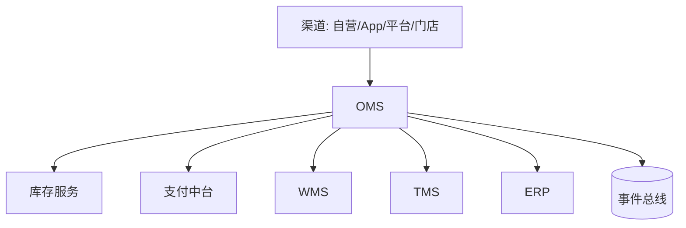
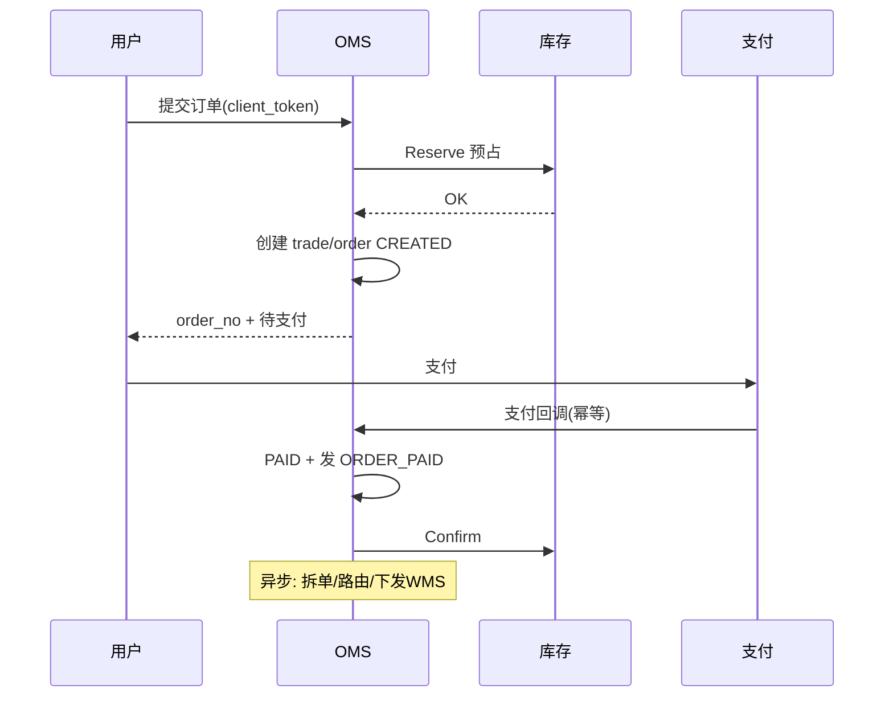
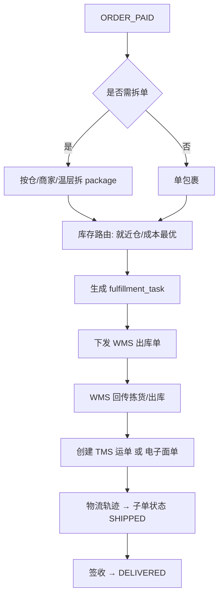
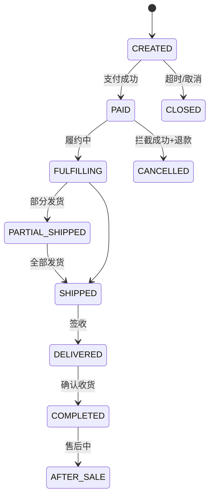
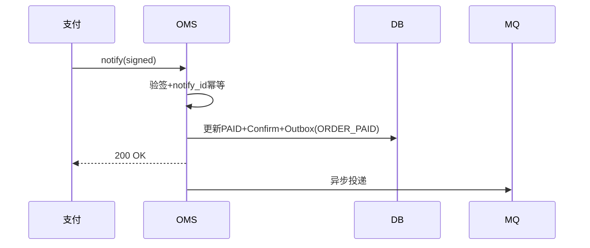
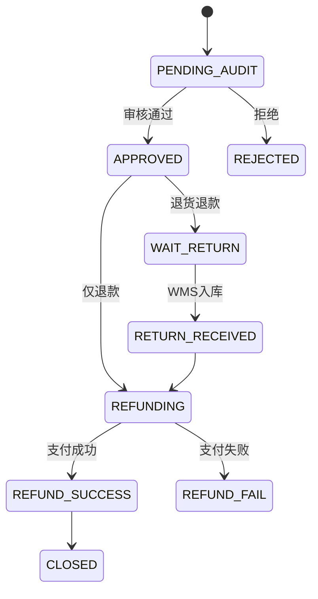

# OMS 系统详细设计（订单管理系统）

**你在做的事**：把「客户下单到商家履约」的全链路管起来——接单、拆单、路由仓、促销与支付协同、售后，并把**可履约、可对账**的事实交给仓储与财务系统。

**本文目标**：读完能画 OMS 边界图、列出核心表与状态机、说明支付/库存/履约/退款如何协同、与 ERP/WMS/TMS 的集成事件有哪些。

**文档级别**：生产级详细设计 **v4（AI 可实施）**；契约 `openapi-oms-core.yaml`，E2E 见 **AI 自动开发与测试手册**。

**建议搭配阅读（主题关键词）**：企业资源计划（ERP）、仓储管理（WMS）、运输管理（TMS）、高并发电商交易、消息最终一致。

---

## 文前目录（速达）

- [一、系统定位与边界](#sec-1)
- [二、业务域与功能架构](#sec-2)
- [三、技术架构](#sec-3)
- [四、核心数据模型](#sec-4)
- [五、核心业务流程](#sec-5)
- [六、状态机与事件](#sec-6)
- [七、对外集成](#sec-7)
- [八、非功能需求](#sec-8)
- [九、安全与风控](#sec-9)
- [十、部署与运维](#sec-10)
- [十一、上线检查清单](#sec-11)
- [十二、生产级表结构设计（DDL）](#sec-12)
- [十三、库存域接口与一致性](#sec-13)
- [十四、集成事件规范（生产级）](#sec-14)
- [十五、REST API 与错误码目录](#sec-15)
- [十六、Outbox、幂等、DLQ 与补偿](#sec-16)
- [十七、大促与降级开关](#sec-17)
- [十八、容量、分库分表与压测](#sec-18)
- [十九、测试矩阵与验收用例](#sec-19)
- [二十、核心 API OpenAPI 级说明](#sec-20)
- [二十一、状态迁移全表与并发仲裁](#sec-21)
- [二十二、全量业务错误码](#sec-22)
- [二十三、拆单路由与渠道适配器](#sec-23)
- [二十四、售后退款 Saga](#sec-24)
- [二十五、AI 实现模块与类清单](#sec-25)
- [二十六、完整 DDL 与 Flyway 顺序](#sec-26)
- [二十七、Gherkin 与自动化测试映射](#sec-27)
- [二十八、AI 任务拆分与验收标准](#sec-28)

---

<a id="sec-1"></a>

## 一、系统定位与边界

### 1.1 一句话定义

**OMS（Order Management System）** 是**订单与履约编排中枢**：统一承接多渠道订单，维护订单真相与状态机，协调库存预占、支付结果、仓配路由、物流订阅与售后，对外输出履约指令与经营事实。

### 1.2 在四系统中的位置

| 系统 | 与 OMS 关系 |
|------|-------------|
| **前台/商城** | 下单、支付、查单、售后入口 |
| **支付中台** | 收单、退款、对账；OMS 不碰资金清算细节 |
| **库存服务** | 可售库存、预占、确认、释放（可与 OMS 同域或独立微服务） |
| **WMS** | 接收出库/入库指令，回传实收实发 |
| **TMS** | 接收运单创建请求，回传轨迹与签收 |
| **ERP** | 接收已过账需要的销售/退货/收入事实；提供 B2B 主数据与信用 |



### 1.3 范围内

- 订单创建（购物车/立即购买/导入）、价格试算、促销命中、运费试算。
- 库存预占（Reserve）、支付成功后确认（Confirm）、关单/取消释放（Release）。
- 主单/子单/包裹单模型；拆单、合单、换仓、部分发货。
- 履约编排：路由仓、下发 WMS、订阅物流、状态回传聚合。
- 售后：仅退款、退货退款、换货；与支付、库存、WMS 逆向协同。
- 渠道对账：平台订单拉取、状态同步（天猫/京东等，按渠道插件）。

### 1.4 范围外

| 能力 | 归属 |
|------|------|
| 总账、发票、应收应付过账 | ERP |
| 库位、波次、拣货任务 | WMS |
| 承运商调度、在途 GPS | TMS |
| 商品主图/详情 CMS | 商品中心/PIM |
| 会员等级长期运营 | CRM/会员系统（OMS 只读权益） |

### 1.5 设计原则

1. **DB 是订单真相源**；Redis 用于预扣、热点、幂等令牌，必须可对账纠正。
2. **快照不可变**：下单时固化价格、标题、税率、地址，售后以快照为准。
3. **幂等端到端**：`client_token`（建单）、`payment_notify_id`（支付）、`event_biz_key`（MQ）。
4. **状态机单向推进**；乱序回调用版本号/状态秩仲裁。
5. **重履约异步化**：支付成功后的拆单、路由、下发 WMS 走 MQ，避免拖垮支付回调。

---

<a id="sec-2"></a>

## 二、业务域与功能架构

### 2.1 功能模块

| 域 | 模块 | 说明 |
|----|------|------|
| 订单 | 建单、改址（限态）、取消、关单 | 主流程 |
| 价格 | 试算、促销、优惠券、运费模板 | 读促销引擎 |
| 库存 | 预占/确认/释放、渠道库存分配 | 可调库存中心 |
| 支付 | 拉起支付、回调、补单 | 对接支付中台 |
| 履约 | 拆单、路由、WMS/TMS 指令、状态聚合 | 编排核心 |
| 物流 | 轨迹查询、签收、异常 | 聚合 TMS/快递 |
| 售后 | 退款/退货/换货状态机 | 与支付/WMS 联动 |
| 渠道 | 平台订单同步、发货回传 | 插件化 |
| 运营 | 订单查询、改价审批、人工Hold | 后台 |

### 2.2 渠道类型与差异

| 渠道 | 订单来源 | 库存 | 发货回传 |
|------|----------|------|----------|
| 自营 App/小程序 | OMS 建单 | 自有库存 | 自有物流单号 |
| 平台电商 | 平台 API 拉单 | 平台仓/商家仓 | 平台发货接口 |
| B2B 经销 | ERP/CRM 下 SO | 信用+库存 | DN 驱动 |
| 门店 O2O | 门店 POS/导购 | 店仓+中心仓 | 同城配/自提 |

---

<a id="sec-3"></a>

## 三、技术架构

### 3.1 服务拆分（推荐）

| 服务 | 职责 |
|------|------|
| `oms-order` | 订单 CRUD、状态机、快照 |
| `oms-fulfillment` | 拆单、路由、包裹、WMS/TMS 适配 |
| `oms-aftersale` | 售后单、退款编排 |
| `oms-channel` | 平台适配器 |
| `inventory`（可独立） | 可售、预占、确认 |
| `pricing`（可独立） | 试算、促销 |

### 3.2 高并发要点（C 端）

| 环节 | 手段 |
|------|------|
| 提交订单 | 网关限流、热点 SKU 路由 Redis 预扣、异步受理 202 |
| 支付回调 | 幂等表 + 状态秩；快速返回 200，重逻辑进 MQ |
| 查询 | 读库 + 缓存；禁止扫全表 |
| 拆单下发 | 消费 `ORDER_PAID`，独立消费者组，可水平扩展 |

### 3.3 数据存储

- **订单库**：按 `buyer_id` 或 `order_no` 分库分表；历史单归档。
- **Redis**：预占记录、活动库存、幂等键、热点 SKU 路由标记。
- **MQ**：Kafka/RocketMQ，Topic 按事件类型划分。

---

<a id="sec-4"></a>

## 四、核心数据模型

### 4.1 订单聚合

| 表/实体 | 粒度 | 关键字段 |
|---------|------|----------|
| `trade_order` | 主单（用户一次结算） | trade_no, buyer_id, status, pay_amount, address_snapshot_id |
| `order` | 子单（按商家/仓/政策拆） | order_no, trade_no, shop_id, status, pay_time |
| `order_line` | 行 | sku_id, qty, price_snapshot, promo_snapshot |
| `order_payment` | 支付单 | payment_no, channel, status, paid_amount |
| `package` | 包裹 | package_no, order_no, wh_id, logistics_no |
| `fulfillment_task` | 履约任务 | task_type, target_system, status, retry_count |

### 4.2 售后

| 实体 | 说明 |
|------|------|
| `aftersale_order` | 售后单：类型 REFUND_ONLY/RETURN_REFUND/EXCHANGE |
| `aftersale_line` | 行级数量、退款金额 |
| `refund_payment` | 对接支付退款单 |

### 4.3 快照

| 实体 | 不可变内容 |
|------|------------|
| `address_snapshot` | 省市区、详细地址、收件人、手机 |
| `price_snapshot` | 单价、优惠分摊、税费、运费 |

### 4.4 编号规则

| 类型 | 示例 |
|------|------|
| trade_no | `T202605311200001` |
| order_no | `O202605311200001-01` |
| package_no | `P202605311200001-01-1` |
| aftersale_no | `AS202605311200001` |

---

<a id="sec-5"></a>

## 五、核心业务流程

### 5.1 C 端下单主链路



### 5.2 支付后履约编排（异步）



### 5.3 取消与关单

| 场景 | 条件 | 库存 | 支付 |
|------|------|------|------|
| 用户取消 | CREATED 未支付 | Release | — |
| 超时关单 | 支付倒计时到期 | Release | — |
| 已支付取消 | 未下发 WMS 或 WMS 拦截成功 | 按规则 Release/Confirm 回滚 | 原路退款 |

### 5.4 售后（退货退款）

1. 用户申请 → `PENDING_AUDIT`。
2. 审核通过 → 若已发货：创建 WMS 退货入库预期；若仅退款：直接退款流。
3. WMS 收货质检 → `RETURN_RECEIVED`。
4. 触发退款 → 支付成功 → `REFUND_COMPLETED` → 发事件给 ERP。

### 5.5 B2B / 平台订单（简）

- **B2B**：ERP 已有 SO 时，OMS 只做「履约可视」与 WMS 指令，不一定走 C 端支付。
- **平台**：渠道服务拉单 → 映射内部 SKU → 占用渠道库存 → 发货后回传平台物流单号。

---

<a id="sec-6"></a>

## 六、状态机与事件

### 6.1 子单状态机（核心）



**状态秩（仲裁用）**：`CREATED(10) < PAID(20) < FULFILLING(30) < SHIPPED(40) < DELIVERED(50) < COMPLETED(60)`，只允许秩增大。

### 6.2 发布事件（OMS → 下游）

| event_type | 时机 | biz_key 示例 |
|------------|------|----------------|
| `ORDER_CREATED` | 建单成功 | `ORDER_CREATED+order_no` |
| `ORDER_PAID` | 支付确认 | `ORDER_PAID+order_no` |
| `ORDER_SPLIT_DONE` | 拆单完成 | `ORDER_SPLIT_DONE+order_no` |
| `FULFILLMENT_RELEASED` | 下发 WMS | `FULFILLMENT_RELEASED+package_no` |
| `ORDER_SHIPPED` | 全部包裹发货 | `ORDER_SHIPPED+order_no` |
| `ORDER_COMPLETED` | 交易完成 | `ORDER_COMPLETED+order_no` |
| `REFUND_COMPLETED` | 退款完成 | `REFUND_COMPLETED+aftersale_no` |

### 6.3 订阅事件（下游 → OMS）

| event_type | 来源 | OMS 动作 |
|------------|------|----------|
| `WMS_OUTBOUND_SHIPPED` | WMS | 更新 package、推进 SHIPPED |
| `TMS_DELIVERED` | TMS | 推进 DELIVERED |
| `WMS_RETURN_INBOUND_DONE` | WMS | 售后收货，触发退款 |
| `ERP_SO_CANCELLED` | ERP | B2B 订单取消 |

### 6.4 ORDER_PAID 载荷（最小）

```json
{
  "event_type": "ORDER_PAID",
  "biz_key": "ORDER_PAID+O202605311200001-01",
  "occurred_at": "2026-05-31T12:00:01+08:00",
  "payload": {
    "order_no": "O202605311200001-01",
    "trade_no": "T202605311200001",
    "buyer_id": "U10001",
    "pay_amount": 199.00,
    "lines": [{ "sku_id": "SKU001", "qty": 2 }]
  }
}
```

---

<a id="sec-7"></a>

## 七、对外集成

### 7.1 调用 WMS

```
POST /wms/v1/outbound/create
{
  "source_order_no": "O...",
  "package_no": "P...",
  "warehouse_code": "WH-SH-01",
  "lines": [{ "sku_code": "SKU001", "qty": 2 }],
  "delivery_type": "EXPRESS",
  "receiver": { ... }
}
```

### 7.2 调用 TMS

```
POST /tms/v1/shipment/create
{
  "package_no": "P...",
  "carrier_code": "SF",
  "service_level": "STANDARD",
  "weight_kg": 1.2,
  "receiver": { ... }
}
```

### 7.3 推送 ERP（销售事实）

- 模式 A：每笔 `ORDER_SHIPPED` 推送一行出库事实。
- 模式 B：日批汇总推送（适合小 ERP）。
- 必带：`order_no`, `material_mapping`, `qty`, `amount`, `tax`, `org_id`。

### 7.4 库存接口（内部）

| 操作 | API 语义 | 幂等键 |
|------|----------|--------|
| Reserve | 预占 | client_token |
| Confirm | 预占转实扣 | order_no |
| Release | 释放 | order_no + reason |

---

<a id="sec-8"></a>

## 八、非功能需求

| 维度 | 目标 |
|------|------|
| 建单 | 常态 P99 < 300ms；大促热点 SKU 可 202 异步 |
| 支付回调 | P99 < 100ms 返回（逻辑进 MQ） |
| 可用性 | 99.95% |
| 订单库 | 支持 5000 万/年，分表 + 归档 |
| 一致性 | 订单与库存预占：本地事务或 TCC；与 WMS 最终一致 |

**HTTP 口径（与电商方案统一）**：400 业务失败、401 未登录、429 限流、202 已受理、503 系统忙。

---

<a id="sec-9"></a>

## 九、安全与风控

- 下单：设备指纹、黑名单、限购、黄牛秒杀规则。
- 改址：仅 `CREATED/PAID` 且未发货；改址记审计。
- 防重放：支付回调验签 + 时间窗。
- 隐私：地址、手机脱敏展示；日志不落明文手机号。

---

<a id="sec-10"></a>

## 十、部署与运维

- **隔离**：大促活动池与常态池分开部署；MQ 消费组独立。
- **对账**：每日 OMS 已支付 vs 支付中台账单；已发货 vs WMS 出库。
- **降级**：促销试算降级、运费降级、非核心推荐关闭；核心建单/支付保留。

---

<a id="sec-11"></a>

## 十一、上线检查清单

| # | 检查项 | 通过标准 |
|---|--------|----------|
| 1 | 状态机 | 乱序回调不导致状态回退 |
| 2 | 幂等 | 重复支付回调只入账一次 |
| 3 | 库存 | Reserve/Confirm/Release 与订单状态一致 |
| 4 | 履约 | ORDER_PAID 后 5 分钟内 WMS 收到出库单 |
| 5 | 售后 | 退货入库与退款金额一致 |
| 6 | 事件 | 所有 event_type 有 biz_key 唯一约束 |
| 7 | 压测 | 目标 TPS 下无超卖、无大面积 503 |
| 8 | 对账 | 支付/WMS/ERP 三方日报差异可解释 |

---

<a id="sec-12"></a>

## 十二、生产级表结构设计（DDL）

### 12.1 订单核心表

```sql
CREATE TABLE trade_order (
  trade_id        BIGINT PRIMARY KEY,
  trade_no        VARCHAR(32) NOT NULL UNIQUE,
  buyer_id        BIGINT NOT NULL,
  channel         VARCHAR(32) NOT NULL COMMENT 'APP/TAOBAO/B2B',
  status          VARCHAR(24) NOT NULL,
  total_amount    DECIMAL(18,4) NOT NULL,
  pay_amount      DECIMAL(18,4) NOT NULL,
  address_snapshot_id BIGINT NOT NULL,
  client_token    VARCHAR(64) NOT NULL COMMENT '建单幂等',
  status_rank     INT NOT NULL DEFAULT 10,
  version         INT NOT NULL DEFAULT 0,
  created_at      DATETIME(3) NOT NULL,
  UNIQUE uk_client (buyer_id, client_token),
  KEY idx_buyer_time (buyer_id, created_at DESC)
) COMMENT='用户一次结算';

CREATE TABLE `order` (
  order_id        BIGINT PRIMARY KEY,
  order_no        VARCHAR(32) NOT NULL UNIQUE,
  trade_no        VARCHAR(32) NOT NULL,
  shop_id         BIGINT NOT NULL,
  status          VARCHAR(24) NOT NULL,
  status_rank     INT NOT NULL,
  pay_time        DATETIME(3) NULL,
  paid_amount     DECIMAL(18,4) NOT NULL DEFAULT 0,
  version         INT NOT NULL DEFAULT 0,
  KEY idx_trade (trade_no),
  KEY idx_status_pay (status, pay_time)
);

CREATE TABLE order_line (
  line_id         BIGINT PRIMARY KEY,
  order_no        VARCHAR(32) NOT NULL,
  line_no         INT NOT NULL,
  sku_id          BIGINT NOT NULL,
  qty             DECIMAL(18,4) NOT NULL,
  price_snapshot_id BIGINT NOT NULL,
  promo_snapshot_id BIGINT NULL,
  UNIQUE uk_order_line (order_no, line_no)
);

CREATE TABLE order_payment (
  payment_id      BIGINT PRIMARY KEY,
  payment_no      VARCHAR(32) NOT NULL UNIQUE,
  order_no        VARCHAR(32) NOT NULL,
  pay_channel     VARCHAR(32) NOT NULL,
  status          VARCHAR(16) NOT NULL,
  amount          DECIMAL(18,4) NOT NULL,
  channel_trade_no VARCHAR(64) NULL,
  notify_id       VARCHAR(128) NULL COMMENT '支付回调幂等',
  UNIQUE uk_notify (pay_channel, notify_id)
);
```

### 12.2 履约与包裹

```sql
CREATE TABLE package (
  package_id      BIGINT PRIMARY KEY,
  package_no      VARCHAR(40) NOT NULL UNIQUE,
  order_no        VARCHAR(32) NOT NULL,
  wh_id           BIGINT NOT NULL,
  status          VARCHAR(24) NOT NULL,
  logistics_no    VARCHAR(64) NULL,
  weight_kg       DECIMAL(10,3) NULL,
  volume_cm3      BIGINT NULL,
  shipped_at      DATETIME(3) NULL,
  KEY idx_order (order_no)
);

CREATE TABLE fulfillment_task (
  task_id         BIGINT PRIMARY KEY,
  task_no         VARCHAR(32) NOT NULL UNIQUE,
  package_no      VARCHAR(40) NOT NULL,
  task_type       VARCHAR(24) NOT NULL COMMENT 'WMS_OUTBOUND/TMS_SHIP',
  target_system   VARCHAR(16) NOT NULL,
  status          VARCHAR(16) NOT NULL COMMENT 'PENDING/SENT/DONE/FAILED',
  retry_count     INT NOT NULL DEFAULT 0,
  last_error      VARCHAR(512) NULL,
  UNIQUE uk_pkg_type (package_no, task_type)
);
```

### 12.3 售后

```sql
CREATE TABLE aftersale_order (
  aftersale_id    BIGINT PRIMARY KEY,
  aftersale_no    VARCHAR(32) NOT NULL UNIQUE,
  order_no        VARCHAR(32) NOT NULL,
  type            VARCHAR(24) NOT NULL,
  status          VARCHAR(24) NOT NULL,
  refund_amount   DECIMAL(18,4) NOT NULL,
  version         INT NOT NULL DEFAULT 0
);

CREATE TABLE order_status_log (
  id              BIGINT PRIMARY KEY AUTO_INCREMENT,
  order_no        VARCHAR(32) NOT NULL,
  from_status     VARCHAR(24) NOT NULL,
  to_status       VARCHAR(24) NOT NULL,
  event_type      VARCHAR(64) NOT NULL,
  event_id        VARCHAR(64) NULL,
  occurred_at     DATETIME(3) NOT NULL,
  KEY idx_order_time (order_no, occurred_at)
);
```

### 12.4 分库分表与归档

| 表 | 分片键 | 分片数（初始） | 归档 |
|----|--------|----------------|------|
| `trade_order` / `order` | `buyer_id` | 64 | 完成+180 天迁冷库 |
| `order_line` | 随 `order_no` 路由 | 同订单库 | 同订单 |
| `order_status_log` | `order_no` | 同订单库 | 保留 2 年 |

**路由**：`shard = buyer_id % 64`；B2B 大单可配置白名单走独立库。

---

<a id="sec-13"></a>

## 十三、库存域接口与一致性

### 13.1 库存模型（与 WMS 分工）

| 层级 | 责任方 | 粒度 | 用途 |
|------|--------|------|------|
| 可售库存 | OMS/库存中心 | SKU+仓+渠道 | 下单预占 |
| 预占 | OMS | reserve_id | 待支付 |
| 物理库存 | WMS | 库位+批次 | 拣货 |
| 财务库存 | ERP | 组织+物料 | 过账 |

### 13.2 Reserve / Confirm / Release（生产契约）

**Reserve**

```
POST /inventory/v1/reserve
Idempotency-Key: {client_token}
{
  "client_token": "ct-uuid",
  "order_no": "O...",
  "warehouse_id": "WH-SH-01",
  "lines": [{ "sku_id": "SKU001", "qty": 2 }]
}
→ { "reserve_id": "RS...", "expire_at": "..." }
```

- 预占 TTL 默认 **30 分钟**（与支付倒计时一致，可配置）。
- 失败码：`INV_1001` 库存不足、`INV_1002` 重复预占（幂等返回原 reserve）。

**Confirm**（支付成功，与订单同事务或可靠消息）

```
POST /inventory/v1/confirm
{ "order_no": "O...", "reserve_id": "RS..." }
```

**Release**（关单/取消）

```
POST /inventory/v1/release
{ "order_no": "O...", "reason": "TIMEOUT|USER_CANCEL|INTERCEPT" }
```

### 13.3 一致性策略

| 场景 | 策略 |
|------|------|
| 建单+预占 | 本地事务（订单+预占记录）或 TCC |
| 支付+Confirm | 订单状态更新与 Confirm **同库事务**；Confirm 失败进补偿队列 |
| WMS 实发 | 最终一致；OMS 不直接扣物理库存 |

### 13.4 超卖防护（生产必配）

- DB 条件更新：`available_qty >= :qty`。
- 热点 SKU：Redis Lua 预扣 + 异步落库（与电商方案一致）。
- 对账：每小时 `sum(reserve)` vs Redis/DB 差异告警。

---

<a id="sec-14"></a>

## 十四、集成事件规范（生产级）

### 14.1 统一信封

与 ERP 篇一致：`event_id/event_type/biz_key/schema_version/occurred_at/trace_id/data`。

### 14.2 OMS 发布事件全量（生产）

| event_type | biz_key | 订阅方 | 触发条件 |
|------------|---------|--------|----------|
| `ORDER_CREATED` | `ORDER_CREATED+order_no` | 风控/数仓 | 建单成功 |
| `ORDER_PAID` | `ORDER_PAID+order_no` | 履约/库存/WMS | 支付确认 |
| `ORDER_SPLIT_DONE` | `...+order_no(+v)` | WMS/履约 | 拆单完成 |
| `FULFILLMENT_RELEASED` | `...+package_no` | WMS | 出库单下发 |
| `WMS_OUTBOUND_CREATED` | 由 WMS 发 | OMS 可选订阅 | 仓内已接单 |
| `ORDER_SHIPPED` | `ORDER_SHIPPED+order_no` | ERP/用户通知 | 全部包裹发货 |
| `ORDER_COMPLETED` | `ORDER_COMPLETED+order_no` | ERP/会员 | 确认收货 |
| `REFUND_COMPLETED` | `REFUND_COMPLETED+aftersale_no` | ERP/库存 | 退款成功 |

### 14.3 `ORDER_PAID` JSON 模板

```json
{
  "event_id": "E20260531120000001",
  "event_type": "ORDER_PAID",
  "biz_key": "ORDER_PAID+O202605311200001-01",
  "schema_version": 1,
  "occurred_at": "2026-05-31T12:00:01.000+08:00",
  "trace_id": "1-abc-001",
  "data": {
    "trade_no": "T202605311200001",
    "order_no": "O202605311200001-01",
    "buyer_id": "U10001",
    "channel": "APP",
    "paid_amount": "199.0000",
    "currency": "CNY",
    "pay_time": "2026-05-31T12:00:01.000+08:00",
    "lines": [
      { "line_id": 90001, "sku_id": "SKU001", "qty": "2.0000", "warehouse_id": "WH-SH-01" }
    ]
  }
}
```

### 14.4 OMS 订阅事件

| event_type | 处理 |
|------------|------|
| `WMS_OUTBOUND_SHIPPED` | 更新 package→SHIPPED；聚合 order 状态 |
| `TMS_WAYBILL_CREATED` | 写 logistics_no |
| `TMS_DELIVERED` | 推进 DELIVERED（校验 status_rank） |
| `WMS_RETURN_INBOUND_DONE` | 售后收货→触发退款 |
| `WMS_OUTBOUND_CANCELLED` | 拦截成功→取消发货态 |

### 14.5 状态秩仲裁（防乱序）

```pseudo
function applyStatus(order, newStatus, event):
  newRank = STATUS_RANK[newStatus]
  if newRank < order.status_rank: 
    log.warn("out_of_order", event)
    return // 不推进
  if newRank == order.status_rank: return // 幂等
  insert order_status_log(...)
  update order set status=newStatus, status_rank=newRank, version=version+1
    where order_no=? and version=?
```

---

<a id="sec-15"></a>

## 十五、REST API 与错误码目录

### 15.1 对外 API（C 端 / 开放平台）

| 方法 | 路径 | 说明 |
|------|------|------|
| POST | `/orders` | 提交订单 |
| GET | `/orders/{order_no}` | 订单详情 |
| POST | `/orders/{order_no}/cancel` | 取消 |
| POST | `/orders/{order_no}/pay` | 拉起支付 |
| POST | `/payments/notify/{channel}` | 支付回调（内网） |
| GET | `/orders/{order_no}/logistics` | 物流轨迹 |
| POST | `/aftersales` | 申请售后 |
| GET | `/aftersales/{aftersale_no}` | 售后详情 |

### 15.2 提交订单请求（生产字段）

```json
{
  "client_token": "550e8400-e29b-41d4-a716-446655440000",
  "buyer_id": "U10001",
  "channel": "APP",
  "address_id": "ADDR100",
  "lines": [{ "sku_id": "SKU001", "qty": 2, "warehouse_id": "WH-SH-01" }],
  "coupon_id": null,
  "invoice_type": "NONE"
}
```

**响应**

- 同步成功：`201` + `order_no` + `pay_params`
- 异步受理：`202` + `reserve_id` + `query_url`
- 库存不足：`400` + `OMS_20001`

### 15.3 错误码目录（节选）

| code | HTTP | 含义 |
|------|------|------|
| `OMS_10001` | 401 | 未登录 |
| `OMS_20001` | 400 | 库存不足 |
| `OMS_20002` | 400 | 促销失效 |
| `OMS_20003` | 409 | 重复提交（client_token 幂等） |
| `OMS_30001` | 400 | 订单状态不允许取消 |
| `OMS_30002` | 409 | 支付回调重复（当成功） |
| `OMS_40001` | 429 | 限购/限流 |
| `OMS_50001` | 202 | 已受理排队中 |
| `OMS_90001` | 503 | 系统繁忙 |

---

<a id="sec-16"></a>

## 十六、Outbox、幂等、DLQ 与补偿

### 16.1 支付回调路径（生产）



- 回调接口 **禁止** 在 DB 事务内调 WMS HTTP；只写 Outbox。
- 补偿任务：扫描 `PAID` 但无 `ORDER_PAID` 发出超过 5 分钟 → 补发。

### 16.2 履约补偿

| 异常 | 检测 | 补偿 |
|------|------|------|
| WMS 创建失败 | task=FAILED | 指数退避重试，超 8 次工单 |
| 拆单未完成 | PAID 10min 无 SPLIT | 重新触发 split job |
| 物流单号缺失 | SHIPPED 无 waybill | 调 TMS 补创建 |

### 16.3 DLQ 处理

- 人工重放须校验当前订单状态，禁止向 `CLOSED` 单补发 `ORDER_PAID`。
- 重放使用原 `biz_key`，消费者按幂等返回。

---

<a id="sec-17"></a>

## 十七、大促与降级开关

| 开关 | 说明 |
|------|------|
| `oms.order.async_submit` | 全量 202 异步建单 |
| `oms.hot_sku.redis_reserve` | 热点 SKU 走 Redis |
| `oms.pricing.degrade` | 跳过非核心促销 |
| `oms.fulfillment.delay_seconds` | 支付后延迟拆单削峰 |
| `oms.wms.batch_release` | 批量下发 WMS |

**隔离**：大促独立部署池、独立 MQ Topic `order.paid.flash`。

---

<a id="sec-18"></a>

## 十八、容量、分库分表与压测

| 场景 | 目标 |
|------|------|
| 建单 | 常态 1000 TPS，P99<300ms |
| 支付回调 | 2000 TPS，P99<100ms（仅写库+Outbox） |
| 订单查询 | 5000 QPS 读，缓存命中率>90% |

**压测用例**：热点 SKU 1 万并发预扣不超卖；支付回调重复 100 次仅 1 次 PAID；MQ 堆积恢复后无重复拆单。

---

<a id="sec-19"></a>

## 十九、测试矩阵与验收用例

| 编号 | 场景 | 期望 |
|------|------|------|
| OMS-T01 | 正常下单支付 | CREATED→PAID→FULFILLING |
| OMS-T02 | 超时关单 | Release 库存 |
| OMS-T03 | 重复 client_token | 同一 order_no |
| OMS-T04 | 重复支付回调 | 单 PAID |
| OMS-T05 | 部分发货 | PARTIAL_SHIPPED |
| OMS-T06 | 退货退款 | WMS 入库后退款 |
| OMS-T07 | 乱序轨迹 | 不降级状态 |
| OMS-T08 | WMS 拦截 | 取消+退款 |

---

<a id="sec-20"></a>

## 二十、核心 API OpenAPI 级说明

### 20.1 `POST /api/v1/orders`（提交订单）

**Headers**

| Header | 必填 | 说明 |
|--------|:----:|------|
| `Authorization` | 是 | Bearer JWT |
| `Idempotency-Key` | 是 | 同 `client_token` |
| `X-Request-Id` | 推荐 | 全链路追踪 |

**Request**

```json
{
  "client_token": "550e8400-e29b-41d4-a716-446655440000",
  "buyer_id": "U10001",
  "channel": "APP",
  "shop_id": "SHOP01",
  "address_id": "ADDR100",
  "delivery_type": "EXPRESS",
  "pay_channel": "WECHAT",
  "lines": [
    {
      "sku_id": "SKU001",
      "qty": "2.0000",
      "warehouse_id": "WH-SH-01",
      "unit_price_expect": "99.5000"
    }
  ],
  "coupon_ids": ["CPN100"],
  "buyer_remark": "请放门口"
}
```

**处理步骤（同步路径）**

1. 鉴权 + 黑名单 + 限购。
2. 价格试算（促销引擎）→ 与 `unit_price_expect` 偏差 >1% 则 `OMS_20002`。
3. B2B 调 ERP 信用（可选）。
4. 库存 Reserve（同事务写 `trade_order`/`order`）。
5. 写地址/价格快照。
6. 返回 `order_no` + 支付参数。

**Response 201**

```json
{
  "code": "0",
  "data": {
    "trade_no": "T202605311200001",
    "orders": [
      {
        "order_no": "O202605311200001-01",
        "pay_amount": "199.0000",
        "pay_expire_at": "2026-05-31T12:15:00+08:00",
        "pay_params": { "prepay_id": "wx..." }
      }
    ]
  }
}
```

**Response 202（异步受理）**

```json
{
  "code": "OMS_50001",
  "data": {
    "reserve_id": "RS202605311200001",
    "query_url": "/api/v1/orders/async-result?reserve_id=..."
  }
}
```

### 20.2 `POST /api/v1/payments/notify/wechat`（支付回调，内网）

| 步骤 | 要求 |
|------|------|
| 验签 | 平台公钥，失败 401 |
| 幂等 | `notify_id` 或 `channel_trade_no` 唯一 |
| 事务 | 更新 payment→PAID、order 状态、Confirm 库存、Outbox ORDER_PAID |
| 响应 | 200 + `SUCCESS` 字符串（微信要求） |
| 禁止 | 事务内 HTTP 调 WMS |

**乱序**：已 `CLOSED` 的订单收到支付 → 走 **自动退款** 原路退回，记 `ORDER_PAID_LATE` 审计。

### 20.3 `POST /api/v1/aftersales`

| 字段 | 必填 | 说明 |
|------|:----:|------|
| `order_no` | 是 | 子单 |
| `type` | 是 | REFUND_ONLY/RETURN_REFUND/EXCHANGE |
| `lines[]` | 是 | `order_line_id,qty,reason` |
| `evidence_urls` | 否 | 图片凭证 |

**守卫**：订单状态 ≥ PAID；未超售后窗口；金额 ≤ 实付。

### 20.4 `GET /api/v1/orders/{order_no}`

响应含：`status/status_rank/packages[]/logistics_timeline/aftersale_allowed`。

---

<a id="sec-21"></a>

## 二十一、状态迁移全表与并发仲裁

### 21.1 子单 `order.status` 全表

| 当前 | 触发 | 下一 | status_rank | 守卫 |
|------|------|------|:-----------:|------|
| CREATED | pay_success | PAID | 20 | payment 成功 |
| CREATED | timeout/cancel | CLOSED | 5 | 无支付 |
| PAID | split_start | FULFILLING | 30 | — |
| FULFILLING | partial_ship | PARTIAL_SHIPPED | 35 | 部分 package SHIPPED |
| PARTIAL_SHIPPED | all_ship | SHIPPED | 40 | 全部 package |
| FULFILLING | all_ship | SHIPPED | 40 | — |
| SHIPPED | tms_delivered | DELIVERED | 50 | rank 校验 |
| DELIVERED | confirm/auto | COMPLETED | 60 | 超时自动确认可配置 |
| PAID | intercept_ok | CANCELLED | 8 | WMS 未发运+退款完成 |
| COMPLETED | aftersale_open | AFTER_SALE | 65 | 售后进行中 |
| AFTER_SALE | aftersale_close | COMPLETED | 60 | 售后结束 |

### 21.2 包裹 `package.status`

`CREATED → WMS_ACCEPTED → PICKING → CHECKED → SHIPPED → DELIVERED`

- OMS 聚合：任一 package `SHIPPED` 不一定主单 SHIPPED；**全部** SHIPPED 才升主单。

### 21.3 并发写（乐观锁）

```sql
UPDATE `order` SET status=?, status_rank=?, version=version+1
WHERE order_no=? AND version=? AND status_rank < ?;
```

`affected_rows=0` → 读最新状态，按幂等或仲裁决定是否重试。

---

<a id="sec-22"></a>

## 二十二、全量业务错误码

| code | HTTP | 说明 |
|------|------|------|
| OMS_10001 | 401 | 未登录 |
| OMS_10002 | 403 | 无店铺权限 |
| OMS_20001 | 400 | 库存不足 |
| OMS_20002 | 400 | 价格变动 |
| OMS_20003 | 409 | 重复提交（幂等成功） |
| OMS_20004 | 400 | 优惠券不可用 |
| OMS_20005 | 400 | 起送价不足 |
| OMS_30001 | 400 | 状态不允许取消 |
| OMS_30002 | 409 | 支付重复（幂等） |
| OMS_30003 | 400 | 已发货不可仅退款 |
| OMS_30004 | 400 | 售后超时 |
| OMS_40001 | 429 | 限购 |
| OMS_40002 | 429 | 秒杀限流 |
| OMS_50001 | 202 | 异步受理 |
| OMS_60001 | 400 | 改址不允许 |
| OMS_70001 | 400 | 渠道 SKU 未映射 |
| OMS_90001 | 503 | 系统繁忙 |
| OMS_90002 | 503 | 依赖 ERP 超时 |

---

<a id="sec-23"></a>

## 二十三、拆单路由与渠道适配器

### 23.1 拆单维度（支付后）


| 规则 | 说明 | 配置键 |
|------|------|--------|
| 商家拆 | 多店铺购物车 | `split.by_shop` |
| 温层拆 | 冷链不可与普通混包 | `split.by_temp_zone` |
| 仓路由 | 就近/成本/库存深度 | `route.strategy` |
| 超大件 | 单独包裹 | `split.oversize` |

### 23.2 路由策略 `route.strategy`

| 值 | 算法 |
|----|------|
| `NEAREST` | 收货地址 → 仓距离最小且有库存 |
| `LOWEST_COST` | 运费试算 + 仓内操作成本加权 |
| `DEEPEST_STOCK` | 优先库存最多仓（减缺货） |

**输出**：`package_no` + `warehouse_id` + `lines[]`。

### 23.3 渠道适配器接口（平台电商）

```pseudo
interface ChannelAdapter {
  pullOrders(since): List<ChannelOrder>
  mapSku(channelSku): internalSkuId
  ackShip(package, waybill): void
  syncRefund(aftersale): void
}
```

| 平台 | 拉单 | 发货回传 | 退款 |
|------|------|----------|------|
| 天猫 | 每 1min | 必填运单号 | 平台退款单号幂等 |
| 京东 | 推送+补偿 | 多包裹支持 | 同上 |
| 抖音 | 高频限流 | 电子面单关联 | 异步 |

**幂等**：`channel_order_id` 唯一；重复拉单更新不新建。

---

<a id="sec-24"></a>

## 二十四、售后退款 Saga



| 步骤 | 系统 | 失败补偿 |
|------|------|----------|
| 1 审核 | OMS | — |
| 2 创建退货入库 | WMS | 重试 task |
| 3 入库完成 | WMS 事件 | 未收到则人工查仓 |
| 4 申请退款 | 支付 | 支付失败进 REFUND_FAIL，客服重试 |
| 5 完成 | OMS 发 REFUND_COMPLETED | ERP 消费 |
| 6 库存 | 良品上架/残次 | WMS 规则 |

**金额校验**：`sum(line.refund) <= order.paid`；部分退必须带 `order_line_id`。

**超时**：审核 48h、用户寄回 7 天、退款接口 30s 超时转异步查询。

---

---

<a id="sec-25"></a>

## 二十五、AI 实现模块与类清单

| 包路径 | 类 | 职责 |
|--------|-----|------|
| `...order` | `OrderApplicationService` | 建单编排 |
| `...order` | `OrderStateMachine` | status_rank |
| `...payment` | `PaymentNotifyHandler` | 验签+幂等+PAID |
| `...inventory` | `InventoryClient` | reserve/confirm/release |
| `...fulfillment` | `SplitOrderService` | 拆单路由 |
| `...fulfillment` | `FulfillmentReleaseService` | 下发 WMS |
| `...aftersale` | `AftersaleSagaOrchestrator` | 退款 Saga |
| `...integration.consumer` | `WmsOutboundShippedConsumer` | 更新包裹/订单 |
| `...integration.consumer` | `TmsDeliveredConsumer` | DELIVERED |
| `...outbox` | `OrderPaidOutboxPublisher` | ORDER_PAID |

**单测必写**：`OrderStateMachineTest`（覆盖第二十一章全表）、`PaymentNotifyIdempotentTest`、`CreateOrderIdempotentTest`。

---

<a id="sec-26"></a>

## 二十六、完整 DDL 与 Flyway 顺序

| 版本 | 文件 |
|------|------|
| V1 | `V1__init_order.sql` — trade_order, order, order_line |
| V2 | `V2__init_payment_snapshot.sql` — order_payment, address_snapshot, price_snapshot |
| V3 | `V3__init_fulfillment.sql` — package, fulfillment_task |
| V4 | `V4__init_aftersale.sql` — aftersale_order, order_status_log |
| V5 | `V5__init_integration.sql` — processed_message, outbox |

分库：按 `buyer_id % 64` 逻辑在应用层路由（或 ShardingSphere 规则见手册）。

---

<a id="sec-27"></a>

## 二十七、Gherkin 与自动化测试映射

| Scenario | OMS Step 定义 | 关键断言 |
|----------|---------------|----------|
| E2E-01 | `用户提交订单` / `模拟支付` | PAID, Outbox |
| E2E-02 | `相同 client_token` | order_no 相等 |
| E2E-03 | `支付回调重复` | 1 条 payment |
| E2E-04 | `触发关单` | CLOSED + Release |
| E2E-06 | `申请退货退款` | aftersale 状态机 |

**库存 Mock IT**：`InventoryWireMockTest` 验证 Reserve/Confirm 调用序。

**契约**：`CreateOrderContractTest` 对照 `openapi-oms-core.yaml`。

---

<a id="sec-28"></a>

## 二十八、AI 任务拆分与验收标准

| 任务 ID | 描述 | 完成判定 |
|---------|------|----------|
| OMS-01 | V1~V5 Flyway | validate 通过 |
| OMS-02 | POST /orders + 幂等 | E2E-02 绿 |
| OMS-03 | 支付回调 + ORDER_PAID | E2E-01/03 绿 |
| OMS-04 | Split + FULFILLMENT_RELEASED | WMS 收到 OB |
| OMS-05 | 售后 Saga | E2E-06 绿 |
| OMS-06 | 状态机乱序 | E2E-08 绿 |

**库存服务**：可先 `scm-oms-service` 内置 `InventoryController` 实现三接口，后续再拆微服务。

---

**版本说明**：生产级 **v4（AI 可实施）**。


