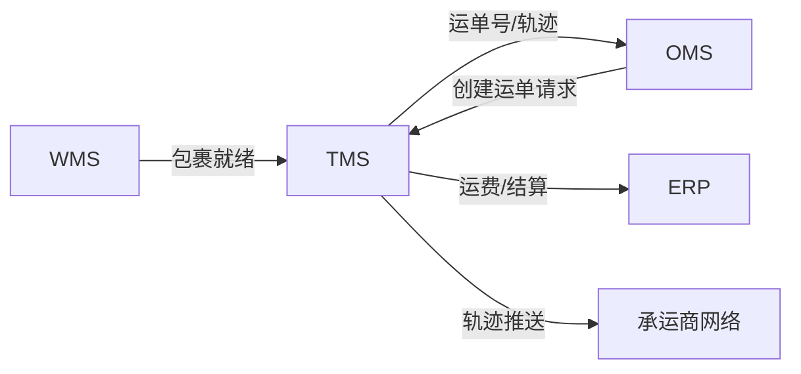
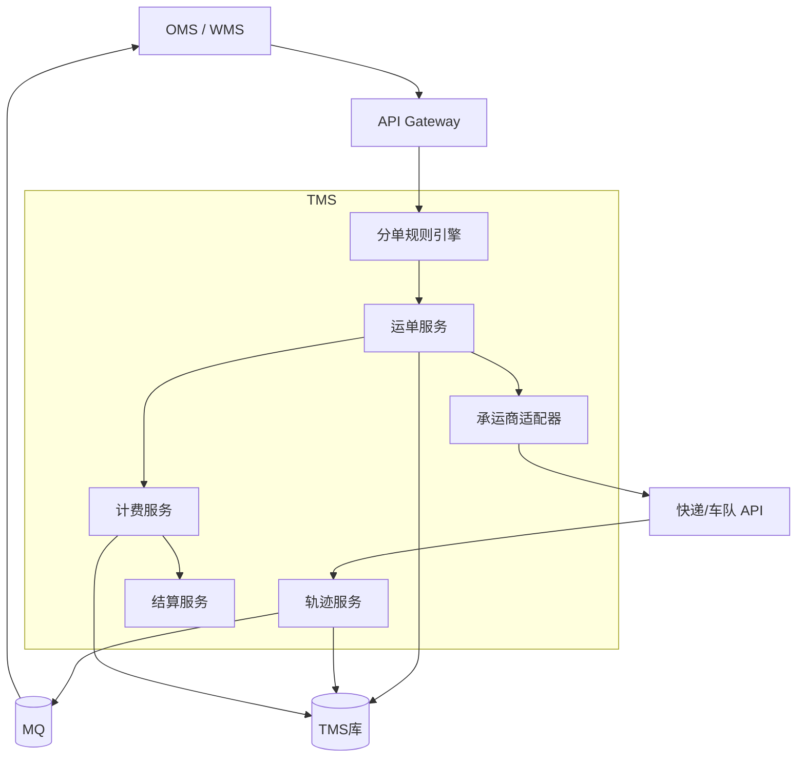
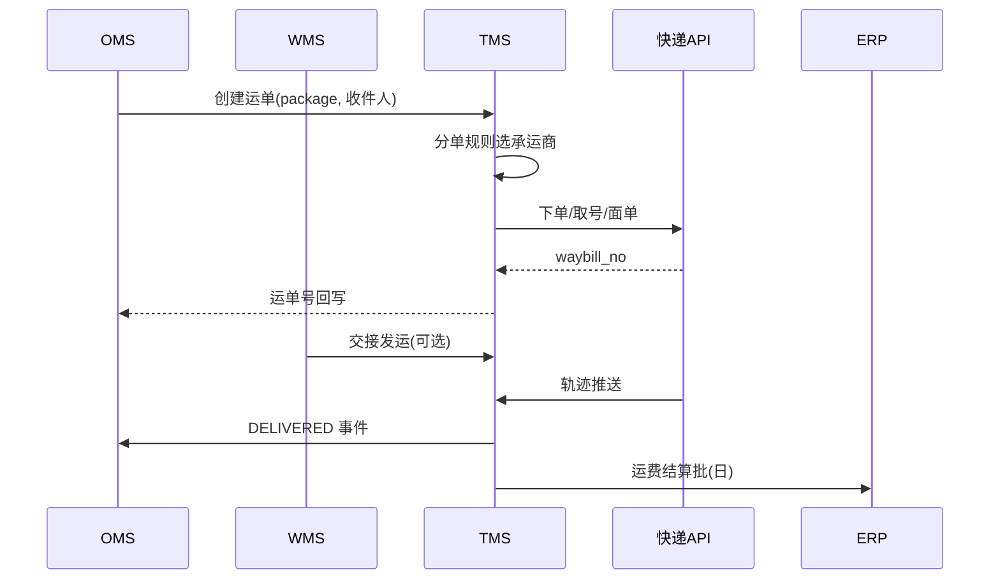
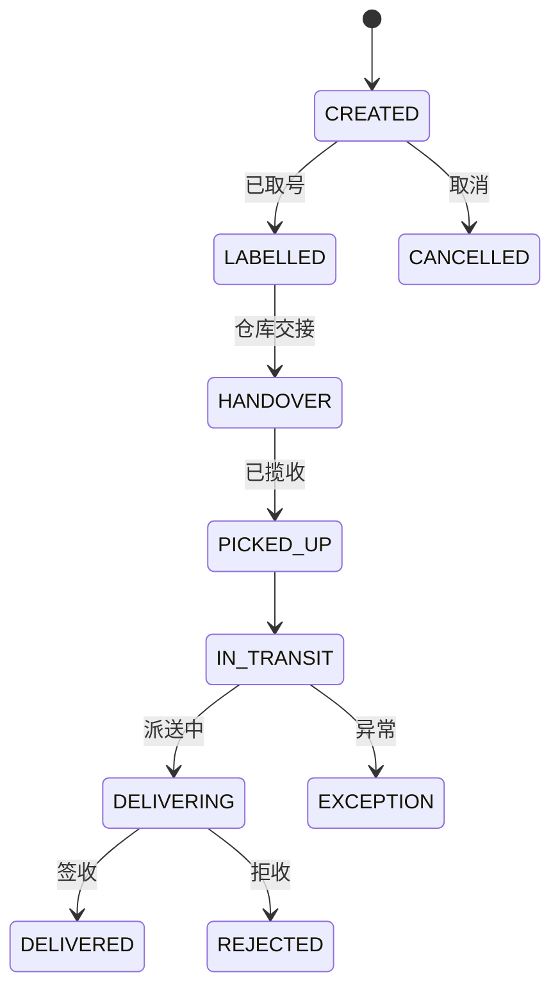
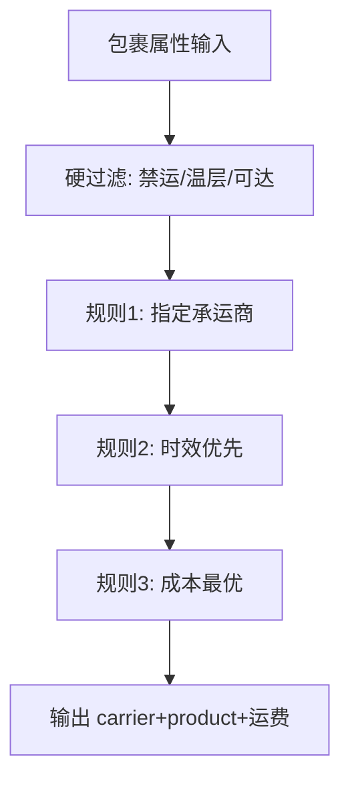
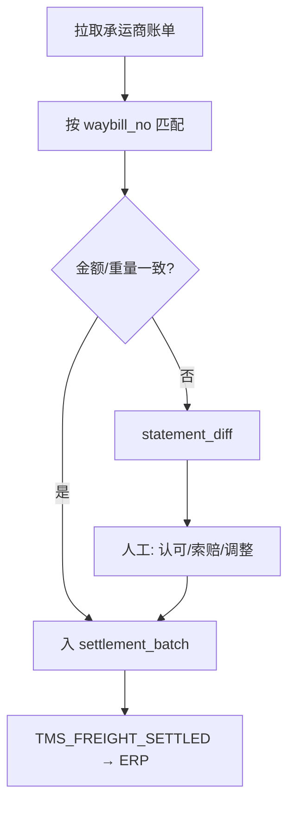

# TMS 系统详细设计（运输管理系统）

**你在做的事**：管「货从仓里出来到客户手里」这一段——选承运商、组单、排线、下单、在途跟踪、签收、异常与运费结算，并把结果告诉订单和财务系统。

**本文目标**：读完能说明 TMS 与 OMS/WMS/ERP 的衔接、运单与运费模型、状态机、轨迹集成与结算对账。

**文档级别**：生产级详细设计 **v4（AI 可实施）**；契约 `openapi-tms-core.yaml`。

**建议搭配阅读（主题关键词）**：订单管理（OMS）、仓储管理（WMS）、企业资源计划（ERP）、高并发电商履约。

---

## 文前目录（速达）

- [一、系统定位与边界](#sec-1)
- [二、业务域与功能架构](#sec-2)
- [三、技术架构](#sec-3)
- [四、核心数据模型](#sec-4)
- [五、核心业务流程](#sec-5)
- [六、状态机与事件](#sec-6)
- [七、对外集成](#sec-7)
- [八、非功能需求](#sec-8)
- [九、承运商与结算](#sec-9)
- [十、部署与运维](#sec-10)
- [十一、上线检查清单](#sec-11)
- [十二、生产级表结构设计（DDL）](#sec-12)
- [十三、分单规则与价卡引擎](#sec-13)
- [十四、集成事件规范（生产级）](#sec-14)
- [十五、REST API 与错误码目录](#sec-15)
- [十六、承运商适配器与熔断](#sec-16)
- [十七、轨迹标准化与推送节流](#sec-17)
- [十八、容量、结算批与压测](#sec-18)
- [十九、测试矩阵与验收用例](#sec-19)
- [二十、核心 API OpenAPI 级说明](#sec-20)
- [二十一、状态迁移全表与拦截规则](#sec-21)
- [二十二、全量业务错误码](#sec-22)
- [二十三、结算对账与差异处理](#sec-23)
- [二十四、承运商对接检查清单](#sec-24)
- [二十五、AI 实现模块与类清单](#sec-25)
- [二十六、完整 DDL 与 Flyway 顺序](#sec-26)
- [二十七、Gherkin 与自动化测试映射](#sec-27)
- [二十八、AI 任务拆分与验收标准](#sec-28)

---

<a id="sec-1"></a>

## 一、系统定位与边界

### 1.1 一句话定义

**TMS（Transportation Management System）** 是**运输执行与运费管理中枢**：根据业务规则选择承运方式，将包裹/运单交由快递或自有车队运输，聚合轨迹与签收，处理异常与索赔，完成运费试算、对账与结算数据输出。

### 1.2 在四系统中的位置

| 系统 | 与 TMS 关系 |
|------|-------------|
| **OMS** | 要运单号、要看物流、要签收状态推进订单 |
| **WMS** | 提供包裹重量体积、发运交接时间 |
| **ERP** | 接收运费成本、承运商应付；可选收入确认辅助 |
| **承运商** | 快递 API、车队 GPS、电子面单 |



### 1.3 范围内

- 运输计划：快递、零担、整车、同城即时配。
- 承运商管理：产品、时效、价格表、黑名单。
- 运单：创建、面单、揽收、在途、签收、拒收。
- 轨迹：订阅快递推送、清洗、转发 OMS。
- 运费：试算、实际运费、分摊到订单行（规则）。
- 异常：延误、破损、丢件、改址、拦截。
- 结算：对账单、差异、应付 ERP。

### 1.4 范围外

| 能力 | 归属 |
|------|------|
| 库内拣货发运 | WMS |
| 订单支付退款 | OMS + 支付 |
| 会计过账细节 | ERP |
| 国际关务（若未采购关务模块） | 关务系统 |
| 自有车队 HR 排班 | HR（TMS 只消费司机资源） |

### 1.5 设计原则

1. **运单与包裹 1:1 或 N:1**（拼整车）；关系在创建时固化。
2. **轨迹以承运商为准**，TMS 做标准化与去重；状态推进 OMS 需幂等。
3. **运费先试算后结算**：下单展示用试算，结算用称重复核与合同价。
4. **承运商适配器插件化**：每家快递独立 adapter，统一内部模型。

---

<a id="sec-2"></a>

## 二、业务域与功能架构

### 2.1 模块

| 模块 | 功能 |
|------|------|
| 网络 | 承运商、服务产品、覆盖范围、时效 |
| 规则 | 分单规则、限运、保价、温层 |
| 计划 | 线路、车次、停靠点（B2B/整车） |
| 执行 | 运单、面单、揽收、签收 |
| 轨迹 | 订阅、解析、推送 |
| 运费 | 价卡、附加费、分摊 |
| 异常 | 工单、理赔 |
| 结算 | 对账、发票、应付导出 |
| 司机端 | 接单、导航、签收拍照（自有车队） |

### 2.2 运输模式对比

| 模式 | 典型场景 | TMS 关注点 |
|------|----------|------------|
| 快递 | B2C 包裹 | 电子面单、轨迹 API |
| 同城即时 | O2O 2 小时达 | 骑手调度、实时位置 |
| 零担 LTL | B2B 批发 | 合单、提货预约 |
| 整车 FTL | 大批量 | 车次、装载率、多点卸 |
| 国际 | 跨境 | 关务交接点（扩展） |

---

<a id="sec-3"></a>

## 三、技术架构

### 3.1 架构图



### 3.2 分单规则引擎

输入：包裹属性（重量、体积、温层、目的地、时效要求、客户等级）、仓库位置、渠道。

输出：`carrier_code` + `service_product` + 预估运费 + 预计时效。

规则类型：优先级链、评分卡、成本最优、时效最优、指定承运商。

### 3.3 轨迹处理

- 订阅：快递推送 URL / 主动轮询。
- 标准化状态映射：`PICKED_UP → IN_TRANSIT → OUT_FOR_DELIVERY → DELIVERED / REJECTED`。
- 去重：`carrier_code + track_no + status + event_time`。

---

<a id="sec-4"></a>

## 四、核心数据模型

### 4.1 主数据

| 实体 | 说明 |
|------|------|
| `carrier` | 承运商：顺丰、中通、自有车队 |
| `service_product` | 产品：标快、特快、冷链 |
| `rate_card` | 价卡：分区、首重续重、最低收费 |
| `route` | 线路（整车）：起点终点、里程 |
| `vehicle` / `driver` | 自有车队资源 |

### 4.2 运单

| 实体 | 说明 |
|------|------|
| `shipment` | 运单头：shipment_no, carrier, status |
| `shipment_package` | 关联 package_no, weight, volume |
| `waybill` | 承运商运单号（可能一对多包裹） |
| `tracking_event` | 轨迹点 |
| `freight_charge` | 运费明细：基础费、燃油、偏远附加 |
| `exception_case` | 异常工单 |

### 4.3 结算

| 实体 | 说明 |
|------|------|
| `settlement_batch` | 结算批 |
| `carrier_statement` | 承运商对账单行 |
| `freight_allocation` | 分摊到 order_no/line |

---

<a id="sec-5"></a>

## 五、核心业务流程

### 5.1 B2C 快递（最常见）



### 5.2 运费试算（下单页）

1. OMS 调用 `POST /tms/v1/freight/estimate`，传入地址、SKU 重量体积模板。
2. TMS 返回多承运商方案列表（价格、时效）。
3. 用户选择 → OMS 快照 `carrier_product_id`；真正下单以 WMS 复核重量为准重新计费（可选补差价流程）。

### 5.3 拦截/改址

| 操作 | 条件 | 流程 |
|------|------|------|
| 拦截 | 未揽收或承运商支持 | TMS 调快递拦截 API → 成功则 OMS 取消发货态 |
| 改址 | 在途可改 | 审批 → 承运商改址 → 附加费 |

### 5.4 B2B 整车（简）

1. ERP/OMS 下发运输需求（体积、重量、卸货点列表）。
2. TMS 组 `transport_order` → 排线 → 指派车辆司机。
3. 装车确认 → 在途 GPS → 各点 POD 签收 → 运费按合同结算。

### 5.5 异常与理赔

- 延误：自动工单 + 客服台。
- 破损/丢件：拍照取证 → 理赔金额 → ERP 其他应收/成本调整。

---

<a id="sec-6"></a>

## 六、状态机与事件

### 6.1 运单状态机



### 6.2 发布事件

| event_type | 时机 | 订阅方 |
|------------|------|--------|
| `TMS_WAYBILL_CREATED` | 取号成功 | OMS |
| `TMS_PICKED_UP` | 揽收 | OMS |
| `TMS_IN_TRANSIT` | 在途更新（可节流） | OMS（展示） |
| `TMS_DELIVERED` | 签收 | OMS、ERP（若按签收确认收入） |
| `TMS_REJECTED` | 拒收 | OMS → 售后 |
| `TMS_FREIGHT_SETTLED` | 结算批确认 | ERP |

### 6.3 TMS_DELIVERED 最小载荷

```json
{
  "event_type": "TMS_DELIVERED",
  "biz_key": "TMS_DELIVERED+SH20260531001",
  "payload": {
    "shipment_no": "SH20260531001",
    "waybill_no": "SF1234567890",
    "package_no": "P202605311200001-01-1",
    "order_no": "O202605311200001-01",
    "delivered_at": "2026-06-02T10:30:00+08:00",
    "pod_type": "SIGN",
    "receiver_sign": "本人"
  }
}
```

### 6.4 OMS 状态推进规则

- 仅当 OMS 子单 ≥ `SHIPPED` 才接受 `DELIVERED`；否则进入异常队列人工处理。
- 同一 `biz_key` 重复投递不改变已完成订单。

---

<a id="sec-7"></a>

## 七、对外集成

### 7.1 创建运单 API

```
POST /tms/v1/shipment/create
Idempotency-Key: package_no
{
  "package_no": "P...",
  "order_no": "O...",
  "warehouse_code": "WH-SH-01",
  "carrier_code": null,
  "service_level": "STANDARD",
  "weight_kg": 1.2,
  "volume_cm3": 8000,
  "insured_value": 0,
  "sender": { ... },
  "receiver": { ... }
}
→ { "shipment_no", "waybill_no", "label_url" }
```

### 7.2 承运商适配器接口（内部）

| 方法 | 说明 |
|------|------|
| `createOrder` | 下单取号 |
| `cancelOrder` | 取消 |
| `subscribeTrack` | 订阅轨迹 |
| `intercept` | 拦截 |
| `queryFreight` | 运费查询 |

### 7.3 与 ERP

- 日批 `TMS_FREIGHT_SETTLED`：按承运商汇总应付金额、税金、成本中心。
- 字段：`carrier_id`, `period`, `total_amount`, `tax`, `org_id`, `gl_account_mapping`。

### 7.4 与 WMS

- 发运交接：`HANDOVER` 事件双向确认，防止未交接已揽收。

---

<a id="sec-8"></a>

## 八、非功能需求

| 维度 | 目标 |
|------|------|
| 取号 | P99 < 2s（依赖承运商 SLA） |
| 轨迹延迟 | 承运商推送后 30s 内转发 OMS |
| 可用性 | 99.9%；承运商失败可切换备用承运商 |
| 峰值 | 大促取号削峰：队列 + 限流 + 提前取号（预售包裹） |

**降级**：承运商 API 不可用时，允许「延迟取号」模式，先返回占位单号规则由运维配置（需业务同意）。

---

<a id="sec-9"></a>

## 九、承运商与结算

### 9.1 价卡管理

- 分区表（省/市/邮编段）、首重续重、抛货系数（体积重 = 体积/系数）。
- 合同价版本化：`rate_card_version`，结算按运单创建日或揽收日择一（需合同定）。

### 9.2 对账

| 步骤 | 说明 |
|------|------|
| 拉取 | 承运商账单 CSV/API |
| 匹配 | waybill_no + 重量复核 |
| 差异 | 超重、偏远、退回重复收费 |
| 确认 | 生成 `settlement_batch` → 推送 ERP |

### 9.3 分摊到订单（管理会计）

- 规则：按重量、按金额、按件数分摊到 `order_line`。
- 用于 OMS 展示「运费成本」、毛利报表（数仓消费）。

---

<a id="sec-10"></a>

## 十、部署与运维

- 承运商 adapter 独立进程，故障隔离。
- 轨迹消费高吞吐 Topic，按 `waybill_no` 分区保序。
- 监控：取号失败率、轨迹积压、签收率、时效 SLA 达标率。

---

<a id="sec-11"></a>

## 十一、上线检查清单

| # | 检查项 | 通过标准 |
|---|--------|----------|
| 1 | 分单规则 | 10 个典型地址试算与人工一致 |
| 2 | 面单 | 扫描可出库，承运商可揽收 |
| 3 | 轨迹 | 全流程 OMS 可见且状态正确 |
| 4 | 签收 | DELIVERED 推进订单且无回退 |
| 5 | 运费 | 试算 vs 结算差异 < 约定阈值 |
| 6 | ERP | 结算批借贷平衡 |
| 7 | 异常 | 拦截/拒收走通售后 |
| 8 | 压测 | 取号峰值无大面积超时 |

---

## 附录：四系统关键事件一览（集成评审用）

| 事件 | 生产者 | 消费者 | 用途 |
|------|--------|--------|------|
| ORDER_PAID | OMS | WMS/履约 | 触发出库 |
| FULFILLMENT_RELEASED | OMS | WMS | 出库单 |
| WMS_OUTBOUND_SHIPPED | WMS | OMS、ERP | 发货/成本 |
| TMS_WAYBILL_CREATED | TMS | OMS | 物流单号 |
| TMS_DELIVERED | TMS | OMS、ERP | 签收/收入 |
| TMS_FREIGHT_SETTLED | TMS | ERP | 运费应付 |
| WMS_GRN_POSTED | WMS | ERP | 采购入库 |
| REFUND_COMPLETED | OMS | ERP | 退货退款 |

---

<a id="sec-12"></a>

## 十二、生产级表结构设计（DDL）

### 12.1 承运商与价卡

```sql
CREATE TABLE carrier (
  carrier_id      BIGINT PRIMARY KEY,
  carrier_code    VARCHAR(32) NOT NULL UNIQUE,
  carrier_name    VARCHAR(128) NOT NULL,
  status          TINYINT NOT NULL DEFAULT 1
);

CREATE TABLE service_product (
  product_id      BIGINT PRIMARY KEY,
  carrier_id      BIGINT NOT NULL,
  product_code    VARCHAR(32) NOT NULL,
  product_name    VARCHAR(64) NOT NULL,
  time_limit_hours INT NOT NULL,
  UNIQUE uk_carrier_prod (carrier_id, product_code)
);

CREATE TABLE rate_card (
  rate_card_id    BIGINT PRIMARY KEY,
  carrier_id      BIGINT NOT NULL,
  version         INT NOT NULL,
  effective_from  DATE NOT NULL,
  effective_to    DATE NOT NULL,
  status          VARCHAR(16) NOT NULL,
  UNIQUE uk_carrier_ver (carrier_id, version)
);

CREATE TABLE rate_card_line (
  line_id         BIGINT PRIMARY KEY,
  rate_card_id    BIGINT NOT NULL,
  zone_code       VARCHAR(32) NOT NULL,
  weight_from_kg  DECIMAL(10,3) NOT NULL,
  weight_to_kg    DECIMAL(10,3) NOT NULL,
  base_fee        DECIMAL(18,4) NOT NULL,
  step_fee        DECIMAL(18,4) NOT NULL,
  min_fee         DECIMAL(18,4) NOT NULL
);
```

### 12.2 运单与轨迹

```sql
CREATE TABLE shipment (
  shipment_id     BIGINT PRIMARY KEY,
  shipment_no     VARCHAR(32) NOT NULL UNIQUE,
  package_no      VARCHAR(40) NOT NULL UNIQUE,
  order_no        VARCHAR(32) NOT NULL,
  carrier_id      BIGINT NOT NULL,
  product_id      BIGINT NOT NULL,
  status          VARCHAR(24) NOT NULL,
  waybill_no      VARCHAR(64) NULL,
  label_url       VARCHAR(512) NULL,
  weight_kg       DECIMAL(10,3) NOT NULL,
  volume_cm3      BIGINT NOT NULL,
  freight_estimated DECIMAL(18,4) NULL,
  freight_actual  DECIMAL(18,4) NULL,
  version         INT NOT NULL DEFAULT 0,
  KEY idx_waybill (waybill_no),
  KEY idx_status (status, updated_at)
);

CREATE TABLE tracking_event (
  event_id        BIGINT PRIMARY KEY AUTO_INCREMENT,
  waybill_no      VARCHAR(64) NOT NULL,
  carrier_status  VARCHAR(64) NOT NULL,
  standard_status VARCHAR(24) NOT NULL,
  event_time      DATETIME(3) NOT NULL,
  location        VARCHAR(128) NULL,
  raw_payload     JSON NULL,
  UNIQUE uk_dedup (waybill_no, carrier_status, event_time)
);
```

### 12.3 结算

```sql
CREATE TABLE settlement_batch (
  batch_id        BIGINT PRIMARY KEY,
  batch_no        VARCHAR(32) NOT NULL UNIQUE,
  carrier_id      BIGINT NOT NULL,
  period_code     CHAR(6) NOT NULL,
  total_amount    DECIMAL(18,4) NOT NULL,
  tax_amount      DECIMAL(18,4) NOT NULL,
  status          VARCHAR(16) NOT NULL,
  UNIQUE uk_carrier_period (carrier_id, period_code)
);

CREATE TABLE freight_allocation (
  id              BIGINT PRIMARY KEY AUTO_INCREMENT,
  shipment_no     VARCHAR(32) NOT NULL,
  order_no        VARCHAR(32) NOT NULL,
  order_line_id   BIGINT NULL,
  allocated_amount DECIMAL(18,4) NOT NULL
);
```

---

<a id="sec-13"></a>

## 十三、分单规则与价卡引擎

### 13.1 规则链（生产）



| 规则类型 | 示例 | 优先级 |
|----------|------|--------|
| 强制 | 冷链必须用冷链产品 | 100 |
| 指定 | 客户合同 SF 标快 | 90 |
| 评分 | `score = w1*时效 + w2*成本 + w3*签收率` | 50 |
| 兜底 | 默认中通 | 1 |

### 13.2 运费试算公式（快递）

- `charge_weight = max(actual_weight, volume_cm3 / throw_ratio)`（抛货系数默认 6000）
- `fee = max(min_fee, base_fee + ceil((charge_weight - w0)/step) * step_fee)`
- 附加费：偏远、保价、高峰（表驱动）

### 13.3 试算 API 响应

```json
{
  "package_no": "P...",
  "options": [
    {
      "carrier_code": "SF",
      "product_code": "STANDARD",
      "fee": "12.50",
      "currency": "CNY",
      "eta_hours": 24
    }
  ]
}
```

---

<a id="sec-14"></a>

## 十四、集成事件规范（生产级）

### 14.1 发布事件

| event_type | biz_key | 时机 |
|------------|---------|------|
| `TMS_WAYBILL_CREATED` | `+shipment_no` | 取号成功 |
| `TMS_PICKED_UP` | `+waybill_no` | 揽收 |
| `TMS_DELIVERED` | `+shipment_no` | 签收 |
| `TMS_REJECTED` | `+shipment_no` | 拒收 |
| `TMS_SHIPMENT_CANCELLED` | `+shipment_no` | 取消 |
| `TMS_FREIGHT_SETTLED` | `+batch_no` | 结算批确认 |

### 14.2 `TMS_DELIVERED` 模板

```json
{
  "event_id": "E20260602100000001",
  "event_type": "TMS_DELIVERED",
  "biz_key": "TMS_DELIVERED+SH20260531001",
  "schema_version": 1,
  "occurred_at": "2026-06-02T10:30:00.000+08:00",
  "data": {
    "shipment_no": "SH20260531001",
    "waybill_no": "SF1234567890",
    "package_no": "P202605311200001-01-1",
    "order_no": "O202605311200001-01",
    "delivered_at": "2026-06-02T10:30:00.000+08:00",
    "pod_type": "SIGN",
    "signer": "本人"
  }
}
```

### 14.3 `TMS_FREIGHT_SETTLED` 模板

```json
{
  "event_type": "TMS_FREIGHT_SETTLED",
  "biz_key": "TMS_FREIGHT_SETTLED+STL202605+SF",
  "data": {
    "settlement_batch_no": "STL202605-SF-001",
    "carrier_code": "SF",
    "period": "202605",
    "total_amount": "128500.0000",
    "tax_amount": "15420.0000",
    "currency": "CNY",
    "line_count": 10240
  }
}
```

---

<a id="sec-15"></a>

## 十五、REST API 与错误码目录

| 方法 | 路径 | 幂等键 |
|------|------|--------|
| POST | `/tms/v1/freight/estimate` | — |
| POST | `/tms/v1/shipment/create` | package_no |
| POST | `/tms/v1/shipment/{no}/cancel` | shipment_no |
| POST | `/tms/v1/shipment/{no}/intercept` | shipment_no |
| GET | `/tms/v1/tracking/{waybill_no}` | — |
| POST | `/tms/v1/settlement/batches` | carrier+period |
| POST | `/tms/v1/integration/carrier/callback` | 承运商签名 |

| code | HTTP | 含义 |
|------|------|------|
| `TMS_10001` | 409 | 运单已存在 |
| `TMS_20001` | 400 | 不可达 |
| `TMS_20002` | 400 | 承运商拒单 |
| `TMS_30001` | 400 | 状态不可拦截 |
| `TMS_40001` | 503 | 承运商超时 |
| `TMS_40002` | 200 | 降级备用承运商（需标记） |

---

<a id="sec-16"></a>

## 十六、承运商适配器与熔断

### 16.1 适配器接口

```java
// 概念接口，语言无关
interface CarrierAdapter {
  CreateResult createOrder(ShipmentRequest req);
  CancelResult cancelOrder(String waybillNo);
  TrackSubscribeResult subscribe(String waybillNo);
  FreightQuote quote(QuoteRequest req);
}
```

### 16.2 熔断与降级

| 指标 | 阈值 | 动作 |
|------|------|------|
| 错误率 1min | >30% | 熔断 60s |
| P99 延迟 | >5s | 半开探测 |
| 连续超时 | 10 次 | 切换备用承运商 |

- 备用承运商创建须在运单上标记 `fallback=true`，结算按实际承运商合同。

### 16.3 回调验签

- 每个承运商独立 `secret`；验签失败 **401**，不计费。
- 原始 body 存 `carrier_callback_raw`，**禁止**进 MQ payload。

---

<a id="sec-17"></a>

## 十七、轨迹标准化与推送节流

### 17.1 标准状态映射表（示例）

| carrier_status（顺丰） | standard_status |
|------------------------|-----------------|
| 50 | PICKED_UP |
| 30/31 | IN_TRANSIT |
| 44 | DELIVERING |
| 80 | DELIVERED |
| 70 | REJECTED |

### 17.2 推送 OMS 节流

- `IN_TRANSIT`：同一运单最多 **1 次/30 分钟** 推送 OMS（展示走查询接口）。
- `DELIVERED/REJECTED`：**立即**推送，不节流。
- 去重键：`(waybill_no, standard_status, event_time)`。

---

<a id="sec-18"></a>

## 十八、容量、结算批与压测

| 指标 | 目标 |
|------|------|
| 取号 | P99<2s（含承运商） |
| 轨迹写入 | 5 万条/分钟 |
| 日运单 | 50 万+ |

**结算批**：按月+承运商生成；匹配率目标 99.5%；差异进 `statement_diff` 人工池。

**压测**：承运商 Mock 1 万 QPS 取号；轨迹重复投递不重复推进状态。

---

<a id="sec-19"></a>

## 十九、测试矩阵与验收用例

| 编号 | 场景 | 期望 |
|------|------|------|
| TMS-T01 | 创建运单 | waybill+label |
| TMS-T02 | 重复 package | 幂等 |
| TMS-T03 | 承运商熔断 | 备用承运商 |
| TMS-T04 | 轨迹签收 | OMS DELIVERED |
| TMS-T05 | 拒收 | REJECTED+售后 |
| TMS-T06 | 拦截 | 未揽收可取消 |
| TMS-T07 | 运费试算 vs 结算 | 差异<阈值 |
| TMS-T08 | 结算批 | ERP 应付入账 |

---

<a id="sec-20"></a>

## 二十、核心 API OpenAPI 级说明

### 20.1 `POST /tms/v1/freight/estimate`

**Request**

```json
{
  "from_warehouse_code": "WH-SH-01",
  "receiver": {
    "province": "浙江省",
    "city": "杭州市",
    "district": "余杭区",
    "address": "文一西路",
    "zip": "310000"
  },
  "packages": [
    { "weight_kg": "1.200", "volume_cm3": 8000, "insured_value": "0" }
  ],
  "temp_zone": "NORMAL",
  "service_level": "STANDARD"
}
```

**Response**：`options[]` 含 `carrier_code/product_code/fee/eta_hours/rank`。

### 20.2 `POST /tms/v1/shipment/create`

| 字段 | 必填 | 说明 |
|------|:----:|------|
| `package_no` | 是 | 幂等键 |
| `order_no` | 是 | |
| `carrier_code` | 否 | 空则走分单引擎 |
| `product_code` | 否 | |
| `weight_kg` / `volume_cm3` | 是 | WMS 复核值 |
| `sender` / `receiver` | 是 | |

**Response 201**

```json
{
  "code": "0",
  "data": {
    "shipment_no": "SH20260531001",
    "waybill_no": "SF1234567890",
    "label_url": "https://...",
    "carrier_code": "SF",
    "freight_estimated": "12.50",
    "fallback_used": false
  }
}
```

### 20.3 `POST /tms/v1/shipment/{shipment_no}/intercept`

| 状态 | 是否允许 |
|------|----------|
| CREATED/LABELLED | 是 |
| PICKED_UP+ | 承运商 API 决定 |

### 20.4 承运商回调 `POST /tms/v1/integration/carrier/{code}/callback`

- 验签 → 写 `tracking_event` → 映射 `standard_status` → 节流推送 OMS。
- 响应 200 即可，业务异步。

---

<a id="sec-21"></a>

## 二十一、状态迁移全表与拦截规则

| 当前 | 触发 | 下一 | 守卫 |
|------|------|------|------|
| CREATED | label_ok | LABELLED | 取号成功 |
| LABELLED | handover | HANDOVER | WMS 交接事件 |
| HANDOVER | pickup | PICKED_UP | 揽收扫描 |
| PICKED_UP | hub | IN_TRANSIT | — |
| IN_TRANSIT | dispatch | DELIVERING | — |
| DELIVERING | sign | DELIVERED | — |
| DELIVERING | reject | REJECTED | — |
| * | cancel_ok | CANCELLED | 未揽收或承运商确认 |

**OMS 推进**：仅 `DELIVERED/REJECTED` 改变订单终态；`IN_TRANSIT` 不升主单状态。

---

<a id="sec-22"></a>

## 二十二、全量业务错误码

| code | HTTP | 说明 |
|------|------|------|
| TMS_10001 | 409 | 运单已存在 |
| TMS_10002 | 404 | 运单不存在 |
| TMS_20001 | 400 | 地址不可达 |
| TMS_20002 | 400 | 温层不支持 |
| TMS_20003 | 400 | 重量超限 |
| TMS_30001 | 400 | 不可拦截 |
| TMS_30002 | 400 | 已签收 |
| TMS_40001 | 503 | 承运商超时 |
| TMS_40002 | 200 | 已切换备用承运商 |
| TMS_40003 | 400 | 价卡缺失 |
| TMS_50001 | 400 | 结算批已锁定 |
| TMS_50002 | 400 | 对账差异未处理 |
| TMS_90001 | 500 | 系统异常 |

---

<a id="sec-23"></a>

## 二十三、结算对账与差异处理

### 23.1 对账流程（月）



### 23.2 差异类型

| 类型 | 原因 | 处理 |
|------|------|------|
| 重量差异 | 抛货系数 | 以承运商复核为准调 `freight_actual` |
| 重复计费 | 账单重复 | 拒付该行 |
| 未匹配 | 漏揽收 | 查 TMS 无则索赔 |
| 偏远附加 | 价卡未含 | 规则表补附加费 |

### 23.3 `statement_diff` 表

```sql
CREATE TABLE statement_diff (
  diff_id BIGINT PRIMARY KEY,
  waybill_no VARCHAR(64) NOT NULL,
  carrier_amount DECIMAL(18,4),
  system_amount DECIMAL(18,4),
  diff_type VARCHAR(32) NOT NULL,
  status VARCHAR(16) NOT NULL COMMENT 'OPEN/APPROVED/REJECTED',
  resolved_at DATETIME(3) NULL
);
```

### 23.4 分摊回溯

结算确认后按 `shipment_no` 写 `freight_allocation`；数仓按 `order_line_id` 算毛利。

---

<a id="sec-24"></a>

## 二十四、承运商对接检查清单

| # | 检查项 | 顺丰示例 | 通过标准 |
|---|--------|----------|----------|
| 1 | 沙箱取号 | 下测试单 | 返回 waybill |
| 2 | 电子面单 | 打印 PDF | 可扫描出库 |
| 3 | 轨迹订阅 | 配置回调 URL | 验签通过 |
| 4 | 状态映射 | 50/80 等 | 映射表已配 |
| 5 | 取消/拦截 | 未揽收 | API 成功 |
| 6 | 运费试算 | 10 个地址 | 误差 <5% |
| 7 | 账单拉取 | 上月 CSV | 解析成功 |
| 8 | 熔断 | Mock 超时 | 备用承运商 |
| 9 | 幂等 | 重复 create | 同一 shipment |
| 10 | 压测 | 500 QPS 取号 | 错误率 <0.1% |

**adapter 配置项**：`endpoint/app_id/secret/sandbox/mode` 全走配置中心；密钥不入库。

---

---

<a id="sec-25"></a>

## 二十五、AI 实现模块与类清单

| 类 | 职责 |
|----|------|
| `FreightEstimateService` | 价卡试算 |
| `RoutingRuleEngine` | 分单链 |
| `ShipmentAppService` | 建单幂等 |
| `CarrierAdapter` / `MockCarrierAdapter` | 取号 |
| `TrackingNormalizeService` | 状态映射+去重 |
| `OmsEventPublisher` | TMS_DELIVERED 节流 |
| `SettlementBatchService` | 月结批 |

**单测**：`RoutingRuleEngineTest`、`TrackingDedupTest`、`ShipmentCreateIdempotentTest`。

---

<a id="sec-26"></a>

## 二十六、完整 DDL 与 Flyway 顺序

V1 carrier/product → V2 rate_card → V3 shipment/tracking → V4 settlement/freight_allocation。

---

<a id="sec-27"></a>

## 二十七、Gherkin 与自动化测试映射

| Scenario | TMS 责任 |
|----------|----------|
| E2E-01 | createShipment + 模拟签收 |
| E2E-08 | 乱序轨迹 |
| E2E-09 | — |
| 结算 | E2E-01 可省略月结，单测 SettlementBatchTest |

---

<a id="sec-28"></a>

## 二十八、AI 任务拆分与验收标准

| 任务 ID | 完成判定 |
|---------|----------|
| TMS-01 | Flyway 绿 |
| TMS-02 | estimate+create 契约绿 |
| TMS-03 | callback→DELIVERED IT 绿 |
| TMS-04 | 熔断 Mock 单测绿 |
| TMS-05 | E2E-01 TMS 段绿 |

---

**版本说明**：生产级 **v4（AI 可实施）**。


