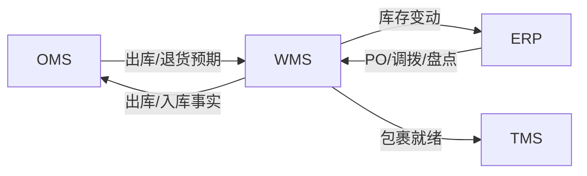
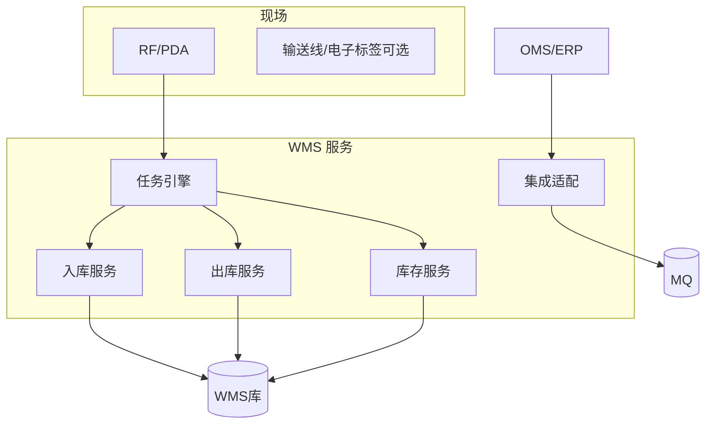
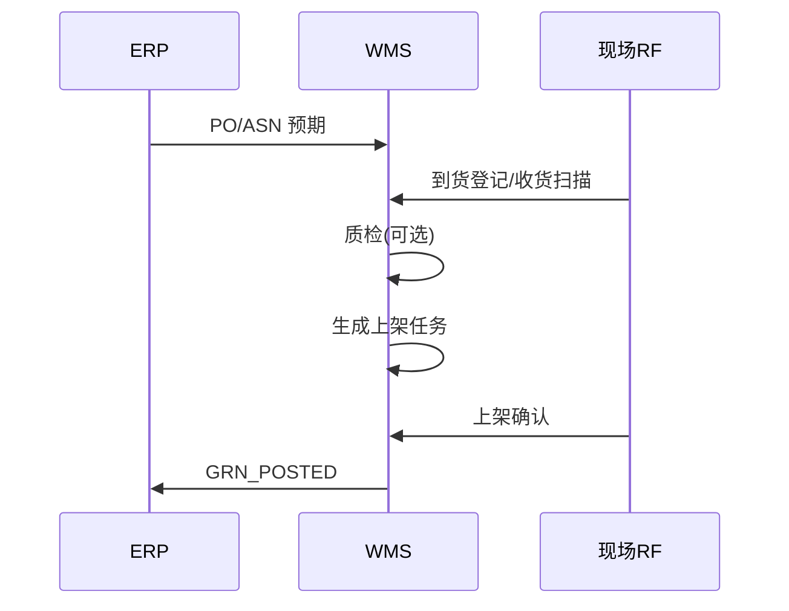
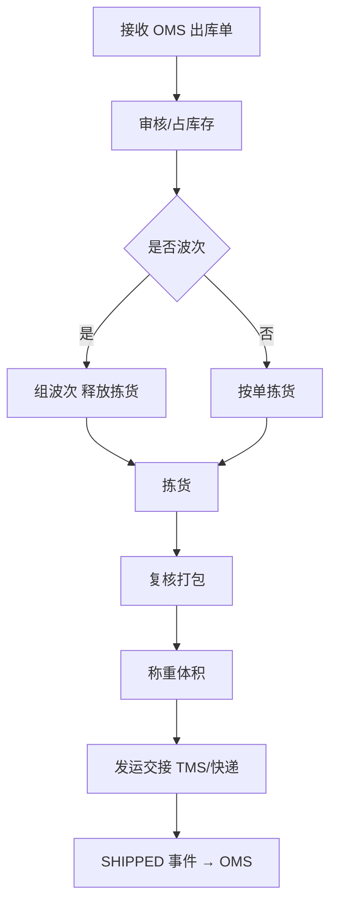
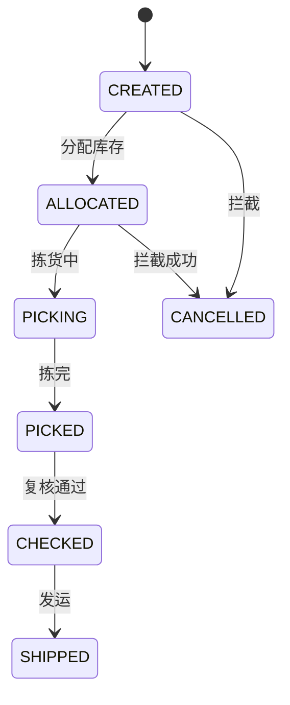
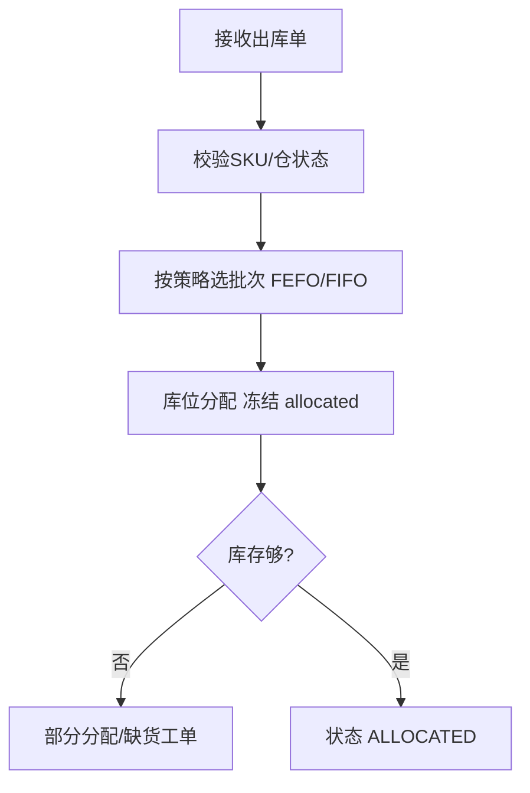

# WMS 系统详细设计（仓储管理系统）

**你在做的事**：管仓库里「货在哪、怎么收、怎么存、怎么拣、怎么发、怎么盘」——把订单系统的出库指令变成可执行的库内作业，并把**实收实发数量**回传给订单与财务。

**本文目标**：读完能说明 WMS 与 OMS/ERP/TMS 的分工、核心库内流程、库存粒度（库位/批次）、状态机与回传事件。

**文档级别**：生产级详细设计 **v4（AI 可实施）**；契约 `openapi-wms-core.yaml`。

**建议搭配阅读（主题关键词）**：订单管理（OMS）、企业资源计划（ERP）、运输管理（TMS）、高并发电商履约链路。

---

## 文前目录（速达）

- [一、系统定位与边界](#sec-1)
- [二、业务域与功能架构](#sec-2)
- [三、技术架构](#sec-3)
- [四、核心数据模型](#sec-4)
- [五、核心业务流程](#sec-5)
- [六、状态机与事件](#sec-6)
- [七、对外集成](#sec-7)
- [八、非功能需求](#sec-8)
- [九、现场作业与设备](#sec-9)
- [十、部署与运维](#sec-10)
- [十一、上线检查清单](#sec-11)
- [十二、生产级表结构设计（DDL）](#sec-12)
- [十三、库存分配与拣货算法](#sec-13)
- [十四、集成事件规范（生产级）](#sec-14)
- [十五、REST/RF API 与错误码](#sec-15)
- [十六、Outbox、幂等、离线作业](#sec-16)
- [十七、波次与任务引擎配置](#sec-17)
- [十八、容量、仓边缘部署与压测](#sec-18)
- [十九、测试矩阵与验收用例](#sec-19)
- [二十、核心 API OpenAPI 级说明](#sec-20)
- [二十一、状态迁移全表与拦截规则](#sec-21)
- [二十二、全量业务错误码](#sec-22)
- [二十三、并发库存与冻结治理](#sec-23)
- [二十四、3PL 多货主与计费扩展](#sec-24)
- [二十五、AI 实现模块与类清单](#sec-25)
- [二十六、完整 DDL 与 Flyway 顺序](#sec-26)
- [二十七、Gherkin 与自动化测试映射](#sec-27)
- [二十八、AI 任务拆分与验收标准](#sec-28)

---

<a id="sec-1"></a>

## 一、系统定位与边界

### 1.1 一句话定义

**WMS（Warehouse Management System）** 是**库内执行与库存精度系统**：管理仓库、库区、库位、容器、批次效期；驱动收货、上架、补货、拣货、复核、发运、盘点、逆向入库；保证「账实相符」并把执行结果事件化。

### 1.2 在四系统中的位置

| 上游 | 下发什么 | WMS 做什么 | 回传什么 |
|------|----------|------------|----------|
| **OMS** | 销售出库单、退货入库预期 | 拣货发运 | 出库确认、发货数量 |
| **ERP** | 采购 PO、调拨单、盘点指令 | 收货上架、调拨执行 | GRN、出库、损益 |
| **TMS** | — | 交接发运区、装载 | 可回传包裹称重体积 |
| **WMS** | — | 库内真相 | 事件给 OMS/ERP |



### 1.3 范围内

- 多仓、多货主（若 3PL）、温层（常温/冷链）。
- 入库：ASN/预约、收货、质检、上架。
- 出库：波次、拣货策略、复核、打包、交接承运。
- 库内：移库、补货、冻结、批次/效期、序列号（可选）。
- 盘点：循环盘、全盘、差异处理。
- 逆向：退货质检、良品/不良品分流。

### 1.4 范围外

| 能力 | 归属 |
|------|------|
| 订单支付、促销 | OMS |
| 会计凭证、成本计价规则 | ERP |
| 路线规划、运费计费 | TMS |
| 运输在途跟踪 | TMS/快递 |
| 采购谈判、供应商评分 | SRM/ERP |

### 1.5 设计原则

1. **库位级库存是 WMS 真相**；ERP 是财务账，OMS 是可售库存，三者通过对账对齐。
2. **先冻结后动账**：拣货分配即冻结库位库存，发运确认才扣减。
3. **批次/效期**：出库遵循 FEFO/FIFO 策略，可配置。
4. **幂等接收上游单**：`source_doc_no + doc_type` 唯一。

---

<a id="sec-2"></a>

## 二、业务域与功能架构

### 2.1 模块地图

| 模块 | 功能点 |
|------|--------|
| 基础 | 仓库、库区、库位、容器、SKU 映射、作业班组 |
| 入库 | 预约、收货、质检、上架任务 |
| 出库 | 出库单、波次、拣货、复核、发运 |
| 库内 | 移库、补货、冻结、属性变更 |
| 库存 | 余额、批次、效期、序列号 |
| 盘点 | 计划、冻结、录入、差异 |
| 逆向 | 退货收货、分拣、重新上架 |
| 任务 | RF/PDA 任务推送、绩效 |
| 集成 | OMS/ERP/TMS 适配、事件 |

### 2.2 仓库类型

| 类型 | 特点 | 拣货策略 |
|------|------|----------|
| 中心仓 CDC | 大批量、多区域配送 | 波次+分区拣货 |
| 前置仓 FDC | 同城快配 | 订单直拣 |
| 门店仓 | 小面积、高频补货 | 摘果式 |
| 3PL 仓 | 多货主 | 货主隔离+计费 |

---

<a id="sec-3"></a>

## 三、技术架构

### 3.1 逻辑架构



### 3.2 任务引擎

- 将业务单拆解为**可执行任务**（上架、拣货、复核、移库）。
- 任务状态：`PENDING → ASSIGNED → IN_PROGRESS → DONE / CANCELLED`。
- 支持认领、转派、优先级、路径优化（按库位顺序）。

### 3.3 与自动化设备（可选）

| 设备 | 集成方式 | 说明 |
|------|----------|------|
| 电子标签 PTW | 中间件 API | 亮灯拣货 |
| AGV | WCS | 搬运任务 |
| 输送线 | PLC/OPC | 分拣口投递 |

---

<a id="sec-4"></a>

## 四、核心数据模型

### 4.1 结构主数据

| 实体 | 说明 |
|------|------|
| `warehouse` | 物理仓，映射 ERP 逻辑仓 |
| `zone` | 库区：收货区、存储区、拣货区、发货区 |
| `location` | 库位编码，类型（托盘位/货架位/地面） |
| `container` | 托盘、周转箱、拣货车 |
| `sku` | WMS SKU，映射 OMS sku_id / ERP material_id |

### 4.2 库存

| 实体 | 粒度 | 关键字段 |
|------|------|----------|
| `inventory_balance` | 仓+SKU(+批次) | on_hand, allocated, frozen |
| `inventory_location` | 库位级 | location_id, qty, batch_id |
| `batch` | 批次 | batch_no, mfg_date, exp_date |
| `serial` | 序列号 | serial_no, status |

**数量关系**：`on_hand = available + allocated + frozen`（实现时统一口径，避免多套定义）。

### 4.3 单据

| 单据 | 来源 | 说明 |
|------|------|------|
| `inbound_order` | ERP PO / OMS 退货 | 预期入库 |
| `receipt` | WMS 收货 | 实收 |
| `putaway_task` | 收货后 | 上架 |
| `outbound_order` | OMS 包裹 | 预期出库 |
| `wave` | 波次合并 | 多条 OB 合并拣货 |
| `pick_task` | 波次释放 | 拣货 |
| `shipment` | 复核后 | 发运确认 |
| `stocktake` | ERP/计划 | 盘点 |

### 4.4 出库单与包裹关系

- 一个 `outbound_order` 对应 OMS 一个 `package_no`。
- 允许多 OB 合并进入一个 `wave`，拣货后按 OB 复核分拨。

---

<a id="sec-5"></a>

## 五、核心业务流程

### 5.1 入库（采购）



### 5.2 出库（电商）



### 5.3 拣货策略（可配置）

| 策略 | 适用 |
|------|------|
| 订单拣货 | 前置仓、单量少 |
| 波次拣货 | 中心仓高峰 |
| 分区+汇总 | 多区大仓，先分后合 |
| 边拣边分 | 大促，减少二次分拨 |

### 5.4 补货

- 拣货区 `min_qty` 触发补货任务，从存储区移库到拣货区。
- 补货未完成时，出库分配可回退或等待（策略配置）。

### 5.5 盘点

1. 创建盘点计划 → 冻结库位或 SKU。
2. RF 盲盘/明盘录入。
3. 差异复核 → 生成调整单 → 事件 `STOCKTAKE_ADJUSTED` → ERP。

### 5.6 退货入库

1. OMS 下发 `return_inbound_expected`。
2. 收货质检：良品重新上架；不良品入残次区。
3. 事件 `RETURN_INBOUND_DONE` → OMS 触发退款。

---

<a id="sec-6"></a>

## 六、状态机与事件

### 6.1 出库单状态



### 6.2 发布事件

| event_type | 时机 | 订阅方 |
|------------|------|--------|
| `WMS_INBOUND_RECEIVED` | 收货完成 | ERP |
| `WMS_PUTAWAY_DONE` | 上架完成 | ERP（可选） |
| `WMS_OUTBOUND_ALLOCATED` | 分配完成 | OMS（可选） |
| `WMS_OUTBOUND_SHIPPED` | 发运确认 | OMS、ERP |
| `WMS_GRN_POSTED` | 采购入库过账 | ERP |
| `WMS_RETURN_INBOUND_DONE` | 退货入库 | OMS |
| `WMS_STOCKTAKE_ADJUSTED` | 盘点调整 | ERP |

### 6.3 WMS_OUTBOUND_SHIPPED 最小载荷

```json
{
  "event_type": "WMS_OUTBOUND_SHIPPED",
  "biz_key": "WMS_OUTBOUND_SHIPPED+OB20260531001",
  "payload": {
    "outbound_no": "OB20260531001",
    "package_no": "P202605311200001-01-1",
    "source_order_no": "O202605311200001-01",
    "warehouse_code": "WH-SH-01",
    "shipped_at": "2026-05-31T15:00:00+08:00",
    "lines": [
      { "sku_code": "SKU001", "qty": 2, "batch_no": "B202601" }
    ],
    "weight_kg": 1.2,
    "volume_cm3": 8000
  }
}
```

---

<a id="sec-7"></a>

## 七、对外集成

### 7.1 接收 OMS 出库单

- 幂等：`package_no` 唯一。
- 校验：SKU 存在、仓库启用、库存可分配。
- 失败码：库存不足 400、重复 409、仓停用 400。

### 7.2 接收 ERP

| 类型 | 动作 |
|------|------|
| PO 释放 | 创建 inbound 预期 |
| 调拨出库 | 创建 outbound + 在途标记 |
| 调拨入库 | 创建 inbound |
| 盘点指令 | 创建 stocktake |

### 7.3 交接 TMS

- 发运确认后调用 TMS 创建运单，或仅回传「待揽收」列表由 TMS 批量拉取。
- 必传：包裹号、重量、体积、收件人、承运商产品编码。

### 7.4 库存对账

| 频率 | 对象 | 规则 |
|------|------|------|
| 实时 | OMS 可售 vs WMS 可用（若共享模型） | 差异告警 |
| 日 | WMS on_hand vs ERP 库存账 | 调账流程 |
| 周 | 库位账 vs 余额汇总 | 内部一致性 |

---

<a id="sec-8"></a>

## 八、非功能需求

| 维度 | 目标 |
|------|------|
| RF 接口 | P99 < 200ms，断网可离线队列（可选） |
| 波次释放 | 单仓 1 万行/小时级拣货任务生成 |
| 准确性 | 库存准确率 ≥ 99.5%（行业基准，企业自定） |
| 可用性 | 仓内 99.9%，断网可继续扫码（离线模式） |

---

<a id="sec-9"></a>

## 九、现场作业与设备

- **条码体系**：库位码、SKU 码、箱码、运单号统一编码规则文档。
- **权限**：收货员不可复核（SoD）；盘点员不可同时拣货同一库位。
- **绩效**：任务耗时、行数、差错率报表。

---

<a id="sec-10"></a>

## 十、部署与运维

- 单仓可独立部署（边缘），总部汇总报表。
- 高峰前：预生成拣货路径、清理僵尸冻结、校验载具。
- 监控：任务积压、拣货超时、复核差异率、集成失败队列。

---

<a id="sec-11"></a>

## 十一、上线检查清单

| # | 检查项 | 通过标准 |
|---|--------|----------|
| 1 | 主数据 | 库位地图 100% 录入，SKU 映射无遗漏 |
| 2 | 策略 | 批次/FEFO、波次规则试跑 3 单 |
| 3 | 幂等 | 重复 package 不重复出库 |
| 4 | 回传 | SHIPPED 后 1 分钟内 OMS 可见物流单号 |
| 5 | ERP | GRN/出库事件借贷物料一致 |
| 6 | 盘点 | 全盘差异流程走通 |
| 7 | RF | 弱网/断网场景符合预期 |
| 8 | 安全 | 高价值 SKU 双人复核启用 |

---

<a id="sec-12"></a>

## 十二、生产级表结构设计（DDL）

### 12.1 仓库结构

```sql
CREATE TABLE warehouse (
  wh_id           BIGINT PRIMARY KEY,
  wh_code         VARCHAR(32) NOT NULL UNIQUE,
  wh_name         VARCHAR(128) NOT NULL,
  erp_wh_code     VARCHAR(32) NOT NULL,
  timezone        VARCHAR(32) NOT NULL DEFAULT 'Asia/Shanghai',
  status          TINYINT NOT NULL DEFAULT 1
);

CREATE TABLE location (
  location_id     BIGINT PRIMARY KEY,
  wh_id           BIGINT NOT NULL,
  location_code   VARCHAR(64) NOT NULL,
  zone_code       VARCHAR(32) NOT NULL,
  location_type   VARCHAR(16) NOT NULL COMMENT 'RECEIVE/STORAGE/PICK/SHIP',
  pick_seq        INT NOT NULL DEFAULT 0 COMMENT '拣货路径序号',
  status          TINYINT NOT NULL DEFAULT 1,
  UNIQUE uk_wh_loc (wh_id, location_code)
);
```

### 12.2 库存（库位级）

```sql
CREATE TABLE inventory_balance (
  balance_id      BIGINT PRIMARY KEY,
  wh_id           BIGINT NOT NULL,
  sku_id          BIGINT NOT NULL,
  batch_no        VARCHAR(64) NOT NULL DEFAULT '',
  qty_on_hand     DECIMAL(18,4) NOT NULL,
  qty_allocated   DECIMAL(18,4) NOT NULL DEFAULT 0,
  qty_frozen      DECIMAL(18,4) NOT NULL DEFAULT 0,
  version         INT NOT NULL DEFAULT 0,
  UNIQUE uk_bal (wh_id, sku_id, batch_no)
);

CREATE TABLE inventory_location (
  id              BIGINT PRIMARY KEY AUTO_INCREMENT,
  wh_id           BIGINT NOT NULL,
  location_id     BIGINT NOT NULL,
  sku_id          BIGINT NOT NULL,
  batch_no        VARCHAR(64) NOT NULL DEFAULT '',
  qty             DECIMAL(18,4) NOT NULL,
  UNIQUE uk_loc_sku (location_id, sku_id, batch_no)
);
```

### 12.3 出库与任务

```sql
CREATE TABLE outbound_order (
  ob_id           BIGINT PRIMARY KEY,
  outbound_no     VARCHAR(32) NOT NULL UNIQUE,
  package_no      VARCHAR(40) NOT NULL UNIQUE,
  source_order_no VARCHAR(32) NOT NULL,
  wh_id           BIGINT NOT NULL,
  status          VARCHAR(24) NOT NULL,
  wave_no         VARCHAR(32) NULL,
  version         INT NOT NULL DEFAULT 0,
  KEY idx_pkg (package_no),
  KEY idx_status (wh_id, status, created_at)
);

CREATE TABLE outbound_line (
  line_id         BIGINT PRIMARY KEY,
  outbound_no     VARCHAR(32) NOT NULL,
  line_no         INT NOT NULL,
  sku_id          BIGINT NOT NULL,
  qty_ordered     DECIMAL(18,4) NOT NULL,
  qty_picked      DECIMAL(18,4) NOT NULL DEFAULT 0,
  qty_shipped     DECIMAL(18,4) NOT NULL DEFAULT 0,
  batch_no        VARCHAR(64) NOT NULL DEFAULT '',
  UNIQUE uk_ob_line (outbound_no, line_no)
);

CREATE TABLE wms_task (
  task_id         BIGINT PRIMARY KEY,
  task_no         VARCHAR(32) NOT NULL UNIQUE,
  task_type       VARCHAR(24) NOT NULL COMMENT 'PUTAWAY/PICK/CHECK/MOVE',
  ref_doc_no      VARCHAR(32) NOT NULL,
  wh_id           BIGINT NOT NULL,
  status          VARCHAR(16) NOT NULL,
  assignee        VARCHAR(64) NULL,
  priority        INT NOT NULL DEFAULT 100,
  KEY idx_wh_status (wh_id, status, priority)
);
```

### 12.4 入库

```sql
CREATE TABLE inbound_order (
  ib_id           BIGINT PRIMARY KEY,
  inbound_no      VARCHAR(32) NOT NULL UNIQUE,
  source_doc_no   VARCHAR(32) NOT NULL COMMENT 'PO号',
  wh_id           BIGINT NOT NULL,
  status          VARCHAR(24) NOT NULL,
  UNIQUE uk_source (source_doc_no, wh_id)
);

CREATE TABLE receipt (
  receipt_id      BIGINT PRIMARY KEY,
  receipt_no      VARCHAR(32) NOT NULL UNIQUE,
  inbound_no      VARCHAR(32) NOT NULL,
  received_at     DATETIME(3) NOT NULL
);
```

---

<a id="sec-13"></a>

## 十三、库存分配与拣货算法

### 13.1 分配流程（出库 ALLOCATED）



**SQL 条件更新（防超扣）**

```sql
UPDATE inventory_balance
SET qty_allocated = qty_allocated + :qty, version = version + 1
WHERE wh_id = :wh AND sku_id = :sku AND batch_no = :batch
  AND (qty_on_hand - qty_allocated - qty_frozen) >= :qty
  AND version = :ver;
-- affected_rows=0 → 分配失败，换批次或缺货
```

### 13.2 FEFO 批次选择

1. 查询 `batch.exp_date ASC` 且 `available>0`。
2. 跳过 **冻结批次**（质检不合格）。
3. 若订单要求指定批次，仅该批次。

### 13.3 波次算法（生产参数）

| 参数 | 说明 | 示例值 |
|------|------|--------|
| `wave.max_orders` | 单波次最大单数 | 200 |
| `wave.max_lines` | 单波次最大行数 | 2000 |
| `wave.cutoff_time` | 截单时间 | 16:00 |
| `wave.group_by` | 分组键 | 承运商+温层 |
| `pick.path_sort` | 路径 | `pick_seq ASC` |

### 13.4 拣货异常

| 异常 | 处理 |
|------|------|
| 短拣 | 生成补拣任务或缺货上报 OMS |
| 错拣 | 复核拦截 + 绩效记录 |
| 批次不符 | 强制复核扫码批次 |

---

<a id="sec-14"></a>

## 十四、集成事件规范（生产级）

### 14.1 发布事件

| event_type | biz_key | 时机 |
|------------|---------|------|
| `WMS_OUTBOUND_CREATED` | `+outbound_no` | 出库单落库 |
| `WMS_OUTBOUND_ALLOCATED` | `+outbound_no` | 分配完成 |
| `WMS_OUTBOUND_SHIPPED` | `+outbound_no` | 发运确认 |
| `WMS_OUTBOUND_CANCELLED` | `+outbound_no` | 拦截成功 |
| `WMS_GRN_POSTED` | `+receipt_no` | 采购入库过账 |
| `WMS_RETURN_INBOUND_DONE` | `+receipt_no` | 退货入库完成 |
| `WMS_STOCKTAKE_ADJUSTED` | `+stocktake_no` | 盘点调整 |

### 14.2 `WMS_OUTBOUND_SHIPPED` 生产模板

```json
{
  "event_id": "E20260531150000001",
  "event_type": "WMS_OUTBOUND_SHIPPED",
  "biz_key": "WMS_OUTBOUND_SHIPPED+OB20260531001",
  "schema_version": 1,
  "occurred_at": "2026-05-31T15:00:00.000+08:00",
  "trace_id": "1-wms-99",
  "data": {
    "outbound_no": "OB20260531001",
    "package_no": "P202605311200001-01-1",
    "source_order_no": "O202605311200001-01",
    "warehouse_code": "WH-SH-01",
    "shipped_at": "2026-05-31T15:00:00.000+08:00",
    "carrier_code": "SF",
    "waybill_no": "SF1234567890",
    "lines": [
      {
        "sku_code": "SKU001",
        "qty": "2.0000",
        "batch_no": "B202601",
        "location_code": "A-01-02-03"
      }
    ],
    "weight_kg": "1.200",
    "volume_cm3": 8000
  }
}
```

### 14.3 订阅事件

| event_type | 动作 |
|------------|------|
| `FULFILLMENT_RELEASED` | 创建 `outbound_order` |
| `PO_RELEASED` | 创建 `inbound_order` |
| 取消指令 | 仅 `CREATED/ALLOCATED` 可取消 |

---

<a id="sec-15"></a>

## 十五、REST/RF API 与错误码

### 15.1 集成 REST

| 方法 | 路径 | 幂等键 |
|------|------|--------|
| POST | `/wms/v1/outbound/create` | package_no |
| POST | `/wms/v1/outbound/{no}/cancel` | outbound_no+reason |
| POST | `/wms/v1/inbound/create` | source_doc_no+wh |
| POST | `/wms/v1/integration/erp/grn` | receipt_no |

### 15.2 RF 作业 API（仓内）

| 方法 | 路径 | 说明 |
|------|------|------|
| POST | `/rf/v1/tasks/claim` | 认领任务 |
| POST | `/rf/v1/pick/confirm` | 拣货确认 |
| POST | `/rf/v1/check/confirm` | 复核 |
| POST | `/rf/v1/ship/handover` | 发运交接 |

**离线模式**：RF 本地队列 `offline_queue`，恢复后按 `operation_id` 幂等上传。

### 15.3 错误码

| code | HTTP | 含义 |
|------|------|------|
| `WMS_10001` | 409 | 出库单已存在 |
| `WMS_20001` | 400 | 库存不足 |
| `WMS_20002` | 400 | 状态不允许操作 |
| `WMS_30001` | 400 | 批次效期不符 |
| `WMS_40001` | 409 | 复核数量不一致 |
| `WMS_90001` | 503 | 仓服务不可用 |

---

<a id="sec-16"></a>

## 十六、Outbox、幂等、离线作业

- 所有 `SHIPPED/GRN_POSTED` 与库存扣减 **同一事务** + Outbox。
- `package_no` 全局唯一；重复创建返回 `WMS_10001` 且带原 `outbound_no`。
- 夜间作业：清理 `allocated` 僵尸（对应 OB 已 CANCELLED）、库位账与余额对账。

---

<a id="sec-17"></a>

## 十七、波次与任务引擎配置

```yaml
wave:
  enabled: true
  schedules:
    - cron: "0 8,12,16 * * *"
      wh_code: WH-SH-01
      strategy: BY_CARRIER
pick:
  confirm_mode: SCAN_EACH  # SCAN_EACH / BATCH
check:
  weight_threshold_kg: 30  # 超重强制称重
ship:
  handover_required: true   # 交接 TMS 后才能 SHIPPED
```

---

<a id="sec-18"></a>

## 十八、容量、仓边缘部署与压测

| 指标 | 目标 |
|------|------|
| RF 扫码 | P99<200ms |
| 单仓日出库单 | 10 万+ |
| 波次释放 | 1 万行/小时 |

**边缘部署**：单仓 WMS+RF 可下沉到仓内机房，总部汇总事件；断网时 RF 离线队列最长 4 小时。

**压测**：1 万单并发分配无负库存；重复 `package_no` 创建仅 1 张 OB。

---

<a id="sec-19"></a>

## 十九、测试矩阵与验收用例

| 编号 | 场景 | 期望 |
|------|------|------|
| WMS-T01 | 创建出库分配 | ALLOCATED |
| WMS-T02 | 波次拣货复核发运 | SHIPPED 事件 |
| WMS-T03 | 缺货 | 上报+部分发 |
| WMS-T04 | 拦截取消 | CANCELLED 事件 |
| WMS-T05 | 采购收货 | GRN_POSTED |
| WMS-T06 | FEFO | 先出近效期批次 |
| WMS-T07 | 盘点差异 | ADJUSTED |
| WMS-T08 | 离线拣货 | 恢复后幂等 |

---

<a id="sec-20"></a>

## 二十、核心 API OpenAPI 级说明

### 20.1 `POST /wms/v1/outbound/create`

**幂等**：`package_no`（与 OMS 一致）

| 字段 | 类型 | 必填 | 说明 |
|------|------|:----:|------|
| `package_no` | string | 是 | |
| `source_order_no` | string | 是 | OMS 子单 |
| `warehouse_code` | string | 是 | |
| `delivery_type` | enum | 是 | EXPRESS/LTL/PICKUP |
| `carrier_code` | string | 否 | 指定承运商 |
| `lines[]` | array | 是 | sku_code,qty |
| `receiver` | object | 是 | 姓名/电话/地址（仓内打印用） |

**响应 201**：`outbound_no`, `status=CREATED`

**副作用**：写 `outbound_order`；发 `WMS_OUTBOUND_CREATED`（可选）；**不**立即分配库存（可配置自动分配）。

### 20.2 `POST /wms/v1/outbound/{outbound_no}/allocate`

手动/自动触发分配；返回 `allocated_lines[]` 含 `batch_no, location_code`。

### 20.3 `POST /rf/v1/pick/confirm`

```json
{
  "task_no": "TK20260531001",
  "operation_id": "op-uuid",
  "lines": [
    {
      "outbound_no": "OB...",
      "sku_code": "SKU001",
      "qty": "2.0000",
      "from_location": "A-01-02",
      "batch_no": "B202601"
    }
  ]
}
```

- `operation_id` 幂等；离线重传不重复扣库位。

### 20.4 `POST /rf/v1/ship/handover`

| 字段 | 必填 |
|------|:----:|
| `outbound_no` | 是 |
| `waybill_no` | 是 |
| `weight_kg` | 是 |
| `handover_at` | 是 |

→ 状态 `SHIPPED`，发 `WMS_OUTBOUND_SHIPPED`，调 TMS（异步）。

---

<a id="sec-21"></a>

## 二十一、状态迁移全表与拦截规则

### 21.1 出库单

| 当前 | 动作 | 下一 | 守卫 |
|------|------|------|------|
| CREATED | allocate | ALLOCATED | 库存够/部分 |
| ALLOCATED | pick | PICKING | 任务认领 |
| PICKING | pick_done | PICKED | 数量≥订购或短拣确认 |
| PICKED | check_ok | CHECKED | 复核一致 |
| CHECKED | handover | SHIPPED | 交接扫描 |
| CREATED | cancel | CANCELLED | OMS 拦截指令 |
| ALLOCATED | cancel | CANCELLED | 释放 allocated |
| PICKING+ | cancel | — | 需主管权限，生成返拣任务 |

### 21.2 拦截（与 OMS 协同）

1. OMS 发 `cancel` + `reason=INTERCEPT`。
2. WMS 仅 `CREATED/ALLOCATED` 直接取消；`PICKING` 需现场返架后取消。
3. 成功发 `WMS_OUTBOUND_CANCELLED`；OMS 触发退款流。

---

<a id="sec-22"></a>

## 二十二、全量业务错误码

| code | HTTP | 说明 |
|------|------|------|
| WMS_10001 | 409 | 出库单已存在 |
| WMS_10002 | 404 | 出库单不存在 |
| WMS_20001 | 400 | 库存不足 |
| WMS_20002 | 400 | 状态不允许 |
| WMS_20003 | 400 | 批次冻结 |
| WMS_30001 | 400 | 效期不足天数 |
| WMS_30002 | 400 | 批次与订单不符 |
| WMS_40001 | 409 | 复核数量不一致 |
| WMS_40002 | 400 | 复核需双人 |
| WMS_50001 | 400 | 库位已冻结盘点 |
| WMS_60001 | 400 | 货主不匹配(3PL) |
| WMS_70001 | 400 | 温层冲突 |
| WMS_90001 | 503 | 服务不可用 |
| WMS_90002 | 503 | TMS 交接失败 |

---

<a id="sec-23"></a>

## 二十三、并发库存与冻结治理

### 23.1 三层锁（概念）

| 层级 | 机制 | 场景 |
|------|------|------|
| L1 余额行 | `version` 乐观锁 | 分配/发运扣减 |
| L2 库位行 | `SELECT ... FOR UPDATE` | 同库位并发拣货 |
| L3 盘点冻结 | `location.freeze_flag` | 盘点互斥 |

### 23.2 僵尸 allocated 清理（Cron）

```sql
-- 找出 OB 已 CANCELLED 但 allocated 未释放的异常（应=0）
SELECT ob.outbound_no FROM outbound_order ob
JOIN inventory_balance b ON ...
WHERE ob.status='CANCELLED' AND b.qty_allocated > 0;
```

每日 03:00 自动释放并告警 P1。

### 23.3 超卖最后一道闸

发运 `handover` 时再次校验：`qty_on_hand - qty_allocated >= 0`；失败禁止 `SHIPPED`。

---

<a id="sec-24"></a>

## 二十四、3PL 多货主与计费扩展

### 24.1 货主模型

| 字段 | 说明 |
|------|------|
| `owner_id` | 货主（商家） |
| `wh_id` | 共用物理仓 |
| `inventory_balance` | 增加 `owner_id` 维度 |

**隔离**：拣货任务、报表按 `owner_id` 过滤；混货主库位禁止（可配置）。

### 24.2 计费项（3PL 可选）

| 计费项 | 触发点 | 单位 |
|--------|--------|------|
| 入库操作费 | GRN 完成 | 件/箱 |
| 仓储费 | 日结库存体积 | m³/天 |
| 出库拣货费 | SHIPPED | 件/行 |
| 耗材费 | 包装扫描 | 个 |

生成 `billing_detail` 导出，**不过 ERP 应收**（由 3PL 运营系统或 ERP 扩展模块处理）。

### 24.3 冷链（GSP 要点）

- 批次必填 `exp_date`；出库 FEFO 强制。
- 温度记录设备可选对接；超温批次自动 `frozen`。

---

---

<a id="sec-25"></a>

## 二十五、AI 实现模块与类清单

| 类 | 职责 |
|----|------|
| `OutboundAppService` | 创建/取消出库单 |
| `AllocationService` | FEFO+乐观锁分配 |
| `PickTaskService` | RF 拣货确认 |
| `ShipHandoverService` | 发运+事件 |
| `FulfillmentReleasedConsumer` | 接 OMS 指令 |
| `InventoryBalanceRepository` | 条件更新 qty |

**单测**：`AllocationServiceTest`、`OutboundStateMachineTest`、`PickConfirmIdempotentTest`。

---

<a id="sec-26"></a>

## 二十六、完整 DDL 与 Flyway 顺序

V1 warehouse/location → V2 inventory_balance/location → V3 outbound → V4 inbound/receipt → V5 wms_task/integration。

---

<a id="sec-27"></a>

## 二十七、Gherkin 与自动化测试映射

| Scenario | WMS 责任 |
|----------|----------|
| E2E-01 | 创建 OB→拣货→handover→SHIPPED 事件 |
| E2E-05 | 两包裹分别发运 |
| E2E-06 | 退货 inbound |
| E2E-07 | 出库幂等 |

---

<a id="sec-28"></a>

## 二十八、AI 任务拆分与验收标准

| 任务 ID | 完成判定 |
|---------|----------|
| WMS-01 | Flyway 绿 |
| WMS-02 | create outbound 契约绿 |
| WMS-03 | allocate 单测绿 |
| WMS-04 | RF pick+handover IT 绿 |
| WMS-05 | E2E-01 WMS 段绿 |

---

**版本说明**：生产级 **v4（AI 可实施）**。


