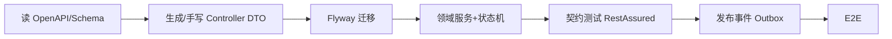

# 供应链四系统 · AI 自动开发与测试手册

**你在做的事**：让 AI（Cursor/Codex 等）仅凭本仓库文档与契约，**按固定顺序**实现 ERP/OMS/WMS/TMS 可运行代码，并跑通单元测试、契约测试、集成测试与一条完整 E2E。

**读者**：AI Agent、后端研发、测试。人类只需准备：JDK17、Docker、Maven。

**配套契约目录**：`业务方案/ai-dev/`（OpenAPI、JSON Schema、Gherkin、fixtures、docker-compose）。

**可运行代码仓**：`scm-platform/`（Monorepo，已实现 W0~W4 骨架与单测；W5/W6 由 AI 按 AGENTS.md 续写）。

---

## 〇、给 AI 的执行指令（复制到 Agent 首条 Prompt）

```text
你是供应链四系统实现 Agent。必须遵守：
1. 技术栈：Java 17 + Spring Boot 3.2 + MyBatis-Plus + Flyway + Kafka；测试 JUnit5 + Testcontainers + RestAssured。
2. 契约优先：先读 业务方案/ai-dev/contracts/*.yaml 与 *.schema.json，再写代码；接口/事件字段不得擅自增删。
3. 实施顺序：严格按本手册「实施波次」W0→W6，每波次结束必须运行该波次「退出命令」全绿再进入下一波。
4. 幂等：所有写接口实现 Idempotency-Key；所有 MQ 消费者实现 biz_key 幂等表 processed_message。
5. 测试数据：仅使用 fixtures.yaml 中的 ID，禁止硬编码随机 UUID 导致联调不一致。
6. 完成标准：scm-integration-tests 中 e2e.feature 全 Scenario 通过。
7. 不得跳过测试声称完成；失败则修到绿。
参考设计：ERP/OMS/WMS/TMS 详细设计 v3+ 各文档第二十五～二十八章；集成规范 v2。
```

---

## 一、Monorepo 工程结构（必须按此创建）

```text
scm-platform/
├── pom.xml                          # parent BOM
├── scm-common/
│   ├── event/                       # EventEnvelope, EventPublisher
│   ├── idempotency/                 # IdempotencyFilter, ProcessedMessageRepo
│   ├── outbox/                      # OutboxPoller, OutboxEntity
│   └── web/                         # ApiResponse, ErrorCode, GlobalException
├── scm-erp-service/
│   ├── src/main/java/.../modules/{mdm,p2p,o2c,inventory,fi,integration}
│   ├── src/main/resources/db/migration/
│   └── src/test/java/
├── scm-oms-service/
├── scm-wms-service/
├── scm-tms-service/
├── scm-mock-pay/                    # 支付回调 Mock（W2 用）
├── scm-integration-tests/
│   ├── src/test/resources/e2e.feature
│   └── src/test/java/.../E2EIT.java
├── contracts/                       # 从 业务方案/ai-dev/contracts 同步或 submodule
└── docker-compose.yml
```

**模块依赖**：`oms/wms/tms/erp` → `scm-common`；integration-tests 依赖四服务 + Testcontainers。

---

## 二、技术栈与版本锁定

| 组件 | 版本 | 用途 |
|------|------|------|
| Java | 17 | LTS |
| Spring Boot | 3.2.x | Web, Validation, Kafka |
| MyBatis-Plus | 3.5.x | ORM |
| Flyway | 9.x | DDL 迁移 |
| Kafka | 3.x | 事件 |
| MySQL | 8.0 | 每服务独立库 `scm_erp` 等 |
| Redis | 7 | 幂等令牌、热点库存（OMS） |
| JUnit5 | 5.10 | 单测 |
| Testcontainers | 1.19 | MySQL+Kafka 集成测 |
| RestAssured | 5.x | API 测 |
| Cucumber | 7.x | E2E Gherkin |

---

## 三、实施波次（AI 不得跳步）

| 波次 | 目标 | 主要交付 | 退出命令（全绿才下一波） |
|------|------|----------|--------------------------|
| **W0** | 基础设施 | docker-compose、parent pom、scm-common 骨架 | `docker compose up -d` + `mvn -q -pl scm-common test` |
| **W1** | ERP 主数据 | 组织/物料/客商/映射/科目；REST 查询 | `mvn -q -pl scm-erp-service test` |
| **W2** | OMS 交易 | 下单/支付Mock/库存Reserve/Confirm/Outbox ORDER_PAID | `mvn -q -pl scm-oms-service,scm-mock-pay test` |
| **W3** | WMS 出库 | 接 FULFILLMENT_RELEASED、分配、RF拣货、SHIPPED 事件 | `mvn -q -pl scm-wms-service test` |
| **W4** | TMS 运单 | 建单/轨迹Mock/ DELIVERED 事件 | `mvn -q -pl scm-tms-service test` |
| **W5** | ERP 过账 | 消费 WMS_OUTBOUND_SHIPPED、posting_rule、凭证 | `mvn -q -pl scm-erp-service test`（已实现 `WmsShipmentPostingIT`） |
| **W6** | 全链路 E2E | Cucumber / `B2CLocalFlowIT` | 本地起 8081/8082/8084 后跑 integration-tests |

---

## 四、契约优先工作流



1. **OpenAPI**：`ai-dev/contracts/openapi-*.yaml` → 可选 openapi-generator 生成 DTO（或手写对齐字段名）。
2. **事件 Schema**：`event-envelope.schema.json` + `events/*.schema.json` → 消费者单元测试用 JSON Fixture 校验。
3. **状态机**：各系统详细设计第二十一章 → 生成 `enum` + `StateMachineService` + 表驱动测试。

---

## 五、固定测试夹具（禁止改名）

> 完整键值见 `ai-dev/fixtures.yaml`。摘要：

| 键 | 值 | 用途 |
|----|-----|------|
| `FIX.buyer_id` | U10001 | 下单用户 |
| `FIX.sku_id` | SKU001 | 商品 |
| `FIX.material_code` | M001 | ERP 映射 |
| `FIX.warehouse_code` | WH-SH-01 | 仓 |
| `FIX.org_id` | ORG001 | 组织 |
| `FIX.partner_id` | C10001 | B2B 客户 |
| `FIX.client_token` | ct-fix-001 | 建单幂等 |
| `FIX.carrier_code` | SF | 顺丰 |

**种子 SQL**：W1 结束执行 `ai-dev/seed/W1_master_data.sql`（物料映射、仓、科目、posting_rule）。

---

## 六、E2E 场景索引（Gherkin）

文件：`ai-dev/e2e.feature`。AI 必须全部实现。

| Scenario ID | 名称 | 断言要点 |
|-------------|------|----------|
| E2E-01 | B2C 下单支付发货签收 | OMS PAID→SHIPPED→DELIVERED；ERP 有 je_no |
| E2E-02 | 建单幂等 | 重复 client_token 同一 order_no |
| E2E-03 | 支付回调幂等 | 回调 3 次仅 1 次 PAID |
| E2E-04 | 超时关单 | CREATED→CLOSED，库存 Release |
| E2E-05 | 部分发货 | PARTIAL_SHIPPED→SHIPPED |
| E2E-06 | 退货退款 | 售后→WMS 入库→REFUND_COMPLETED→ERP 冲销 |
| E2E-07 | WMS 出库幂等 | 重复 package 单 OB |
| E2E-08 | 轨迹乱序 | DELIVERED 先于 IN_TRANSIT 不回退 |
| E2E-09 | ERP 出库幂等 | 重复 SHIPPED 单凭证 |
| E2E-10 | 信用拒绝 | B2B 超额 ERP_03001 |

---

## 七、测试金字塔与命令

| 层级 | 目录约定 | 命令示例 |
|------|----------|----------|
| 单元 | `**/src/test/java/**/unit/` | `mvn -pl scm-oms-service -Dtest=OrderStateMachineTest test` |
| 契约/API | `**/contract/` | `mvn -pl scm-oms-service -Dtest=*ApiContractTest test` |
| 集成 | `**/*IT.java` | Testcontainers 起 MySQL+Kafka |
| E2E | `scm-integration-tests` | `mvn -pl scm-integration-tests verify` |

**CI 流水线（GitHub Actions 语义）**

```yaml
jobs:
  test:
    steps:
      - run: docker compose -f docker-compose.ci.yml up -d
      - run: mvn -B verify
      - run: mvn -pl scm-integration-tests verify -Pe2e
```

---

## 八、各服务 AI 实现清单（勾选式）

### 8.1 scm-common（W0）

- [ ] `EventEnvelope` 与 `event-envelope.schema.json` 一致
- [ ] `ProcessedMessageRepository.exists(bizKey)`
- [ ] `OutboxEntity` + 定时投递 `OutboxPoller`
- [ ] `ApiResponse<T>` code/message/request_id/data
- [ ] `BusinessException` + ErrorCode 枚举（按各系统第二十二章）

### 8.2 scm-oms-service（W2）

- [ ] 表：trade_order, order, order_line, order_payment, package, fulfillment_task, order_status_log
- [ ] POST `/api/v1/orders` + Idempotency-Key
- [ ] POST `/api/v1/payments/notify/wechat`（mock-pay 调用）
- [ ] InventoryClient: reserve/confirm/release
- [ ] 状态机 status_rank 仲裁
- [ ] Outbox ORDER_PAID；消费者：WMS_OUTBOUND_SHIPPED, TMS_*
- [ ] 契约测试：openapi-oms-core.yaml 每条 path

### 8.3 scm-wms-service（W3）

- [ ] 表：outbound_order, inventory_balance, inventory_location, wms_task
- [ ] POST `/wms/v1/outbound/create` 幂等 package_no
- [ ] 分配 FEFO + 乐观锁
- [ ] RF pick/confirm + operation_id 幂等
- [ ] handover → SHIPPED + WMS_OUTBOUND_SHIPPED

### 8.4 scm-tms-service（W4）

- [ ] 表：shipment, tracking_event, rate_card
- [ ] POST `/tms/v1/shipment/create` 幂等
- [ ] CarrierAdapter Mock + 熔断计数器
- [ ] TMS_DELIVERED 推送（节流可单测禁用）

### 8.5 scm-erp-service（W5）

- [ ] 表：material, inventory_ledger, journal_entry, integration_inbox, posting_rule
- [ ] 消费 WMS_OUTBOUND_SHIPPED → 过账引擎
- [ ] POST credit/check
- [ ] 期间关闭拦截 ERP_01001

---

## 九、Mock 与本地联调

| 依赖 | Mock 方式 |
|------|-----------|
| 支付 | `scm-mock-pay` 调 OMS notify，固定 notify_id |
| 承运商 | `CarrierAdapter` profile=mock 返回固定 waybill |
| 促销 | OMS `pricing.stub=true` 原价返回 |

**docker-compose 服务**：mysql×4、kafka、redis、（可选）kafka-ui。

---

## 十、PR / 任务完成 Definition of Done

1. 对应波次退出命令全绿。
2. 新增 API 在 OpenAPI 中有定义且契约测试覆盖。
3. 新增事件有 JSON Schema 与消费者幂等测试。
4. 状态迁移有表驱动测试覆盖所有「当前+事件→下一」行。
5. 无 `TODO` 阻塞 E2E-01。
6. README 含：启动命令、跑 E2E 命令、fixtures 说明。

---

## 十一、常见 AI 失误与禁止项

| 禁止 | 正确做法 |
|------|----------|
| 支付回调里同步调 WMS | 只写 Outbox，异步消费 |
| 事件 payload 放手机号 | 用 buyer_id/address_id |
| 状态回退 | status_rank 守卫 |
| 不用 Flyway 手改库 | 只通过 migration |
| 凭证可物理删除 | 冲销 REVERSED |
| 测完不跑 E2E | W6 verify 必须通过 |

---

## 十二、与设计文档的映射

| AI 交付物 | 设计文档章节 |
|-----------|--------------|
| Flyway SQL | 第十二章 DDL + 第二十五章完整 DDL |
| Controller | 第二十章 OpenAPI |
| StateMachine | 第二十一章 |
| ErrorCode 枚举 | 第二十二章 |
| EventConsumer | 第十四章 + ai-dev/contracts/events |
| Cucumber Step | 第二十七章 Gherkin |
| 补偿 Job | 第二十四章 Saga |

---

---

## 十三、Kafka Topic 与 Consumer Group（实现必配）

| Topic | Producer | Consumer Group | 处理器类名（约定） |
|-------|----------|----------------|-------------------|
| `scm.order.lifecycle` | OMS | `wms-fulfillment-cg` | — |
| `scm.fulfillment.cmd` | OMS | `wms-outbound-cg` | `FulfillmentReleasedConsumer` |
| `scm.wms.execution` | WMS | `oms-wms-cg` / `erp-wms-cg` | `WmsOutboundShippedConsumer` |
| `scm.tms.execution` | TMS | `oms-tms-cg` / `erp-tms-cg` | `TmsDeliveredConsumer` |
| `scm.erp.posting` | ERP | — | 可选审计 |

**消息 Key**：`order_no` 或 `package_no`，保证同单有序。

---

## 十四、scm-common 表（W0 必建）

```sql
CREATE TABLE processed_message (
  id BIGINT PRIMARY KEY AUTO_INCREMENT,
  biz_key VARCHAR(128) NOT NULL,
  event_id VARCHAR(64) NOT NULL,
  consumer_group VARCHAR(64) NOT NULL,
  consumed_at DATETIME(3) NOT NULL,
  UNIQUE uk_consume (biz_key, consumer_group)
);

CREATE TABLE outbox_message (
  id BIGINT PRIMARY KEY AUTO_INCREMENT,
  event_id VARCHAR(64) NOT NULL UNIQUE,
  event_type VARCHAR(64) NOT NULL,
  biz_key VARCHAR(128) NOT NULL,
  topic VARCHAR(128) NOT NULL,
  payload_json JSON NOT NULL,
  status VARCHAR(16) NOT NULL,
  created_at DATETIME(3) NOT NULL,
  sent_at DATETIME(3) NULL
);
```

---

## 十五、AI 生成代码时的文件检查表

每完成一个 `OMS-0x` 任务，在 PR 描述粘贴：

```markdown
- [ ] Flyway 版本连续
- [ ] OpenAPI 字段与 DTO 一致
- [ ] 错误码在 GlobalException 注册
- [ ] 事件发布走 Outbox
- [ ] 单测类已在 UNIT_TEST_CATALOG 勾选
- [ ] 未在回调里同步跨服务 HTTP
```

---

**版本**：AI 开发手册 **v1.1**，对应四系统详细设计 **v4（AI 可实施）**。

