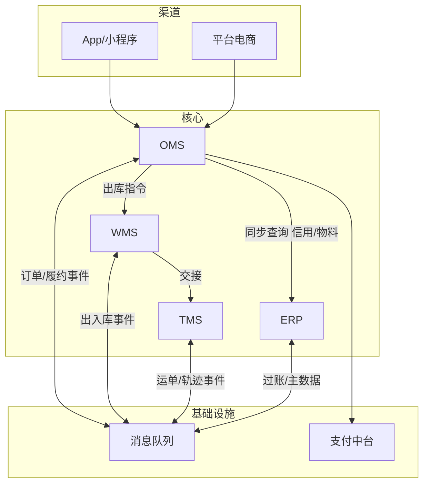
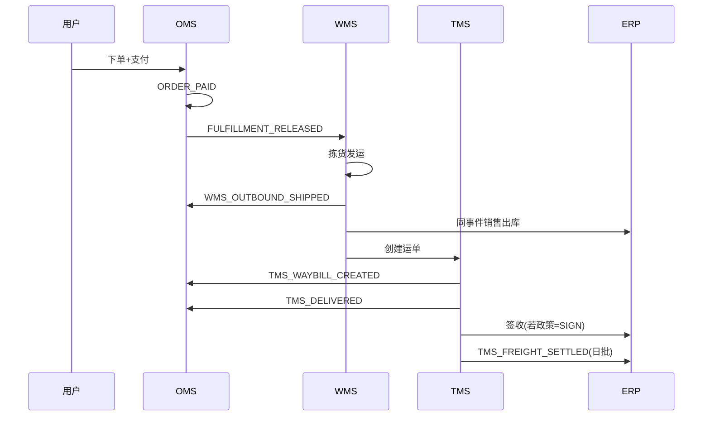
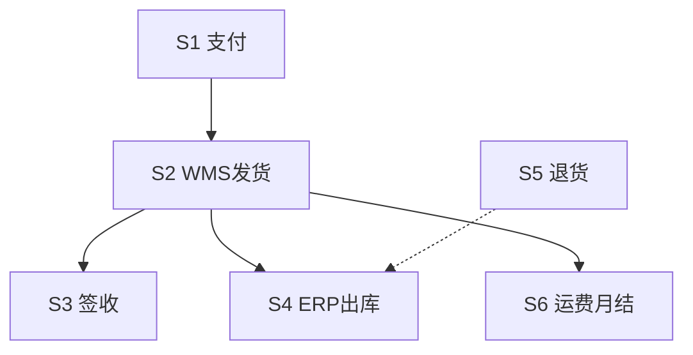

# 供应链四系统生产级集成规范（ERP / OMS / WMS / TMS）

**你在做的事**：让订单、仓储、运输、财务四条链路在**事件、API、幂等、对账、监控**上口径一致，避免「各写各的」导致上线后重复过账、状态回退、对账对不齐。

**本文目标**：作为四份系统详细设计的**集成附录**，实施与联调时必须先读本篇。

**文档级别**：生产级集成规范 v2（事件字段字典、消费契约、Saga 清单、监控大盘、灰度与回放）。

## 文前目录

- [一、集成拓扑](#一集成拓扑生产)
- [二～十、Topic / 信封 / 事件 / 时序 / 重试 / 对账 / 观测 / 安全 / 联调](#十联调验收四系统一起测)
- [十一、核心事件字段字典](#十一核心事件字段字典生产)
- [十二、消费者契约](#十二消费者实现契约必须统一)
- [十三、Saga 清单](#十三跨系统-saga-清单)
- [十四～十七、灰度 / 监控 / 映射 / 扩展联调](#十七联调用例扩展生产验收)

---

## 一、集成拓扑（生产）



**原则**：跨系统写操作默认 **MQ + 幂等**；强一致读（信用、物料映射）走 **同步 API + 缓存**。

---

## 二、消息 Topic 命名（建议）

| Topic | 生产者 | 消费者 | 说明 |
|-------|--------|--------|------|
| `scm.order.lifecycle` | OMS | 履约/WMS/数仓 | 建单/支付/完成 |
| `scm.fulfillment.cmd` | OMS | WMS | 出库/退货预期 |
| `scm.wms.execution` | WMS | OMS/ERP | 收发货事实 |
| `scm.tms.execution` | TMS | OMS/ERP | 运单/签收/结算 |
| `scm.erp.posting` | ERP | 内部/审计 | 过账结果（可选） |
| `scm.master.data` | ERP | OMS/WMS | 主数据变更 |

**分区键**：`order_no` / `package_no` / `outbound_no` / `waybill_no`，保证同单有序。

---

## 三、统一事件信封（强制）

```json
{
  "event_id": "E{snowflake}",
  "event_type": "STRING",
  "biz_key": "EVENT_TYPE+业务唯一键",
  "schema_version": 1,
  "occurred_at": "ISO8601",
  "trace_id": "分布式追踪ID",
  "producer": "OMS|WMS|TMS|ERP",
  "data": {}
}
```

| 规则 | 说明 |
|------|------|
| 幂等 | 消费者以 `biz_key` 唯一；重复投递返回成功 |
| 体积 | 单条建议 <8KB；禁止大图、地址明文、支付原文 |
| 版本 | 只加字段=小版本；改语义=大版本+双读灰度 |
| 时间 | `occurred_at` 用业务时间，不用消费时间 |

---

## 四、全量事件清单（生产）

| event_type | 生产者 | 主要消费者 | biz_key 示例 |
|------------|--------|------------|----------------|
| `ORDER_CREATED` | OMS | 数仓/风控 | `ORDER_CREATED+order_no` |
| `ORDER_PAID` | OMS | 履约/WMS | `ORDER_PAID+order_no` |
| `ORDER_SPLIT_DONE` | OMS | WMS | `ORDER_SPLIT_DONE+order_no` |
| `FULFILLMENT_RELEASED` | OMS | WMS | `FULFILLMENT_RELEASED+package_no` |
| `WMS_OUTBOUND_CREATED` | WMS | OMS | `WMS_OUTBOUND_CREATED+outbound_no` |
| `WMS_OUTBOUND_SHIPPED` | WMS | OMS/ERP | `WMS_OUTBOUND_SHIPPED+outbound_no` |
| `WMS_OUTBOUND_CANCELLED` | WMS | OMS | `WMS_OUTBOUND_CANCELLED+outbound_no` |
| `WMS_GRN_POSTED` | WMS | ERP | `WMS_GRN_POSTED+receipt_no` |
| `WMS_RETURN_INBOUND_DONE` | WMS | OMS | `WMS_RETURN_INBOUND_DONE+receipt_no` |
| `WMS_STOCKTAKE_ADJUSTED` | WMS | ERP | `WMS_STOCKTAKE_ADJUSTED+stocktake_no` |
| `TMS_WAYBILL_CREATED` | TMS | OMS | `TMS_WAYBILL_CREATED+shipment_no` |
| `TMS_DELIVERED` | TMS | OMS/ERP | `TMS_DELIVERED+shipment_no` |
| `TMS_REJECTED` | TMS | OMS | `TMS_REJECTED+shipment_no` |
| `TMS_FREIGHT_SETTLED` | TMS | ERP | `TMS_FREIGHT_SETTLED+batch_no` |
| `REFUND_COMPLETED` | OMS | ERP/库存 | `REFUND_COMPLETED+aftersale_no` |
| `PO_RELEASED` | ERP | WMS | `PO_RELEASED+po_no` |
| `DN_RELEASED` | ERP | WMS | `DN_RELEASED+dn_no` |
| `MATERIAL_MASTER_CHANGED` | ERP | OMS/WMS | `...+material_id+version` |
| `PERIOD_CLOSED` | ERP | 全系统 | `PERIOD_CLOSED+org+period` |

---

## 五、端到端主链路（B2C 生产时序）



---

## 六、重试、DLQ 与补偿（全局）

| 参数 | 建议值 |
|------|--------|
| 最大重试 | 8 次 |
| 退避 | 1m, 2m, 4m, 8m… 指数 |
| DLQ | `{topic}.DLQ`，保留 14 天 |
| 人工重放 | 必须校验目标单据状态 |

**补偿任务（每系统都要有）**

| 系统 | 任务 | 检测条件 |
|------|------|----------|
| OMS | 补发 ORDER_PAID | PAID 无 outbox SENT |
| OMS | 补下发 WMS | PAID 5min 无 OB |
| WMS | 补发 SHIPPED | CHECKED 超时未发运 |
| TMS | 补取号 | SHIPPED 无 waybill |
| ERP | 补过账 | inbox NEW 超时 |

---

## 七、对账体系（生产）

| 对账 | 频率 | A 方 | B 方 | 责任 |
|------|------|------|------|------|
| 支付 | 日 | OMS 已支付 | 支付中台账单 | 财务+研发 |
| 出库 | 日 | OMS 已发货 | WMS 出库 | 供应链 |
| 库存 | 日 | ERP 库存账 | WMS 快照 | 仓储+财务 |
| 运费 | 月 | TMS 结算批 | 承运商账单 | 物流+财务 |
| 收入 | 月 | ERP 收入 | OMS 完成单 | 财务 |

差异单状态：`DETECTED → INVESTIGATING → ADJUSTED/IGNORED`。

---

## 八、可观测性（统一）

| 指标 | 说明 | 告警 |
|------|------|------|
| `integration_lag_seconds` | 消费延迟 | >300s P2 |
| `outbox_pending_count` | 待发送 | >1000 P2 |
| `posting_failure_rate` | ERP 过账失败 | >0.1% P1 |
| `waybill_create_fail_rate` | 取号失败 | >1% P1 |
| `inventory_recon_diff_qty` | 库存差异数量 | >阈值 P1 |

**链路追踪**：`trace_id` 从 OMS 建单贯穿到 ERP 凭证号（日志关联字段）。

---

## 九、安全与合规

- 服务间：mTLS 或 HMAC 签名 + 时间窗。
- PII：事件与日志仅 `user_id/address_id/masked_phone`。
- 关账期：ERP `PERIOD_CLOSED` 后 OMS 仍可查询，但 **禁止** 补过账到关闭期间（除非走调整期间）。

---

## 十、联调验收（四系统一起测）

| 步骤 | 操作 | 通过标准 |
|------|------|----------|
| 1 | 下一单并支付 | OMS=PAID，库存 Confirm |
| 2 | 等 WMS 发运 | OMS=SHIPPED，ERP 有出库凭证 |
| 3 | 查物流 | TMS 有 waybill，OMS 展示轨迹 |
| 4 | 模拟签收 | OMS=DELIVERED，ERP 按政策记收入 |
| 5 | 重复投递 SHIPPED 事件 | 凭证不重复 |
| 6 | 申请退货 | WMS 入库→退款→ERP 冲销 |
| 7 | 跑日对账 | 差异为 0 或已登记 |

---

---

## 十一、核心事件字段字典（生产）

> `data` 内字段；顶层信封见第三节。金额一律 **字符串 DECIMAL**；时间 **ISO8601+时区**。

### 11.1 `ORDER_PAID`

| 字段 | 必填 | 类型 | 说明 |
|------|:----:|------|------|
| `trade_no` | 是 | string | 主单 |
| `order_no` | 是 | string | 子单 |
| `buyer_id` | 是 | string | 不用手机号 |
| `channel` | 是 | string | APP/TAOBAO… |
| `paid_amount` | 是 | string | |
| `currency` | 是 | string | CNY |
| `pay_time` | 是 | datetime | |
| `lines[]` | 是 | array | 见下 |
| `lines[].sku_id` | 是 | string | |
| `lines[].qty` | 是 | string | |
| `lines[].warehouse_id` | 是 | string | 路由结果 |

### 11.2 `FULFILLMENT_RELEASED`

| 字段 | 必填 | 说明 |
|------|:----:|------|
| `package_no` | 是 | |
| `order_no` | 是 | |
| `warehouse_code` | 是 | |
| `lines[]` | 是 | sku_id,qty |
| `receiver_id` | 是 | 地址快照 ID，非明文 |

### 11.3 `WMS_OUTBOUND_SHIPPED`

| 字段 | 必填 | 说明 |
|------|:----:|------|
| `outbound_no` | 是 | |
| `package_no` | 是 | |
| `source_order_no` | 是 | |
| `warehouse_code` | 是 | |
| `shipped_at` | 是 | |
| `waybill_no` | 否 | 有则 OMS 可提前展示 |
| `lines[]` | 是 | sku_code,qty,batch_no |
| `weight_kg` | 否 | |

### 11.4 `TMS_DELIVERED`

| 字段 | 必填 | 说明 |
|------|:----:|------|
| `shipment_no` | 是 | |
| `waybill_no` | 是 | |
| `package_no` | 是 | |
| `order_no` | 是 | |
| `delivered_at` | 是 | |
| `pod_type` | 是 | SIGN/AGENT/LOCKER |

### 11.5 `REFUND_COMPLETED`

| 字段 | 必填 | 说明 |
|------|:----:|------|
| `aftersale_no` | 是 | |
| `order_no` | 是 | |
| `refund_amount` | 是 | |
| `refund_success_at` | 是 | |
| `lines[]` | 是 | sku_id,qty |

### 11.6 `TMS_FREIGHT_SETTLED`

| 字段 | 必填 | 说明 |
|------|:----:|------|
| `settlement_batch_no` | 是 | |
| `carrier_code` | 是 | |
| `period` | 是 | YYYYMM |
| `total_amount` | 是 | |
| `tax_amount` | 是 | |

---

## 十二、消费者实现契约（必须统一）

```pseudo
function consume(msg):
  assert validateEnvelope(msg)
  if exists(processed, msg.biz_key): return ACK
  begin transaction
    insert processed(biz_key, event_id, consumed_at)
    applyBusiness(msg)  // 状态机/过账
    optional insertOutbox(...)
  commit
  ACK
exception:
  rollback
  if retryable: NACK with backoff
  else: route DLQ + alert
```

| 规则 | 说明 |
|------|------|
| 有序 | 同 `order_no` 分区顺序消费 |
| 幂等表 | `processed_biz_key` 唯一索引 |
| 事务外发送 | 禁止；必须 Outbox |
| 日志 | 打 `trace_id/order_no/event_type`，不打 PII |

---

## 十三、跨系统 Saga 清单

| Saga | 触发 | 成功条件 | 补偿 |
|------|------|----------|------|
| S1 下单支付 | 用户支付 | PAID+Confirm | Release 库存+关单 |
| S2 履约发货 | ORDER_PAID | WMS SHIPPED | 拦截+退款(S1 子集) |
| S3 运输签收 | SHIPPED | TMS DELIVERED | 拒收→售后 |
| S4 财务出库 | SHIPPED 事件 | ERP je POSTED | 补成本+重放 |
| S5 退货退款 | 售后审核 | REFUND_COMPLETED | 人工介入支付失败 |
| S6 运费结算 | 月末 | ERP 应付入账 | 差异单人工 |



---

## 十四、灰度、回放与灾备

| 能力 | 做法 |
|------|------|
| 灰度消费 | 按 `buyer_id%100` 路由新版本消费者 |
| 事件回放 | 工具按 `biz_key` 从归档 Topic 重放；禁止改 schema_version |
| 集成停服 | 各系统 `integration.pause=true`，inbox 堆积，恢复后按 `occurred_at` 排序消费 |
| 主从切换 | MQ 与 DB 切换 Runbook：暂停消费者→确认位点→切换→恢复 |

---

## 十五、监控大盘（Grafana 建议面板）

| 面板 | 指标 | 阈值 |
|------|------|------|
| 订单漏斗 | created/paid/shipped/delivered 量 | 日环比 -30% 告警 |
| 履约延迟 | paid→shipped P95 分钟 | >120 P2 |
| 集成健康 | outbox_pending、inbox_failed | 见第六节 |
| 库存一致性 | recon_diff_qty | >100 P1 |
| 取号成功率 | waybill_create_ok_rate | <99% P1 |
| 过账成功率 | erp_posting_ok_rate | <99.9% P1 |

---

## 十六、编码映射治理

| 对象 | 权威源 | 缓存 | 变更事件 |
|------|--------|------|----------|
| 物料/SKU | ERP | OMS/WMS 60s | MATERIAL_MASTER_CHANGED |
| 仓库 | ERP/WMS | 全系统 | WH_MASTER_CHANGED |
| 承运商产品 | TMS | OMS 试算 | CARRIER_PRODUCT_CHANGED |

**启动阻断**：映射缺失时 OMS 下单 `OMS_70001`、WMS 收货 `WMS_20001`、ERP 过账 `ERP_02002`。

---

## 十七、联调用例扩展（生产验收）

| 编号 | 场景 | 断言 |
|------|------|------|
| INT-09 | 支付后 30s 内 WMS 有 OB | package_no 一致 |
| INT-10 | 发货后 60s OMS 有运单 | waybill 一致 |
| INT-11 | ERP 出库凭证 | je 借贷平 |
| INT-12 | 重复 SHIPPED×3 | 凭证 1 张 |
| INT-13 | 关账后事件 | ERP DLQ |
| INT-14 | 部分退 | 库存+退款金额一致 |
| INT-15 | 承运商熔断 | fallback 标记 true |
| INT-16 | 轨迹乱序 | OMS rank 不回退 |

---

---

## 十八、AI 自动开发衔接

| 资产 | 用途 |
|------|------|
| 供应链四系统 AI 自动开发与测试手册 | Agent 主 Prompt、波次 W0~W6 |
| ai-dev/contracts | OpenAPI + JSON Schema |
| ai-dev/e2e.feature | 自动化验收 |
| ai-dev/fixtures.yaml | 禁止随机测试数据 |

**实现顺序**：先 `processed_message` 幂等表与事件信封，再业务；消费者必须按第十二章伪代码。

---

**版本说明**：集成规范 **v3（AI 可实施）**；与四系统详细设计 v4 配套；**biz_key 语义不可变**。


