# 高并发电商系统设计（常规下单 + 秒杀/大促）

> 本文由现有电商笔记整合而来，目标是把“**常规交易**”与“**秒杀/大促**”在同一套口径下讲清楚：架构分层、库存一致性、防超卖选型、快照/幂等/状态机/对账、削峰与隔离，以及数仓分层落地。

---

## 文前目录（速达）

- [0. 适用范围与总原则](#sec-0)
- [1. 总体架构](#sec-1)
- [2. 常规下单](#sec-2)（含 **[2.4 热点 SKU 路由](#sec-2-4)**、**[2.4.5 热点 SKU 动态发现](#sec-2-4-5)**、**[2.5 统一高并发下单接口](#sec-2-5)**）
- [3. 防超卖](#sec-3)
- [4. 秒杀/大促](#sec-4)

---

<a id="sec-0"></a>

## 0. 适用范围与总原则

### 0.1 两类业务场景（先分清，再选方案）

| 场景 | 典型特征 | 优先目标 |
|------|----------|----------|
| **常规下单（中等并发）** | 体验优先、流程完整；并发量级相对可控（例如 <1000 TPS 量级）；**若单 SKU 瞬时被打爆**，用 **2.4** 静态名单 + 动态升级切 Redis 预扣链路 | **稳定 + 一致 + 易维护**；热点与常态分流 |
| **秒杀/大促（高并发突刺）** | “多人争抢有限公共资源”；流量集中爆发，热点明显 | **削峰 + 隔离 + 可恢复** |
| **统一高并发下单（单接口，可选）** | 产品不拆「秒杀/普通」两套下单 URL，一律按高并发接口建设；靠配置与热点路由区分轻重 | **一套契约 + 分层防护 + SKU 热点自动/名单路由（见 2.4）+ 同步/异步受理统一口径（见 2.5）** |

> **与上表的关系**：前两类仍是**业务形态**上的区分（便于讲清目标与第 4 章秒杀专章）；第三行是**工程落地选项**——可在同一文档内同时保留「分场景叙述」与「单接口实现」，团队选型时二选一或组合使用（单接口 + 活动期加强网关/Sentinel 与活动池，见第 4 章）。

### 0.2 一句话总原则（全篇统一）

- **DB 是交易真相源**：订单与库存最终以数据库为准；Redis 作为缓存/活动快照/削峰组件，允许短暂偏差，但必须能对账纠正。
- **快照职责分离**：活动快照（运行态）与订单快照（审计态）不要混。
- **幂等不是一处**：请求幂等、建单幂等、支付回调幂等、MQ 消费幂等必须端到端覆盖。
- **状态机单向推进**：状态只能向前走；重复/乱序事件不应造成“回退”和重复生效。
- **失败要能完整回滚/补偿**：任何一步失败，都要明确“要恢复哪些资源”（Redis、DB、锁、队列占用）。

---

<a id="sec-1"></a>

## 1. 总体架构（分层与核心组件）

### 1.1 交易链路分层

| 层 | 主要职责 | 常见手段 |
|---|---|---|
| **前端/活动页** | 降低无效请求、提升体验 | 防抖/置灰、验证码；静态资源上 CDN |
| **网关（Nginx/API Gateway）** | 入口削峰与保护 | 令牌桶/漏桶限流（IP/User）；黑白名单；统一错误码 |
| **业务服务（订单/库存/促销/支付）** | 交易闭环、状态机推进 | 线程池隔离、限流/熔断/降级（如 Sentinel） |
| **缓存（Redis）** | 热数据、活动快照、预扣、排行榜 | 热 key 治理；Lua 原子脚本；ZSet 榜单 |
| **消息队列（MQ）** | 削峰、异步任务、可靠事件 | 堆积上限、重试/死信、消费幂等 |
| **数据库（MySQL 等）** | 交易真相：订单、库存、对账 | 条件更新/行锁/乐观锁；分库分表（可选） |
| **数据平台（数仓/BI）** | 业务指标、运营分析 | ODS→DWD→DWS→DWA→ADS |

### 1.2 关键“共用工程能力”

- **统一错误码与 HTTP 映射**：常规建议 401（未登录）、400（可预期业务失败如缺货/售罄/资格不足）、429（限流）、202（已受理/排队中，异步受理场景）、503（系统忙/不可用）、5xx（系统异常）。
- **可观测性**：入口 QPS 与拒绝率、Redis 命令耗时与热点 key、DB 锁等待与事务耗时、MQ 堆积与重试、业务成功率与平均排队时长。

**统一口径速查表（建议评审直接贴这张）**：

| 场景 | HTTP 建议 | 说明 |
|---|---|---|
| 未登录/鉴权失败 | **401** | 未登录/Token 无效 |
| 售罄/缺货/资格不足/参数不合法 | **400** + 业务码 | 业务不可满足，不建议自动重试（除非用户改数量/条件） |
| 限流（明确拒绝） | **429** | 入口限流/热点限流，客户端可退避重试 |
| 已受理（排队中，异步处理） | **202** + `reserve_id` | 正常态，不是故障；通过查询接口拿最终结果 |
| 系统忙/依赖不可用 | **503** | 故障或过载态；必须配合限次重试与退避，避免重试风暴 |
| 并发冲突（可选） | **409** + 业务码 | 乐观锁/并发挤占场景，可引导客户端短退避重试（限次） |

---

<a id="sec-2"></a>

## 2. 常规下单（中等并发）——主链路设计

### 2.1 用户侧流程（概览）

购物车结算 → 确认地址/配送/支付方式 → **提交订单**（前端校验 + 调用后端创建订单，生成 `order_no`，订单进入 `CREATED/待支付`） → **拉起支付** → 支付结果回跳/回调（失败可重试，超时自动关单）。

#### 2.1.1 参照淘宝的“交易主流程”（把用户看到的每一步写清楚）

下面按淘宝常见体验口径把“用户侧”流程拆到可实现粒度，并标注每一步的系统关键动作（你可以直接用于 PRD/评审）：

1) **结算页（确认订单页）**
- 展示：收货地址、商品明细、优惠、运费、应付金额、预计送达、发票等
- 交互：用户可修改地址、选择优惠券/活动、改数量、选择配送方式、备注
- 系统动作：价格试算、库存预检（体验挡板）、限购/风控预校验（不作为最终边界）

2) **提交订单**
- 用户点击“提交订单”
- 系统动作（核心）：创建主单/子单/明细（含快照） + 库存 Reserve（预占）+ 返回 `order_no`（或异步受理返回 `reserve_id`）
- 用户感知：提交成功后进入“待付款”页（可看到订单号与倒计时）

3) **待付款（交易已创建）**
- 展示：订单金额、支付方式、支付倒计时（常见 15 分钟）
- 交互：立即支付 / 取消订单
- 系统动作：启动“超时关单”机制（延时消息/定时扫描二选一），到期自动关单并 Release 预占库存

4) **支付**
- 用户在支付宝/微信等完成支付
- 系统动作：支付回调验签 + 幂等去重 + 订单状态仲裁（`CREATED/PAYING -> PAID`）+ 库存 Confirm（预占转成交）+ 可靠发事件（Outbox/事务消息）

5) **待发货 / 履约中**
- 展示：订单已支付、等待发货；可申请退款（按规则）
- 系统动作：履约编排（拆包裹/路由仓/下发 WMS/门店）异步推进子单履约状态

6) **已发货**
- 展示：物流单号、轨迹
- 系统动作：发货事件推进状态（子单→主单汇总展示）

7) **确认收货 / 交易成功**
- 用户确认收货（或超时自动确认）
- 系统动作：状态推进到 `COMPLETED`，进入可评价、可售后窗口（按规则）

8) **售后（退款/退货退款）**
- 展示：仅在满足规则时可申请
- 系统动作：退款状态机与支付/库存/履约协同（是否回补库存取决于业务：未发货通常可回补，已发货通常走逆向入库）

> 淘宝式关键体验点：用户看到的主线是“**确认订单 → 待付款（倒计时）→ 已付款 → 待发货/已发货 → 交易成功 → 售后**”，其中“倒计时关单 + 释放占用”是最核心的交易闭环之一。

#### 2.1.2 淘宝常见的两种“减库存口径”（拍下减 vs 付款减）与本文默认选择

电商行业常见两种口径（淘宝等平台会因类目/活动/商家能力而不同）：

| 口径 | 含义 | 用户体验 | 风险与代价 |
|---|---|---|---|
| **拍下减库存**（下单即占用） | 提交订单成功就 Reserve/占用库存，未付款超时会释放 | 下单后更“稳”，不易支付时才发现缺货 | 需要关单释放、补偿与对账；大量未支付会增加占用 |
| **付款减库存**（支付后占用） | 提交订单不占库存，支付成功才扣减/占用 | 提交更快，但支付时可能失败（缺货） | 高并发下更易出现支付失败争议；对一致性与补偿要求更高 |

**本文默认口径**：采用“**拍下减库存（Reserve 预占）+ 付款 Confirm + 超时 Release**”，并要求 `CREATED/待支付` 的前提是 Reserve 成功（见 2.2.1）。

#### 2.1.3 淘宝式“订单列表/详情”状态与按钮规则（产品与研发统一口径）

很多争议不是“状态叫什么”，而是**同一状态下用户能点什么按钮**。下面给出一套淘宝风格的默认规则，你可以直接给前端与客服使用。

> 约定：主单对用户展示为“交易状态”，子单对履约系统展示为“履约状态”。用户侧按钮以**主单状态**为准，必要时叠加子单汇总信息（例如部分发货）。

| 用户看到的状态（展示文案） | 主单状态（示例） | 典型按钮 | 按钮是否可用的硬条件 | 备注（淘宝式体验点） |
|---|---|---|---|---|
| **待付款** | `CREATED`/`PAYING` | 去支付、取消订单 | `payable=true` 且未超时 | 显示倒计时；超时后自动关单 |
| **已取消** | `CANCELLED` | 再次购买/加入购物车 | - | 不允许再支付；展示取消原因（超时/用户取消/缺货等） |
| **待发货** | `PAID` | 申请退款、提醒发货（可选） | 退款需满足规则；提醒发货要限频 | 淘宝常见“提醒发货”但必须防刷 |
| **部分发货（可选）** | `PAID/FULFILLING` | 查看物流、申请退款（按明细/子单） | 需要子单级发货信息 | 如果业务不做“部分发货”展示，可只在详情里展示多包裹 |
| **已发货** | `SHIPPED` | 查看物流、确认收货、申请售后 | 售后需满足规则 | 淘宝常见：确认收货后进入评价与售后窗口 |
| **交易成功** | `COMPLETED` | 评价、申请售后（按规则） | 售后窗口期内 | 展示“交易成功时间”与售后截止 |
| **退款中/售后中** | `REFUNDING`（或售后子状态） | 查看进度、撤销申请（可选） | 视规则 | 建议把售后做成独立子状态，避免污染主状态 |
| **已退款** | `REFUNDED` | 再次购买 | - | 退款完成是终态之一 |

**展示与交互硬规则（必须写死，避免争议）**：

- **能否支付只看 `payable` 与倒计时**：任何非“待付款”状态都不允许出现支付入口。
- **取消按钮的边界**：默认仅 `CREATED/PAYING` 可取消；进入 `PAID` 后取消改走“退款/拦截发货”流程。
- **多子单/多包裹**：用户侧可以“一个主单多个包裹”展示；按钮要么全局禁用，要么按子单/明细粒度给入口（不要混乱）。
- **原因要可解释**：取消/失败/退款都必须有 `reason_code + reason_message`，客服才能解释清楚。

#### 2.1.4 淘宝式“超时关单”口径（倒计时来源、延长边界、关单提示）

超时关单是“拍下减库存（Reserve）”口径的必配闭环，否则库存会被长期占用。

**倒计时来源（建议默认）**：

- `pay_expire_at = created_at + pay_ttl`，其中 `pay_ttl` 常见为 **15 分钟**（可按类目/风控动态配置）
- 前端展示倒计时以服务端返回的 `pay_expire_at` 为准（避免客户端时间不准）

**到期后系统动作（建议默认）**：

1) 条件更新把订单从 `CREATED/PAYING -> CANCELLED`（原因 `TIMEOUT`）（见 2.2.4）
2) 触发库存 Release（释放预占）；Release 必须幂等（见 2.2.4）
3) 写入状态日志/审计字段（便于客服解释与对账）

**用户提示口径（建议默认）**：

- 倒计时结束后，订单详情页展示：**“订单已超时关闭”**，并提示“可重新下单”（不引导继续支付）
- 若支付渠道出现“用户已支付但回调晚到”的极端情况：以 **订单状态仲裁**为准（谁先条件更新成功谁赢），并由对账/人工兜底处理异常（避免让用户重复扣款或重复发货）

**是否允许延长倒计时（建议默认：谨慎开放）**：

- 默认不开放“延长”入口，避免被滥用长期占库存
- 如业务强需求（例如大额订单、线下转账），可按风控/客服白名单延长，但必须：
  - 延长次数与总时长有上限
  - 延长动作必须记录审计（谁延长、延长到何时、原因）
  - 延长后仍以 `pay_expire_at` 作为唯一支付边界

#### 2.1.5 取消/退款时库存是否回补：淘宝式规则矩阵（建议默认）

“要不要回补库存”不是一句话能说清的，它取决于 **订单状态**与**履约状态**。下面给一张可直接落地的矩阵，避免售后与库存互相打架。

> 本文默认库存口径：Reserve（拍下预占）→ Confirm（付款确认）→ Release（取消释放）。  
> “回补库存”分两类：  
> - **Release 预占**：只发生在未支付阶段（`reserved_stock -> available_stock`）  
> - **逆向回补**：发生在已支付之后（已 Confirm 的占用），通常要走“退货入库/逆向入库”闭环，不建议直接把库存加回可售（除非你明确是“未发货全额退款、无需退货”的业务）

| 场景 | 用户操作/触发 | 典型状态 | 是否回补库存 | 回补方式（建议默认） | 备注（淘宝式口径） |
|---|---|---|---|---|---|
| 未支付取消 | 用户取消/系统关单超时 | `CREATED/PAYING` | **是** | **Release 预占**（幂等） | 标准闭环：到期自动释放 |
| 支付失败 | 支付失败/撤销支付 | `CREATED/PAYING` | **是** | **Release 预占**（幂等） | 失败原因要可解释 |
| 已支付但未发货，用户申请退款并通过 | 仅退款（不发货） | `PAID` 且未进入出库/发货 | **视业务**（建议：谨慎） | **两种二选一并写死**：A 不立即回补（等逆向确认）；B 允许直接回补可售（仅对“未出库且确定不会发货”的场景） | 淘宝常见“未发货仅退款”，但商家侧要能保证不会再发货 |
| 已出库/已发货后退款退货 | 退货退款 | `SHIPPED/COMPLETED` | **不直接回补可售** | 走逆向：退货入库成功后再增加可售（或增加在途/待质检库存） | 真实电商必须有“质检/入库”环节 |
| 部分发货/部分退款 | 子单/明细维度售后 | 主单汇总 + 子单分歧 | **按子单/明细** | 只对退款/退货成功的明细做逆向回补 | 订单展示要支持“多包裹/部分售后” |
| 虚拟商品/服务类 | 退款规则更严格 | 通常无库存或逻辑库存 | **通常不回补** | 视业务：可能是“名额/配额”回补而非实物库存 | 例如会员/卡券，走权益状态机 |
| 预售/定金/尾款 | 规则复杂（按协议） | `CREATED/PAID` 多阶段 | **按阶段** | 定金期一般不占真实库存或占“预售配额”；尾款支付后再按常规库存流程 | 淘宝常见预售口径：名额/配额先锁 |

**实现落地建议（避免“退款把库存加乱”）**：

- 未支付阶段：只做 **Release 预占**，属于交易主链路闭环，必须自动化、幂等、可对账。
- 已支付阶段：是否回补可售，必须与履约/WMS 能力对齐：  
  - 如果无法保证“不会发货”，不要在退款通过时立即回补可售（避免重复卖）。  
  - 更稳的做法是：退款通过 → 逆向入库完成 → 再回补可售（并记录库存流水）。

#### 2.1.6 淘宝式售后链路（仅退款 / 退货退款）：流程与状态机口径（建议默认）

淘宝式售后的核心不是“多几个状态”，而是把三个边界写死：  
**① 哪些状态能发起？② 退款资金怎么走？③ 库存回补是否依赖逆向入库？**

**A. 两类售后（建议默认）**

| 类型 | 适用前提（典型） | 关键差异 |
|---|---|---|
| **仅退款** | 未发货/未出库，或商家同意不发货退款 | 通常不需要退货；是否回补可售取决于是否确认不会再发货（见 2.1.5） |
| **退货退款** | 已发货/已收货后 | 需要逆向物流与入库（质检），库存回补通常以“入库成功”为准 |

**B. 售后主流程（文字版，淘宝式）**

1) 用户在订单详情发起售后：选择“仅退款/退货退款”，填写原因与凭证（图片可选）  
2) 系统校验：是否在可售后窗口期、是否允许该明细/子单发起、是否存在进行中的售后单  
3) 生成售后单（建议独立 `after_sale_no`），状态进入 `APPLIED`  
4) 商家/系统审核：通过进入后续；拒绝则 `REJECTED`（用户可补充材料再申请，按规则）  
5) 退货退款场景：生成退货地址与物流单号，用户寄回；系统跟踪物流与签收  
6) 商家签收/质检通过：进入 `REFUNDING`，发起退款  
7) 退款成功：售后单 `REFUNDED`；订单明细/子单同步更新“售后完成”标记（不建议把主单状态直接改成 REFUNDED，除非整单全退）  
8) 库存回补：  
   - 仅退款：按 2.1.5 的二选一口径执行  
   - 退货退款：建议入库成功后回补可售（或回补到待质检/待上架库存）

**B.1 售后 × 退款 × 库存逆向：端到端时序图（强烈建议评审必贴）**

> 说明：这张图把“业务流程”与“幂等/仲裁/对账”放在同一张图里：退款是否成功以 `payment_refund` 为准；库存是否回补以 `inventory_refund + inventory_change_log` 为准。

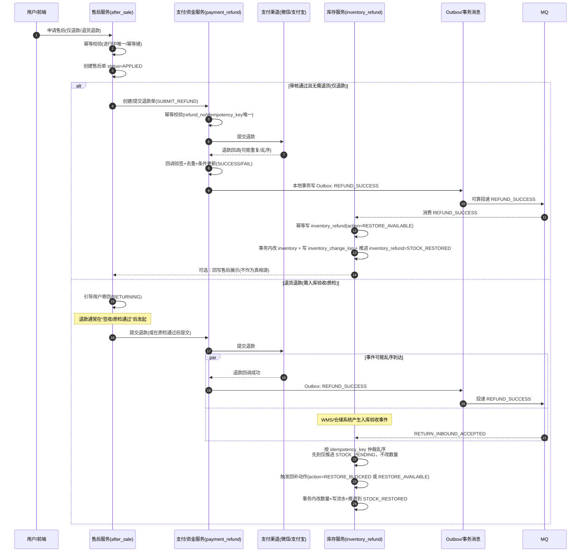

**C. 售后状态机（最小可用，建议默认）**

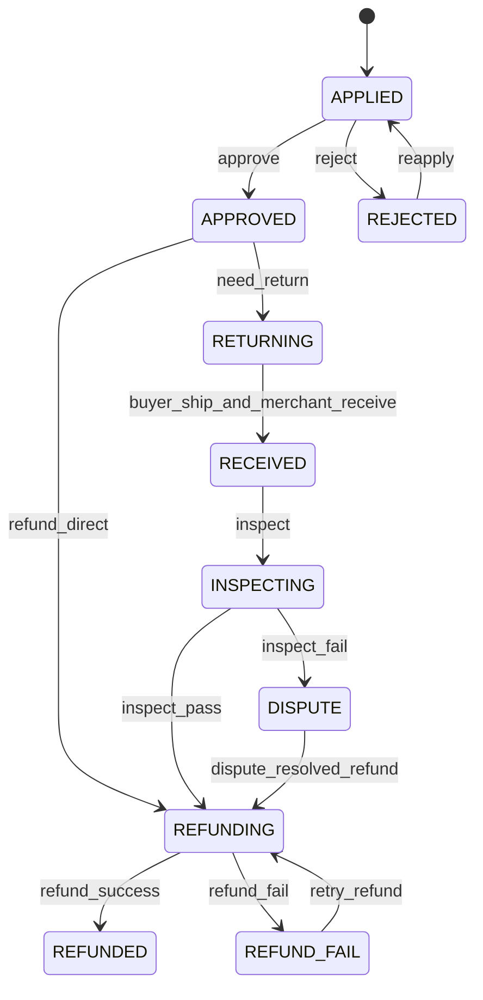

> 提醒：售后建议“独立状态机”，订单主状态保持 `PAID/SHIPPED/COMPLETED` 等交易状态，通过“明细售后标记/售后单列表”展示给用户（更像淘宝，也更利于部分退款/多次售后）。

**D. 与订单/库存/支付协同的硬规则**

- **重复申请幂等**：同一 `order_item_id` 在同一时间只允许存在一个“进行中的售后单”（唯一约束/幂等校验）。
- **退款幂等**：同一 `after_sale_no` 发起退款只允许成功一次（支付侧回调去重）。
- **库存回补不抢跑**：退货退款不要在“申请通过”就加回可售（除非你明确是无需退货的仅退款），否则会重复卖。

**E. 售后单字段状态机（补齐到可直接开发/对账的粒度，强烈建议）**

> 目标：售后“状态机图”只能说明流程，真正线上会踩坑的是“字段被谁改、能不能改、改几次”。本节把它写成可执行规则。

**E.1 售后单核心字段（最小集合）**

| 字段 | 类型（建议） | 必填 | 用途 |
|---|---|---:|---|
| `after_sale_no` | varchar(32) | 是 | 售后单号（全局唯一） |
| `order_no` | varchar(32) | 是 | 关联订单号 |
| `order_item_id` | bigint | 是 | 关联明细（部分退款/多次售后必须有） |
| `type` | varchar(20) | 是 | `ONLY_REFUND/RETURN_REFUND`（仅退款/退货退款） |
| `status` | varchar(20) | 是 | 售后主状态（见 E.2） |
| `refund_amount` | decimal(10,2) | 是 | 本次申请退款金额（不得超过该明细实付） |
| `currency` | varchar(8) | 否 | 币种 |
| `reason_code` | varchar(32) | 是 | 申请原因码（便于统计/风控） |
| `reason_desc` | varchar(256) | 否 | 用户补充说明 |
| `evidence_urls` | json | 否 | 凭证图片等（可选） |
| `review_result` | varchar(20) | 否 | `APPROVE/REJECT`（也可合并进状态） |
| `review_reason` | varchar(256) | 否 | 审核驳回原因（客服话术/工单） |
| `return_need` | tinyint | 否 | 是否需要退货（典型：退货退款=1，部分仅退款=0） |
| `return_address_id` | bigint | 否 | 退货地址（如需要退货才有） |
| `return_logistics_no` | varchar(64) | 否 | 用户寄回物流单号 |
| `merchant_received_at` | datetime(3) | 否 | 商家签收时间（退货退款链路） |
| `inspect_result` | varchar(20) | 否 | `PASS/FAIL`（质检结果） |
| `refund_no` | varchar(64) | 否 | 退款单号（支付侧/售后侧生成，强烈建议） |
| `refund_status` | varchar(20) | 否 | `NONE/APPLIED/PROCESSING/SUCCESS/FAIL`（可选聚合态） |
| `refund_success_at` | datetime(3) | 否 | 退款成功时间（只允许首次写入） |
| `idempotency_key` | varchar(64) | 是 | 售后申请幂等（建议：`order_item_id + type + window` 或客户端 request_id） |
| `created_at` | datetime(3) | 是 | 创建时间 |
| `updated_at` | datetime(3) | 是 | 更新时间（扫描/补偿/对账） |

**E.2 售后字段枚举口径（推荐默认）**

| 字段 | 推荐枚举（最小集合） | 备注 |
|---|---|---|
| `type` | `ONLY_REFUND/RETURN_REFUND` | 类型一旦创建 **不允许修改**（否则对账口径会炸） |
| `status` | `APPLIED/APPROVED/REJECTED/RETURNING/RECEIVED/INSPECTING/DISPUTE/REFUNDING/REFUNDED/REFUND_FAIL/CANCELLED` | 允许精简：不做质检可去掉 `INSPECTING/DISPUTE` |
| `refund_status`（可选） | `NONE/APPLIED/PROCESSING/SUCCESS/FAIL` | 如果你已有独立退款单表，可不在售后单冗余 |

**E.3 事件 → 字段变更规则（幂等必须写死）**

| 事件 | from（允许状态） | to（目标状态） | 允许更新字段（建议） | 幂等关键点 |
|---|---|---|---|---|
| `APPLY_AFTER_SALE` | - | `APPLIED` | 首次写入：`after_sale_no/order_no/order_item_id/type/refund_amount/reason_*/*_urls/idempotency_key` | 同一 `idempotency_key` 只允许创建一次（唯一约束） |
| `REVIEW_APPROVE` | `APPLIED` | `APPROVED` | `review_result=APPROVE`、`review_reason`、`updated_at` | 重复审核只允许幂等返回成功，不可反复改审核原因 |
| `REVIEW_REJECT` | `APPLIED` | `REJECTED` | `review_result=REJECT`、`review_reason` | 驳回后若允许“补充材料再申请”，建议新建一单或明确 `REJECTED -> APPLIED` 的幂等键策略 |
| `NEED_RETURN` | `APPROVED` | `RETURNING` | `return_need=1`、`return_address_id` | `return_address_id` 只允许首次写入（避免反复更换导致纠纷） |
| `REFUND_DIRECT` | `APPROVED` | `REFUNDING` | `return_need=0`、`refund_no`、`refund_status=APPLIED/PROCESSING` | `refund_no` 建唯一索引，保证“同一售后只发起一次退款” |
| `BUYER_SHIP` | `RETURNING` | `RETURNING`（状态不变） | `return_logistics_no` | `return_logistics_no` 只允许首次写入（或允许覆盖但必须留审计） |
| `MERCHANT_RECEIVE` | `RETURNING` | `RECEIVED` | `merchant_received_at` | 只允许首次写入（NULL->非 NULL） |
| `INSPECT_START` | `RECEIVED` | `INSPECTING` | - | 可选 |
| `INSPECT_PASS` | `INSPECTING/RECEIVED` | `REFUNDING` | `inspect_result=PASS`、`refund_no`、`refund_status=APPLIED/PROCESSING` | 发起退款只允许一次（`refund_no` 唯一） |
| `INSPECT_FAIL` | `INSPECTING/RECEIVED` | `DISPUTE` | `inspect_result=FAIL` | - |
| `REFUND_SUCCESS` | `REFUNDING` | `REFUNDED` | `refund_status=SUCCESS`、`refund_success_at` | `refund_success_at` 只允许首次写入；重复回调只做幂等忽略 |
| `REFUND_FAIL` | `REFUNDING` | `REFUND_FAIL` | `refund_status=FAIL`（+失败原因字段，如有） | 允许 `REFUND_FAIL -> REFUNDING` 的重试，但必须以 `refund_no` 去重 |
| `CANCEL_AFTER_SALE`（可选） | `APPLIED/APPROVED/RETURNING`（按规则） | `CANCELLED` | `updated_at`（+取消原因） | 取消不允许影响已发起退款的链路（已 `REFUNDING` 禁止取消） |

**E.4 建议的数据库约束（售后落地必备）**

- **进行中唯一约束（必须）**：同一 `order_item_id` 同时只能有一个“进行中售后”。常见做法：
  - 逻辑约束：`status IN ('APPLIED','APPROVED','RETURNING','RECEIVED','INSPECTING','DISPUTE','REFUNDING')` 视为进行中
  - 物理实现：维护 `in_progress`（0/1）冗余列，并对 `(order_item_id, in_progress)` 建唯一索引（MySQL 里比“部分索引/条件索引”更通用）
- **退款幂等（必须）**：`refund_no` 唯一；或 `(after_sale_no, refund_action)` 唯一，确保“同一售后只成功发起一次退款”。
- **关键时间点只写一次（强烈建议）**：`merchant_received_at/refund_success_at` 只允许 NULL→非 NULL。
- **状态推进必须条件更新（必须）**：例如 `UPDATE after_sale SET status=? WHERE after_sale_no=? AND status IN (...)`，禁止无条件 UPDATE（防乱序/并发写坏状态）。

#### 2.1.7 关键接口与字段（面向前端/客服/对账的最小契约）

为了让前端、客服与对账系统“查得到、解释得清、算得对”，建议下单与售后最少返回/存储以下字段（不要求一次性全做，但口径要统一）：

**订单创建返回（同步模式）**：

- `order_no`
- `status`（`CREATED/待支付`）
- `payable`（true/false）
- `pay_expire_at`（倒计时截止时间）
- `pay_amount`（实付）
- `sub_orders[]`（可选：子单简要，便于详情页）

**订单创建失败返回（扣库失败）**：

- `error_code`：`NOT_ENOUGH_STOCK` 或 `RETRYABLE`
- `error_message`：给用户看的短文案
- `attempt_no`（可选：启用失败留痕时返回，用于客服追踪）

**订单详情查询返回（淘宝式必要字段）**：

- `order_no/status/payable/pay_expire_at`
- `actions[]`：后端计算的可用按钮列表（去支付/取消/退款/确认收货等），避免前端自己猜规则
- `packages[]`：包裹/子单履约信息（多包裹时尤为关键）
- `after_sale_entries[]`：每条明细是否可发起售后、当前售后状态

**售后创建返回**：

- `after_sale_no`
- `status`（`APPLIED`）
- `type`（仅退款/退货退款）
- `refund_amount`（建议以 `item_pay_amount` 为上限，见 2.2.3）

#### 2.1.8 淘宝式“订单时间线”：关键时间字段与审计口径（客服/对账必备）

淘宝式订单详情通常会有一条“时间线”（下单→付款→发货→签收→完成，期间穿插取消/售后）。要实现这一点，最重要的不是 UI，而是把**关键时间字段**与**审计日志**口径提前设计好。

**A. 订单详情时间线的最小节点（建议默认）**

| 时间线节点（展示文案示例） | 建议字段 | 触发来源 | 备注 |
|---|---|---|---|
| 订单创建 | `created_at` | 建单成功 | 起点 |
| 等待付款（倒计时） | `pay_expire_at` | `created_at + pay_ttl` | 前端倒计时以此为准 |
| 发起支付（可选） | `pay_started_at` | 调起支付成功 | 可选中间态 |
| 付款成功 | `paid_at` | 支付回调/查单确认 | 必须幂等 |
| 取消/关闭 | `closed_at` + `cancel_reason` | 用户取消/超时关单/风控拦截 | 要可解释 |
| 履约开始（可选） | `fulfilling_at` | 履约编排开始 | 可选 |
| 已发货 | `shipped_at` + `logistics_no` | 发货/出库事件 | 多包裹用数组结构 |
| 已签收（可选） | `signed_at` | 物流回传/人工确认 | 可选 |
| 交易成功 | `completed_at` | 用户确认/自动确认 | 终态之一 |
| 售后申请 | `after_sale_applied_at`（在售后单） | 用户发起售后 | 建议在售后单上维护 |
| 退款成功 | `refund_success_at`（在售后单/退款单） | 退款回调确认 | 建议在售后单上维护 |

> 说明：部分字段你在第 5 章/第 19 章已经给过建议，这里把“用户时间线展示”的口径集中收敛到第 2 章，便于产品/前端直接拿来用。

**B. 多包裹/多子单的时间线展示建议（淘宝式）**

- 主单时间线展示“汇总节点”：已付款、部分发货/已发货、交易成功等。
- 包裹级时间线（可在详情页展开）：每个包裹有自己的 `shipped_at/logistics_no` 与物流轨迹。
- 售后时间线按明细/售后单展示，不强行塞进主单时间线的每个节点里（否则信息噪音太大）。

**C. 审计日志口径（必须有，才能解释清楚“为什么”）**

建议保留“状态变更审计日志”（你在第 19.3 已给出 `order_status_log` 的 DDL 参考），并在业务上统一以下字段口径：

- `order_no` / `sub_order_no`（可选）
- `from_status` / `to_status`
- `event_type`：如 `CREATE_ORDER/PAY_SUCCESS/CANCEL_TIMEOUT/APPLY_REFUND/SHIP` 等
- `operator`：`user/system/job/customer_service`
- `reason_code` + `reason_message`：例如 `TIMEOUT/USER_CANCEL/NOT_ENOUGH_STOCK/RISK_REJECT`
- `trace_id/request_id`：用于链路追踪与排障
- `occurred_at`

**D. 客服解释的“最小事实链”（建议默认）**

当用户投诉“为什么订单取消/为什么不能支付/为什么退款后没回补库存”时，客服只需要按以下顺序查证即可：

1) 订单当前 `status/payable/pay_expire_at`（是否已超时、是否可支付）  
2) 最近一次状态变更日志（`order_status_log` 的最新一条：谁操作、原因是什么）  
3) 库存预占记录（是否 Reserve 成功、是否已 Release/Confirm）  
4) 售后单与退款单（是否在退款中/是否已退款成功）  

> 这套“事实链”能把绝大多数争议单解释清楚，也能指导你在异常时走补偿/对账任务，而不是让客服靠猜。

#### 2.1.9 淘宝式“交易域接口清单”（最小闭环，可直接按此拆服务/对接前端）

下面列的是淘宝式交易闭环里“必须存在”的最小接口集合。你不一定一次性全部实现，但建议把**接口名、入参关键字段、幂等键**口径统一，避免后期补功能时返工。

**A. 前端直接调用的核心接口（建议默认）**

| 接口 | 作用 | 关键入参（最小集合） | 关键出参（最小集合） | 幂等/约束 |
|---|---|---|---|---|
| 订单确认页试算 `POST /trade/preview` | 展示确认订单页 | `user_id`、`items[sku_id,qty]`、`address_id`、`coupon_id`（可选） | `total_amount/discount_amount/freight_amount/pay_amount`、库存预检结果 | 仅体验挡板，不作为最终边界 |
| 提交订单 `POST /trade/orders` | 创建订单 + Reserve | `idempotency_key`、`request_id`、`items...`、`address...`、`coupon...` | `order_no`、`status`、`payable`、`pay_expire_at`、`pay_amount` | `idempotency_key` 唯一；`CREATED` 需 Reserve 成功 |
| 订单详情 `GET /trade/orders/{order_no}` | 淘宝式详情页 | `order_no` | `status/payable/pay_expire_at/actions[]/packages[]/after_sale_entries[]` | 后端计算 `actions[]` |
| 订单列表 `GET /trade/orders` | 我的订单 | `user_id`、分页、筛选状态 | 列表项（含展示状态与主按钮） | 失败留痕单默认不展示 |
| 取消订单 `POST /trade/orders/{order_no}/cancel` | 用户取消 | `order_no`、`reason_code` | 新状态与时间线 | 仅 `CREATED/PAYING` 允许；Release 幂等 |
| 发起支付 `POST /pay/submit` | 拉起支付 | `order_no`、支付渠道 | `pay_token/pay_url` | 可选 `PAYING` 中间态 |

**B. 业务系统/商家侧常用接口（建议默认）**

| 接口 | 作用 | 关键入参 | 关键出参 | 约束 |
|---|---|---|---|---|
| 发货 `POST /fulfill/ship` | 推进发货 | `sub_order_no`、`logistics_no`、包裹明细 | 子单履约状态 | 幂等：同包裹号不重复发货 |
| 物流查询 `GET /fulfill/logistics/{logistics_no}` | 轨迹 | `logistics_no` | 轨迹节点 | 可由三方回传同步 |

**C. 售后接口（淘宝式必备）**

| 接口 | 作用 | 关键入参 | 关键出参 | 约束 |
|---|---|---|---|---|
| 申请售后 `POST /after-sale/apply` | 创建售后单 | `order_item_id`、`type`、`reason`、`refund_amount` | `after_sale_no/status` | 同 `order_item_id` 同时只允许一个进行中售后 |
| 售后详情 `GET /after-sale/{after_sale_no}` | 进度展示 | `after_sale_no` | 状态机节点 + 时间线 | - |
| 售后撤销（可选） `POST /after-sale/{no}/cancel` | 用户撤销 | `after_sale_no` | 新状态 | 仅在部分状态允许 |

> 建议实践：所有接口响应统一带 `trace_id/request_id`，方便“客服事实链”串起来。

#### 2.1.10 淘宝式“交易事件/消息清单”（事件驱动闭环：关单、发货、售后）

淘宝式交易系统通常会用事件驱动把“同步必须做的事”与“异步可补偿的事”分开。下面给出最小事件集合，便于你后续落 Outbox/MQ（与第 19 章一致）。

| 事件 | 触发时机 | 生产者 | 关键字段（最小集合） | 消费者（示例） |
|---|---|---|---|---|
| `ORDER_CREATED` | 建单+Reserve 成功 | 订单服务 | `order_no/user_id/pay_expire_at/pay_amount/idempotency_key` | 通知/风控异步/埋点 |
| `ORDER_CANCELLED` | 用户取消/超时关单成功 | 订单服务 | `order_no/cancel_reason/closed_at` | 库存 Release（若未在同事务完成）、通知 |
| `PAY_SUCCESS` | 支付确认成功 | 支付服务/订单服务 | `order_no/paid_at/channel/trade_no` | 库存 Confirm、履约编排、通知 |
| `SHIPMENT_CREATED` | 发货成功 | 履约/物流服务 | `sub_order_no/order_no/logistics_no/shipped_at` | 订单展示、通知 |
| `AFTER_SALE_APPLIED` | 用户申请售后 | 售后服务 | `after_sale_no/order_item_id/type/refund_amount` | 客服系统、风控 |
| `REFUND_SUCCESS` | 退款成功 | 支付/售后服务 | `after_sale_no/order_no/refund_amount/refund_success_at` | 订单展示、库存逆向流程 |

**事件幂等建议（必须写死）**：

- `event_id` 全局唯一（用于消费去重）
- `biz_key` 建议用 `event_type + order_no(+ sub_order_no/after_sale_no)`（便于幂等与追踪）
- 消费者侧用“去重表/唯一索引”保证重复消息不重复生效

#### 2.1.11 状态=展示：后端状态 → 前端文案 → 按钮集合 → 客服话术（淘宝式对齐表）

这张表的目的，是把“技术状态机”翻译成“用户能看懂、客服能解释、前端能渲染”的统一口径。建议前端不要自己写 if/else 猜逻辑，而是让后端在订单详情接口返回 `actions[]`，前端只负责渲染（见 2.1.7）。

| 后端状态/标记（示例） | 前端展示文案（示例） | `actions[]`（示例） | 客服解释要点（示例） | 备注 |
|---|---|---|---|---|
| `CREATED` 且 `payable=true` | 待付款 | `PAY_NOW`、`CANCEL` | “订单已创建，需在倒计时内完成付款，超时会自动关闭并释放库存。” | 展示 `pay_expire_at` 倒计时 |
| `CREATED` 且 `payable=false`（或失败留痕单） | 下单失败/不可支付 | `BUY_AGAIN`（可选） | “本次下单未成功（缺货/系统繁忙），不会扣款也不会占用库存，可调整后重试。” | 默认不出现在订单列表 |
| `PAYING` | 支付处理中 | `VIEW_PAY_RESULT`（可选） | “支付正在处理中，如已扣款会自动对账处理，请稍后刷新或查看支付结果。” | 是否需要此中间态按产品决定 |
| `CANCELLED` + `cancel_reason=TIMEOUT` | 已超时关闭 | `BUY_AGAIN` | “超过付款时间系统自动关闭，库存已释放，可重新下单。” | 淘宝式常见文案 |
| `CANCELLED` + `cancel_reason=USER_CANCEL` | 已取消 | `BUY_AGAIN` | “用户主动取消，未付款不会扣款，库存已释放。” | - |
| `PAID` | 待发货 | `APPLY_REFUND`、`REMIND_SHIP`（可选） | “已付款，商家准备发货中；如需取消请走退款流程。” | `REMIND_SHIP` 必须限频 |
| `FULFILLING`（可选） | 履约中 | `APPLY_REFUND`（按规则） | “订单正在拣货/配货中，可能已进入出库流程，退款是否可即时生效以页面提示为准。” | 是否展示“履约中”按业务决定 |
| `SHIPPED` | 已发货 | `VIEW_LOGISTICS`、`CONFIRM_RECEIPT`、`APPLY_AFTER_SALE` | “商品已交付物流，可查看轨迹；如有问题可申请售后。” | 多包裹展示 `packages[]` |
| `COMPLETED` | 交易成功 | `RATE`、`APPLY_AFTER_SALE`（窗口期内） | “已完成交易，仍可在售后窗口期内申请售后。” | 展示售后截止时间（如有） |
| 售后中（明细维度）`after_sale_status=APPLIED/RETURNING/REFUNDING` | 售后处理中 | `VIEW_AFTER_SALE` | “售后正在处理中，可在售后详情查看审核/退货/退款进度。” | 不建议把主单强行置 `REFUNDING` |
| 售后完成（明细维度）`after_sale_status=REFUNDED` | 已退款（部分/全部） | `BUY_AGAIN` | “退款已完成，是否回补库存取决于退货入库与质检结果（实物类）。” | “部分退款”需在详情页解释清楚 |

**按钮枚举建议（最小集合，便于前后端对齐）**：

- `PAY_NOW`：去支付  
- `CANCEL`：取消订单  
- `BUY_AGAIN`：再次购买  
- `APPLY_REFUND`：仅退款（未发货场景）  
- `APPLY_AFTER_SALE`：申请售后（退货退款等）  
- `VIEW_LOGISTICS`：查看物流  
- `CONFIRM_RECEIPT`：确认收货  
- `RATE`：评价  
- `REMIND_SHIP`：提醒发货（可选，需限频）  
- `VIEW_AFTER_SALE`：查看售后进度  

> 落地建议：后端返回 `actions[]` 时，同时返回每个 action 的 `enabled` 与 `disabled_reason`（便于前端灰显与客服解释），避免用户点了才报错。

### 2.2 后端服务协作（推荐形态）

| 阶段 | 主要动作 | 关键点 |
|---|---|---|
| 登录态校验 | 用户服务校验登录 | 未登录返回 **401** |
| 购物车/商品校验 | 拉取 SKU 列表、规格有效性、库存预检（缓存） | 预检只做“体验挡板”，最终以扣减为准 |
| 促销算价 | 计算券/积分/活动 | 产出应付金额与分摊明细（可放快照） |
| 创建订单 | 写主单/子单 | 订单状态进入 **CREATED/待支付** |
| 扣减库存 | DB 事务内扣减（常用行锁或条件更新） | 扣减失败要给“可重试/缺货”明确语义 |
| 支付与回调 | 拉起支付，接收异步回调/查单 | 回调必须幂等；状态机只前进 |
| 支付后异步 | 物流下单、通知、积分等 | **异步化**，避免阻塞回调主链路 |

#### 2.2.1 创建订单与扣库存：先后顺序与事务边界（必须统一口径）

你在评审/开发时需要先把这 3 个问题一次性讲清楚，否则实现会出现“各写各的”：  
**① 先建单还是先扣库存？② 是否必须同一个事务？③ 扣减失败怎么对外表达？**

**推荐默认（同库可本地事务时）**：

- **同一个 DB 本地事务内**完成：**创建主单/子单 + 库存预占（Reserve）**，事务提交成功后订单处于 `CREATED/待支付`。
- **先建单，再预占库存**（仍在同一事务内），原因：库存预占需要 `order_no / order_item_id` 做**幂等**与**追溯**；失败时也能落清楚失败原因（给用户明确语义）。

**两种部署形态的选择表（直接贴评审）**：

| 形态 | 是否要求“创建订单 + 扣库存”同一事务 | 推荐实现 | 优点 | 代价/注意 |
|---|---|---|---|---|
| **订单库与库存库同库/同实例**（可本地事务） | **是（强烈建议）** | 一个事务里：写主单/子单 → 库存 Reserve → 订单 `CREATED` | 实现最简单、强一致、排障直观 | 事务要短；库存写入要用条件更新避免长锁等待 |
| **跨库/跨服务**（无法本地事务） | **否（不要硬追求）** | **最终一致**：订单先落 `CREATED`（可选 `PENDING_STOCK`）→ 可靠事件（Outbox/事务消息二选一）→ 库存 Reserve 幂等处理 → 成功推进，失败走补偿/关单 | 解耦、可扩展、抗故障 | 状态更多；必须做幂等、补偿、对账；不要把最热路径强绑 Seata |

**库存扣减建议统一为“预占三段式”（Reserve → Confirm / Release）**：

- **Reserve（下单成功）**：`available_stock -= qty`，`reserved_stock += qty`（条件更新，防负数）
- **Confirm（支付成功）**：`reserved_stock -= qty`（可选 `sold_count += qty`）
- **Release（取消/超时）**：`available_stock += qty`，`reserved_stock -= qty`

**扣减失败的对外语义（必须可执行，不要只说“失败”）**：

| 失败类型 | 典型原因 | 对外语义（建议业务码/HTTP） | 客户端/调用方动作 |
|---|---|---|---|
| **缺货（不可自动重试）** | 条件更新影响行数=0，且确认不是超时/死锁/断连等系统错误 | **400** + `NOT_ENOUGH_STOCK` | 提示用户改数量/换商品 |
| **可重试（系统暂态）** | 锁等待超时、死锁、连接抖动、主从切换等 | **503**（或 **409**）+ `RETRYABLE` | **限次重试 + 退避**，避免重试风暴 |

> 关键一致性约束：**订单进入 `CREATED/待支付` 的前提是库存 Reserve 成功**（同库事务场景）；跨服务时如果允许先 `CREATED`，则必须用“库存处理中/失败不可支付”的状态或标记把口径写死，避免出现“能支付但没占到库存”的争议单。

#### 2.2.1.1 扣库失败，是否还应该创建订单？（建议默认口径）

这个问题本质是在做取舍：你是要 **强一致 + 简单实现**，还是要 **失败留痕 + 可追踪**。无论选哪一种，都必须把“是否可支付”口径写死，避免产生争议单。

**建议默认（大多数常规电商）**：

- **扣库（Reserve/预占）失败 ⇒ 不创建订单**（至少不创建 `CREATED/待支付` 的“可支付订单”）。
- 落地方式（同库本地事务场景）：`创建主单/子单/明细 + Reserve` 放在同一个事务内；Reserve 失败直接回滚，对外返回明确语义（缺货/可重试）。

**什么时候需要“扣库失败也创建订单”（仅建议作为可选增强）**：

当你明确需要以下任一能力时，可以创建“失败单/留痕单”（不可支付）：

- **客服追踪**：用户投诉“刚刚点了下单但没成功”，需要可追溯编号与失败原因
- **风控审计**：需要记录失败下单行为用于风控模型或黑产识别
- **运营分析**：需要统计“缺货导致的流失”并关联到 SKU/活动/渠道

**一旦选择“失败留痕”，必须遵守的硬规则**：

- **扣库失败创建出来的订单，状态绝不能是 `CREATED/待支付`**（因为 `CREATED/待支付` = 可支付，必须满足 Reserve 成功的前提）。
- 失败留痕单必须满足：**不可支付、不可进入履约、可被清理/归档**，且对外文案必须清晰。

**建议落地的状态/标记（两种二选一，写死即可）**：

| 方式 | 做法 | 优点 | 注意 |
|---|---|---|---|
| **方式 A：新增失败终态** | 订单直接落 `FAILED_STOCK`（缺货）或 `FAILED_RETRYABLE`（系统暂态） | 语义直观，查询简单 | 需要把“失败态订单”从用户订单列表/支付入口中隔离 |
| **方式 B：保留主状态 + 加可支付标记** | 主状态仍可用 `CREATED`（或 `INIT`），但必须有 `payable=false` + `fail_reason` | 不想扩展太多状态时可用 | 研发容易误用 `CREATED` 当作“可支付”，必须强约束 |

**对外返回语义（与 2.2.1 表格保持一致）**：

- **缺货**：`NOT_ENOUGH_STOCK`（建议 **400**），不自动重试
- **可重试**：`RETRYABLE`（建议 **503/409**），限次重试 + 退避，避免重试风暴

**失败留痕单的“展示与清理”口径（建议默认）**：

如果你启用“失败留痕”，建议把它当作一种“系统记录”，而不是一张真正的交易订单，口径如下（写死可减少投诉与客服争议）：

- **是否出现在用户订单列表**（建议默认：不出现）
  - **默认不展示**在“我的订单”列表，避免用户误以为“下单成功但没付款”。
  - 允许在“提交订单页”就地提示：失败原因（缺货/系统繁忙）+ 下一步动作（改数量/重试），不引导进入支付。

- **是否允许查询**（建议默认：可按编号查询，但不允许支付）
  - 如果你仍希望给用户一个追溯凭证，可返回 `attempt_no`（下单尝试号）或“失败单号”，用于客服定位。
  - 查询接口返回必须明确：`payable=false`，并返回 `fail_reason` 与 `fail_message`（面向用户文案）。

- **客服/运营如何使用**（建议默认：只在后台可见）
  - 后台按 `attempt_no/order_no/user_id/sku_id` 可检索到失败原因、时间、渠道、请求幂等键、库存预检与最终扣减结果（便于解释与复盘）。
  - 运营统计使用“失败原因维度”聚合（缺货 vs 可重试），避免把系统抖动误判为缺货。

- **清理/归档策略**（建议默认：短 TTL）
  - 失败留痕单属于“低价值但占空间”的记录，建议 **TTL 7～30 天**自动归档/清理（按合规与审计要求调整）。
  - 清理前必须保证相关审计日志/指标已沉淀（例如只保留聚合指标或脱敏后的明细）。

- **与真正订单的边界**（必须写死）
  - 失败留痕单 **不参与**：履约、发票、售后、对账（交易口径）。
  - 失败留痕单 **不触发**：库存 Confirm/Release（因为 Reserve 未成功或已回滚），避免重复补偿。

#### 2.2.2 主单/子单拆分规则（建议默认）与字段最小集合

本小节的目标是把“为什么拆、按什么拆、拆完怎么查/怎么对账”讲清楚，让研发能一次性把表结构与索引设计到位。

**主单 vs 子单的职责边界（建议默认）**：

- **主单（`order_no`）**：对用户可见的“交易外壳”，承载**支付、优惠、地址、发票、整体金额、主状态**等；它是用户查询与售后入口。
- **子单（`sub_order_no`）**：面向履约/供应链的“执行单元”，承载**履约主体（商家/仓/门店）、配送方式、发货状态、拆包裹**等；它是仓配/商家处理的入口。
- **订单明细（`order_item_id`）**：面向商品与库存的“最小计量单元”，承载 `sku_id、qty、成交价快照`；库存预占/释放建议关联到明细级，便于对账与补偿。

**什么时候拆子单（触发条件）**：

| 拆分维度 | 典型触发 | 推荐理由 | 影响点 |
|---|---|---|---|
| **按商家/店铺** | 一个购物车同时买多家商品 | 结算、对账、发票、售后责任边界清晰 | 子单金额分摊、子单售后 |
| **按仓/门店/履约节点** | 同一商家但不同仓发货；或“门店发货/同城配送”混合 | 库存与拣货、运费、时效强相关 | 子单需要 `warehouse_id` |
| **按配送方式** | 同一单既有快递又有同城即时 | 时效与履约流程不同 | 子单发货状态机不同 |
| **按温控/特殊品类（可选）** | 冷链/大件/处方药等 | 合规/包装/承运商差异 | 子单增加合规字段 |

> 建议默认规则：**能按“商家/仓”拆就足够覆盖 80% 场景**；不要一开始就按“活动/品类/发货波次”拆得太碎，否则订单关联与对账复杂度爆炸。

**拆单时机（强烈建议写死）**：

- **常规电商默认（推荐）**：同步下单链路只做“轻拆单/最小落库”——写主单 + 明细（必要快照/金额/幂等键/状态），并**最多按商家/店铺维度生成子单骨架**（便于对账与售后边界）；订单状态 `CREATED/待支付`。  
  **按仓库拆单/履约路由/拆包裹/下发 WMS/门店**等重逻辑，建议在支付成功后消费 `ORDER_PAID` 事件**异步**完成（见第 19.2.2 的履约异步链路）。
- **秒杀/异步受理场景**：可以先落“最小订单骨架”（主单+必要字段），异步补齐子单/明细，但必须保证：**库存预占与支付可用性口径不冲突**（见 2.2.1 的一致性约束）。

**字段最小集合（不用一次建全，但口径必须统一）**：

**A. 主单 `orders`（最小集合）**

| 字段 | 必填 | 说明 |
|---|---:|---|
| `order_no` | 是 | 主单号（全局唯一） |
| `user_id` | 是 | 用户ID |
| `status` | 是 | 主状态（至少含 `CREATED/待支付`、`PAID`、`CANCELLED`） |
| `pay_amount` | 是 | 实付金额（券后） |
| `total_amount` | 是 | 总金额（券前） |
| `idempotency_key` | 是 | 建单幂等键（唯一约束） |
| `request_id` | 否 | 客户端请求ID（链路追踪/弱网重试） |
| `created_at / updated_at` | 是 | 时间字段（TTL/对账/扫描） |

**B. 子单 `sub_orders`（最小集合）**

| 字段 | 必填 | 说明 |
|---|---:|---|
| `sub_order_no` | 是 | 子单号（全局唯一） |
| `order_no` | 是 | 关联主单号（索引） |
| `seller_id` | 是 | 商家/店铺（按商家拆必填） |
| `warehouse_id` | 是 | 仓/门店（按仓拆必填；无仓时约定默认值） |
| `fulfillment_status` | 是 | 履约状态（与主状态解耦） |
| `delivery_type` | 否 | 配送方式（快递/同城/自提等） |
| `sub_pay_amount` | 是 | 子单应付金额（用于对账/分摊） |

**C. 明细 `order_items`（最小集合）**

| 字段 | 必填 | 说明 |
|---|---:|---|
| `order_item_id` | 是 | 明细ID（建议全局唯一） |
| `order_no` | 是 | 关联主单（索引） |
| `sub_order_no` | 是 | 关联子单（索引） |
| `sku_id` | 是 | SKU |
| `qty` | 是 | 数量 |
| `deal_price` | 是 | 成交价（快照） |
| `snapshot` | 否 | 商品/规格文案快照（用于展示与审计） |

**D. 库存预占关联建议（强烈建议）**

- 预占记录（不论你实现为“预占表”还是“库存变动流水”），都建议至少带上：  
  - `order_no`、`sub_order_no`、`order_item_id`、`sku_id`、`warehouse_id`、`qty`、`idempotency_key`、`expire_at`
- 这样你才能在以下场景做到“可追溯 + 可补偿 + 可对账”：  
  - 超时关单释放到底释放了哪几行、释放是否完整  
  - 支付成功确认到底确认了哪几行，重复回调不会重复确认  
  - 异常单定位：订单存在但预占缺失/重复预占/部分预占成功

#### 2.2.3 金额分摊（主单→子单→明细）：规则、误差处理与对账口径（建议默认）

拆了主单/子单之后，金额就必须回答 3 个问题：  
**① 券/满减到底算在谁头上？② 子单应付怎么得来？③ 退款时按什么金额退才不会对不上账？**

本小节给一套“可直接实现、可对账”的默认口径。

**必须分摊的金额要素（建议默认）**：

- **商品金额**：按明细的 `deal_price * qty` 汇总
- **优惠**：平台券/店铺券/满减/立减/折扣等（统称 `discount_amount`）
- **运费/配送费**（如有）：可能是主单级，也可能按子单计费
- **实付金额**：`pay_amount = total_amount - discount_amount + freight_amount`

> 关键原则：**任何会影响“子单可对账、可退款”的金额，都必须能落到子单与明细上**（哪怕是一个近似的、但规则固定的分摊结果）。

**推荐默认：两层分摊（先到子单，再到明细）**：

1) **主单 → 子单**：把“主单级优惠/运费”等按规则分到各子单，得到每个子单的 `sub_total_amount/sub_discount_amount/sub_freight_amount/sub_pay_amount`  
2) **子单 → 明细**：把子单的优惠进一步按比例分到每条 `order_item`，得到 `item_discount_amount/item_pay_amount`

**分摊维度建议（按业务责任归属）**：

| 金额要素 | 归属口径（建议默认） | 分摊目标 |
|---|---|---|
| 店铺券/店铺满减 | 只在该 `seller_id` 子单内生效 | 子单内明细 |
| 平台券/跨店满减 | 主单级（跨子单） | 先分到子单，再分到子单明细 |
| 运费 | 通常子单级（按仓/包裹） | 子单（必要时再分到明细用于退运费规则） |

**核心算法：按比例分摊 + “分摊尾差”归并（保证精确对账）**：

- **按比例分摊**：以金额基数做权重（例如按 `item_total_amount` 占比）
- **尾差处理**：由于分摊到“分”为单位会产生尾差，必须用固定规则收敛，保证：
  - 子单各明细 `sum(item_pay_amount) == sub_pay_amount`
  - 主单各子单 `sum(sub_pay_amount) == order_pay_amount`

**尾差归并规则（建议默认，简单且可解释）**：

- 先按比例计算每条明细的理论分摊值
- 向下取整到“分”（floor）
- 计算剩余尾差（以“分”为单位）
- 把尾差按固定顺序逐个 +1 分分配给若干条明细，直到尾差为 0
- **固定顺序建议**：按 `order_item_id` 升序，或按“金额最大优先”（二选一，写死即可）

> 一定要“写死顺序”，否则不同语言/不同服务实现会产生不同分摊结果，最终对不上账。

**退款/售后口径（与分摊绑定，避免争议）**：

- **按明细退款时**：默认以 `item_pay_amount` 作为“可退上限”，避免出现“某明细退超过实际支付”的情况。
- **按子单退款时**：默认以 `sub_pay_amount` 为可退上限；子单内的各明细退款累计不超过子单实付。
- **运费退款**：需要单独规则（例如“未发货可退运费、已发货不退运费”），建议把运费先落在子单（`sub_freight_amount`），是否分到明细按产品规则决定。

**对账与审计建议（强烈建议落字段）**：

- 子单落：`sub_total_amount/sub_discount_amount/sub_freight_amount/sub_pay_amount`
- 明细落：`item_total_amount/item_discount_amount/item_pay_amount`
- 并且把“分摊版本/规则版本”落一列（例如 `allocation_version`），便于后续规则升级不影响历史单据解释。

#### 2.2.4 并发仲裁与幂等：支付成功 vs 超时关单（以及库存 Confirm/Release）怎么“只生效一次”

订单链路最容易出线上争议的点，不是“怎么写状态机图”，而是**并发与乱序**：  
支付回调可能晚到、关单任务可能提前跑、客户端可能弱网重试、MQ 可能重复投递。  
本小节把仲裁规则写死，并给出可直接实现的 SQL 模板（条件更新为主）。

**必须统一的仲裁原则（建议默认）**：

- **状态只能前进**：任何重复/乱序事件，只允许“幂等结束”，禁止回退。
- **谁先成功更新谁赢**：用 DB 条件更新做原子仲裁，返回影响行数=0 的一方必须当作“已经被别人处理过”。
- **库存与订单同一逻辑**：Confirm/Release 同样要条件更新 + 幂等，保证不会重复确认/重复释放。

**并发场景表（评审直接贴）**：

| 并发/乱序场景 | 可能发生的竞态 | 最终应达成的结果（口径） |
|---|---|---|
| 支付成功回调 与 超时关单同时到达 | 一个想把订单置 `PAID`，另一个想置 `CANCELLED` | **二选一**：谁先条件更新成功谁赢；输的一方幂等结束 |
| 重复支付回调（多次 SUCCESS） | 重复推进 `PAID`、重复 Confirm 库存 | 第一次成功生效，后续全部幂等忽略（不重复扣/不重复发事件） |
| 关单任务重复执行 | 重复释放库存 | 第一次成功释放，后续幂等忽略 |
| 客户端提交订单重复请求（弱网重试） | 重复创建订单、重复预占库存 | 以 `idempotency_key` 唯一约束保证“最多一单”；库存以同一幂等键最多预占一次 |

**2.2.4.1 支付成功回调 vs 超时关单：时序图（强烈建议）**

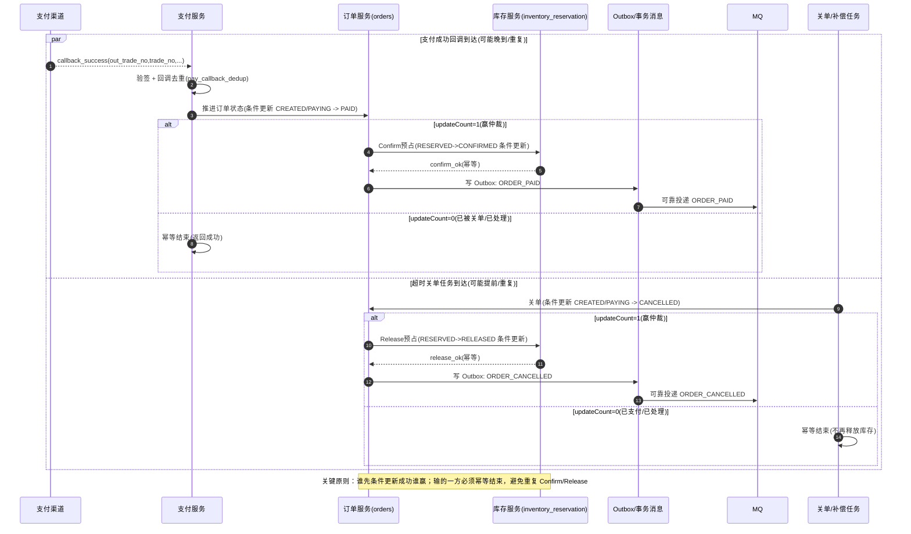

**订单状态仲裁：条件更新模板（建议默认）**：

支付成功推进：

```sql
UPDATE orders
SET status = 'PAID',
    paid_at = CURRENT_TIMESTAMP(3),
    updated_at = CURRENT_TIMESTAMP(3),
    version = version + 1
WHERE order_no = ?
  AND status IN ('CREATED','PAYING');
```

超时关单（只关未支付）：

```sql
UPDATE orders
SET status = 'CANCELLED',
    cancel_reason = 'TIMEOUT',
    closed_at = CURRENT_TIMESTAMP(3),
    updated_at = CURRENT_TIMESTAMP(3),
    version = version + 1
WHERE order_no = ?
  AND status IN ('CREATED','PAYING');
```

> 说明：`updateCount=1` 表示你赢了仲裁；`updateCount=0` 表示订单已经被其他事件推进（例如已 `PAID` 或已 `CANCELLED`），此时必须**直接返回成功（幂等结束）**，不要再做任何副作用动作。

**库存 Confirm/Release 仲裁：建议落在“预占记录”状态机上（强烈建议）**：

> 若你已有 `inventory_reservation`（预占记录）或等价的“库存占用流水状态”，请把 Confirm/Release 的幂等仲裁做在这张表上，而不是只盯着 `inventory` 的数量列。

Confirm（支付成功，只从 `RESERVED -> CONFIRMED` 走一次）：

```sql
UPDATE inventory_reservation
SET status = 'CONFIRMED',
    confirmed_at = CURRENT_TIMESTAMP(3),
    updated_at = CURRENT_TIMESTAMP(3)
WHERE reserve_id = ?
  AND status = 'RESERVED';
```

Release（取消/超时，只从 `RESERVED -> RELEASED` 走一次）：

```sql
UPDATE inventory_reservation
SET status = 'RELEASED',
    released_at = CURRENT_TIMESTAMP(3),
    updated_at = CURRENT_TIMESTAMP(3)
WHERE reserve_id = ?
  AND status = 'RESERVED';
```

对应的库存数量变更（示意，仍用条件更新避免负数）：

- Confirm：减少 `reserved_stock`（可选增加 `sold_count`）
- Release：`available_stock += qty` 且 `reserved_stock -= qty`

> 顺序建议：先“预占记录”状态条件更新赢得仲裁，再执行对应的 `inventory` 数量变更；若数量变更失败（极少见，通常是数据不一致），必须告警并进入补偿/对账任务，避免静默漂移。

**幂等键与唯一约束建议（落库就能避免 80% 事故）**：

- `orders.idempotency_key`：唯一索引（同一提交最多创建一单）
- `inventory_reservation.idempotency_key`：唯一索引（同一订单/明细最多预占一次）
- 支付回调去重：以 `out_trade_no + trade_status`（或 hash）做唯一约束（你在第 19.5.2 已给出参考表）

**错误码与重试（与 0.2 统一错误码表对齐）**：

- 订单状态条件更新 `updateCount=0`：这是**幂等/已被处理**，对外返回成功即可（避免回调重试风暴）
- 库存 Confirm/Release 条件更新 `updateCount=0`：同样视为幂等结束（已确认/已释放/已取消）
- DB 超时/死锁等：返回 **503** 并由内部限次重试（或异步补偿），避免客户端无限重试

### 2.3 常规下单流程图（Mermaid）

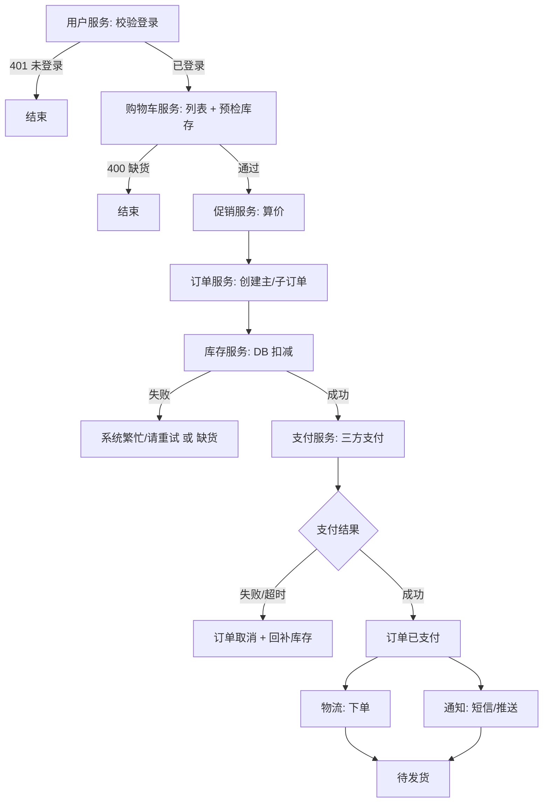

<a id="sec-2-4"></a>

### 2.4 非活动高并发：热点 SKU 路由（静态名单 + 动态升级）

**目标**：日常「常规下单」不设活动池时，仍要对 **少数被打爆的 SKU** 用上 Redis 原子预扣 + 异步落库 + 失败回补；**绝大部分 SKU** 继续走 DB 乐观锁/条件更新，控制复杂度。

#### 2.4.1 两类业务现实

| 类型 | 说明 | 策略侧重 |
|---|---|---|
| **热点可预判** | 新品首发、直播主推等，SKU 列表事先可知 | **配置中心维护热点名单**（SKU + 生效时间窗），命中即走 Redis 预扣链路 |
| **热点不可预判** | 任意 SKU 可能因热搜/带货瞬时变热 | 在静态名单之外，加 **动态发现**：单 SKU 扣库存 QPS、错误率、RT 超阈 → **自动加入临时热点**（带 TTL） |

> **观点/待定**：阈值与 TTL 需结合压测与容量规划调参，无全行业统一数字。

#### 2.4.2 单请求路由规则

1. 判断 SKU 是否命中 **静态热点名单** 或 **临时热点集合**（如 Redis Set / 本地缓存 + 版本号）。
2. **命中**：`Redis Lua` 原子预扣（`remain >= qty`）→ 返回 `reserve_id` + **幂等键** → MQ/异步任务幂等建单 → **DB 扣减该 SKU 可售库存**；DB 失败或关单超时 → **幂等回补** Redis。
3. **未命中**：走 **2.2 / 2.3** 的常规链路（缓存仅预检，以 DB 扣减为准）。

**多 SKU 一单**：实现上宜 **整单按「最严路径」升级**——行内任一明细 SKU 命中热点，则 **整单走 Redis 预扣链路**（或拆单，后者复杂度高，慎用）。

#### 2.4.3 与第 4 章秒杀链路的边界

- **本节（2.4）**：非活动、SKU 维度的 **可售余量** 在 Redis 侧做 **预扣镜像**；无「活动划拨池 N」，DB 扣减对应 **SKU 可售/可发**（与第 3 章库存模型一致）。
- **第 4 章秒杀**：常伴随 **活动池/隔离库存**、更强削峰与风控；热点名单可与秒杀预案 **复用同一套路由组件**，但 **数据 key 与划拨语义** 分开，避免混用。

#### 2.4.4 运维与对账（生产建议）

- 静态名单：**版本号 + 时间窗**，避免活动结束仍走预扣链路。
- 临时热点：**TTL + 最大条目数**，防止热点集合无限膨胀。
- **对账作业**：热点 SKU 定期比对 Redis `remain` 与 DB 可售，漂移报警；与 **19.4.3 库存对账** 同一类治理，可按域合并任务。

<a id="sec-2-4-5"></a>

#### 2.4.5 热点 SKU 动态发现（指标口径与参数建议）

**本文目标**：在 **2.4.2** 路由规则不变的前提下，约定一套**团队内统一的监控字段与分层**，让「临时热点集合」的产生与退出**可对表实现、可对监控验收**；具体阈值仍为**压测与容量规划结果**，本文只给**结构**与**常见区间**。

**分层：谁驱动「进 2.4 临时热点」**

| 层级 | 作用 | 是否参与自动升级 Redis 预扣链路 |
|------|------|----------------------------------|
| **L1 库存写路径（主）** | 扣减、预占、关单回补等**触及库存一致性**的请求，按 `sku_id` 聚合 | **是**：默认仅当 L1 满足条件时才写入临时热点集合 |
| **L2 网关 / 接入层 SKU 读（辅）** | 商品详情、加购页、预检读等带 `sku_id` 的路由计数 | **否（默认）**：只用于缓存/CDN/Sentinel 调参；**若 L1 未覆盖全链路**，可将 L2 与 L1 做 **AND** 作为补强，避免「只读热」误升整单预扣 |
| **L3 成交侧（可选确认）** | 支付成功、出库等按 SKU 的 CPS/件数 | **否**：仅作「真热」佐证，缓解爬虫与重试误报，延迟大，不宜单独触发 |

**固定字段规范（监控与路由侧同名对齐）**

| 字段名 | 必填 | 聚合维度 | 采集位置（建议） | 含义 |
|--------|------|----------|------------------|------|
| `sku_id` | 是 | — | 全链路统一透传 | 业务 SKU |
| `sku_stock_qps` | 是 L1 | `sku_id` [+ 可选 `region`/`az`] | 库存服务或订单内调库存的边界 | 库存写路径每秒请求数（预占/扣减/释放等计入口径需团队**写死一份**） |
| `sku_stock_err_rate` | 是 L1 | `sku_id` | 同上 | 该 SKU 库存调用失败或超时占比 |
| `sku_stock_p99_ms` | 是 L1 | `sku_id` | 同上 | 该 SKU 库存路径 P99 延迟（毫秒） |
| `sku_gateway_qps` | 选 L2 | `sku_id` [+ `route` 如 detail/cart] | API 网关或 Ingress | 带 SKU 参数的读接口 QPS（**不含**纯静态资源域名，除非已绑定 SKU） |
| `sku_paid_cps` | 选 L3 | `sku_id` | 支付/订单域事件或数仓准实时 | 支付成功维度每秒订单数或件数（二选一再统一） |

**L1 库存写路径计入口径（建议枚举，落地时替换为真实 RPC / HTTP 名）**

以下按**业务语义**归类，便于研发把「哪些调用算进 `sku_stock_*`」写成评审可勾选的清单；**具体接口名由团队填第二列**，与监控埋点、网关路由共用同一套表。

| 语义（应计入 L1） | 典型动作 | 备注 |
|------------------|----------|------|
| **预占 / 冻结** | Reserve、Hold、TryDeduct、预占库存 | 下单链路「先占后扣」中的占 |
| **实扣 / 确认** | Confirm、Commit、实扣、支付后扣减 | 与业务确认节点对齐 |
| **释放 / 回补** | Release、Cancel、Unhold、关单释放、退款还库 | 与预占/实扣成对出现者**均计入**（否则高并发下释放风暴也会打爆库存服务，需被看见） |
| **换货 / 部分退（写库存）** | 按 SKU 调整可售量的写接口 | 若与主购物链路共用库存服务，建议计入 |

**默认不计入 `sku_stock_qps`（避免误判「写热点」）**

| 语义 | 说明 |
|------|------|
| **纯读预检** | 只读缓存/Redis 可售余量、不落条件更新、不占库的接口（若与「预占」拆在不同 API，**预检不算 L1**） |
| **管理端与离线** | 盘点、人工改库、批量导入、对账批处理触发的调账 |
| **内部健康检查** | 探测、心跳类调用 |

若业务上「预检」与「预占」是**同一接口**内分支，则按**实际是否发生库存写**分子计数（需在埋点区分 `op=read_check` / `op=reserve`），否则 L1 会被读流量刷高。

**幂等与重试（须与监控、限流共用同一规则）**

- **推荐**：对同一业务键（如 `idempotency_key` 或 `client_request_id` + `sku_id`）在滑动窗口内，**服务端成功执行库存写**计次数；客户端重试若被幂等挡回且**未触达存储写**，可不计入 `sku_stock_qps`（实现复杂时也可退化为「请求到达次数」——全团队统一即可）。
- `sku_stock_err_rate` 的分母：与上述分子规则一致；分子为超时、业务失败、不可重试错误等（**与库存服务 SLA 定义一致**）。

**与 2.4 Redis 预扣的关系**

- L1 飙高是「**是否把 SKU 放进临时热点**」的输入；真正走 **Lua 预扣**仍由 **2.4.2** 路由命中后执行，二者勿混为同一计数器。

**时间窗口标签（与指标一并上报或查询时带维度）**

| 标签建议 | 含义 | 常用取值（实践区间） |
|----------|------|----------------------|
| `window_s` 或等价维度 | 聚合窗口秒数 | **3 / 10 / 60** 三档即可覆盖：突刺、稳定、环比基线 |

路由与监控对同一张「临时热点」表读写时，**窗口口径须一致**（例如入热点看 `window_s=10` 的 `sku_stock_qps`，出热点可放宽到 `window_s=60` 的滞回）。

**默认推荐判定（可配置为表达式，此处为语义约定）**

- **入临时热点（建议）**：`sku_stock_qps`（短窗）**且** `sku_stock_err_rate` 或 `sku_stock_p99_ms` 至少一项异常 **且**（可选）`sku_gateway_qps` 同向升高 **或** `sku_paid_cps` 在可接受延迟内升高；避免单字段入集。
- **仅读热**：`sku_gateway_qps` 高但 L1 正常 → **不调** 2.4 预扣，只调缓存与限流。
- **滞回**：入热点阈值 **严于** 出热点；TTL **5～30 分钟**；全站临时热点 **max_entries** 上限与 **2.4.4** 一致。
- **优先级**：静态热点名单（配置）**始终覆盖**动态集合；同 SKU 以配置时间窗与版本号为准。

**大规模与多地域（观点）**

- 超高 QPS 下可先 **Heavy-Hitter / CMS** 筛候选 SKU，再对候选集精算 L1 指标。
- 分 **region/az** 维护 Top-K 再合并，降低「局部热误判全站热」。

**上线前检查清单（对照字段表）**

- [ ] **L1 语义表**已补全贵司真实 **RPC/HTTP 名**，并与埋点、监控、热点路由共用**同一套**计入口径。
- [ ] Prometheus/日志/自研指标中已存在 **L1 三字段** + `sku_id`，且与路由服务订阅的是**同一统计源**。
- [ ] `sku_stock_*` 的「成功/失败/超时」口径与库存接口契约一致，无重复计数。
- [ ] L2/L3 若启用，字段名与窗口与文档表一致；入热点表达式已在配置中心可调。
- [ ] 压测：突刺、重试风暴、退热回落 DB；**19.4.3** 对临时热点 SKU 提高对账频率。

<a id="sec-2-5"></a>

### 2.5 统一高并发下单接口（不区分秒杀/普通）

当产品**不拆两套下单 URL**、一律按高并发接口建设时，用**一套对外契约 + 内部分层与可配置策略**即可覆盖「日常购」与「瞬时热点」：与 **2.4** 的「热点 SKU 路由」配合——**2.5 管接口与全链路口径，2.4 管何时对 SKU 走 Redis 预扣 + 异步落库**。

#### 2.5.1 设计原则

- **对外**：单一（或少量）提交订单入口；必带 **`request_id` / `idempotency_key`**，弱网重试不重复建单。  
- **对内**：固定顺序 **网关限流 → Sentinel →（可选）Redis Lua 快路径 → DB 真相（条件更新/预占）→ MQ 异步后续**；不在统一高并发主路径默认使用 **Seata 全局事务**跨订单库与库存库强绑定。  
- **库存**：一律以 **DB 条件更新或预占流水**为准；Redis 仅快路径/镜像，**禁止**用「DB 库存与 Redis 数值比较」作为是否可卖的判定。  
- **体验**：高并发下可返回 **受理中 + 可查询键**（`reserve_id` / `order_no`），依赖 **超时关单 + 库存释放 + 对账** 收敛。

#### 2.5.2 分层清单（所有下单共用）

| 层 | 作用 | 说明 |
|---|---|---|
| CDN | 减静态压力 | 活动页资源；**下单接口禁止 CDN 缓存** |
| 前端 | 减无效请求 | 验证码（可按风控档位开关）、防抖、防重复提交 |
| 网关 | 粗限流 | 令牌桶（IP/User）；**429** |
| Sentinel | 细限流与降级 | 接口 QPS、热点参数（用户ID、SKU）；**429（限流）/503（系统忙）**（如支持异步受理则返回 **202 + reserve_id**） |
| Redis | 快路径 | 与 **2.4** 一致：命中热点 SKU 时 **Lua 预扣**；未命中则仅预检/限购短 TTL |
| DB | 真相 | 建单 + 库存预占/扣减；唯一约束保幂等 |
| MQ | 削峰与后续 | 热点异步落库、通知、履约、对账；堆积上限 + DLQ |

#### 2.5.3 两种受理模式（同一接口，配置或负载驱动）

| 模式 | 触发条件 | 行为摘要 |
|---|---|---|
| **A 同步落单** | 默认；SKU 未命中热点且负载在预算内 | 校验 → 算价 → DB 预占/扣减 → 订单 `CREATED` → 返回支付参数 |
| **B 异步受理** | SKU 命中 **2.4** 热点规则，或全局限流/水位触发 | Redis Lua 占坑 → 入 MQ → 立即返回 **已受理（HTTP 202）+ `reserve_id`**（或 200 + 业务码 `QUEUEING`）；消费者幂等落库 |

两种模式共用：**同一套幂等键、状态机、超时关单与库存释放**。

#### 2.5.4 分库与支付后（与第 19 章对齐）

- 订单库与库存库分离：主链路用 **Reserve → Confirm/Release** + **幂等** + **MQ 事件**；支付回调 **Outbox 或事务消息二选一**，避免双事务体系叠加。  
- 拆单、配药机、发货等：**一律异步** + 消费幂等 + DLQ + 人工工单（见第 19 章履约小节）。

#### 2.5.5 小结

**不区分秒杀与普通下单时**：**一个下单接口 + 统一分层防护 + 2.4 热点路由决定同步/异步库存路径**；秒杀级活动可在网关/Sentinel 上再加严阈值，或活动池走第 4 章，但**不必**为「类型」单独拆下单 API。

---

<a id="sec-3"></a>

## 3. 防超卖（库存一致性）——选型与落地

### 3.1 三类主流方案（结论先行）

| 方案 | 关键词 | 优点 | 主要代价/风险 | 适用 |
|---|---|---|---|---|
| **分布式锁**（Redis/ZK） | 串行化同一 SKU | 强一致、跨库通用 | 高并发下易瓶颈；锁治理复杂 | 秒杀/强一致优先 |
| **数据库行锁**（`SELECT ... FOR UPDATE`） | 单行事务锁 | 实现直接、DB 保证一致 | 高并发排队明显；跨分片失效 | 常规下单、中等并发、单分片 |
| **乐观锁**（version/条件更新） | 更新冲突失败重试 | 吞吐高、无显式锁等待 | 高压下失败率高，要重试与补偿 | 高并发、可接受失败重试 |

#### 3.1.1 条件更新 SQL 与接口重试语义（落地示例）

本节与后文「库存表」字段对齐：`available_stock`、`reserved_stock`、`version`；若库存按仓拆分，则业务主键为 `sku_id + warehouse_id`。扣减以 **单条 UPDATE + WHERE 条件** 为准，避免无约束的「先 SELECT 再按算好的绝对值 UPDATE」。

**默认口径（全篇一致）**：除非特别说明，库存以 `sku_id + warehouse_id` 为业务主键；无“仓”概念的业务可以约定一个默认仓（例如 `warehouse_id = 0`），从而沿用同一套 SQL 与索引设计。

**直接扣减可售**（下单即占用、不单独维护预占时）：

- 单行 SKU（无仓维度：可用“默认仓”表达，例如 `warehouse_id = 0`）：

```sql
UPDATE inventory
SET available_stock = available_stock - ?,
    version = version + 1,
    updated_at = CURRENT_TIMESTAMP(3)
WHERE sku_id = ?
  AND warehouse_id = 0
  AND available_stock >= ?;
```

- 按 SKU + 仓：

```sql
UPDATE inventory
SET available_stock = available_stock - ?,
    version = version + 1,
    updated_at = CURRENT_TIMESTAMP(3)
WHERE sku_id = ?
  AND warehouse_id = ?
  AND available_stock >= ?;
```

两处占位「扣减数量」为同一正整数。`ROW_COUNT()` / `updateCount` 为 **1** 表示成功；**0** 表示条件未满足（常见为库存不足）或目标行不存在（若需区分可先校验行是否存在）。

**预占 / 确认 / 释放**（Reserve → Confirm / Release，与主链路「预占 + 幂等」一致时）：

- Reserve（可用转预占）：

```sql
UPDATE inventory
SET available_stock = available_stock - ?,
    reserved_stock = reserved_stock + ?,
    version = version + 1,
    updated_at = CURRENT_TIMESTAMP(3)
WHERE sku_id = ?
  AND warehouse_id = ?
  AND available_stock >= ?;
```

- Confirm（支付成功，预占转出）：按表结构二选一照抄，避免列不存在报错。

  - **表含 `sold_count`**（需在库表上统计累计销量时）：

```sql
UPDATE inventory
SET reserved_stock = reserved_stock - ?,
    sold_count = sold_count + ?,
    version = version + 1,
    updated_at = CURRENT_TIMESTAMP(3)
WHERE sku_id = ?
  AND warehouse_id = ?
  AND reserved_stock >= ?;
```

  - **表不含 `sold_count`**（如仅维护可用/预占与版本）：

```sql
UPDATE inventory
SET reserved_stock = reserved_stock - ?,
    version = version + 1,
    updated_at = CURRENT_TIMESTAMP(3)
WHERE sku_id = ?
  AND warehouse_id = ?
  AND reserved_stock >= ?;
```

- Release（关单或超时释放）：

```sql
UPDATE inventory
SET available_stock = available_stock + ?,
    reserved_stock = reserved_stock - ?,
    version = version + 1,
    updated_at = CURRENT_TIMESTAMP(3)
WHERE sku_id = ?
  AND warehouse_id = ?
  AND reserved_stock >= ?;
```

**版本号与「失败原因」**：若 WHERE 仅含 `version = ?` 而不含 `available_stock >= ?`，则 `updateCount = 0` 时无法区分「库存不足」与「版本冲突」。推荐在扣减语句中 **同时**带上数量条件与 `version`；若仍需对用户区分售罄与可重试冲突，可在失败后短路径再读主库当前库存或结合业务幂等记录判断（注意读从库延迟时不要以从库为最终真相）。

**接口语义与重试建议**：

| DB 结果 | 建议对外语义 | 是否重试 |
|--------|----------------|----------|
| 更新成功（影响行数 1） | 成功 | 否 |
| 影响行数 0，且确认行存在、库存不足 | 缺货 / 库存不足 | 否（除非用户改数量） |
| 影响行数 0，高并发下疑似版本或并发挤占 | 可返回 **409** 或业务码「请重试」 | 可限次重试（如 3～5 次）+ 退避 + 接口限流 |
| 超时、断连等 | **503** / 可重试 | 少次重试，避免重试风暴 |

**幂等与热点**：扣减请求须带业务幂等键（与订单侧 `idempotency_key` 一致），避免重复提交多次扣减；可与「库存变动流水」或订单唯一约束配合，保证同一幂等键只成功扣一次。若同 SKU 还走 Redis 预扣镜像，DB 条件更新失败时要按热点路由策略 **幂等回补** Redis，避免镜像与 DB 长期漂移。

### 3.2 简版决策树（可贴评审）

| 顺序 | 问题 | 是 → 倾向 | 否 → |
|---|---|---|---|
| 1 | 是否秒杀级、强一致优先？ | **分布式锁**（配合 Redis 预扣） | 继续 |
| 2 | 并发是否很高（例如 TPS > 1000 仅作量级参考）？ | **乐观锁** + 重试/限流 | 继续 |
| 3 | 是否分库分表且无法保证同一商品落同片？ | **分布式锁/乐观锁** | **行锁**（实现简单） |

### 3.3 常规 vs 秒杀的“库存链路差异”

- **常规下单**：更常见“缓存预检 + DB 扣减（行锁或条件更新）”，以稳定为主。
- **常规但瞬时热点 SKU**：在不上活动池的前提下，用 **2.4** 的「静态名单 + 动态升级」把单 SKU 流量切到 **Redis 预扣 + 异步落库 + 回补**，避免单行热点把 DB 打满。
- **统一高并发下单接口（不拆秒杀/普通 URL）**：整体口径见 **2.5**，SKU 级路由仍由 **2.4** 承担。
- **秒杀/大促**：必须先在入口与 Redis 挡掉绝大多数无效流量，再进入 DB；并且要有对账与补偿任务兜底。

### 3.4 药房行业特化：按“批号 + 有效期”的库存模型（推荐落地口径）

通用电商通常以 **SKU 维度**扣减库存即可；但药房出库必须考虑 **批号**与**有效期**，并满足“**效期优先出库**”的业务规则。建议把库存的“业务主键”从 `sku_id` 扩展为：

- **药房库存业务主键**：`pharmacy_id + drug_id + batch_no`

并配套一张“不可变/尽量少改动”的出入库流水表，用于对账、审计与追溯。

#### 3.4.1 表与关系（文字版 ER）

- **药房入库单** 1:N **药房入库单明细**
- **订单** 1:N **订单明细**
- **药房库存**：以 `pharmacy_id + drug_id + batch_no` 定位一条库存行，字段建议包含：`stock_qty`、`warn_qty`、`expire_at`
- **药房出入库记录（流水/台账）**：按批号维度记录每次变动，字段建议包含：`pharmacy_stock_id`、`log_type(入库/出库/调整/导入)`、`inbound_id`（入库场景）、`order_id`（出库场景）、`delta_qty`、`before_qty`、`after_qty`

> 关键定位：**库存表是“当前态”**，流水表是“历史态”。出现争议与对账，以流水可追溯为准。

#### 3.4.2 关键业务规则 1：效期优先出库（FIFO 按效期）

出库时在满足数量的前提下，优先从“有效期更早”的批号扣减，避免近效期积压。实现建议：

- 同一 `pharmacy_id + drug_id` 下，选取 **未过期且可用库存 > 0** 的批号列表
- 按 `expire_at` **升序**排序，逐批扣减直至满足订单需求

#### 3.4.3 关键业务规则 2：订单明细与出入库流水 1:N（跨批号凑数）

单个订单明细行的数量，可能需要跨多个批号才能凑齐，因此：

- **订单明细 : 出入库记录 = 1 : N**

为了把“这一行订单药从哪些批号出了多少”追溯清楚，建议在出入库流水中增加 `order_item_id`（或用中间关联表）。

#### 3.4.4 并发一致性与幂等（药房库存的“防超卖”落点）

药房库存并发的冲突粒度更细（到批号），但业务扣减会跨多行（多个批号）。建议至少明确以下规则：

- **同一库存行更新与流水写入**：尽量在同一事务内完成（行锁/条件更新/乐观锁其一），避免出现“库存变了但流水没写/流水写了但库存没变”
- **跨批号扣减的原子性**：要么在一个事务里逐行扣减+写流水，要么采用“预占/预扣 + 确认/取消”的两阶段方式（并配补偿任务）
- **幂等键**：入库单、发货/出库、库存调整等接口必须支持重复提交幂等（如业务单号唯一约束 + 幂等表）
- **避免负库存**：扣减用条件更新（如 `stock_qty >= delta`）或行锁，失败要返回清晰的“缺货/可重试”语义

**跨批号扣减的“可恢复性”补充（强烈建议写进评审）**：

- 扣减过程如果跨多个批号，务必保证“**每一笔扣减都有流水**且能按 `order_item_id` 回放重算”；即使出现部分批号扣减成功、后续批号失败，也必须能通过补偿任务把已扣减批号回滚（或转为预占并最终 Confirm/Release 收敛）。
- 建议把“出库流水”作为对账与补偿的真相源：出现争议时以流水重放结果为准，库存表仅作为当前态展示。

#### 3.4.5 UI 与运营提示（减少线下损耗）

库存列表建议对有效期做显著区分：正常 / 临期预警 / 已过期（颜色或标签），帮助线下优先处理临期药品。

---

<a id="sec-4"></a>

## 4. 秒杀/大促（高并发突刺）——削峰与隔离

### 4.1 入口削峰（从外到内）

| 层级 | 常用手段 |
|---|---|
| 静态资源 | 活动页静态资源上 **CDN**；**动态下单接口禁止 CDN 缓存** |
| 前端 | 验证码、按钮置灰/防抖、防重复提交 |
| 网关 | Nginx 令牌桶/漏桶限流（IP/User）；超限返回 **429** |
| 应用保护 | Sentinel/等价能力：按接口 QPS、用户维度限流，熔断/降级 |
| MQ 削峰 | 入队异步处理；设置**最大堆积量**，超过直接拒绝并提示“活动火爆” |
| Redis 热数据 | 活动快照、库存预扣、Token/幂等键、结果查询加速 |

### 4.2 秒杀全链路（推荐“Redis 预扣 + 锁 + DB 真相”）

核心顺序（失败就按相反方向回滚）：

1) **网关限流**（429）  
2) **Redis 预判**（无库存快速失败）  
3) **Redis 预扣**：`DECR stock`，若结果 < 0 立刻 `INCR` 回滚并售罄  
4) **分布式锁**（按 SKU 维度，可选）：拿不到返回 **503（系统忙）**或业务码提示稍后重试（不要把 503 表述为“排队”）  
5) **DB 校验与扣减**：行锁/条件更新保证最终一致  
6) **创建订单（简化字段可先落）**，拉起支付  
7) **支付成功/失败**：推进状态机；失败要恢复 DB/Redis 库存并释放锁  
8) **MQ 异步补全**：订单非核心字段、通知、积分、对账事件等

> 重要说明（秒杀场景的主流工程实践）：  
> - **Redis 预扣建议优先用 Lua 原子脚本**把“幂等判断 + 校验 + 扣减/回滚”合成一次原子操作，通常不需要再用“方法级分布式锁”去包住 Redis 操作。  
> - **分布式锁是否需要**取决于你后续的 DB 落库方案：如果 DB 落库采用“条件更新 + 幂等 + 补偿”的闭环，很多团队会选择**不在秒杀主链路引入锁**，而把并发冲突交给条件更新与重试/补偿处理；如果必须强串行化某个 SKU 的落库过程，再考虑锁，并严格控制等待时间与降级语义（如 503 系统忙/业务码）。

**建议默认方案（除非你有强理由）**：

- **默认不加锁**：入口限流 + Redis Lua 原子占坑（含幂等）→ MQ 削峰 → DB 条件更新/唯一约束幂等落库 → 失败补偿/对账。  
- **只有在以下情况才考虑加锁**：你必须强制串行化某个 `resource_id` 的落库过程（例如下游不是幂等、落库会写扩散且无法靠条件更新收敛），并且能接受更高 RT 与更复杂的锁治理（等待时间、租约、降级语义、锁泄漏处理）。

### 4.2.1 秒杀“公共资源争抢”落地版（秒杀/抢红包通用）

本小节把常见的“秒杀、抢红包、抢券名额”等 **公共资源争抢**业务，整理成一套可以直接开发/评审的落地清单：**分层拦截 → Redis 原子占坑 → MQ 削峰 → DB 落账 → 幂等与补偿闭环**。

#### 4.2.1.1 分层拦截清单（从外到内）

| 层 | 目标 | 具体手段 | 失败返回语义（建议） |
|---|---|---|---|
| CDN/静态 | 降低源站压力 | 活动页静态资源 CDN；接口不缓存 | - |
| 前端 | 减少无效点击 | 验证码/人机校验、防抖、按钮置灰 | 本地提示（不作为安全边界） |
| Nginx/网关 | 粗粒度挡洪峰 | 令牌桶/漏桶；IP + 用户维度限流 | **429**（限流） |
| Sentinel | 细粒度保护 | 接口 QPS + 热点参数（用户ID）限流；熔断降级 | **429**（限流）/ **503**（系统忙） |
| MQ | 削峰与隔离 | 入队异步处理；堆积上限；DLQ | **202**（已受理/排队中）或活动火爆（业务码）；队列不可用才考虑 **503** |
| Redis | 快速判定与占坑 | 热点数/活动快照；Lua 原子预扣；幂等键短期去重 | **400**（售罄/资格不足） |
| DB | 交易真相源 | 条件更新/行锁；写订单/流水；唯一约束幂等 | **400**（缺货）/ **503**（重试） |

#### 4.2.1.2 关键 Key/字段约定（最小集合）

- **请求幂等键**：`request_id`（客户端生成，弱网重试保持不变）  
- **用户唯一键**：`user_id`（限购/资格判断）  
- **资源唯一键**：`resource_id`（SKU/红包池/券活动等统一抽象）  
- **占坑流水号**：`reserve_id`（Redis 预扣成功后生成，用于结果查询与补偿定位，命名统一使用下划线风格；不要混用 `reservationId/reserveId`）

Redis 常用 Key（示例命名，可按团队规范调整）：

- `seckill:stock:{resource_id}`：可抢余额（活动运行态）  
- `seckill:dup:{resource_id}:{user_id}`：防重复抢（短 TTL）  
- `seckill:result:{reserve_id}`：结果查询（PENDING/SUCCESS/FAIL + order_no/原因）

#### 4.2.1.3 推荐主链路时序（不使用 Seata 绑死主链路）

**入口同步链路（必须快，目标是“快速失败/快速受理”）**

1. 网关/Sentinel 限流与降级（超限直接返回 **429**；系统忙/依赖不可用返回 **503**）。  
2. 秒杀服务做基础校验：登录态、活动时间窗、黑白名单/风控。  
3. **Redis Lua 原子脚本**（建议合并以下动作为一次原子操作）：  
   - 校验是否重复抢（`seckill:dup`）  
   - 校验库存/名额是否足够（`seckill:stock`）  
   - 成功则扣减并写入 `dup`，生成 `reserve_id`，把 `seckill:result` 置为 `PENDING`
4. 原子预扣失败：直接返回“售罄/资格不足”（400）。  
5. 预扣成功：将 `{reserve_id, request_id, user_id, resource_id, qty}` 投递 MQ（削峰），同步返回“**已受理/排队中**”（**HTTP 202 + reserve_id**，或 200 + 业务码 `QUEUEING`）。

**异步落库链路（允许慢，但必须可恢复）**

6. MQ 消费者拿到消息后，先做 **消费幂等**（`request_id`/`reserve_id` 唯一约束）。  
7. DB 本地事务内完成（建议同事务）：  
   - 写“秒杀订单/参与记录”（状态 `CREATED/待支付` 或 `SUCCESS`，视业务）  
   - DB 侧做最终扣减/冻结（条件更新/行锁其一）  
   - 写关键流水（用于对账与补偿）
8. 落库成功：更新 `seckill:result:{reserve_id}` 为 `SUCCESS` 并写入 `order_no`（或参与成功凭证）。  
9. 落库失败：更新 `seckill:result:{reserve_id}` 为 `FAIL`，并触发补偿（见下一节）。

> 说明：这里的“事务”只需要 **DB 本地事务**（同库内），而不是把“订单服务 + 库存服务”强行绑进 Seata 全局事务。秒杀更关键的是：**幂等 + 补偿 + 对账闭环**。

#### 4.2.1.4 失败补偿表（必须写进评审）

| 失败点 | 表现 | 必做动作（补偿） | 备注 |
|---|---|---|---|
| Redis 预扣失败 | 直接售罄/资格不足 | 无 | 快速失败 |
| Redis 预扣成功但 MQ 投递失败 | 用户已占坑但系统未入队 | 记录待补偿任务；**释放 Redis 占坑/库存** 或重试投递 | 两种策略二选一：以“最终能落库”为目标 |
| MQ 重复投递/重复消费 | 同一用户/请求被处理多次 | 消费幂等（唯一约束/幂等表） | 必须端到端幂等 |
| DB 扣减/冻结失败 | Redis 显示占坑成功，但 DB 失败 | 更新结果为 FAIL；**回补 Redis 库存/释放占坑** | 以 DB 为真相源 |
| 创建订单成功但后续支付超时 | 订单长期占用资源 | 关单任务：取消订单 + 释放 DB 冻结 + 回补 Redis（如需要） | TTL 要明确（如 15 分钟） |
| 结果页查询不到 | 用户体验差 | 提供 `reserve_id` 查询；允许“排队中”提示；超时兜底 FAIL | 结果可观测与可追踪 |

#### 4.2.1.5 与“锁”的关系（把锁用在该用的地方）

- **Redis 预扣阶段**：优先 Lua 原子，不建议再加“方法级分布式锁”。  
- **DB 落库阶段**：优先“条件更新 + 影响行数判定 + 幂等”；只有在确实需要串行化同一资源的复杂写入（例如跨批次/跨多行强原子扣减）时再考虑锁，并保证锁等待可控、失败语义清晰。

### 4.4 秒杀与分布式事务（Seata）选型结论（必须写清楚）

**结论先行**：秒杀/抢红包这类“公共资源争抢”的主链路，通常 **不建议**使用 Seata 把“创建订单 + 扣库存”强行绑定为强一致分布式事务；更推荐 **最终一致性**（Redis 预扣 + MQ 削峰 + DB 落库 + 幂等 + 补偿/对账）。

#### 4.4.1 为什么秒杀主链路不建议上 Seata

- **热点资源 + 高并发**：库存行/活动名额是典型热点；强一致分布式事务会引入全局协调、锁竞争、回滚成本，容易把吞吐与延迟打穿。  
- **与削峰目标冲突**：秒杀的核心是“入口快速失败 + 把慢动作异步化”。把核心动作绑进全局事务会拉长链路，削弱削峰效果。  
- **故障面扩大**：参与方越多，越容易级联超时；秒杀更需要“可恢复”，而不是“强耦合阻塞”。

#### 4.4.2 MQ 事务消息 / Outbox 与 Seata 的关系（避免两套体系叠加）

在秒杀链路里，**MQ（普通消息、事务消息或 Outbox）**常用于保证“可靠事件 + 削峰”。如果你已经用 MQ 作为一致性主叙事，就不要再让 Seata 充当第二套“核心一致性机制”，否则会出现：

- 消息成功但全局事务回滚、或事务提交但消息没发出 → 需要双重补偿与双重对账  
- 排障与压测复杂度上升（不知道问题属于事务协调还是消息投递/消费）

推荐做法（选其一并写成统一口径）：

- **方案 A（常见）**：本地事务落库（订单/冻结记录/流水） + Outbox（可靠发消息） + 消费端幂等  
- **方案 B**：RocketMQ 事务消息（半消息 + 本地事务 + 回查） + 消费端幂等  

两者都属于“最终一致性”体系，适合秒杀削峰链路。

### 4.3 秒杀链路流程图（Mermaid）

```mermaid
flowchart TD
    U[用户点击秒杀] --> FE[前端拦截/防抖/验证码]
    FE --> GW{网关限流 IP/User}
    GW -->|超限| E429[HTTP 429]
    GW -->|通过| R0{Redis预判库存}
    R0 -->|无货| SOLD[售罄]
    R0 -->|有货| RD[Redis DECR 预扣]
    RD --> D1{DECR后是否小于0}
    D1 -->|是| RB1[INCR回滚] --> SOLD
    D1 -->|否| LK{获取分布式锁 lock:sku}
    LK -->|失败| E503[HTTP 503/系统忙请重试]
    LK -->|成功| DB[DB 扣减: 条件UPDATE/行锁]
    DB --> C1{扣减成功?}
    C1 -->|否| RB2[回滚Redis+释放锁] --> BUSY[系统繁忙/售罄]
    C1 -->|是| ORD[创建秒杀订单(待支付)]
    ORD --> PAY[拉起支付]
    PAY --> PR{支付结果}
    PR -->|成功| PAID[订单已支付+释放锁] --> MQ[MQ异步补全/通知/对账] --> END1[结束]
    PR -->|超时/失败| CAN[取消订单+恢复DB/Redis库存+释放锁] --> END2[结束]
```

---

## 5. 快照、幂等、状态机、对账（统一口径）

### 5.1 两类快照（必须写进评审）

| 快照 | 冻结时机 | 常见存放 | 是否可清理 | 说明 |
|---|---|---|---|---|
| **活动快照** | 活动发布/预热 | Redis + DB 活动配置 | **可**（活动结束后） | 管“能不能卖、什么价、限购、剩余库存” |
| **订单快照** | 下单成功那刻 | DB 订单/明细（列或 JSON） | **不可** | 管“历史单据：当时卖的是什么/什么价” |

### 5.2 订单快照的两种数据设计（选型建议）

| 方案 | 做法 | 适用 |
|---|---|---|
| **方案一（推荐默认）** | 订单明细直接存快照字段（或核心列 + `extra` JSON） | 绝大多数电商：实现简单、展示稳定 |
| **方案二（版本日志）** | 商品日志表存版本；订单引用 `product_id + version/log_id` | 强审计/合规：需要严格按版本调证 |

### 5.3 端到端幂等（最小集合）

- **请求幂等**：客户端生成 `request_id`（弱网重试保持不变），贯穿日志与链路追踪。
- **建单幂等**：`idempotency_key` 做唯一约束（唯一索引/幂等表），保证同一业务请求最多创建一单。
- **支付回调幂等**：以 `order_no` + 状态机校验，重复回调不重复推进。
- **MQ 消费幂等**：以 `order_no` 或 `message_id` 去重，避免重复扣库存/重复发通知。

### 5.4 订单状态机（最小可用）

本节把“状态机”补到可以**直接开发**的粒度：状态集合、事件、允许/禁止的迁移、以及支撑幂等与补偿闭环的表字段。

#### 5.4.1 订单状态集合（推荐默认口径）

> 说明：你在第 20.3.1 已画了扩展版状态机图，这里补齐“状态语义 + 关键时间点 + 可逆/不可逆”口径，避免研发各写各的。

| 状态 | 含义（对用户/对系统） | 常见触发 | 是否可进入取消/退款分支 |
|---|---|---|---|
| `CREATED` | 订单已创建、资源已预占（待支付） | 建单成功 | 可取消（超时/用户取消/风控） |
| `PAYING` | 已发起支付（可选中间态） | 调起三方支付成功 | 可取消（支付超时/失败） |
| `PAID` | 支付已确认成功 | 支付回调/查单确认 | 可退款（售后/逆向） |
| `FULFILLING` | 履约中（拣货/配药/打包/出库） | 履约编排开始 | 可退款/拦截（视业务） |
| `SHIPPED` | 已发货（已交物流） | 发货单创建并出库 | 可退款/退货（视业务） |
| `COMPLETED` | 已完成（确认收货或超时自动完成） | 用户确认/超时任务 | 通常仅允许售后退款（视规则） |
| `CANCELLED` | 已取消（未支付或未履约前终止） | 超时关单/用户取消/风控拦截 | 不可再支付（只允许幂等重复事件） |
| `REFUNDING` | 退款中（已提交退款申请/已发起退款） | 申请退款通过 | 进入 `REFUNDED` |
| `REFUNDED` | 已退款完成（终态之一） | 退款回调/查单确认 | 终态（只允许幂等重复事件） |

推荐默认规则：**状态单向推进**，任何“重复/乱序事件”只允许产生**幂等的无副作用处理**（不回退、不重复扣减/释放资源）。

#### 5.4.2 订单状态迁移（事件驱动口径表）

| from | event（事件） | to | 关键校验（必须有） | 关键副作用（必须幂等） |
|---|---|---|---|---|
| - | `CREATE_ORDER` | `CREATED` | 建单幂等：`idempotency_key` 唯一 | 预占库存（Reserve）或落库存预占流水 |
| `CREATED` | `START_PAY` | `PAYING` | 仅允许一次（可重复幂等） | 记录 `pay_started_at` |
| `CREATED/PAYING` | `PAY_SUCCESS` | `PAID` | 支付回调去重 + 条件更新防并发 | Confirm 库存（预占转成交）+ 发 `ORDER_PAID` 事件 |
| `CREATED/PAYING` | `PAY_FAIL` | `CANCELLED` | 仅在未 `PAID` 时允许 | Release 库存（释放预占）+ 记录 `cancel_reason` |
| `CREATED/PAYING` | `CANCEL_TIMEOUT` | `CANCELLED` | TTL 到期；条件更新仲裁并发 | Release 库存 + 记录 `closed_at` |
| `PAID` | `START_FULFILL` | `FULFILLING` | 仅允许从已支付进入 | 履约编排开始（异步） |
| `FULFILLING` | `SHIP` | `SHIPPED` | 需要发货单/出库单已生成 | 记录 `shipped_at` + 物流单号 |
| `SHIPPED` | `CONFIRM_RECEIPT/COMPLETE_TIMEOUT` | `COMPLETED` | 确认收货或超时任务 | 记录 `completed_at` |
| `PAID/FULFILLING/SHIPPED` | `APPLY_REFUND` | `REFUNDING` | 售后规则校验（时效/状态） | 冻结逆向流程；发 `REFUND_APPLIED` |
| `REFUNDING` | `REFUND_SUCCESS` | `REFUNDED` | 退款回调去重 + 条件更新 | 记录 `refund_success_at` |
| `REFUNDING` | `REFUND_FAIL` | `PAID/SHIPPED`（按规则） | 明确回退目的状态（可选） | 仅记录失败原因（不重复 Confirm 库存） |

**禁止迁移（必须写进研发共识）**：

- 已 `CANCELLED/REFUNDED/COMPLETED` 的订单，**禁止**再进入支付或取消以外的状态；收到相关事件仅做幂等“忽略/返回成功”（避免重试风暴）。
- `SHIPPED` 之后 **禁止**走 `CANCELLED`（退款/退货走 `REFUNDING` 分支）。

#### 5.4.3 支撑订单状态机的关键字段（主表最小集合）

> 目标：字段能支撑“条件更新仲裁 + 幂等 + 超时任务 + 对账/审计”。字段可以不一次性全建，但**至少要在文档里明确**。

| 字段 | 类型（建议） | 必填 | 用途 |
|---|---|---:|---|
| `order_no` | varchar(32) | 是 | 全局订单号（唯一） |
| `user_id` | bigint | 是 | 用户维度索引与风控 |
| `status` | varchar(20) | 是 | 订单主状态（本节枚举） |
| `pay_status` | varchar(20) | 否 | 可选：支付子状态（`UNPAID/PROCESSING/SUCCESS/FAIL`），也可合并进 `status` |
| `idempotency_key` | varchar(64) | 是 | 建单幂等（唯一索引） |
| `request_id` | varchar(64) | 否 | 客户端请求幂等/链路追踪（推荐保留） |
| `total_amount` | decimal(10,2) | 是 | 订单总额 |
| `pay_amount` | decimal(10,2) | 是 | 实付金额（券/积分后） |
| `currency` | varchar(8) | 否 | 币种（如 CNY） |
| `created_at` | datetime(3) | 是 | 创建时间（用于 TTL） |
| `pay_started_at` | datetime(3) | 否 | 发起支付时间 |
| `paid_at` | datetime(3) | 否 | 支付成功时间 |
| `closed_at` | datetime(3) | 否 | 取消/关单时间 |
| `cancel_reason` | varchar(32) | 否 | 关单原因码（`TIMEOUT/USER_CANCEL/RISK_REJECT/...`） |
| `fulfilling_at` | datetime(3) | 否 | 履约开始时间 |
| `shipped_at` | datetime(3) | 否 | 发货时间 |
| `completed_at` | datetime(3) | 否 | 完成时间 |
| `refund_status` | varchar(20) | 否 | 可选：退款子状态 |
| `version` | int | 是 | 乐观锁/并发仲裁（或只用条件更新不依赖 version） |
| `updated_at` | datetime(3) | 是 | 更新与扫描（对账/补偿） |

**A. 字段状态机：最小枚举口径（推荐直接照抄）**

> 目标：让“字段怎么变”与“事件怎么来”对齐，避免研发/前端/对账各写一套口径。

| 字段 | 推荐枚举（最小集合） | 与 `status` 的关系 | 备注 |
|---|---|---|---|
| `status` | `CREATED/PAYING/PAID/FULFILLING/SHIPPED/COMPLETED/CANCELLED/REFUNDING/REFUNDED` | 主状态机 | **只允许前进**（除非你明确设计了可回退的事件与目的状态） |
| `pay_status`（可选） | `UNPAID/PROCESSING/SUCCESS/FAIL` | 支付视角子状态 | 不想维护两套就删掉：只用 `status` 即可 |
| `refund_status`（可选） | `NONE/APPLIED/PROCESSING/SUCCESS/FAIL/CLOSED` | 退款视角子状态 | 复杂售后（部分退/多次退）建议放到“售后单”里，主单只留聚合态 |
| `cancel_reason` | `TIMEOUT/USER_CANCEL/RISK_REJECT/PAY_FAIL/…` | 取消原因码 | **只在 `status=CANCELLED` 时有值**（其余状态必须为空） |

**B. 字段写入/变更规则（把“只前进”落到字段层）**

| 事件 | 允许更新字段（建议） | 不允许更新（避免抖动/回写） | 说明（关键约束） |
|---|---|---|---|
| `CREATE_ORDER` | `status=CREATED`、`created_at`、金额快照类字段 | `paid_at/closed_at/completed_at` | 建单成功就把“快照/金额/收货信息”一次性落库，后续只允许补非核心扩展字段 |
| `START_PAY` | `status=PAYING`（可选）/`pay_status=PROCESSING`、`pay_started_at` | 重写 `created_at/total_amount/pay_amount` | 支付链路允许幂等重复：重复事件只做“已是目标态则忽略” |
| `PAY_SUCCESS` | `status=PAID`、`pay_status=SUCCESS`、`paid_at` | 修改 `cancel_reason/closed_at` | `paid_at` **只允许首次写入**：`paid_at IS NULL` 才能写（或由条件更新保证） |
| `PAY_FAIL` | `status=CANCELLED`、`pay_status=FAIL`、`closed_at`、`cancel_reason=PAY_FAIL` | 修改 `paid_at` | 只允许在 `status in (CREATED,PAYING)` 时生效 |
| `CANCEL_TIMEOUT`/`USER_CANCEL`/`RISK_REJECT` | `status=CANCELLED`、`closed_at`、`cancel_reason` | 修改 `paid_at` | 取消与支付成功并发：以条件更新仲裁（谁先更新成功谁赢） |
| `START_FULFILL` | `status=FULFILLING`、`fulfilling_at` | 修改 `paid_at/closed_at` | 履约开始应当是**已支付后**才允许 |
| `SHIP` | `status=SHIPPED`、`shipped_at`（+ 物流字段） | 修改 `closed_at/cancel_reason` | 发货后不允许取消，只能走售后/退款分支 |
| `CONFIRM_RECEIPT`/`COMPLETE_TIMEOUT` | `status=COMPLETED`、`completed_at` | 修改 `shipped_at` | 完成时间 **只允许首次写入** |
| `APPLY_REFUND` | `status=REFUNDING`、`refund_status=APPLIED/PROCESSING` | 修改 `paid_at` | 是否允许从 `SHIPPED` 进入退款取决于售后规则；口径必须提前定 |
| `REFUND_SUCCESS` | `status=REFUNDED`、`refund_status=SUCCESS`、（可选）`refund_success_at` | 修改 `cancel_reason` | 退款成功回调必须幂等（重复回调不重复推进） |

**C. 建议的数据库约束（让“字段状态机”变成强约束，而不是口头约定）**

- **幂等唯一约束（必须）**：`idempotency_key` 建唯一索引（或建幂等表，但必须保证“同一 key 只能成功一次建单”）。
- **状态与时间字段的最小一致性（强烈建议）**：
  - `status='PAID'` 时 `paid_at IS NOT NULL`
  - `status='CANCELLED'` 时 `closed_at IS NOT NULL` 且 `cancel_reason IS NOT NULL`
  - `status='COMPLETED'` 时 `completed_at IS NOT NULL`
  - `paid_at`、`closed_at`、`completed_at` **只允许从 NULL -> 非 NULL**（防止被后续重试覆盖时间点）
- **禁止回退（必须靠 WHERE 条件实现）**：所有状态推进 SQL 必须带 `AND status IN (...)`（或 `AND version=?`），不允许“无条件 UPDATE”。

#### 5.4.4 订单状态推进的“条件更新”模板（推荐）

支付成功推进（防并发与乱序）：

```sql
UPDATE orders
SET status = 'PAID',
    paid_at = CURRENT_TIMESTAMP(3),
    updated_at = CURRENT_TIMESTAMP(3),
    version = version + 1
WHERE order_no = ?
  AND status IN ('CREATED','PAYING');
```

超时关单（只关未支付）：

```sql
UPDATE orders
SET status = 'CANCELLED',
    cancel_reason = 'TIMEOUT',
    closed_at = CURRENT_TIMESTAMP(3),
    updated_at = CURRENT_TIMESTAMP(3),
    version = version + 1
WHERE order_no = ?
  AND status IN ('CREATED','PAYING');
```

> 关键点：**谁先更新成功谁赢**；另一方拿到 `updateCount = 0` 时必须按“已被其他事件推进”处理（幂等结束）。

### 5.5 对账与补偿（必须有，不然迟早漂）

| 补偿/对账任务 | 扫描条件 | 处理 |
|---|---|---|
| 丢单补偿 | Redis 显示成功/占用，DB 无订单 | 重试落库或释放占用（按业务） |
| 超时取消 | `CREATED/PAYING` 且超过支付 TTL | 取消订单 + 回滚 DB/Redis 库存 |
| 库存对账 | 活动结束后 Redis 与 DB 不一致 | 以 **DB + 流水重算结果** 为准：小差异自动修正；大差异锁定 SKU 并转工单复核 |

### 5.6 库存状态机（预占/确认/释放 + 预占流水）

你在第 19.4 已定义了三段式协议，这里补齐“库存状态机 + 表字段”口径，让库存服务能在**乱序/重复/重试**下仍然收敛。

#### 5.6.1 两个层次的库存状态机（必须区分）

- **库存行（`inventory`）的“数量状态”**：用 `available_stock/reserved_stock/sold_count` 表达当前态；它不是“订单级状态机”，不要把每个订单的状态硬塞进库存行。
- **库存预占记录（`inventory_reservation`）的“订单级状态机”**：每个订单/明细占用一条或多条预占记录，状态机在这里推进，便于幂等、补偿、对账。

#### 5.6.2 预占记录状态机（推荐）

| 状态 | 含义 | 进入时机 | 退出到 |
|---|---|---|---|
| `RESERVED` | 已预占（占用成功） | 下单成功（Reserve 成功） | `CONFIRMED` / `RELEASED` |
| `CONFIRMED` | 已确认成交 | 支付成功（Confirm） | 终态 |
| `RELEASED` | 已释放占用 | 关单/超时/支付失败（Release） | 终态 |

对应的迁移规则（必须幂等）：

- `RESERVED --(PAY_SUCCESS)--> CONFIRMED`
- `RESERVED --(CANCEL/PAY_FAIL/TIMEOUT)--> RELEASED`
- `CONFIRMED/RELEASED` 收到任何重复事件：**忽略并返回成功**（不再变更库存数量）

#### 5.6.3 支撑库存状态机的关键表字段（推荐最小集合）

**A. `inventory`（库存当前态）关键字段**

| 字段 | 必填 | 用途 |
|---|---:|---|
| `sku_id`、`warehouse_id` | 是 | 业务主键（唯一约束） |
| `total_stock` | 是 | 总量上限（定义要全篇一致） |
| `available_stock` | 是 | 可用（Reserve 时减少，Release 时增加） |
| `reserved_stock` | 是 | 预占（Reserve 时增加，Confirm/Release 时减少） |
| `sold_count` | 否 | 已售累计（Confirm 时增加；退款是否回滚需另定） |
| `version` | 是 | 乐观锁（可选但推荐保留） |
| `updated_at` | 是 | 对账/扫描 |

**B. `inventory_reservation`（库存预占记录，推荐新增）关键字段**

| 字段 | 类型（建议） | 必填 | 用途 |
|---|---|---:|---|
| `reserve_id` | bigint/uuid | 是 | 预占记录主键（对外可返回） |
| `order_no` | varchar(32) | 是 | 关联订单（索引） |
| `order_item_id` | bigint | 否 | 关联明细（可选但强建议） |
| `sku_id`、`warehouse_id` | bigint | 是 | 关联库存行（索引） |
| `qty` | int | 是 | 预占数量 |
| `status` | varchar(20) | 是 | `RESERVED/CONFIRMED/RELEASED` |
| `idempotency_key` | varchar(64) | 是 | 幂等键（唯一索引，保证一次预占只生效一次） |
| `expire_at` | datetime(3) | 是 | 预占过期时间（用于超时释放扫描） |
| `confirmed_at` | datetime(3) | 否 | Confirm 时间 |
| `released_at` | datetime(3) | 否 | Release 时间 |
| `created_at`、`updated_at` | datetime(3) | 是 | 审计与扫描 |

**C. `inventory_change_log`（库存变动流水，推荐新增）关键字段**

| 字段 | 必填 | 用途 |
|---|---:|---|
| `biz_type`、`biz_id` | 是 | 业务来源（建议枚举：`RESERVE/CONFIRM/RELEASE/ADJUST/REFUND_RESTORE/RETURN_INBOUND/RETURN_QA_PASS/RETURN_QA_FAIL` 等）+ 业务单号（如 `order_no`/`reserve_id`/`refund_no`） |
| `sku_id`、`warehouse_id` | 是 | 维度定位 |
| `delta_available`、`delta_reserved`、`delta_sold`、`delta_blocked` | 是 | 变化量（可为正/负） |
| `before_*`、`after_*` | 否 | 可选：便于排障与审计 |
| `created_at` | 是 | 对账依据（流水重算） |

**`biz_id` 取值规则（建议写死，避免各服务各写各的）**：

- `RESERVE/CONFIRM/RELEASE`：取 `reserve_id`（最稳定的“库存占用流水号”）。
- `REFUND_RESTORE/RETURN_INBOUND/RETURN_QA_PASS/RETURN_QA_FAIL`：取 `refund_no`（逆向单号）。
- `ADJUST`：取库存调整单号（如 `adjust_no`/盘点单号）；若没有独立单号，用“来源单号 + 操作人 + 时间窗”生成可追溯的业务号。

> 对账口径：出现争议时，优先用 `inventory_change_log` 回放重算（可追溯），再与 `inventory` 当前态比对修正。

#### 5.6.4 退款/退货的库存逆向状态机（需要更严格时必须加）

本小节解决两个“线上必遇到”的分歧点，并把口径写死：

1) **退款是否回补库存？**——要分“未发货退款”和“已发货退货/退款”。  
2) **库存回补回到哪里？**——回到 `available_stock`（可再次销售）还是回到“不可售/待质检”的隔离池。

为避免把复杂状态塞进 `inventory` 主表，逆向仍然遵循“**订单级状态在记录表推进**，库存行只做数量变动”。

##### 5.6.4.1 逆向的两种业务路径（默认推荐）

| 路径 | 适用订单状态 | 典型场景 | 库存回补时点 | 推荐库存处理 |
|---|---|---|---|---|
| **A 仅退款（未发货）** | `PAID/FULFILLING` 且未出库 | 拣货前取消、配药失败等 | **退款成功或退款确认**（按风控） | 直接回补到 `available_stock`（可售） |
| **B 退货退款（已发货/已收货）** | `SHIPPED/COMPLETED` | 用户退货、售后退回 | **入库验收通过** | 回补到“可售”或“隔离池”二选一（建议默认隔离） |

> 建议默认：B 路径引入“隔离池”，避免退回商品直接可售导致质量/合规风险。

##### 5.6.4.1.1 逆向仲裁总览流程图（乱序/重复事件必看）

```mermaid
flowchart TD
    A[收到逆向相关事件<br/>REFUND_SUCCESS / RETURN_INBOUND_ACCEPTED / RETURN_QA_PASSED] --> B{生成幂等键<br/>refund_no+sku_id+warehouse_id+action}
    B --> C[Upsert inventory_refund<br/>不存在则创建 status=APPLIED]
    C --> D{是否满足回补前置条件?}
    D -->|否| E[推进/保持 STOCK_PENDING<br/>仅记录event_seen/更新时间<br/>不改库存数量]
    D -->|是| F[执行回补动作(事务)]
    F --> G[UPDATE inventory 数量变动<br/>available/blocked...]
    G --> H[INSERT inventory_change_log<br/>biz_id=refund_no]
    H --> I[UPDATE inventory_refund<br/>status=STOCK_RESTORED<br/>(条件更新)]
    E --> J[进入补偿扫描<br/>超时告警+人工介入]
    I --> K[终态：重复/乱序事件到达<br/>幂等忽略返回成功]
```

##### 5.6.4.2 是否需要新增字段：`blocked_stock`（建议）

如果你的业务存在“退货待质检/不可售”，建议在 `inventory` 增加一列：

- `blocked_stock`：不可售/隔离库存（退货入库先进入这里，质检通过再转入 `available_stock`）

对应不变量变为：
\[
available\_stock + reserved\_stock + sold\_count + blocked\_stock \le total\_stock
\]

##### 5.6.4.3 逆向记录表（推荐新增）：`inventory_refund`（退款/退货库存回补状态机）

> 说明：`inventory_reservation` 解决“预占-确认-释放”；但退款/退货会发生在 Confirm 之后，且可能分批退、部分退，因此需要一张“逆向”记录表保证幂等与可对账。

推荐状态集合（最小可用）：

| 状态 | 含义 |
|---|---|
| `APPLIED` | 已申请逆向（仅记录，不动库存） |
| `APPROVED` | 逆向审核通过（可选） |
| `STOCK_PENDING` | 等待回补库存（例如等退款成功/等退货入库） |
| `STOCK_RESTORED` | 库存已回补（终态之一） |
| `REJECTED/CANCELLED` | 逆向驳回或撤销（终态之一） |

核心迁移（示例口径）：

- A 仅退款（未发货）：`APPLIED -> STOCK_PENDING -> STOCK_RESTORED`（通常在 `REFUND_SUCCESS` 事件后回补）
- B 退货退款（已发货）：`APPLIED -> STOCK_PENDING ->（入库验收）-> STOCK_RESTORED`

必须幂等：同一 `refund_no + sku_id` 的“回补库存”只能成功一次。

**5.6.4.3.1 `inventory_refund` 字段状态机（补齐到可直接实现的粒度）**

> 目标：库存服务面对乱序事件（先退款成功、后入库；或先入库、后退款成功）仍然能收敛到唯一结果，并且能对账回放。

**A. 逆向单核心字段（最小集合）**

| 字段 | 类型（建议） | 必填 | 用途 |
|---|---|---:|---|
| `refund_no` | varchar(64) | 是 | 逆向单号（来自售后/退款域，全局唯一） |
| `order_no` | varchar(32) | 是 | 订单号（便于审计/追踪） |
| `order_item_id` | bigint | 否（推荐是） | 明细维度（部分退款/分批退货必须有） |
| `sku_id`、`warehouse_id` | bigint | 是 | 定位库存维度 |
| `qty` | int | 是 | 逆向数量（支持部分/分批） |
| `action` | varchar(32) | 是 | 本次逆向动作：`RESTORE_AVAILABLE/RESTORE_BLOCKED/QA_PASS_MOVE/QA_FAIL_DISCARD` 等 |
| `status` | varchar(20) | 是 | 状态机：`APPLIED/APPROVED/STOCK_PENDING/STOCK_RESTORED/REJECTED/CANCELLED` |
| `reason_code` | varchar(32) | 否 | 逆向原因码（统计/排障） |
| `idempotency_key` | varchar(128) | 是 | 幂等键（建议：`refund_no + sku_id + warehouse_id + action`） |
| `restore_target` | varchar(20) | 否 | `AVAILABLE/BLOCKED`（可选冗余，便于对账展示） |
| `event_seen` | json | 否 | 可选：记录已到达事件类型集合（排障用，不作为强依赖） |
| `created_at`、`updated_at` | datetime(3) | 是 | 扫描/补偿/对账 |

**B. 字段枚举口径（推荐默认）**

| 字段 | 推荐枚举（最小集合） | 备注 |
|---|---|---|
| `action` | `RESTORE_AVAILABLE/RESTORE_BLOCKED/QA_PASS_MOVE/QA_FAIL_DISCARD` | **必须纳入幂等键**，否则“先入隔离后转可售”会被误判重复 |
| `status` | `APPLIED/APPROVED/STOCK_PENDING/STOCK_RESTORED/REJECTED/CANCELLED` | `STOCK_RESTORED` 为终态之一 |
| `restore_target`（可选） | `AVAILABLE/BLOCKED` | 与 `action` 可互推导，冗余是为了查询方便 |

**C. 事件 → 字段变更规则（库存服务必须按此仲裁）**

| 事件 | 适用路径 | 允许从哪些 `inventory_refund.status` 进入 | 目标状态 | 允许更新字段 | 必须幂等点 |
|---|---|---|---|---|---|
| `CREATE_REFUND_RECORD`（内部） | A/B | - | `APPLIED` | 首次写入所有主键字段 + `idempotency_key` | `idempotency_key` 唯一，重复创建返回已存在 |
| `REFUND_SUCCESS`（未发货） | A | `APPLIED/APPROVED/STOCK_PENDING` | `STOCK_PENDING` | 仅更新 `updated_at`（可记录 event_seen） | **不得**直接加库存，必须走“回补动作”去重 |
| `RETURN_INBOUND_ACCEPTED`（已发货） | B | `APPLIED/APPROVED/STOCK_PENDING` | `STOCK_PENDING` | 同上 | 入库先到也只推进到 pending，具体“加到哪里”由 action 决定 |
| `RESTORE_TO_AVAILABLE`（内部动作） | A | `STOCK_PENDING` | `STOCK_RESTORED` | 写入 `restore_target=AVAILABLE` | 以 `idempotency_key` 保证“只回补一次”，并写 `inventory_change_log` |
| `RESTORE_TO_BLOCKED`（内部动作） | B | `STOCK_PENDING` | `STOCK_RESTORED` | 写入 `restore_target=BLOCKED` | 同上 |
| `QA_PASS_MOVE`（内部动作） | B（启用隔离池） | `STOCK_RESTORED`（且 restore_target=BLOCKED） | `STOCK_RESTORED`（状态不变） | - | 用独立 `action=QA_PASS_MOVE` 生成新一条 `inventory_refund`（推荐），避免同一行复用导致幂等键混乱 |

**D. 建议的数据库约束（库存逆向落地必备）**

- **幂等唯一约束（必须）**：`idempotency_key` 唯一（或唯一索引覆盖 `refund_no+sku_id+warehouse_id+action`）。
- **同一逆向单可多行（建议）**：部分退款/分批退货时允许同一 `refund_no` 对不同 `order_item_id/sku_id` 多条记录。
- **库存数量更新与逆向单推进必须同事务（强烈建议）**：同一个 DB 事务里完成：
  - `UPDATE inventory ...`（数量变动）
  - `UPDATE inventory_refund SET status='STOCK_RESTORED' ... WHERE idempotency_key=? AND status='STOCK_PENDING'`
  - `INSERT inventory_change_log ...`（流水对账）
  任一失败都回滚，避免“数量变了但逆向单没变”造成重复回补。
- **禁止无条件推进（必须）**：逆向单推进必须带 `AND status IN (...)`，确保乱序/重试不会回写错误状态。

##### 5.6.4.4 逆向事件与库存数量变动（推荐表）

| 事件 | 触发条件 | 需要改动的库存列 | `inventory_change_log.biz_type` 建议 | 备注 |
|---|---|---|---|---|
| `REFUND_SUCCESS_BEFORE_SHIP` | 未发货且退款成功 | `available_stock +qty`（可选：`sold_count -qty`） | `REFUND_RESTORE` | 是否回滚 `sold_count` 见下条规则 |
| `RETURN_INBOUND_ACCEPTED` | 已发货退货，入库验收通过 | `blocked_stock +qty`（或 `available_stock +qty`） | `RETURN_INBOUND` | 建议默认进隔离池 |
| `RETURN_QA_PASSED` | 质检通过 | `blocked_stock -qty, available_stock +qty` | `RETURN_QA_PASS` | 可售转移 |
| `RETURN_QA_FAILED` | 质检失败 | `blocked_stock -qty`（进入报损/销毁流程） | `RETURN_QA_FAIL` | 具体处理依业务 |

##### 5.6.4.5 `sold_count` 是否回滚（必须写死，不然数据口径会炸）

两种口径二选一，**推荐默认用口径 1**（更利于经营分析）：

- **口径 1（推荐）**：`sold_count` 只增不减，代表“历史成交累计”；退款/退货不回滚 `sold_count`，而是用单独指标（如“退款量/退货量”）在数仓或报表里扣除。  
- **口径 2（不推荐但可选）**：退款成功时回滚 `sold_count`，使其代表“净成交”。此口径会让对账与审计更复杂（尤其部分退款/跨周期），慎用。

文档默认选择：**口径 1**。

##### 5.6.4.6 逆向也要有“条件更新 + 幂等键”

库存回补（示例：回补可售）：

```sql
UPDATE inventory
SET available_stock = available_stock + ?,
    version = version + 1,
    updated_at = CURRENT_TIMESTAMP(3)
WHERE sku_id = ?
  AND warehouse_id = ?;
```

回补到隔离池（示例：退货入库先入 `blocked_stock`）：

```sql
UPDATE inventory
SET blocked_stock = blocked_stock + ?,
    version = version + 1,
    updated_at = CURRENT_TIMESTAMP(3)
WHERE sku_id = ?
  AND warehouse_id = ?;
```

隔离池转可售（示例：质检通过搬运）：

```sql
UPDATE inventory
SET blocked_stock = blocked_stock - ?,
    available_stock = available_stock + ?,
    version = version + 1,
    updated_at = CURRENT_TIMESTAMP(3)
WHERE sku_id = ?
  AND warehouse_id = ?
  AND blocked_stock >= ?;
```

> 注意：上面的 UPDATE 只是“数量变动”。真正的幂等要靠 `inventory_refund`（或去重表）里的唯一约束保证“同一次回补只做一次”，并且同步写 `inventory_change_log` 作为对账依据。

#### 5.6.5 订单退款状态机 × 库存逆向：跨域一致性对齐表（建议评审必贴）

> 目标：把“订单 REFUNDING/REFUNDED”与“库存是否回补、回补到哪里、由谁触发”写成硬规则，避免各服务各自推进导致不一致。

##### 5.6.5.1 逆向单（`inventory_refund`）创建与推进的统一口径

- **逆向单号**：`refund_no`（来自售后/退款域，必须全局唯一）。
- **逆向幂等键**：`inventory_refund.idempotency_key`（建议：`refund_no + sku_id + warehouse_id + action`，其中 `action` 取 `RESTORE_AVAILABLE/RESTORE_BLOCKED/QA_PASS_MOVE`）。
- **库存回补只认逆向单**：库存服务收到任何“退款成功/入库验收/质检通过”事件，必须先查/写 `inventory_refund` 的幂等记录，再改 `inventory` 数量与写 `inventory_change_log`。

**5.6.5.1.1 `REFUND_SUCCESS` 消费侧：库存逆向 + 售后展示联动时序图（推荐必贴）**

> 目标：说明“钱已退”事件到达后，库存服务如何在乱序/重复下幂等收敛；售后服务如何只做展示聚合，不抢真相源。

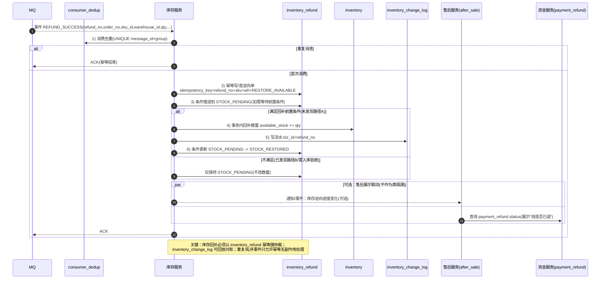

**5.6.5.1.2 `RETURN_INBOUND_ACCEPTED` 消费侧：退货入库验收 → 回补隔离池（路径 B 默认）**

> 目标：退货退款场景，入库验收事件到达后，把库存先回补到 `blocked_stock`（隔离池），避免“退回商品未经质检直接可售”。

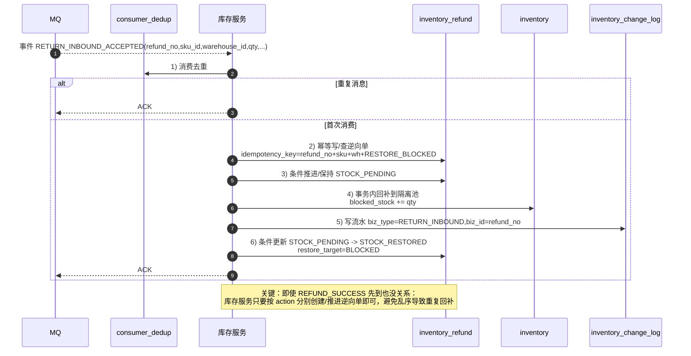

**5.6.5.1.3 `RETURN_QA_PASSED` 消费侧：隔离池 → 可售搬运（质检通过）**

> 目标：质检通过后，把库存从隔离池搬回可售；该动作必须有独立 `action=QA_PASS_MOVE` 的幂等键，避免与“入库回补”混淆。

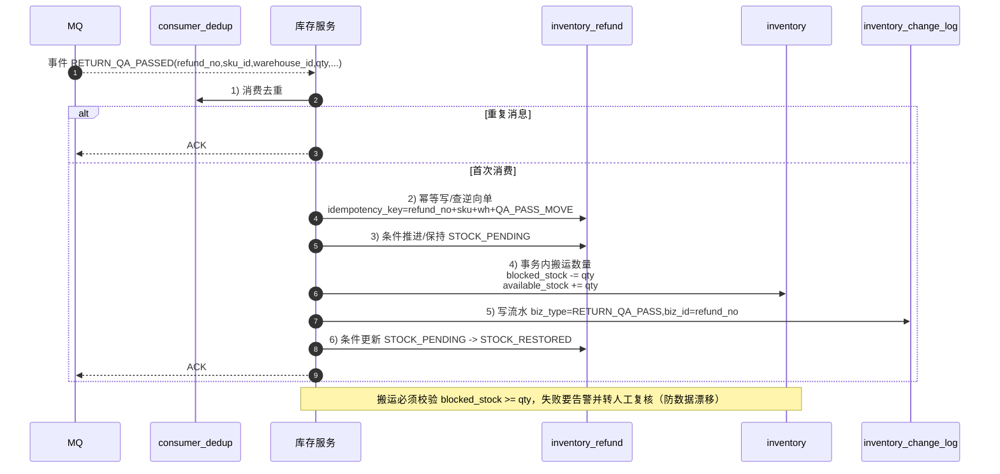

##### 5.6.5.2 订单状态与库存动作对齐（强制规则）

| 订单状态（orders.status） | 售后/退款事件 | 允许创建 `inventory_refund`？ | 允许回补库存？ | 回补目标（默认） | 备注（仲裁点） |
|---|---|---:|---:|---|---|
| `PAID` | `APPLY_REFUND` | 是 | 否（先不动库存） | - | 进入 `REFUNDING`，等待后续结果 |
| `FULFILLING` | `APPLY_REFUND` | 是 | 否（先不动库存） | - | 如已出库则按退货退款走 |
| `SHIPPED/COMPLETED` | `APPLY_REFUND` | 是 | 否 | - | 必须等待“退货入库验收”类事件 |
| `REFUNDING` | `REFUND_SUCCESS`（且未发货） | 是（已存在则幂等） | 是 | `AVAILABLE` | 对应 5.6.4 路径 A |
| `REFUNDING` | `REFUND_SUCCESS`（已发货） | 是（已存在则幂等） | 否 | - | 仅代表“钱退了”，库存仍等退货入库 |
| `REFUNDING` | `RETURN_INBOUND_ACCEPTED` | 是（已存在则幂等） | 是 | `BLOCKED`（推荐） | 对应 5.6.4 路径 B |
| `REFUNDING` | `RETURN_QA_PASSED` | 是（已存在则幂等） | 是（搬运） | `BLOCKED -> AVAILABLE` | 仅对启用隔离池时适用 |
| `REFUNDING` | `REFUND_FAIL/REJECTED` | 是（记录即可） | 否 | - | 不回补库存 |
| `REFUNDED` | 任意重复事件 | 否（或仅幂等写） | 否/是（仅允许幂等补漏） | - | 防止重复回补；允许“补漏式”修正一次 |
| `CANCELLED` | - | 否 | 否 | - | 取消走的是 `inventory_reservation` Release，不走逆向 |

##### 5.6.5.3 订单与库存的并发仲裁（必须明确，否则会出现“钱退了货没退/库存重复回补”）

- **退款成功 vs 超时关单**：仅可能发生在未支付阶段（`CREATED/PAYING`），此时库存走 `inventory_reservation` 的 Release；**禁止**同时创建 `inventory_refund`。
- **退款成功 vs 退货入库**：可能乱序到达。库存服务按 `inventory_refund.idempotency_key` 去重：  
  - 先到 `REFUND_SUCCESS`（已发货场景）只更新逆向状态为 `STOCK_PENDING`，不回补数量；  
  - 后到 `RETURN_INBOUND_ACCEPTED` 才执行回补（进 `BLOCKED` 或 `AVAILABLE`）。
- **补偿兜底**：对账任务可扫描 `inventory_refund.status in ('STOCK_PENDING') AND created_at < now()-T`，对外提示/告警并推动人工介入（例如退货物流丢失、验收未录入）。

##### 5.6.5.4 事件投递建议（保证最终一致）

为避免“订单状态更新成功但库存没收到事件”，推荐两种一致性口径二选一（与第 4.4.2、19.6 保持一致）：

- **Outbox**：订单/售后域在本地事务里更新 `orders.status` 与写 outbox，异步可靠投递 `REFUND_SUCCESS/RETURN_INBOUND_ACCEPTED/RETURN_QA_PASSED` 等事件。
- **事务消息**：RocketMQ 事务消息绑定本地事务，消费端依赖幂等表去重。

无论选哪种：**库存回补必须以 `inventory_refund + inventory_change_log` 可追溯为最终准绳**。

##### 5.6.5.5 逆向事件消息体（最小字段集合，建议统一）

> 原则：库存服务想做到“可对账、可补偿、可幂等”，消息体里必须带齐定位与数量字段；否则只能依赖二次查询、会被延迟/缺数据拖垮。

**通用字段（所有逆向事件都必须带）**

| 字段 | 必填 | 说明 |
|---|---:|---|
| `event_id` | 是 | 事件唯一ID（用于消费去重） |
| `event_type` | 是 | `REFUND_SUCCESS/RETURN_INBOUND_ACCEPTED/RETURN_QA_PASSED/...` |
| `occurred_at` | 是 | 事件发生时间 |
| `refund_no` | 是 | 售后/退款单号（全局唯一） |
| `order_no` | 是 | 订单号 |
| `order_item_id` | 否（推荐是） | 明细ID（部分退款/分批退货强烈建议） |
| `user_id` | 否（推荐） | 用于审计/风控/排障 |
| `sku_id` | 是 | SKU |
| `warehouse_id` | 是 | 仓（无仓可固定为 0） |
| `qty` | 是 | 本次逆向数量（支持部分） |
| `trace_id/request_id` | 否 | 链路追踪 |

**库存侧幂等键建议（用于 `inventory_refund.idempotency_key`）**

- **回补到可售**：`refund_no + sku_id + warehouse_id + 'RESTORE_AVAILABLE'`
- **回补到隔离池**：`refund_no + sku_id + warehouse_id + 'RESTORE_BLOCKED'`
- **隔离池转可售（质检通过搬运）**：`refund_no + sku_id + warehouse_id + 'QA_PASS_MOVE'`

> 说明：同一 `refund_no` 可能出现“多次事件”（例如先入隔离池，后质检通过再转可售），因此幂等键必须把 `action` 纳入，否则会错误地把后续事件当重复丢弃。

**推荐消息样例（JSON）**

```json
{
  "event_id": "E20260408-000001",
  "event_type": "RETURN_INBOUND_ACCEPTED",
  "occurred_at": "2026-04-08T10:00:00.000Z",
  "refund_no": "R202604080001",
  "order_no": "O202604070001",
  "order_item_id": 90001,
  "user_id": 10086,
  "sku_id": 20001,
  "warehouse_id": 0,
  "qty": 1,
  "trace_id": "t-xxx",
  "request_id": "req-xxx"
}
```

**库存对账落地规则（建议默认）**：

- **对账来源优先级**：流水重算结果（可追溯） > DB 当前态 > Redis 镜像（运行态）。
- **Redis 处理策略**：  
  - 若 Redis 仅作“活动运行态镜像”，且活动已结束：优先 **清理活动 Key**，避免历史脏数据影响后续。  
  - 若活动仍在进行：以“流水重算/DB”作为目标值 **覆盖修正 Redis**，并对该 `sku_id + warehouse_id` 进入短期观察（更高频对账/报警）。
- **差异阈值**（示例，需结合业务调参）：  
  - `abs(diff) <= 1`：自动修正并打 INFO 日志  
  - `1 < abs(diff) <= 10`：自动修正 + P2 告警  
  - `abs(diff) > 10`：锁定异常 SKU（可临时下架/限售）+ 生成工单人工复核（P1/P2 视金额与影响面）

---

## 6. 秒杀落地方案选型（Lua 闭环 vs MQ 异步）

### 6.1 两种常见落地形态

| 方案 | 核心思路 | 你必须补齐的能力 |
|---|---|---|
| **Redis + Lua 原子闭环** | Lua 内做：幂等判断 → 扣库存 → 记录流水/订单（或临时结构） | 可靠落库（MQ/补偿）、消费幂等、对账 |
| **Redis 判抢/排队 + MQ 异步落库** | Redis 快速判断（令牌池/入队）；真正落单扣库异步在 DB 完成 | 排队结果查询、超时策略、MQ 堆积与限流 |

### 6.2 必备工程点（不补就容易翻车）

- **幂等顺序**：先幂等判断，再扣库存，再写单据/流水。
- **可追溯 ID**：即使异步，也建议返回 `request_id/order_no` 便于查询与对账。
- **一致性认知**：Redis 成功不等于 DB 一定成功，必须有“可靠消息 + 重试 + 补偿 + 对账”闭环。

---

## 7. 缓存与榜单（热点治理）

### 7.1 两级缓存（可选）

JVM 本地缓存 + Redis，减少跨网络访问与 Redis 压力；要明确本地失效策略与一致性要求。

### 7.2 缓存与 DB 最终一致（可选）

通过订阅 binlog（例如 Canal 这类思路）异步更新 Redis，需处理延迟、乱序、重复更新等问题。

### 7.3 热销榜（实时榜单）

Redis **ZSet**：score = 销量/热度，支持 Top N、分页、按时间窗口等（按业务设计）。

---

## 8. 数据仓库分层落地（商品-订单-用户）

### 8.1 分层与单向依赖

**流向**：`ODS → DWD → DWS →（结合 DWA 维度）→ ADS`，避免循环依赖，保证可回溯与可对账。

### 8.2 各层关键点（概要）

- **ODS**：业务库原始同步，尽量 1:1，保留回溯能力。
- **DWD**：清洗明细（字段标准化、脱敏、异常剔除），粒度原子。
- **DWS**：按主题轻聚合（商品/订单/用户），减少重复计算。
- **DWA**：公共维度统一维护（时间/类目/地域等），避免口径不一致。
- **ADS**：面向报表/大屏的最终输出，尽量减少下游再加工。

### 8.3 对账口径建议（务必写清）

例如：DWS 的“日支付总额”应能与 DWD 明细聚合对齐；口径统一后再做指标。

---

## 9. 与电商无关但常用的“列表排序”能力（可复用模块）

此能力常用于：后台运营配置（频道位、商品展示顺序、活动位等）。

| 交互形态 | 推荐接口入参 | 后端策略 |
|---|---|---|
| 上移/下移一位 | `idA, idB` | 交换两条记录的 `sort` |
| 拖拽批量排序 | 有序 `ids` 数组 | 按下标生成 `1..n` 批量更新 |
| 前端带序号提交 | 对象数组（含 id + sort） | 规范化/重排后批量更新（需说明是否整段重排） |

注意：要明确“并发编辑策略”（乐观锁/版本号/最后写入覆盖）、是否要求序号连续、分页场景如何避免冲突。

---

## 10. 上线前检查清单（高并发版）

**快照**
- [ ] 活动快照（价/库存/限购）定义清晰，预热时写入 Redis，活动结束可清理/归档  
- [ ] 订单快照字段齐备（商品名/规格文案/成交价/数量/活动或规则引用），永久可追溯

**幂等与状态机**
- [ ] `request_id` 贯穿；`idempotency_key` 唯一约束建单  
- [ ] 支付回调幂等；MQ 消费幂等  
- [ ] 状态机只前进，乱序/重复不会重复生效

**链路回滚与补偿**
- [ ] 明确 Redis 预扣、锁、DB 扣减的回滚顺序与异常分支  
- [ ] 有超时取消任务、丢单补偿任务、活动后库存对账

**药房库存（如适用）**
- [ ] 库存主键是否按 `pharmacy_id + drug_id + batch_no` 建模；是否能表达“同药多批号”  
- [ ] 出库是否按 `expire_at` 升序优先扣减（效期优先）  
- [ ] 订单明细是否可追溯到多条出库流水（1:N）；对账字段（`order_item_id`/关联表）是否齐备  
- [ ] 跨批号扣减的一致性策略是否明确（单事务逐行扣减 vs 两阶段预占）与补偿闭环是否具备  

**削峰与保护**
- [ ] 网关限流（429）+ 应用限流/熔断/降级（503）  
- [ ] MQ 设堆积上限与拒绝策略，避免无限堆积拖垮下游

**观测**
- [ ] Redis/DB/MQ/网关/业务成功率关键指标与告警阈值齐备

---

## 11. 术语表（团队统一口径）

| 术语 | 定义 |
|---|---|
| **活动快照** | 活动运行态配置与库存（Redis/活动库），允许活动结束清理 |
| **订单快照** | 下单那刻写入订单明细的展示与成交信息（DB），永久保留 |
| **幂等键** | 保证同一业务请求”最多生效一次”的唯一标识 |
| **真相源** | 最终对账以 DB 为准；缓存可偏差但必须可修正 |
| **分布式锁** | 跨服务/跨进程的锁，用于保证分布式环境下的并发安全 |
| **最终一致性** | 系统经过一段时间后达到数据一致的状态，不强调实时一致性 |
| **强一致性** | 所有读操作都能读到最新的写操作结果 |
| **Outbox模式** | 业务操作与事件发送在同一本地事务中，保证数据一致性 |
| **全局锁** | 分布式事务中用于协调多个资源访问的锁 |

---
## 12. 生产级部署与运维方案

### 12.1 微服务架构设计

#### 12.1.1 服务拆分原则
- **单一职责原则**：每个服务专注于特定业务领域
- **数据隔离**：每个服务拥有独立的数据库，避免数据耦合
- **高内聚低耦合**：服务内部高度相关，服务间依赖最小化
- **可独立部署**：每个服务能够独立发布、升级和回滚

#### 12.1.2 服务分类
| 服务类别 | 服务名称 | 职责 |
|---|---|---|
| **核心服务** | 商品服务 | 商品信息管理、商品搜索 |
| | 订单服务 | 订单创建、订单状态管理 |
| | 用户服务 | 用户认证、用户信息管理 |
| | 库存服务 | 库存管理、库存扣减 |
| | 支付服务 | 支付流程处理、支付回调 |
| **支撑服务** | 消息服务 | 消息推送、事件通知 |
| | 文件服务 | 图片上传、文件存储 |
| | 通知服务 | 邮件、短信、推送通知 |
| | 日志服务 | 统一日志收集、分析 |
| **基础设施** | 网关服务 | 请求路由、鉴权、限流 |
| | 配置中心 | 统一配置管理 |
| | 注册中心 | 服务注册发现 |
| | 链路追踪 | 分布式链路追踪 |
| | 监控告警 | 系统监控、业务监控 |

#### 12.1.3 服务间通信
- **同步调用**：通过 REST API 或 RPC 进行服务间同步调用
- **异步通信**：通过消息队列进行异步通信，降低服务耦合
- **服务网格**：使用 Istio 等服务网格实现服务间的安全通信、流量管理和策略执行

### 12.2 数据库设计与优化

#### 12.2.1 数据库选型
- **主数据库**：MySQL（支持 ACID 事务，适合核心业务数据）
- **缓存**：Redis（高速缓存、会话存储、分布式锁）
- **搜索引擎**：Elasticsearch（商品搜索、日志检索）
- **时序数据库**：InfluxDB（监控数据、业务指标）

#### 12.2.2 分库分表策略
- **垂直拆分**：按业务模块拆分数据库
- **水平拆分**：
  - 订单表：按用户ID取模拆分
  - 商品表：按类目拆分
  - 用户表：按用户ID取模拆分

#### 12.2.3 数据一致性保障
- **分布式事务**：使用 Seata 保证跨服务数据一致性
- **最终一致性**：通过 MQ + Outbox 模式保证数据最终一致性
- **补偿机制**：建立完善的补偿和重试机制

### 12.3 高可用与容灾设计

#### 12.3.1 服务高可用
- **多活部署**：在多个数据中心部署相同的服务实例
- **故障转移**：通过健康检查和负载均衡实现自动故障转移
- **降级策略**：在系统压力过大时进行服务降级，保证核心功能可用

#### 12.3.2 数据高可用
- **主从复制**：MySQL 主从架构，保证数据不丢失
- **读写分离**：写操作走主库，读操作走从库
- **数据备份**：定时备份数据，支持快速恢复

#### 12.3.3 容灾方案
- **同城容灾**：在同一城市的不同机房部署备份系统
- **异地容灾**：在不同城市的机房部署灾备系统
- **数据同步**：通过数据库复制、消息同步等方式保证数据一致性

### 12.4 安全设计

#### 12.4.1 认证授权
- **统一认证**：基于 JWT + OAuth2.0 的统一认证体系
- **权限控制**：基于 RBAC 的细粒度权限控制
- **SSO 集成**：支持单点登录

#### 12.4.2 数据安全
- **敏感数据加密**：对用户隐私数据进行加密存储
- **传输加密**：使用 HTTPS 加密传输
- **SQL 注入防护**：使用参数化查询防止 SQL 注入

#### 12.4.3 网络安全
- **防火墙**：设置网络访问控制
- **DDoS 防护**：部署 DDoS 防护设备
- **WAF**：部署 Web 应用防火墙

### 12.5 监控与告警

#### 12.5.1 系统监控
- **基础设施监控**：CPU、内存、磁盘、网络等
- **应用监控**：JVM、GC、线程池等
- **业务监控**：订单量、转化率、支付成功率等

#### 12.5.2 链路追踪
- **分布式追踪**：通过 TraceID 追踪请求在整个系统中的流转
- **性能分析**：定位性能瓶颈，优化系统性能

#### 12.5.3 日志管理
- **统一日志格式**：规范日志格式，便于解析和分析
- **日志收集**：通过 ELK Stack 收集和分析日志
- **审计日志**：记录关键操作，用于安全审计

#### 12.5.4 告警机制
- **分级告警**：P0、P1、P2、P3 不同级别的告警
- **多渠道通知**：邮件、短信、钉钉、电话等
- **告警收敛**：避免告警风暴，智能收敛重复告警

### 12.6 性能优化策略

#### 12.6.1 缓存策略
- **多级缓存**：
  - 浏览器缓存
  - CDN 缓存
  - 应用层缓存 (Redis/Memcached)
  - 数据库缓存
- **缓存更新策略**：Cache-Aside、Read/Write Through、Write Behind
- **缓存穿透/击穿/雪崩防护**

#### 12.6.2 数据库优化
- **索引优化**：合理设计索引，提高查询效率
- **SQL 优化**：避免 N+1 查询、优化复杂 SQL
- **连接池优化**：合理配置数据库连接池参数

#### 12.6.3 应用层优化
- **异步处理**：对于非实时性要求的操作采用异步处理
- **批量处理**：对于批量操作采用批量处理减少数据库压力
- **资源池化**：合理使用线程池、连接池等资源池

### 12.7 容量规划与扩展

#### 12.7.1 容量评估
- **用户规模预测**：基于业务增长预测用户规模
- **性能基准测试**：定期进行压力测试，评估系统性能
- **容量预警**：建立容量预警机制，及时扩容

#### 12.7.2 水平扩展
- **无状态服务**：将服务设计为无状态，便于水平扩展
- **容器化部署**：使用 Docker + Kubernetes 实现弹性伸缩
- **负载均衡**：通过负载均衡实现流量分发

#### 12.7.3 垂直扩展
- **硬件升级**：升级 CPU、内存、存储等硬件配置
- **数据库分片**：对数据库进行垂直拆分和水平拆分

### 12.8 灰度发布与回滚

#### 12.8.1 灰度发布策略
- **金丝雀发布**：先向一小部分用户发布新版本
- **蓝绿部署**：维护两个相同的生产环境，快速切换
- **滚动发布**：逐步替换旧版本实例

#### 12.8.2 回滚机制
- **快速回滚**：出现问题时能够快速回滚到稳定版本
- **数据回滚**：在数据库变更时考虑数据回滚方案
- **配置回滚**：快速恢复到之前的配置状态

### 12.9 开发规范与最佳实践

#### 12.9.1 代码规范
- **统一编码规范**：制定并遵循统一的编码规范
- **代码审查**：建立严格的代码审查机制
- **自动化测试**：编写单元测试、集成测试

#### 12.9.2 部署规范
- **CI/CD 流水线**：建立自动化的构建、测试、部署流水线
- **环境管理**：开发、测试、预发布、生产环境的统一管理
- **版本管理**：采用 Git Flow 或类似分支管理策略

#### 12.9.3 运维规范
- **自动化运维**：使用 Ansible、Terraform 等工具实现自动化运维
- **配置管理**：集中管理配置文件，避免配置不一致
- **发布管理**：制定发布窗口和发布流程

### 12.10 生产环境部署架构

#### 12.10.1 基础设施架构
```
[用户] -> [DNS负载均衡] -> [CDN] -> [WAF] -> [API网关] -> [微服务集群]
                        |-> [负载均衡器] -> [应用服务器集群]
                        |-> [数据库集群]
                        |-> [缓存集群]
                        |-> [消息队列集群]
                        |-> [监控系统]
                        |-> [日志系统]
```

#### 12.10.2 安全架构
- **边界安全**：网络边界部署防火墙、WAF
- **应用安全**：身份认证、权限控制、数据加密
- **数据安全**：数据库访问控制、敏感数据加密
- **运维安全**：堡垒机、操作审计

### 12.11 运维工具链

#### 12.11.1 部署工具
- **容器编排**：Kubernetes
- **镜像管理**：Harbor
- **配置管理**：Consul、ETCD

#### 12.11.2 监控工具
- **系统监控**：Prometheus + Grafana
- **应用监控**：SkyWalking、Jaeger
- **日志分析**：ELK Stack (Elasticsearch + Logstash + Kibana)

#### 12.11.3 运维自动化
- **自动化测试**：JUnit、TestNG、Mockito
- **持续集成**：Jenkins、GitLab CI
- **基础设施即代码**：Terraform、Ansible

## 13. 性能测试与容量规划

### 13.1 性能测试方案

#### 13.1.1 测试场景设计
- **常规下单场景**：模拟用户正常下单流程
- **秒杀场景**：模拟高并发秒杀场景
- **商品搜索场景**：模拟商品搜索和浏览
- **支付场景**：模拟支付流程

#### 13.1.2 性能指标定义
| 指标 | 目标值 | 测试场景 |
|---|---|---|
| 页面响应时间 | < 200ms | 首页加载 |
| API响应时间 | < 100ms | 关键接口 |
| 系统吞吐量 | 10,000 QPS | 高峰时段 |
| 错误率 | < 0.1% | 所有场景 |
| 可用性 | 99.95% | 全天候 |

#### 13.1.3 压力测试工具
- **JMeter**：功能强大，支持分布式测试
- **Gatling**：基于 Scala 的高性能测试工具
- **wrk**：轻量级 HTTP 压力测试工具

### 13.2 容量规划

#### 13.2.1 基准测试
- 定期对系统进行基准测试，了解系统承载能力
- 记录不同负载下的性能表现
- 识别性能瓶颈和优化点

#### 13.2.2 扩容策略
- **垂直扩容**：提升单个节点性能
- **水平扩容**：增加服务节点数量
- **智能扩缩容**：基于负载指标自动扩缩容

### 13.3 降级与熔断

#### 13.3.1 降级策略
- **开关降级**：通过配置开关关闭非核心功能
- **限流降级**：限制流量保护核心功能
- **服务降级**：暂时关闭非关键服务

#### 13.3.2 熔断机制
- **熔断器模式**：当错误率达到阈值时自动熔断
- **恢复机制**：熔断后定时尝试恢复
- **半开状态**：逐步恢复流量测试服务状态

## 14. 数据库设计详解

### 14.1 核心业务表设计

#### 14.1.1 订单表 (orders)
```sql
CREATE TABLE orders (
    id BIGINT PRIMARY KEY AUTO_INCREMENT,
    order_no VARCHAR(32) UNIQUE NOT NULL COMMENT '订单号',
    user_id BIGINT NOT NULL COMMENT '用户ID',
    idempotency_key VARCHAR(64) NOT NULL COMMENT '建单幂等键（唯一）',
    request_id VARCHAR(64) NULL COMMENT '请求ID（链路追踪/弱网重试）',
    source_channel VARCHAR(16) NOT NULL DEFAULT 'APP' COMMENT '来源渠道 APP/H5/PC/MINI',
    risk_level VARCHAR(16) NOT NULL DEFAULT 'LOW' COMMENT '风控等级',
    currency VARCHAR(8) NOT NULL DEFAULT 'CNY' COMMENT '币种',
    total_amount DECIMAL(10,2) NOT NULL COMMENT '订单总金额（原价汇总）',
    discount_amount DECIMAL(10,2) NOT NULL DEFAULT 0 COMMENT '优惠总额（券/活动等）',
    pay_amount DECIMAL(10,2) NOT NULL COMMENT '实付金额',
    status VARCHAR(20) NOT NULL DEFAULT 'CREATED' COMMENT '订单主状态（CREATED/PAYING/PAID/...）',
    pay_status VARCHAR(20) NOT NULL DEFAULT 'UNPAID' COMMENT '支付子状态（可选）',
    delivery_status VARCHAR(20) NOT NULL DEFAULT 'UNSHIPPED' COMMENT '配送/履约子状态（可选）',
    cancel_reason VARCHAR(32) NULL COMMENT '取消/关单原因码',
    pay_started_at DATETIME(3) NULL COMMENT '发起支付时间',
    paid_at DATETIME(3) NULL COMMENT '支付成功时间',
    closed_at DATETIME(3) NULL COMMENT '关单时间',
    shipped_at DATETIME(3) NULL COMMENT '发货时间',
    completed_at DATETIME(3) NULL COMMENT '完成时间',
    created_at TIMESTAMP DEFAULT CURRENT_TIMESTAMP,
    updated_at TIMESTAMP DEFAULT CURRENT_TIMESTAMP ON UPDATE CURRENT_TIMESTAMP,
    version INT DEFAULT 0 COMMENT '乐观锁版本号',
    INDEX idx_user_id (user_id),
    INDEX idx_order_no (order_no),
    INDEX idx_created_at (created_at),
    UNIQUE KEY uk_idempotency_key (idempotency_key),
    INDEX idx_user_status_time (user_id, status, created_at)
);
```

> 建议：如果你希望“支付/履约”全部用 `status` 一把梭，也可以删除 `pay_status/delivery_status`，但要在文档里固定口径，避免前后端/数据口径割裂。

#### 14.1.2 订单详情表 (order_items)
```sql
CREATE TABLE order_items (
    id BIGINT PRIMARY KEY AUTO_INCREMENT,
    order_id BIGINT NOT NULL COMMENT '订单ID',
    order_no VARCHAR(32) NOT NULL COMMENT '订单号（冗余，便于查询与分库分表）',
    product_id BIGINT NOT NULL COMMENT '商品ID',
    sku_id BIGINT NOT NULL COMMENT 'SKU ID',
    quantity INT NOT NULL COMMENT '购买数量',
    sale_price DECIMAL(10,2) NOT NULL COMMENT '成交单价',
    origin_price DECIMAL(10,2) NULL COMMENT '原价（可选）',
    total_price DECIMAL(10,2) NOT NULL COMMENT '明细应付小计',
    pay_price DECIMAL(10,2) NOT NULL COMMENT '明细实付小计（分摊后）',
    warehouse_id BIGINT NOT NULL DEFAULT 0 COMMENT '发货仓/履约仓（没有仓可固定为0）',
    product_snapshot JSON COMMENT '商品快照',
    created_at TIMESTAMP DEFAULT CURRENT_TIMESTAMP,
    INDEX idx_order_id (order_id),
    INDEX idx_order_no (order_no),
    INDEX idx_sku_id (sku_id)
);
```

#### 14.1.3 库存表 (inventory)
```sql
CREATE TABLE inventory (
    id BIGINT PRIMARY KEY AUTO_INCREMENT,
    sku_id BIGINT NOT NULL COMMENT 'SKU ID',
    warehouse_id BIGINT NOT NULL COMMENT '仓库ID',
    total_stock INT NOT NULL COMMENT '总库存',
    available_stock INT NOT NULL COMMENT '可用库存',
    reserved_stock INT DEFAULT 0 COMMENT '已预订库存',
    blocked_stock INT DEFAULT 0 COMMENT '隔离/不可售库存（退货待质检等）',
    sold_count INT DEFAULT 0 COMMENT '已售数量',
    version INT DEFAULT 0 COMMENT '乐观锁版本号',
    created_at TIMESTAMP DEFAULT CURRENT_TIMESTAMP,
    updated_at TIMESTAMP DEFAULT CURRENT_TIMESTAMP ON UPDATE CURRENT_TIMESTAMP,
    UNIQUE KEY uk_sku_warehouse (sku_id, warehouse_id),
    INDEX idx_sku_id (sku_id),
    INDEX idx_warehouse_id (warehouse_id)
);
```

#### 14.1.4 库存预占记录表（推荐新增，支撑幂等/补偿/对账）

> 说明：库存行（`inventory`）表达的是“当前态数量”，订单级的预占/确认/释放必须落在“预占记录”上，才能在乱序/重试下仍然可解释、可对账。

```sql
CREATE TABLE inventory_reservation (
    id BIGINT PRIMARY KEY AUTO_INCREMENT,
    reserve_id VARCHAR(64) NOT NULL COMMENT '预占流水号（对外可用）',
    order_no VARCHAR(32) NOT NULL COMMENT '订单号',
    order_item_id BIGINT NULL COMMENT '订单明细ID（推荐）',
    sku_id BIGINT NOT NULL COMMENT 'SKU ID',
    warehouse_id BIGINT NOT NULL COMMENT '仓库ID',
    qty INT NOT NULL COMMENT '预占数量',
    status VARCHAR(20) NOT NULL COMMENT 'RESERVED/CONFIRMED/RELEASED',
    idempotency_key VARCHAR(128) NOT NULL COMMENT '库存预占幂等键（唯一）',
    expire_at DATETIME(3) NOT NULL COMMENT '预占过期时间（用于超时释放）',
    confirmed_at DATETIME(3) NULL,
    released_at DATETIME(3) NULL,
    created_at DATETIME(3) NOT NULL DEFAULT CURRENT_TIMESTAMP(3),
    updated_at DATETIME(3) NOT NULL DEFAULT CURRENT_TIMESTAMP(3) ON UPDATE CURRENT_TIMESTAMP(3),
    UNIQUE KEY uk_reserve_id (reserve_id),
    UNIQUE KEY uk_inventory_reserve_idem (idempotency_key),
    KEY idx_order_no (order_no),
    KEY idx_sku_wh_status_expire (sku_id, warehouse_id, status, expire_at)
);
```

#### 14.1.5 库存变动流水表（推荐新增，作为最终对账依据）

```sql
CREATE TABLE inventory_change_log (
    id BIGINT PRIMARY KEY AUTO_INCREMENT,
    biz_type VARCHAR(20) NOT NULL COMMENT 'RESERVE/CONFIRM/RELEASE/ADJUST/REFUND_RESTORE/RETURN_INBOUND/RETURN_QA_PASS/RETURN_QA_FAIL',
    biz_id VARCHAR(64) NOT NULL COMMENT '业务单号（order_no/reserve_id/refund_no等）',
    sku_id BIGINT NOT NULL,
    warehouse_id BIGINT NOT NULL,
    delta_available INT NOT NULL DEFAULT 0,
    delta_reserved INT NOT NULL DEFAULT 0,
    delta_sold INT NOT NULL DEFAULT 0,
    delta_blocked INT NOT NULL DEFAULT 0,
    created_at DATETIME(3) NOT NULL DEFAULT CURRENT_TIMESTAMP(3),
    KEY idx_biz (biz_type, biz_id),
    KEY idx_sku_wh_time (sku_id, warehouse_id, created_at)
);
```

#### 14.1.6 退款/退货库存逆向表（推荐新增，避免把状态塞进库存主表）

> 说明：退款/退货发生在 `inventory_reservation` 的 Confirm 之后，且可能部分退/分批退；需要独立表保证幂等、审计与对账。

```sql
CREATE TABLE inventory_refund (
    id BIGINT PRIMARY KEY AUTO_INCREMENT,
    refund_no VARCHAR(64) NOT NULL COMMENT '退款/售后单号',
    order_no VARCHAR(32) NOT NULL COMMENT '订单号',
    order_item_id BIGINT NULL COMMENT '订单明细ID（推荐）',
    sku_id BIGINT NOT NULL,
    warehouse_id BIGINT NOT NULL,
    qty INT NOT NULL COMMENT '逆向数量（可部分退款/部分退货）',
    action VARCHAR(32) NOT NULL COMMENT '逆向动作：RESTORE_AVAILABLE/RESTORE_BLOCKED/QA_PASS_MOVE/QA_FAIL_DISCARD',
    refund_type VARCHAR(20) NULL COMMENT '可选：ONLY_REFUND/RETURN_REFUND（更推荐由售后域维护）',
    status VARCHAR(20) NOT NULL COMMENT 'APPLIED/APPROVED/STOCK_PENDING/STOCK_RESTORED/REJECTED/CANCELLED',
    restore_target VARCHAR(20) NOT NULL DEFAULT 'AVAILABLE' COMMENT '回补目标 AVAILABLE/BLOCKED（默认按策略）',
    idempotency_key VARCHAR(128) NOT NULL COMMENT '逆向幂等键（唯一，建议包含 action）',
    stock_restored_at DATETIME(3) NULL,
    created_at DATETIME(3) NOT NULL DEFAULT CURRENT_TIMESTAMP(3),
    updated_at DATETIME(3) NOT NULL DEFAULT CURRENT_TIMESTAMP(3) ON UPDATE CURRENT_TIMESTAMP(3),
    UNIQUE KEY uk_inv_refund_idem (idempotency_key),
    KEY idx_refund_no (refund_no),
    KEY idx_order_no (order_no),
    KEY idx_sku_wh_status (sku_id, warehouse_id, status),
    KEY idx_action_status (action, status)
);
```

### 14.2 分库分表策略

#### 14.2.1 分库策略
- **订单库**：按用户ID分库，保证同一用户的所有订单在同一个库中
- **商品库**：按类目分库，将相关商品放在同一个库中
- **用户库**：按用户ID分库，保证用户信息一致性

#### 14.2.2 分表策略
- **按时间分表**：订单表按月或季度分表，便于归档和维护
- **按哈希分表**：对大表按主键哈希分表，保证数据分布均匀
- **按范围分表**：按ID范围分表，便于批量操作

### 14.3 读写分离与主从同步

#### 14.3.1 读写分离实现
- **ShardingSphere**：透明实现读写分离
- **MyCat**：数据库中间件实现读写分离
- **应用层实现**：在应用层根据SQL类型路由到不同数据库

#### 14.3.2 主从同步优化
- **半同步复制**：保证至少一个从库同步成功
- **并行复制**：提升从库复制性能
- **延迟监控**：监控主从延迟，及时发现问题

## 15. 分布式事务解决方案

### 15.1 Seata 分布式事务

#### 15.1.1 AT 模式（推荐用于 CRUD 场景）
- **适用场景**：涉及数据库写入的强一致性场景
- **实现原理**：通过全局锁和 Undo Log 实现分布式事务
- **配置要点**：
  ```java
  @GlobalTransactional
  public void createOrder(Order order) {
      // 1. 创建订单
      orderMapper.insert(order);
      
      // 2. 扣减库存
      inventoryService.decreaseStock(order.getItems());
      
      // 3. 扣减用户余额
      userService.decreaseBalance(order.getUserId(), order.getTotalAmount());
  }
  ```

#### 15.1.2 TCC 模式（推荐用于资源预留场景）
- **适用场景**：需要资源冻结/预留的场景，如库存、优惠券
- **实现原理**：Try-Confirm-Cancel 三阶段提交
- **核心要点**：
  - Try 阶段：预留资源，检查业务规则
  - Confirm 阶段：确认执行，真正消耗资源
  - Cancel 阶段：取消操作，释放预留资源
  - 幂等性、空回滚、防悬挂

#### 15.1.3 Saga 模式（推荐用于长事务）
- **适用场景**：业务流程较长，参与者较多
- **实现原理**：正向执行 + 补偿回滚
- **核心要点**：
  - 每个正向操作都要有对应的补偿操作
  - 补偿操作必须幂等
  - 支持失败自动补偿

### 15.2 MQ 最终一致性

#### 15.2.1 Outbox 模式（推荐用于可靠消息）
- **实现原理**：业务操作和消息发送在同一个本地事务中
- **关键表设计**：
  ```sql
  CREATE TABLE message_outbox (
      id BIGINT PRIMARY KEY AUTO_INCREMENT,
      biz_key VARCHAR(64) NOT NULL COMMENT '业务键',
      message_type VARCHAR(32) NOT NULL COMMENT '消息类型',
      payload TEXT NOT NULL COMMENT '消息内容',
      status VARCHAR(20) DEFAULT 'NEW' COMMENT '状态',
      idempotency_key VARCHAR(128) NULL COMMENT '幂等键（可选：与biz_key二选一，建议至少保留一个）',
      retry_count INT DEFAULT 0,
      next_retry_at TIMESTAMP NULL,
      created_at TIMESTAMP DEFAULT CURRENT_TIMESTAMP,
      updated_at TIMESTAMP DEFAULT CURRENT_TIMESTAMP ON UPDATE CURRENT_TIMESTAMP,
      UNIQUE KEY uk_outbox_biz_key (biz_key),
      INDEX idx_status_next_retry (status, next_retry_at)
  );
  ```

> **与全文 Outbox 约定对齐**：上表为入门示意（`message_type` 等命名偏教学）。落地时建议与文档后文「可靠消息 / 表结构落地」中的 **`message_outbox` 生产形态**一致：至少包含 **`message_id`（与 payload 内 `event_id` 对齐）**、**`event_type`**、**`biz_key` 唯一**、**`schema_version`**、**`payload_encoding`**、**`occurred_at`**、以及与 Worker 扫描匹配的 **状态/重试索引**；避免各章示例混用 `message_type` 与 `event_type`。

- **实现流程**：
  1. 在业务事务中同时保存业务数据和待发送消息
  2. 事务提交后，后台任务将消息发送到 MQ
  3. 发送成功后更新消息状态为 SENT

#### 15.2.2 事务消息（RocketMQ）
- **实现原理**：半消息 + 本地事务 + 消息回查
- **适用场景**：需要消息发送与本地事务绑定的场景
- **注意事项**：回查逻辑必须幂等

### 15.3 混合事务方案

#### 15.3.1 核心业务用 Seata，非核心用 MQ
- **常规下单（并发可控）**：可使用 Seata（**库存/券这类资源预留优先 TCC**；CRUD 场景可评估 AT），用来保证“跨服务写入的强约束一致性”。  
- **秒杀/大促（高并发突刺）**：主链路优先采用 **MQ 最终一致性（Outbox/事务消息二选一） + 幂等 + 补偿/对账**，不建议在最热路径把订单+库存强绑定在全局事务里。  
- **支付/通知/积分/履约**：推荐 MQ 异步事件驱动，避免把长链路拖进强一致事务。

#### 15.3.2 分层事务设计
- **应用层**：使用 Seata 管理核心业务事务
- **服务层**：使用本地事务管理单服务事务
- **基础设施层**：使用 MQ 处理异步事件

## 16. 高并发防护策略

### 16.1 多层限流防护

#### 16.1.1 接入层限流（Nginx）
```nginx
# 限制单个IP的请求频率
limit_req_zone $binary_remote_addr zone=api:10m rate=10r/s;
limit_req zone=api burst=20 nodelay;

# 限制请求总数
limit_conn_zone $binary_remote_addr zone=conn_limit_per_ip:10m;
limit_conn conn_limit_per_ip 10;
```

#### 16.1.2 网关层限流（Spring Cloud Gateway）
```java
@Component
public class RateLimiterConfig {
    @Bean
    public RouteLocator customRouteLocator(RouteLocatorBuilder builder) {
        return builder.routes()
            .route(r -> r.path(“/api/order/**”)
                .filters(f -> f.requestRateLimiter()
                    .rateLimiter(RedisRateLimiter.class, “100”, “200”))
                .uri(“lb://order-service”))
            .build();
    }
}
```

#### 16.1.3 服务层限流（Sentinel）
```java
@SentinelResource(value = “createOrder”, 
    blockHandler = “handleBlock”, 
    fallback = “handleFallback”)
public OrderResult createOrder(@RequestBody OrderRequest request) {
    // 订单创建逻辑
}

public OrderResult handleBlock(OrderRequest request, BlockException ex) {
    return OrderResult.rateLimited(“请求过于频繁，请稍后再试”);
}
```

### 16.2 分布式锁应用

#### 16.2.1 Redisson 分布式锁
```java
@Service
public class InventoryService {
    
    @Autowired
    private RedissonClient redissonClient;
    
    public boolean decreaseStock(Long skuId, Integer quantity) {
        RLock lock = redissonClient.getLock(“inventory_lock:” + skuId);
        
        try {
            // 尝试获取锁，最多等待100ms，持有锁最多10s
            if (lock.tryLock(100, 10, TimeUnit.SECONDS)) {
                // 执行扣库存操作
                return doDecreaseStock(skuId, quantity);
            } else {
                // 获取锁失败，返回失败
                return false;
            }
        } catch (InterruptedException e) {
            Thread.currentThread().interrupt();
            return false;
        } finally {
            if (lock.isHeldByCurrentThread()) {
                lock.unlock();
            }
        }
    }
}
```

#### 16.2.2 Zookeeper 分布式锁
```java
public class ZookeeperDistributedLock {
    private final CuratorFramework client;
    private final InterProcessMutex lock;
    
    public ZookeeperDistributedLock(CuratorFramework client, String path) {
        this.client = client;
        this.lock = new InterProcessMutex(client, path);
    }
    
    public void doWithLock(Runnable action) throws Exception {
        lock.acquire();
        try {
            action.run();
        } finally {
            lock.release();
        }
    }
}
```

### 16.3 缓存策略与防护

#### 16.3.1 多级缓存架构
```
浏览器缓存 -> CDN -> 应用本地缓存 -> Redis -> 数据库
```

#### 16.3.2 缓存穿透防护
```java
@Service
public class ProductService {
    
    @Autowired
    private RedisTemplate<String, Object> redisTemplate;
    
    public Product getProduct(Long productId) {
        String key = “product:” + productId;
        
        // 1. 先查缓存
        Product product = (Product) redisTemplate.opsForValue().get(key);
        if (product != null) {
            return product;
        }
        
        // 2. 缓存为空，查数据库
        product = productMapper.selectById(productId);
        if (product == null) {
            // 3. 数据库也查不到，设置空对象到缓存，防止缓存穿透
            redisTemplate.opsForValue().set(key, null, Duration.ofMinutes(5));
            return null;
        }
        
        // 4. 设置正常数据到缓存
        redisTemplate.opsForValue().set(key, product, Duration.ofHours(1));
        return product;
    }
}
```

#### 16.3.3 缓存击穿防护
```java
@Service
public class CacheService {
    
    public Object getWithLock(String key, Supplier<Object> supplier) {
        String lockKey = “lock:” + key;
        String mutexKey = “mutex:” + key;
        
        Object value = redisTemplate.opsForValue().get(key);
        if (value != null) {
            return value;
        }
        
        // 检查是否已经有其他线程在加载数据
        Boolean mutex = (Boolean) redisTemplate.opsForValue().get(mutexKey);
        if (Boolean.TRUE.equals(mutex)) {
            // 短暂休眠后重试
            try {
                Thread.sleep(50);
            } catch (InterruptedException e) {
                Thread.currentThread().interrupt();
            }
            return getWithLock(key, supplier);
        }
        
        // 尝试获取互斥锁
        if (redisTemplate.opsForValue().setIfAbsent(mutexKey, true, Duration.ofSeconds(3))) {
            try {
                // 再次检查缓存，防止重复加载
                value = redisTemplate.opsForValue().get(key);
                if (value == null) {
                    value = supplier.get();
                    redisTemplate.opsForValue().set(key, value, Duration.ofHours(1));
                }
            } finally {
                redisTemplate.delete(mutexKey);
            }
        } else {
            // 没获取到互斥锁，重试
            try {
                Thread.sleep(50);
            } catch (InterruptedException e) {
                Thread.currentThread().interrupt();
            }
            return getWithLock(key, supplier);
        }
        
        return value;
    }
}
```

#### 16.3.4 缓存雪崩防护
- **过期时间随机化**：给缓存设置随机过期时间，避免同时失效
- **缓存预热**：系统启动时预加载热点数据
- **多级缓存**：使用多级缓存，降低数据库压力
- **熔断机制**：缓存失效时，对数据库访问进行熔断

### 16.4 降级与熔断

#### 16.4.1 Hystrix 熔断器
```java
@Component
public class OrderServiceClient {
    
    @HystrixCommand(
        fallbackMethod = “createOrderFallback”,
        commandProperties = {
            @HystrixProperty(name = “execution.isolation.thread.timeoutInMilliseconds”, value = “3000”),
            @HystrixProperty(name = “circuitBreaker.requestVolumeThreshold”, value = “10”),
            @HystrixProperty(name = “circuitBreaker.errorThresholdPercentage”, value = “50”)
        }
    )
    public OrderResult createOrder(OrderRequest request) {
        // 实际的订单创建逻辑
        return orderClient.create(request);
    }
    
    public OrderResult createOrderFallback(OrderRequest request, Throwable throwable) {
        // 熔断后的降级逻辑
        return OrderResult.failure(“服务暂时不可用，请稍后再试”);
    }
}
```

#### 16.4.2 Sentinel 流控降级
```java
@SentinelResource(
    value = “orderFlowControl”,
    blockHandler = “handleFlowBlock”,
    fallback = “handleFallback”
)
public OrderResult processOrder(OrderRequest request) {
    // 订单处理逻辑
    return orderService.process(request);
}

public OrderResult handleFlowBlock(OrderRequest request, BlockException ex) {
    return OrderResult.flowLimited(“请求过多，请稍后再试”);
}

public OrderResult handleFallback(OrderRequest request, Throwable ex) {
    return OrderResult.systemError(“系统异常，请稍后再试”);
}
```

## 17. 监控告警体系

### 17.1 应用监控

#### 17.1.1 Spring Boot Actuator
```yaml
management:
  endpoints:
    web:
      exposure:
        include: health,info,metrics,prometheus
  endpoint:
    health:
      show-details: always
  metrics:
    export:
      prometheus:
        enabled: true
```

#### 17.1.2 自定义监控指标
```java
@RestController
public class OrderController {
    
    private final MeterRegistry meterRegistry;
    
    public OrderController(MeterRegistry meterRegistry) {
        this.meterRegistry = meterRegistry;
    }
    
    @PostMapping("/create")
    public ResponseEntity<OrderResult> createOrder(@RequestBody OrderRequest request) {
        Timer.Sample sample = Timer.start(meterRegistry);
        
        try {
            OrderResult result = orderService.createOrder(request);
            
            // 记录成功指标
            Counter.builder("order.created")
                .tag("result", "success")
                .register(meterRegistry)
                .increment();
                
            return ResponseEntity.ok(result);
        } catch (Exception e) {
            // 记录失败指标
            Counter.builder("order.created")
                .tag("result", "failure")
                .tag("error", e.getClass().getSimpleName())
                .register(meterRegistry)
                .increment();
                
            throw e;
        } finally {
            sample.stop(Timer.builder("order.create.duration")
                .register(meterRegistry));
        }
    }
}
```

### 17.2 链路追踪

#### 17.2.1 SkyWalking 集成
```yaml
skywalking:
  agent:
    application_code: ecommerce-order-service
    collector_backend_service: ${SW_COLLECTOR_SERVER:127.0.0.1:11800}
  logging:
    # 生产默认建议 INFO；仅在排障/联调阶段临时调高（如 DEBUG），避免日志量与磁盘 IO 打爆
    level: INFO
```

#### 17.2.2 链路追踪最佳实践
```java
@Service
public class OrderService {
    
    private final Tracer tracer;
    
    @Autowired
    public OrderService(Tracer tracer) {
        this.tracer = tracer;
    }
    
    public Order createOrder(OrderRequest request) {
        Span span = tracer.buildSpan("createOrder").start();
        
        try (Scope scope = tracer.scopeManager().activate(span)) {
            // 添加业务标签
            span.setTag("user_id", request.getUserId());
            span.setTag("order_amount", request.getAmount());
            
            // 订单创建逻辑
            Order order = doCreateOrder(request);
            
            span.setTag("order_id", order.getId());
            span.setTag("result", "success");
            
            return order;
        } catch (Exception e) {
            span.setTag("result", "failure");
            span.log(Collections.singletonMap("event", "error"));
            span.log(Collections.singletonMap("error.object", e));
            throw e;
        } finally {
            span.finish();
        }
    }
}
```

### 17.3 告警配置

#### 17.3.1 Prometheus 告警规则
```yaml
groups:
  - name: order_service_alerts
    rules:
      - alert: OrderServiceHighErrorRate
        expr: rate(http_server_requests_total{status=~”5..”, uri=~”/api/order/.*”}[5m]) > 0.1
        for: 2m
        labels:
          severity: critical
        annotations:
          summary: “订单服务错误率过高”
          description: “订单服务错误率在过去5分钟内超过10%，当前值为{{ $value }}”
          
      - alert: OrderServiceHighResponseTime
        expr: histogram_quantile(0.95, http_server_requests_seconds_bucket{uri=~”/api/order/.*”}[5m]) > 1
        for: 2m
        labels:
          severity: warning
        annotations:
          summary: “订单服务响应时间过长”
          description: “订单服务95%分位响应时间超过1秒，当前值为{{ $value }}秒”
          
      - alert: DatabaseConnectionPoolExhausted
        expr: datasource_hikaricp_active_connections{pool=”HikariPool-1”} / datasource_hikaricp_max_pool_size{pool=”HikariPool-1”} > 0.8
        for: 1m
        labels:
          severity: critical
        annotations:
          summary: “数据库连接池耗尽”
          description: “数据库连接池使用率超过80%，当前使用率为{{ $value | humanizePercentage }}”
```

#### 17.3.2 告警通知配置
```yaml
# Alertmanager 配置
receivers:
  - name: 'default-receiver'
    email_configs:
      - to: 'admin@example.com'
        send_resolved: true
    webhook_configs:
      - url: 'http://alert-webhook:8080/webhook'
        send_resolved: true
        
route:
  group_by: ['alertname', 'cluster']
  group_wait: 30s
  group_interval: 5m
  repeat_interval: 12h
  receiver: 'default-receiver'
```

## 18. 上线部署 Checklist

### 18.1 部署前检查

#### 18.1.1 代码检查
- [ ] 代码审查完成
- [ ] 单元测试覆盖率 > 80%
- [ ] 集成测试通过
- [ ] 安全扫描通过
- [ ] 性能测试达标

#### 18.1.2 配置检查
- [ ] 生产环境配置正确
- [ ] 数据库连接配置正确
- [ ] 第三方服务配置正确
- [ ] 安全配置检查完成

#### 18.1.3 基础设施检查
- [ ] 服务器资源充足
- [ ] 网络连通性正常
- [ ] 数据库主从同步正常
- [ ] 缓存集群健康

### 18.2 部署后验证

#### 18.2.1 功能验证
- [ ] 核心功能正常使用
- [ ] 用户认证正常
- [ ] 支付功能正常
- [ ] 订单流程正常

#### 18.2.2 性能验证
- [ ] 接口响应时间达标
- [ ] 系统吞吐量达标
- [ ] 数据库性能正常
- [ ] 缓存命中率达标

#### 18.2.3 监控验证
- [ ] 应用监控正常
- [ ] 链路追踪正常
- [ ] 日志收集正常
- [ ] 告警规则生效

### 18.3 应急预案

#### 18.3.1 回滚预案
- [ ] 回滚脚本准备就绪
- [ ] 数据库备份可用
- [ ] 配置备份可用
- [ ] 回滚演练完成

#### 18.3.2 故障处理
- [ ] 故障处理流程清晰
- [ ] 关键联系人信息完整
- [ ] 应急联系方式畅通
- [ ] 故障上报机制明确

---

## 19. 完整下单业务开发设计（阿里云 SDK 落地版）

> 本章目标：基于前 18 章的架构设计，给出**可直接开发**的下单全链路落地方案。外部 SDK 统一使用阿里云生态，代码示例为 **Java / Spring Boot** 风格。
>
> **引用说明**：本章大量引用项目内以下技术文档的核心结论与代码模板：
> - 《接口幂等性处理》— 幂等键设计、去重表、Redis Lua 原子消费
> - 《分布式锁》— Redisson tryLock 模板、waitTime/leaseTime 实践
> - 《分布式事务》— Seata AT/TCC 选型、MQ 最终一致 Outbox 模式
> - 《RocketMQ》— 事务消息、消费重试、DLQ
> - 《消息100%不丢失方案》— 六层防线、Outbox + 同步确认
> - 《高并发接口限流→降级→队列→分布式锁→行锁方案》— 分层防护链路

### 19.1 技术选型与阿里云 SDK 清单

#### 19.1.1 核心技术栈

| 层级 | 技术选型 | 说明 |
|------|----------|------|
| **框架** | Spring Boot 2.7+ / Spring Cloud Alibaba | 微服务基础框架 |
| **网关** | Spring Cloud Gateway + Sentinel | 路由、限流、熔断 |
| **注册/配置中心** | Nacos | 服务发现 + 动态配置 |
| **ORM** | MyBatis-Plus | 条件更新、乐观锁、代码生成 |
| **缓存** | 阿里云 Redis（Tair 兼容）+ Redisson | 热数据、分布式锁、幂等短期去重 |
| **消息队列** | 阿里云 RocketMQ（ONS SDK） | 削峰、异步通知、事务消息 |
| **分布式事务** | 常规下单可选 Seata（**资源预留优先 TCC**；AT 视并发与热点评估）；秒杀主链路优先 MQ 最终一致 | 强一致边界要小；长链路走消息 |
| **数据库** | 阿里云 RDS MySQL 8.0 | 主从、读写分离 |
| **对象存储** | 阿里云 OSS | 商品图片、订单附件 |
| **短信** | 阿里云短信服务（Dysms） | 下单/支付/发货通知 |
| **支付** | 支付宝开放平台（Alipay SDK） | 手机网站支付 / App 支付 |
| **搜索** | 阿里云 Elasticsearch | 商品搜索（可选） |
| **监控** | Prometheus + Grafana + SkyWalking | 指标、链路追踪 |

#### 19.1.2 Maven 核心依赖

```xml
<properties>
    <spring-boot.version>2.7.18</spring-boot.version>
    <spring-cloud-alibaba.version>2021.0.5.0</spring-cloud-alibaba.version>
    <aliyun-oss.version>3.17.4</aliyun-oss.version>
    <aliyun-dysms.version>2.0.24</aliyun-dysms.version>
    <aliyun-ons.version>1.8.8.8.Final</aliyun-ons.version>
    <alipay-sdk.version>4.38.157.ALL</alipay-sdk.version>
    <redisson.version>3.27.2</redisson.version>
    <seata.version>1.7.1</seata.version>
    <mybatis-plus.version>3.5.5</mybatis-plus.version>
</properties>

<dependencies>
    <!-- Spring Boot & Cloud -->
    <dependency>
        <groupId>org.springframework.boot</groupId>
        <artifactId>spring-boot-starter-web</artifactId>
    </dependency>
    <dependency>
        <groupId>org.springframework.boot</groupId>
        <artifactId>spring-boot-starter-data-redis</artifactId>
    </dependency>
    <dependency>
        <groupId>org.springframework.boot</groupId>
        <artifactId>spring-boot-starter-validation</artifactId>
    </dependency>

    <!-- Spring Cloud Alibaba -->
    <dependency>
        <groupId>com.alibaba.cloud</groupId>
        <artifactId>spring-cloud-starter-alibaba-nacos-discovery</artifactId>
    </dependency>
    <dependency>
        <groupId>com.alibaba.cloud</groupId>
        <artifactId>spring-cloud-starter-alibaba-sentinel</artifactId>
    </dependency>
    <dependency>
        <groupId>com.alibaba.cloud</groupId>
        <artifactId>spring-cloud-starter-alibaba-seata</artifactId>
    </dependency>

    <!-- 阿里云 OSS -->
    <dependency>
        <groupId>com.aliyun.oss</groupId>
        <artifactId>aliyun-sdk-oss</artifactId>
        <version>${aliyun-oss.version}</version>
    </dependency>

    <!-- 阿里云短信 -->
    <dependency>
        <groupId>com.aliyun</groupId>
        <artifactId>dysmsapi20170525</artifactId>
        <version>${aliyun-dysms.version}</version>
    </dependency>

    <!-- 阿里云 RocketMQ (ONS) -->
    <dependency>
        <groupId>com.aliyun.openservices</groupId>
        <artifactId>ons-client</artifactId>
        <version>${aliyun-ons.version}</version>
    </dependency>

    <!-- 支付宝 SDK -->
    <dependency>
        <groupId>com.alipay.sdk</groupId>
        <artifactId>alipay-sdk-java</artifactId>
        <version>${alipay-sdk.version}</version>
    </dependency>

    <!-- Redisson -->
    <dependency>
        <groupId>org.redisson</groupId>
        <artifactId>redisson-spring-boot-starter</artifactId>
        <version>${redisson.version}</version>
    </dependency>

    <!-- MyBatis-Plus -->
    <dependency>
        <groupId>com.baomidou</groupId>
        <artifactId>mybatis-plus-boot-starter</artifactId>
        <version>${mybatis-plus.version}</version>
    </dependency>

    <!-- Seata -->
    <dependency>
        <groupId>io.seata</groupId>
        <artifactId>seata-spring-boot-starter</artifactId>
        <version>${seata.version}</version>
    </dependency>
</dependencies>
```

#### 19.1.3 阿里云统一配置（application.yml）

```yaml
# ========== 阿里云公共配置 ==========
aliyun:
  access-key-id: ${ALIYUN_AK}
  access-key-secret: ${ALIYUN_SK}
  region-id: cn-hangzhou

  # OSS
  oss:
    endpoint: oss-cn-hangzhou.aliyuncs.com
    bucket-name: ecommerce-product-images
    # 上传目录前缀
    dir-prefix: product/

  # 短信
  sms:
    sign-name: "电商平台"
    template-code:
      order-created: SMS_001  
      pay-success: SMS_002    
      shipped: SMS_003        

  # RocketMQ (ONS)
  rocketmq:
    name-server: http://MQ_INST_xxx.mq-internet-access.mq-internet.aliyuncs.com:80
    group-id: GID_ORDER
    topic:
      order-event: TOPIC_ORDER_EVENT
      sms-notify: TOPIC_SMS_NOTIFY
    # 消费重试上限
    max-reconsume-times: 8

# ========== 支付宝 ==========
alipay:
  app-id: ${ALIPAY_APP_ID:your-app-id}
  private-key: ${ALIPAY_PRIVATE_KEY:your-private-key}
  alipay-public-key: ${ALIPAY_PUBLIC_KEY:alipay-public-key}
  gateway: https://openapi.alipay.com/gateway.do
  notify-url: https://your-domain.com/api/pay/callback/alipay
  return-url: https://your-domain.com/pay/result

# ========== Redis ==========
spring:
  redis:
    host: r-xxx.redis.rds.aliyuncs.com
    port: 6379
    password: ${REDIS_PASSWORD}
    database: 0

# ========== Seata ==========
seata:
  tx-service-group: order_tx_group
  service:
    vgroup-mapping:
      order_tx_group: default
  registry:
    type: nacos
    nacos:
      server-addr: ${NACOS_ADDR:127.0.0.1:8848}
```

### 19.2 生产级下单链路（明确同步边界）

#### 19.2.1 同步链路（必须在 300ms 内完成）

1. 鉴权 + 账号风控（黑白名单/设备指纹）
2. 幂等校验（request_id / idempotency_key）
3. 价格校验（促销快照 + 券核销预占）
4. 库存预占（Redis + DB 条件扣减）
5. 创建订单主记录（`CREATED`）
6. 返回 `order_no + pay_token`

> 目标与降级口径：同步链路建议作为 **P95 目标 300ms**（非绝对“必须”）。当系统负载/依赖抖动导致无法在预算内稳定完成时，应按 **2.5.3 / 4.2** 的口径降级到 **异步受理（HTTP 202 + reserve_id）**，避免在入口用重试把系统打穿。
>
> 原则：同步链路只做“必须立即给用户反馈”的动作；通知、积分、推荐回流全部异步。

#### 19.2.2 异步链路（允许最终一致）

- 短信/站内信/Push
- 积分发放、成长值更新
- 发票申请任务
- 用户行为埋点与推荐回流
- 风控补判（可触发人工审核）

##### 19.2.2.1 支付后履约异步链路（拆单 → 药房配药机 → 打包发货）

本小节用于落地你提到的“订单拆单后通过 WebService 下发到药房配药机自动配药打包发货”。关键原则：**支付回调不做履约重活**，只做“状态推进 + 可靠发事件”，后续全部事件驱动异步处理，并保证 **幂等、可重试、可人工兜底**。

**事件与 Topic（示例命名）**

| 事件 | 触发时机 | 生产者 | 消费者 | 说明 |
|---|---|---|---|---|
| `ORDER_PAID` | 支付回调成功、本地事务提交后 | 订单服务（Outbox/事务消息） | 拆单服务/履约编排 | 履约链路起点 |
| `ORDER_SPLIT_DONE` | 拆单完成 | 拆单服务 | 履约编排/药房路由 | 输出子单/发药任务 |
| `PHARMACY_TASK_CREATE` | 创建配药任务 | 履约编排 | 配药机适配器（WebService） | 下发给设备 |
| `PHARMACY_TASK_RESULT` | 设备回执/查询补偿得到结果 | 配药机适配器 | 履约编排/订单服务 | 成功则推进发货状态 |
| `SHIPMENT_CREATED` | 生成发货单/面单 | 履约/物流服务 | 通知服务/订单服务 | 通知与状态更新 |

> 说明：Topic 与事件数量不必一次做全，最小闭环只需要 `ORDER_PAID` →（拆单/下发）→（结果回写）即可；其余可逐步演进。

**消息体最小字段（建议统一）**

- `event_id`：事件唯一ID（用于消费去重）  
- `event_type`：如 `ORDER_PAID`  
- `occurred_at`：事件发生时间  
- `order_no`：主单号  
- `sub_order_no`：子单号（拆单后必填）  
- `pharmacy_id`：药房ID（如果需要路由）  
- `trace_id/request_id`：链路追踪  
- `biz_key`：业务幂等键（建议为 `event_type + order_no(+ sub_order_no)`）

**幂等与重试（必须写清楚，否则一定翻车）**

- **生产端可靠性**：支付回调处理完成后，通过 **Outbox**（或 RocketMQ 事务消息二选一）发布 `ORDER_PAID`，保证“订单状态已更新”与“事件可追溯可重放”。  
- **消费端幂等**：每个消费者用 `event_id` 或 `biz_key` 做唯一约束（去重表/唯一索引），重复消息直接 ack，不重复触发 WebService/发货。  
- **WebService 幂等**：向配药机下发任务必须带 `task_no`（全局唯一），配药机适配器需要支持“重复下发 = 查询已有任务并返回同一结果”的语义（至少做到“重复下发不重复配药”）。

**配药机 WebService 适配器（建议落地形态）**

- 适配器只做两件事：  
  - **发送任务**：`createTask(task_no, pharmacy_id, items...)`  
  - **查询任务**：`queryTask(task_no)`（用于超时补偿/回查）  
- 避免把设备协议/字段散落到订单服务；统一收敛在适配器，便于测试与替换。

**失败场景与兜底（履约一定要有）**

| 场景 | 表现 | 自动处理 | 人工兜底 |
|---|---|---|---|
| MQ 堆积 | 设备下发延迟 | 扩容消费者；限流入口；监控告警 | 运营公告/延迟提示 |
| WebService 超时/失败 | 下发无响应 | 进入重试队列；指数退避；达到阈值进 DLQ | 人工工单：改手工拣货/换药房 |
| 设备“接收成功但执行失败” | 有失败回执 | 触发补偿：重新路由/拆分任务 | 人工复核与重发 |
| 乱序/重复回执 | 状态反复跳 | 状态机校验只前进；回执幂等 | 人工核对设备日志 |

**状态推进建议（和订单状态机对齐）**

- 支付成功：订单 `PAID`（同步完成）  
- 履约开始：`FULFILLING`（由履约编排在异步事件里推进）  
- 配药完成/打包完成：可选中间态（按业务）  
- 发货：`SHIPPED`  

**时序图（建议直接用于评审）**

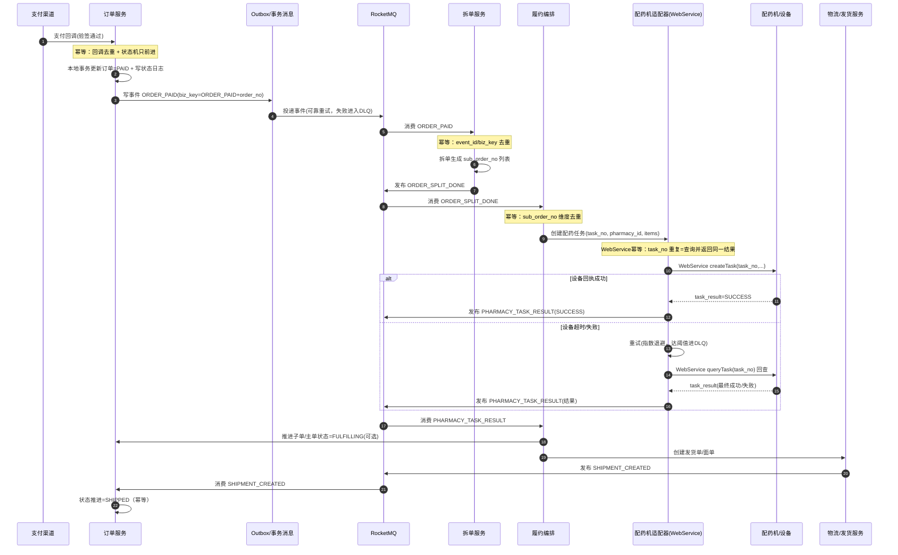

**异常与补偿闭环（DLQ → 告警 → 工单 → 人工兜底 → 状态修正）**

```mermaid
flowchart TD
    A[消费者/适配器处理事件] --> B{处理成功?}
    B -->|是| OK[写去重/推进状态/ACK] --> END[结束]

    B -->|否| R[记录失败原因 + 增加重试计数]
    R --> C{是否可重试?}
    C -->|是| D[指数退避重试<br/>10s/30s/60s/5min...] --> A
    C -->|否/超阈值| DLQ[进入DLQ(死信队列)]

    DLQ --> AL[触发告警(P1/P2)]
    AL --> T[生成工单/值班通知]
    T --> M{人工处置决策}

    M -->|换药房/换设备| REROUTE[重新路由 pharmacy_id<br/>生成新 task_no] --> REPUB[补发 PHARMACY_TASK_CREATE]
    M -->|改手工拣货| MANUAL[人工拣货/打包] --> REPUB2[补发 PHARMACY_TASK_RESULT=SUCCESS(人工确认)]
    M -->|取消履约| CANCEL[取消子单/关单] --> REPUB3[补发 PHARMACY_TASK_RESULT=FAIL + 触发退款/释放资源]

    REPUB --> MQ1[(MQ)] --> A
    REPUB2 --> MQ1 --> FIX[推进状态机(只前进) + 记录审计] --> END
    REPUB3 --> MQ1 --> FIX --> END
```

**告警与处置建议（最小可执行口径）**

| 告警项 | 触发条件（示例） | 等级 | 自动动作 | 人工SOP（最少一步） |
|---|---|---|---|---|
| 配药任务 DLQ 增长 | 5 分钟 DLQ 新增 > N | P1 | 自动扩容消费者（如有） | 选择：换药房/改手工/取消 |
| 配药回执超时 | `task_no` 超过 T 分钟无结果 | P1 | 自动 queryTask 回查 | 设备离线则改手工 |
| WebService 错误率飙升 | 5xx 比例 > X% 持续 3 分钟 | P1 | 熔断下发、限流入口 | 切换备用设备/药房 |
| 履约乱序/重复回执 | 同 `task_no` 多次回执且冲突 | P2 | 状态机校验只前进 | 人工核对设备日志 |

**工单字段模板（建议直接用于实施）**

| 字段 | 是否必填 | 说明 |
|---|---|---|
| `ticket_id` | 是 | 工单编号（可外部系统生成） |
| `scene` | 是 | 场景：配药失败/设备离线/回执超时/DLQ 等 |
| `order_no` | 是 | 主单号 |
| `sub_order_no` | 否 | 子单号（拆单后填写） |
| `task_no` | 否 | 配药任务号（WebService 幂等关键） |
| `pharmacy_id` | 否 | 当前药房/门店 |
| `device_id` | 否 | 配药机/设备编号 |
| `event_id` / `biz_key` | 否 | 触发该工单的事件定位信息 |
| `error_code` | 否 | 设备/适配器/业务错误码 |
| `error_message` | 否 | 错误描述（可脱敏） |
| `retry_count` | 否 | 已重试次数 |
| `first_occurred_at` | 是 | 首次发生时间 |
| `last_occurred_at` | 是 | 最近发生时间 |
| `decision` | 是 | 人工决策：换药房/换设备/改手工/取消履约 |
| `operator` | 是 | 操作人（账号/工号） |
| `operator_note` | 否 | 备注（原因、证据、电话沟通记录等） |
| `audit_trace_id` | 否 | 审计追踪ID（便于复盘） |

**人工兜底操作的审计口径（防止“人工一操作就不可追溯”）**

- 人工兜底必须产出一条“不可变审计记录”（可落库或入审计日志），至少包含：`order_no/sub_order_no/task_no/decision/operator/occurred_at/before_status/after_status`。  
- 人工补发 `PHARMACY_TASK_RESULT=SUCCESS` 时，必须标记 `result_source=MANUAL`（或等价字段），避免后续对账误判为设备自动成功。  
- 所有人工触发的“补发事件”必须带新的 `event_id`，但 `biz_key` 应保持与业务一致（便于幂等与追踪）。

**WebService 适配器接口契约（建议最小化并保持稳定）**

> 目标：把设备协议隔离在适配器内部，订单/履约只依赖稳定契约；并把幂等键 `task_no` 作为第一等公民。

- `createTask`（下发任务）

```json
{
  "task_no": "T202604070001",
  "pharmacy_id": "P001",
  "order_no": "O202604070001",
  "sub_order_no": "SO202604070001-01",
  "items": [
    { "drug_id": "D001", "sku_id": "SKU001", "qty": 2, "batch_no": "B20250301" }
  ],
  "callback_url": "https://xxx/callback/pharmacy",
  "occurred_at": "2026-04-07T10:00:00Z"
}
```

- `queryTask`（回查任务）

```json
{
  "task_no": "T202604070001",
  "pharmacy_id": "P001"
}
```

- `taskResult`（统一回执模型，回调/回查都转成同一结构）

```json
{
  "task_no": "T202604070001",
  "status": "SUCCESS",
  "error_code": null,
  "error_message": null,
  "finished_at": "2026-04-07T10:03:00Z"
}
```

##### 19.2.2.2 拆单与“按月分表（MyCat）”注意事项（落地提醒）

如果订单表采用 **按月分表**（例如 MyCat 以月份路由），建议明确以下规则，避免后期查询与对账困难：

- **路由键稳定**：主单号 `order_no` 建议包含可解析的时间片（或显式 `order_month` 字段），保证拆单、回调、对账能稳定定位分表。  
- **跨月查询策略**：运营/售后/对账类跨月查询，建议走汇总表/搜索索引/按时间窗口查询，避免全库全表扫。  
- **事件携带分片信息**：异步事件里建议携带 `order_month`（或可由 `order_no` 推导），减少消费者做二次解析与误路由风险。  
- **唯一性约束**：`order_no`、`sub_order_no` 必须全局唯一；幂等键（`idempotency_key`）也要全局唯一，避免分表后“每表唯一但全局不唯一”的坑。

#### 19.2.3 服务超时预算（建议值）

| 调用环节 | 超时阈值 | 重试策略 |
|---|---:|---|
| 网关 -> 订单服务 | 200ms | 不重试（避免重复提交） |
| 订单 -> 库存服务 | 80ms | 最多 1 次，指数退避 |
| 订单 -> 支付下单 | 150ms | 不重试，改走支付查询补偿 |
| 订单 -> 风控同步判定 | 60ms | 超时按“谨慎放行 + 异步复核” |

#### 19.2.4 常规下单的分布式事务边界（Seata 用在“可控并发”的小边界）

本章的“常规下单”允许选择 Seata，但要把边界画小、把长链路异步化：

- **适合放进 Seata 的部分（小边界）**：创建订单（`CREATED/待支付`） + 资源预留（库存/优惠券/额度等）。  
- **不适合放进 Seata 的部分（长链路）**：支付回调后的拆单、通知、积分、履约（例如 WebService 下发到药房配药机）、发货等，推荐 MQ 异步驱动。  
- **模式建议**：涉及“库存/券这类资源预留”优先用 **TCC**（Try 冻结/Confirm 实扣/Cancel 释放），比 AT 更贴合“预占-确认-释放”的业务语义。

> 与第 4 章保持一致：**秒杀/抢红包主链路不建议用 Seata 强绑定**，而是用 Redis 原子预扣 + MQ 削峰 + DB 落库 + 幂等补偿闭环。

---

### 19.3 订单域模型（生产可审计版）

#### 19.3.1 状态机扩展（建议）

`CREATED -> PAYING -> PAID -> FULFILLING -> SHIPPED -> COMPLETED`

取消支路：`CREATED/PAYING -> CANCELLED`

退款支路：`PAID/SHIPPED -> REFUNDING -> REFUNDED`

#### 19.3.2 关键表结构补充

**orders（新增关键字段）**
- `idempotency_key`：建单幂等键（唯一索引）
- `snapshot_version`：订单快照版本
- `risk_level`：风控等级（LOW/MID/HIGH）
- `source_channel`：来源渠道（APP/H5/PC/MINI）
- `closed_reason`：取消原因码（超时/用户取消/风控拦截）

**order_status_log（建议新增）**
- `order_no`
- `from_status`
- `to_status`
- `event_type`（PAY_SUCCESS/CANCEL_TIMEOUT/REFUND_SUCCESS）
- `operator`（system/user/job）
- `occurred_at`

> 用途：状态追溯、审计取证、问题复盘。

#### 19.3.3 DDL 参考（幂等 + 状态日志）

```sql
ALTER TABLE orders
  ADD COLUMN idempotency_key VARCHAR(64) NOT NULL COMMENT '幂等键',
  ADD COLUMN snapshot_version INT NOT NULL DEFAULT 1 COMMENT '快照版本',
  ADD COLUMN risk_level VARCHAR(16) DEFAULT 'LOW' COMMENT '风控等级',
  ADD COLUMN source_channel VARCHAR(16) DEFAULT 'APP' COMMENT '来源渠道',
  ADD COLUMN closed_reason VARCHAR(32) NULL COMMENT '关单原因码',
  ADD UNIQUE KEY uk_orders_idempotency_key (idempotency_key);

CREATE TABLE order_status_log (
  id BIGINT PRIMARY KEY AUTO_INCREMENT,
  order_no VARCHAR(32) NOT NULL,
  from_status VARCHAR(20) NOT NULL,
  to_status VARCHAR(20) NOT NULL,
  event_type VARCHAR(32) NOT NULL,
  operator VARCHAR(32) NOT NULL,
  trace_id VARCHAR(64) NULL,
  occurred_at TIMESTAMP NOT NULL DEFAULT CURRENT_TIMESTAMP,
  INDEX idx_order_no_time (order_no, occurred_at)
);
```

---

### 19.4 库存域（预占-确认-释放）标准流程

#### 19.4.1 三段式库存协议

- **Reserve（预占）**：下单成功后先占用库存（`reserved_stock +n`）
- **Confirm（确认）**：支付成功确认成交（`reserved_stock -n`，如启用 `sold_count` 则 `sold_count +n`）
- **Release（释放）**：超时取消/支付失败释放占用（`available_stock +n, reserved_stock -n`）

**字段语义与不变量（用于对账统一口径）**：

- `total_stock`：物理/可售总量上限（是否包含已售由业务定义，但必须全篇一致）。
- `available_stock`：当前可被预占的余量（Reserve 时减少）。
- `reserved_stock`：已被订单占用、等待支付/确认的量（Reserve 时增加，Confirm/Release 时减少）。
- `sold_count`：已确认成交的累计量（如启用则只在 Confirm 增加；退款是否回滚需单独定义）。

推荐默认不变量（同一 `sku_id + warehouse_id` 维度）：
\[
available\_stock \ge 0,\ reserved\_stock \ge 0,\ sold\_count \ge 0
\]
\[
available\_stock + reserved\_stock + sold\_count \le total\_stock
\]

#### 19.4.2 防超卖 SQL 模板（条件更新）

```sql
UPDATE inventory
SET available_stock = available_stock - #{qty},
    reserved_stock = reserved_stock + #{qty},
    version = version + 1
WHERE sku_id = #{skuId}
  AND warehouse_id = #{warehouseId}
  AND available_stock >= #{qty}
  AND version = #{version};
```

返回影响行数=0 时，统一按“库存不足或并发冲突”处理。

#### 19.4.3 库存对账作业（生产必配）

- 周期：每 5 分钟增量 + 每日全量
- 对账维度：`sku_id` / `warehouse_id` / `batch_no`（药房场景）
- 差异处理：
  1) 锁定异常 SKU
  2) 回放流水重算
  3) 自动修正 + 人工复核工单

---

### 19.5 支付域（回调可靠性）

#### 19.5.1 回调处理顺序

1. 验签（支付宝公钥）
2. 幂等检查（`out_trade_no + trade_status`）
3. 状态机校验（仅允许 `CREATED/PAYING -> PAID`）
4. 本地事务更新订单 + 写状态日志
5. 投递支付成功事件（Outbox/MQ）

**19.5.1.1 支付回调处理细化时序图（推荐）**

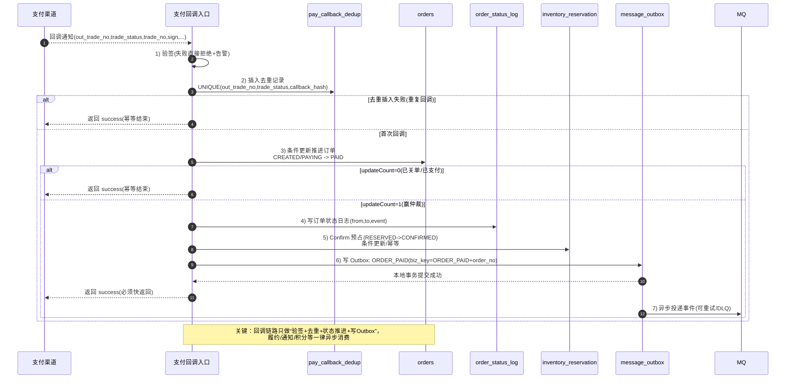

**与“超时关单”的并发仲裁规则（必须写清，否则一定出线上争议）**：

- **关单任务的触发**：以订单创建时间为起点的支付 TTL（例如 15 分钟），由延时任务/MQ 延时消息/定时扫描触发 `CANCELLED` 分支。
- **仲裁原则**：支付回调与关单可能并发到达，最终以**订单状态机**裁决，且只能前进不回退。
- **推荐实现（最小可用）**：更新订单状态时使用“条件更新”保证原子仲裁，例如：  
  - 支付成功：`UPDATE orders SET status='PAID' ... WHERE order_no=? AND status IN ('CREATED','PAYING')`  
  - 超时关单：`UPDATE orders SET status='CANCELLED', closed_reason='TIMEOUT' ... WHERE order_no=? AND status IN ('CREATED','PAYING')`
- **保证点**：无论谁赢，库存侧都必须最终收敛（PAID→Confirm，CANCELLED→Release），并通过对账任务兜底。

#### 19.5.2 防重复回调表（建议）

```sql
CREATE TABLE pay_callback_dedup (
  id BIGINT PRIMARY KEY AUTO_INCREMENT,
  out_trade_no VARCHAR(64) NOT NULL,
  trade_no VARCHAR(64) NOT NULL,
  trade_status VARCHAR(32) NOT NULL,
  callback_hash VARCHAR(128) NOT NULL,
  created_at TIMESTAMP DEFAULT CURRENT_TIMESTAMP,
  UNIQUE KEY uk_pay_callback (out_trade_no, trade_status, callback_hash)
);
```

---

### 19.6 可靠消息（Outbox 落地细节）

#### 19.6.1 投递状态机

`NEW -> SENDING -> SENT -> ACKED`

失败支路：`SENDING -> RETRYING -> DLQ`

**19.6.1.1 Outbox Worker：投递流程图（推荐）**

```mermaid
flowchart TD
    A[定时/常驻Worker扫描 message_outbox<br/>status=NEW/RETRYING] --> B{是否抢到互斥锁?<br/>按 message_id 或 分片}
    B -->|否| A
    B -->|是| C[条件更新: NEW/RETRYING -> SENDING<br/>updateCount=1 才继续]
    C --> D[发送到 MQ]
    D --> E{发送结果}
    E -->|成功| F[更新为 SENT/ACKED<br/>记录 sent_at/ack_at]
    E -->|失败(可重试)| G[更新为 RETRYING<br/>retry_count+1,next_retry_at]
    G --> H{retry_count > max?}
    H -->|否| A
    H -->|是| I[更新为 DLQ<br/>触发告警(P2/P1)]
    I --> J[人工工单/自动回放<br/>修复后可重置为 RETRYING]
```

**19.6.1.2 Outbox 关键字段建议（便于流程可落库、可追踪）**

> 若你已有 outbox 表结构，可对照补齐字段；目标是：能精确定位“哪条消息卡住了、重试了几次、下次什么时候重试、最后一次失败原因是什么”。

| 字段 | 用途 |
|---|---|
| `message_id` | 全局消息ID（唯一） |
| `event_type`、`biz_key` | 事件类型与业务幂等键（如 `ORDER_PAID+order_no`） |
| `payload` | 事件体（JSON） |
| `status` | `NEW/SENDING/SENT/ACKED/RETRYING/DLQ` |
| `retry_count`、`next_retry_at` | 重试计数与下次重试时间 |
| `last_error` | 最近一次失败原因（截断存储） |
| `created_at/sent_at/ack_at/updated_at` | 时序追踪与对账 |

**19.6.1.3 Outbox Worker 扫描/抢占/分片策略（推荐默认，避免重复扫与热点争抢）**

> 目标：让多 Worker 并发投递时“天然不打架”，并且不会出现“全量扫表导致 DB 抖动”。

**A. 只扫描“到期且可投递”的消息**

- `status IN ('NEW','RETRYING')`
- `next_retry_at IS NULL OR next_retry_at <= NOW()`
- 每次批量 `LIMIT N`（如 200～1000，按吞吐与 DB 压力调）

**B. 抢占方式（二选一，推荐用方式 1）**

- **方式 1（推荐，MySQL 8+）**：`SELECT ... FOR UPDATE SKIP LOCKED`  
  - 优点：天然分布式互斥；多个 Worker 各取各的，不会重复拿到同一行  
  - 代价：需要 InnoDB + MySQL 8
- **方式 2（通用）**：先“条件更新抢占”再查询  
  - `UPDATE ... SET status='SENDING' WHERE id IN (...) AND status IN ('NEW','RETRYING')`  
  - 通过 `updateCount` 判断谁抢到

**C. 分片（可选，但高吞吐推荐）**

- 增加 `shard_key`（如 `CRC32(biz_key) % 64`）或用 `id % 64` 作为分片维度
- 每个 Worker 绑定固定分片集合，扫描条件加 `AND shard_key IN (...)`

**D. SQL 模板（方式 1：SKIP LOCKED）**

```sql
-- 事务开始
SELECT id, message_id, biz_key, event_type, payload, retry_count
FROM message_outbox
WHERE status IN ('NEW','RETRYING')
  AND (next_retry_at IS NULL OR next_retry_at <= NOW())
ORDER BY id ASC
LIMIT 500
FOR UPDATE SKIP LOCKED;

-- 抢到的行批量置为 SENDING（可选：也可在发送前逐条更新）
UPDATE message_outbox
SET status = 'SENDING',
    updated_at = NOW()
WHERE id IN (...);
-- 事务提交
```

**E. 发送结果更新模板（必须幂等）**

```sql
-- 成功：SENDING -> SENT（可选再由消费者 ACK 回写为 ACKED）
UPDATE message_outbox
SET status = 'SENT',
    updated_at = NOW()
WHERE message_id = ?
  AND status = 'SENDING';

-- 失败：SENDING -> RETRYING（计算 next_retry_at）
UPDATE message_outbox
SET status = 'RETRYING',
    retry_count = retry_count + 1,
    next_retry_at = DATE_ADD(NOW(), INTERVAL 30 SECOND),
    last_error = ?,
    updated_at = NOW()
WHERE message_id = ?
  AND status = 'SENDING';
```

#### 19.6.2 重试策略（建议）

- 第 1~3 次：10s / 30s / 60s
- 第 4~8 次：5min 固定间隔
- 超过 8 次进入 DLQ，触发 P2 告警

#### 19.6.3 消费者幂等

- 表：`consumer_dedup(message_id, consumer_group)` 唯一索引
- 先写去重表，再执行业务，最后提交 offset/ack

**19.6.3.1 消费者幂等处理流程图（推荐，落地必看）**

```mermaid
flowchart TD
    A[收到 MQ 消息(message_id,biz_key,payload)] --> B[开启本地事务]
    B --> C[插入 consumer_dedup<br/>UNIQUE(message_id,consumer_group)]
    C --> D{插入成功?}
    D -->|否(重复消息)| E[幂等结束：直接 ACK/提交 offset]
    D -->|是(首次消费)| F[执行业务逻辑<br/>推进状态机/写DB/写日志]
    F --> G{业务执行成功?}
    G -->|是| H[提交本地事务]
    H --> I[ACK/提交 offset]
    G -->|否(可重试)| J[回滚事务]
    J --> K[不ACK，让 MQ 重试<br/>指数退避/最大次数]
    K --> L{是否超过重试上限?}
    L -->|否| A
    L -->|是| M[进入 DLQ]
    M --> N[告警 + 工单 + 人工兜底/回放]
```

> 关键约束：`consumer_dedup` 的写入与业务更新必须在同一事务里；否则会出现“去重已写但业务没生效”导致消息被永久吞掉。

#### 19.6.4 DLQ 工单闭环 SOP（建议直接当值班手册）

> 目标：DLQ 不可避免，关键是“进入 DLQ 后是否能稳定收敛”。这套 SOP 让事故从“人肉拍脑袋”变成“可重复执行的闭环”。

**A. 触发条件（建议默认）**

- Outbox 进入 `DLQ`（`retry_count > max`）
- 消费者进入 DLQ（达到重试上限）

**B. 自动化动作（必须）**

1) **告警**：5 分钟内触达（P1/P2 按业务影响）  
2) **生成工单**：携带最小定位信息：`message_id/biz_key/event_type/retry_count/last_error`  
3) **冻结风险扩散（可选）**：对高风险事件（如库存回补）可临时开启“只读/限流/人工审核”开关

**C. 人工处置步骤（SOP）**

1) **定位失败原因**：
   - 下游 MQ 不可用？网络问题？payload 超大？消费者 bug？唯一键冲突？
2) **确认是否可重试**（三类）：
   - **可重试**：下游恢复即可（MQ 抖动、网络抖动）
   - **需修复后重试**：代码 bug/数据不一致，需要先修复
   - **不可重试**：payload 错误或业务已不允许（需要人工标记为终止并留审计）
3) **执行动作（二选一）**：
   - **重置为 RETRYING**：使用你在 `L.3` 的脚本（必须写人工审计标记）
   - **补发事件**：使用 `O. 标准化补发事件脚本模板`（biz_key 唯一，保证可重复执行）
4) **验收**：
   - 对应业务状态收敛（订单/售后/库存逆向）
   - 对账 SQL（见 20.4.3）无异常行
5) **复盘与预防**：
   - 将根因固化为：监控阈值/限流/降级/修复代码/加索引/调整 payload

**D. 禁止项（必须写死）**

- 禁止直接手工修改库存数量但不写流水（会导致永远对不上账）。
- 禁止手工改订单状态但不写状态日志/不发事件（会造成下游永远不一致）。

#### 19.6.13 事故回放/补发闭环流程图（Outbox 版，建议值班墙上贴）

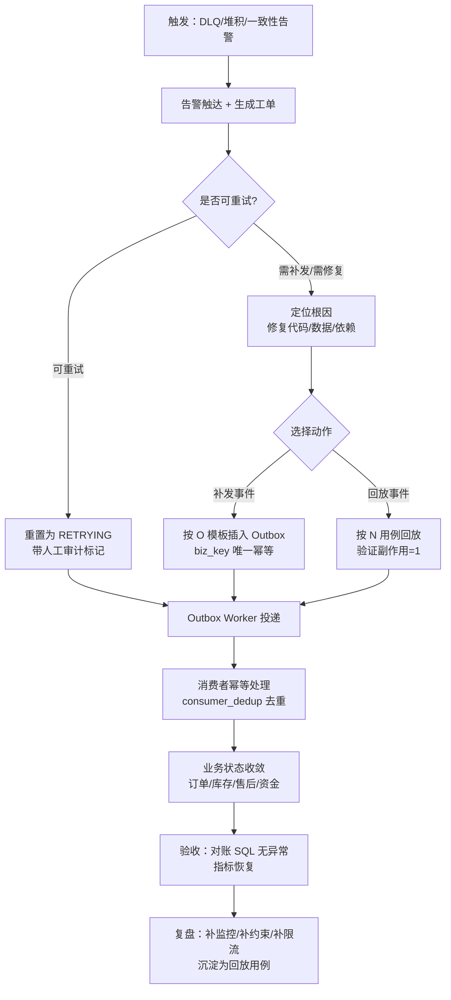

> 关键：补发/回放必须可重复执行（biz_key 唯一 + 消费去重 + 条件更新），否则值班会越修越乱。

#### 19.6.5 Outbox/消费幂等：监控指标与告警阈值模板（建议直接照抄）

> 目标：把“可靠消息”从“实现了就完事”变成“可观测、可预警、可回放”。下面指标建议全量打点上报，并和告警联动。

**A. Outbox 生产端（写入侧）**

| 指标 | 含义 | 建议维度 | 告警（示例） |
|---|---|---|---|
| `outbox_insert_total{event_type,result}` | 写 Outbox 成功/失败次数 | event_type、result | 失败率 > 0.1% 持续 5 分钟（P1） |
| `outbox_insert_lag_ms{p95}` | 业务事务提交到 Outbox 写入耗时 | event_type | p95 > 50ms 持续 5 分钟（P2） |

**B. Outbox Worker（投递侧）**

| 指标 | 含义 | 建议维度 | 告警（示例） |
|---|---|---|---|
| `outbox_pending_total{status}` | `NEW/RETRYING/DLQ` 条数 | status | `DLQ` > 0（P2）; `NEW+RETRYING` 持续增长 10 分钟（P1） |
| `outbox_send_total{result}` | 投递成功/失败次数 | result | 失败率 > 1% 持续 5 分钟（P1） |
| `outbox_send_lag_seconds{p95}` | `created_at -> SENT` 的延迟 | event_type | p95 > 60s 持续 5 分钟（P1） |
| `outbox_retry_count_max` | 最近窗口最大重试次数 | - | max >= 8（P2） |

**C. 消费者侧（业务处理）**

| 指标 | 含义 | 建议维度 | 告警（示例） |
|---|---|---|---|
| `consumer_dedup_hit_total{group}` | 去重命中次数 | group | 命中率异常飙升（提示重复投递/重试风暴，P2） |
| `consumer_process_total{group,result}` | 处理成功/失败次数 | group、result | 失败率 > 1% 持续 5 分钟（P1） |
| `consumer_process_duration_ms{p95,group}` | 处理耗时 | group | p95 > 200ms 持续 5 分钟（P2） |
| `consumer_dlq_total{group,topic}` | DLQ 增量 | group、topic | 5 分钟新增 > 阈值（P1/P2） |

**D. “跨域一致性”指标（强烈建议）**

> 用于发现“钱退了但库存没回补/订单已支付但库存没 Confirm”的幽灵单。

| 指标 | 含义 | 计算方式（示例） | 告警（示例） |
|---|---|---|---|
| `refund_success_without_inventory_restore_total` | 退款成功但逆向未完成 | `payment_refund.SUCCESS` 且 `inventory_refund` 非 `STOCK_RESTORED` | > 0 持续 10 分钟（P1） |
| `paid_without_confirm_total` | 已支付但预占未 Confirm | `orders.PAID` 且 `inventory_reservation` 非 `CONFIRMED` | > 0 持续 10 分钟（P1） |

#### 19.6.6 人工操作审计（强烈建议：修复/补发/重置必须留证）

> 原则：线上任何“手工修复脚本/补发事件/重置DLQ”都必须可追溯，否则复盘时无法回答“谁改的、为什么改、改了什么、影响多少单”。

**A. 最小审计字段（工单/记录必须包含）**

- `ticket_id`：工单号/审批号
- `operator`：操作者（账号/姓名）
- `action_type`：`RESET_DLQ/REPLAY_EVENT/PATCH_DATA/UNBLOCK_AFTER_SALE/...`
- `biz_key`：事件或业务定位（如 `ORDER_PAID+order_no` / `REFUND_SUCCESS+refund_no`）
- `scope`：影响范围（订单数、退款数、SKU 数）
- `reason`：原因说明（根因/现象/证据链接）
- `executed_sql`：执行的 SQL/脚本摘要（可脱敏）
- `occurred_at`：执行时间
- `verify_result`：验收结果（对账 SQL 结果、指标恢复截图等）

**B. 审计落库表（可选但推荐，避免只靠外部工单系统）**

```sql
CREATE TABLE IF NOT EXISTS ops_audit_log (
  id BIGINT PRIMARY KEY AUTO_INCREMENT,
  ticket_id VARCHAR(64) NOT NULL,
  operator VARCHAR(64) NOT NULL,
  action_type VARCHAR(32) NOT NULL,
  biz_key VARCHAR(128) NOT NULL,
  scope VARCHAR(128) NULL,
  reason VARCHAR(512) NULL,
  executed_sql TEXT NULL,
  verify_result VARCHAR(512) NULL,
  created_at TIMESTAMP DEFAULT CURRENT_TIMESTAMP,
  KEY idx_ticket (ticket_id),
  KEY idx_biz_key_time (biz_key, created_at)
);

#### 19.6.7 Outbox 事件 payload 最小字段标准（强烈建议统一，不然消费端会被二次查询拖垮）

> 原则：消费端想“幂等 + 可补偿 + 可对账”，消息体必须带齐定位与数量字段。缺字段会导致消费端必须二次查询（慢、易超时、易读到延迟数据），从而把“可靠消息”做成“更不可靠的链路”。

**A. 通用字段（所有事件都必须带）**

| 字段 | 必填 | 说明 |
|---|---:|---|
| `event_id` | 是 | 全局事件ID（可直接复用 outbox.message_id） |
| `event_type` | 是 | 事件类型（与 Outbox `event_type` 一致） |
| `biz_key` | 是 | 幂等业务键（与 Outbox `biz_key` 一致） |
| `occurred_at` | 是 | 事件发生时间（不是投递时间） |
| `trace_id` | 否（推荐） | 链路追踪 |

**B. 订单类事件**

`ORDER_PAID` 最小字段：

| 字段 | 必填 | 说明 |
|---|---:|---|
| `order_no` | 是 | 订单号 |
| `user_id` | 否（推荐） | 排障/风控 |
| `paid_at` | 是 | 支付成功时间 |

`ORDER_CANCELLED` 最小字段：

| 字段 | 必填 | 说明 |
|---|---:|---|
| `order_no` | 是 | 订单号 |
| `cancel_reason` | 是 | 关单原因 |
| `closed_at` | 是 | 关单时间 |

**C. 退款/逆向类事件（强烈建议一次性带齐，避免库存服务查库）**

`REFUND_SUCCESS` 最小字段：

| 字段 | 必填 | 说明 |
|---|---:|---|
| `refund_no` | 是 | 退款单号（全局唯一） |
| `after_sale_no` | 否（推荐） | 关联售后 |
| `order_no` | 是 | 订单号 |
| `order_item_id` | 否（推荐） | 明细维度（部分退款必需） |
| `sku_id` | 是 | SKU |
| `warehouse_id` | 是 | 仓 |
| `qty` | 是 | 逆向数量 |
| `refund_amount` | 否（推荐） | 金额（排障/对账） |
| `refund_success_at` | 是 | 退款成功时间 |

`RETURN_INBOUND_ACCEPTED` 最小字段：

| 字段 | 必填 | 说明 |
|---|---:|---|
| `refund_no` | 是 | 退款/售后号 |
| `order_no` | 是 | 订单号 |
| `sku_id` | 是 | SKU |
| `warehouse_id` | 是 | 仓 |
| `qty` | 是 | 入库验收数量 |
| `received_at` | 是 | 入库验收时间 |

`RETURN_QA_PASSED` 最小字段：

| 字段 | 必填 | 说明 |
|---|---:|---|
| `refund_no` | 是 | 退款/售后号 |
| `sku_id` | 是 | SKU |
| `warehouse_id` | 是 | 仓 |
| `qty` | 是 | 质检通过数量 |
| `qa_passed_at` | 是 | 质检通过时间 |

`SHIPMENT_CREATED` 最小字段（履约/发货，与 19.6.17 模板一致）：

| 字段 | 必填 | 说明 |
|---|---:|---|
| `order_no` | 是 | 主单号 |
| `sub_order_no` | 否（推荐） | 子单号；无拆单可与主单相同或省略 |
| `package_no` | 否（推荐） | 包裹号；一单多包裹时建议必填 |
| `logistics_no` | 是 | 运单号 |
| `shipped_at` | 是 | 发货时间 |

`CHANNEL_PAYMENT_NOTIFY` 最小字段（渠道回调摘要，**不替代** `ORDER_PAID`）：

| 字段 | 必填 | 说明 |
|---|---:|---|
| `channel` | 是 | 渠道标识（如 `WECHAT_PAY`） |
| `out_trade_no` | 是 | 商户侧支付单号/商户订单号（与内部对账键一致） |
| `channel_trade_no` | 否（推荐） | 渠道交易号 |
| `amount_minor` | 是 | 金额（**整数分**，与团队金额口径统一） |
| `currency` | 是 | 币种 |
| `notify_received_at` | 是 | 验签完成、可落库时间 |
| `sign_verified` | 是 | 是否已通过验签 |

`ORDER_SPLIT_DONE` 最小字段（拆单完成，与 19.6.18 模板一致）：

| 字段 | 必填 | 说明 |
|---|---:|---|
| `order_no` | 是 | 主单号 |
| `split_version` | 否（重拆场景必填） | 拆单版本；不重拆可固定为 1 |
| `sub_orders` | 是 | 子单数组（至少含 `sub_order_no`、路由所需 `warehouse_id` 或门店/承运键） |

`WMS_OUTBOUND_CREATED` 最小字段（WMS 出库单已落单）：

| 字段 | 必填 | 说明 |
|---|---:|---|
| `outbound_no` | 是 | 内部出库单号（全局唯一，常用作消费幂等键） |
| `wms_order_no` | 否（推荐） | WMS 侧单号，对账/工单用 |
| `order_no` | 是 | 主单号 |
| `sub_order_no` | 否（推荐） | 子单号 |
| `warehouse_id` | 是 | 仓 |
| `created_at` | 是 | 出库单创建时间 |

`PHARMACY_TASK_CREATE` 最小字段（创建配药任务，与 19.6.19 模板一致）：

| 字段 | 必填 | 说明 |
|---|---:|---|
| `task_no` | 是 | 全局唯一任务号；适配器对设备下发幂等键（重复下发=查询同一任务） |
| `order_no` | 是 | 主单号 |
| `sub_order_no` | 是 | 子单号 |
| `pharmacy_id` | 是 | 药房/门店/设备路由键 |
| `items` | 是 | 明细数组（至少 `sku_id` + `qty`；药房可加 `batch_hint` 等内部字段） |
| `created_at` | 是 | 任务创建时间 |

`PHARMACY_TASK_RESULT` 最小字段（设备回执或查询补偿，与 19.6.19 模板一致）：

| 字段 | 必填 | 说明 |
|---|---:|---|
| `task_no` | 是 | 与创建任务一致 |
| `result` | 是 | `SUCCESS` / `FAIL` / `PARTIAL`（按业务枚举写死） |
| `result_source` | 是 | `DEVICE`（设备回执）/ `MANUAL`（人工补发）/ `QUERY`（补偿查询）等，**人工成功必须可区分** |
| `order_no` | 否（推荐） | 排障 |
| `sub_order_no` | 否（推荐） | 排障 |
| `pharmacy_id` | 否（推荐） | 排障 |
| `completed_at` 或 `failed_at` | 二选一必填 | 成功/失败时间 |
| `fail_reason` | 否 | `FAIL` 时建议带 |

> **Outbox 行 `biz_key`（非 `data` 内字段）**：`PHARMACY_TASK_RESULT` 须按 **19.6.19** 在**方案 A**（仅 `+task_no`）与**方案 B**（`+task_no+RESULT`）中**二选一并全团队统一**；禁止两套混用。

**D. payload 结构建议（JSON）**

- 顶层统一：`{event_id,event_type,biz_key,schema_version,occurred_at,trace_id,data:{...}}`（与 19.6.12 行字段一致）
- `data` 内按事件类型填充上述最小字段

#### 19.6.8 Outbox payload 体积控制与脱敏规则（必须写死，否则会拖垮 MQ/泄露敏感数据）

> 目标：消息体要“够用但不臃肿”。过大的 payload 会导致 MQ 延迟上升、重试成本飙升、DLQ 处理困难；敏感字段入 payload 会造成合规风险（日志/重放/外部订阅都可能泄露）。

**A. 体积控制规则（建议默认）**

- **单条 payload 建议上限**：\< 8KB（绝大多数业务足够）；超过 32KB 必须评审（通常需要改为“只传 ID + 下游查库/查缓存”或拆事件）。
- **禁止把大对象放进事件**：
  - 商品快照大 JSON、地址全量、图片 URL 列表、长文本备注、完整回调原文
- **推荐做法**：payload 只带“定位与数量”，大字段在各域数据库/对象存储中留存，由客服/审计系统按需查询。

**B. 敏感字段脱敏/禁止清单（必须）**

- **绝对禁止进入 payload（以及日志）**：
  - 用户手机号全量、身份证/证件号、银行卡号、支付私钥/签名原文、完整收货地址明细
- **允许进入 payload 的替代字段**（推荐）：
  - `user_id`（替代手机号）
  - `address_id`（替代地址详情）
  - `masked_phone`（如确实需要展示，可用脱敏值）

**C. 回调原文的留存建议（可选但推荐）**

> 若你需要审计支付/退款回调原文：不要塞进 Outbox payload。建议单独存储：

- 表 `pay_callback_raw` / `refund_callback_raw`：按 `out_trade_no/refund_no` 索引，字段 `raw_body`（可压缩）+ `sign_verified` + `received_at`
- 或存对象存储（OSS/S3）并在表中存 `raw_ref` 引用

#### 19.6.9 事件版本（schema_version）与向前兼容（必须写死，否则一升级就全链路崩）

> 目标：事件字段总会演进（加字段、改字段名、扩枚举）。没有版本策略就会出现：生产者升级后，老消费者解析失败 → 重试风暴 → DLQ 雪崩。

**A. payload 顶层增加版本字段（强烈建议）**

- `schema_version`：整数递增（如 1/2/3）
- 版本变化规则：
  - **只加字段**：小版本兼容（老消费者忽略未知字段）
  - **改字段含义/删除字段/改枚举语义**：必须升大版本，并保证消费者同时兼容旧版本一段时间

推荐结构：

```json
{
  "event_id": "E...",
  "event_type": "REFUND_SUCCESS",
  "biz_key": "REFUND_SUCCESS+R2026...",
  "schema_version": 1,
  "occurred_at": "2026-04-08T10:00:00.000Z",
  "trace_id": "t-xxx",
  "data": {
    "refund_no": "R...",
    "order_no": "O...",
    "sku_id": 20001,
    "warehouse_id": 0,
    "qty": 1,
    "refund_success_at": "2026-04-08T10:00:00.000Z"
  }
}
```

**B. 兼容策略（建议默认）**

- **消费者解析策略**：未知字段忽略；已知字段缺失给默认值或走降级分支（并打点/告警）
- **灰度发布**：先升级消费者（兼容新旧版本）→ 再升级生产者发新版本事件
- **回放策略**：补发/重放时必须带原 `schema_version`，避免用“最新结构”重放历史事件导致老消费者异常

#### 19.6.10 payload 压缩/加密（可选策略：只在确实需要时启用）

> 目标：当 payload 字段较多（但又无法只传 ID）时，压缩可以降低 MQ 带宽与延迟；加密用于跨团队/跨系统订阅时降低泄露风险。默认不启用，避免复杂度失控。

**A. 压缩（推荐：gzip/zstd 二选一）**

- **启用条件**：payload 经评审仍 > 8KB，且事件吞吐较高（否则收益不明显）。
- **落地方式**：
  - `payload` 存压缩后的 base64 字符串
  - 增加字段/头：`payload_encoding='json'/'gzip+base64'/'zstd+base64'`
- **注意**：压缩后也要遵守脱敏规则（不要压缩敏感数据来“掩耳盗铃”）。

**B. 加密（可选，谨慎启用）**

- **适用场景**：事件可能被非核心系统订阅；或事件会落日志/外部审计平台。
- **推荐做法**：KMS 管理密钥，使用 envelope encryption（数据密钥加密 payload）。
- **关键要求**：密钥轮换策略必须写死；消费者解密失败要能降级处理（进入 DLQ + 告警）。

#### 19.6.11 消费者兼容解析伪代码模板（按版本解析，避免升级崩链路）

> 目标：把“兼容策略”落到代码形态，让团队复制粘贴就能实现。核心：未知字段忽略、缺字段给默认值、版本不支持走 DLQ（但要可定位）。

```pseudo
function handleMessage(msg):
    # 1) 基础校验
    assert msg.event_type != null
    assert msg.biz_key != null
    v = msg.schema_version ?? 1

    # 1.1) 按编码解码 payload（可选：如果 msg.payload 已经是结构化对象则跳过）
    enc = msg.payload_encoding ?? 'json'
    if enc == 'json':
        rawJson = msg.payload
    else if enc == 'gzip+base64':
        rawJson = gunzip(base64decode(msg.payload))
    else if enc == 'zstd+base64':
        rawJson = zstdDecompress(base64decode(msg.payload))
    else:
        emitMetric("consumer_unknown_payload_encoding_total", tags={enc: enc})
        throw NonRetryableError("unknown payload_encoding")

    obj = jsonParse(rawJson)

    # 2) 按版本解析（只加字段的版本通常可复用同一解析器）
    if v == 1:
        data = parseV1(obj.data)
    else if v == 2:
        data = parseV2(obj.data)  # 兼容 V1：缺字段给默认值
    else:
        # 版本未知：不要硬处理，避免写坏状态；进 DLQ 并告警
        emitMetric("consumer_unknown_schema_version_total", tags={event_type: obj.event_type, version: v})
        throw NonRetryableError("unknown schema_version")

    # 3) 业务幂等（先写 consumer_dedup，再执行业务）
    beginTransaction()
        if !insertConsumerDedup(msg.event_id, consumer_group):
            commitTransaction()
            ack()
            return

        applyBusiness(data)  # 条件更新 + 幂等键 + 终态保护
    commitTransaction()
    ack()
```

#### 19.6.12 生产者写 Outbox 的强制字段与规范（必须写死，避免“写了事件但不好回放/不好对账”）

> 目标：让事件“可回放、可追溯、可对账”。这节是给“写 Outbox 的人”看的：写哪些字段、怎么写、哪些坑不能踩。

**A. message_outbox 行必须包含的最小字段**

- `message_id`：全局唯一（建议 `Eyyyymmdd-xxxxxx` 或 UUID），并作为 payload 的 `event_id`
- `biz_key`：业务幂等键（唯一），必须能表达“一次业务只一次事件”（如 `ORDER_PAID+order_no`）
- `event_type`：与 payload 顶层 `event_type` 一致
- `schema_version`：必须写（默认 1），用于消费者兼容解析
- `payload_encoding`：必须写（默认 `json`），用于消费者解码（见 19.6.10）
- `occurred_at`：强烈建议写（业务发生时间），用于统计投递延迟/对账
- `payload`：必须是“标准结构”（见 19.6.7），至少带 `event_id/event_type/biz_key/schema_version/occurred_at/data`
- `created_at/updated_at`：DB 自动维护

**B. occurred_at 口径（避免时间线对不上）**

- `occurred_at` = **业务事件发生时间**（如支付确认成功时间 `paid_at`，退款成功时间 `refund_success_at`），而不是“Outbox 入库时间”。
- 当你只拿到了“入库时间”而拿不到业务发生时间：允许先用入库时间兜底，但必须在 payload 中标注 `occurred_at_source='fallback'`（可选字段）并打点告警。

**C. payload_encoding 落地规则（建议默认）**

- 默认：`payload_encoding='json'`，payload 为明文 JSON（仍需脱敏与体积控制）。
- 启用压缩时：
  - `payload_encoding='gzip+base64'` 或 `zstd+base64`
  - payload 存“压缩后二进制”的 base64 字符串
  - 消费者必须先解码再解析 JSON；解码失败必须进 DLQ + 告警（不可无限重试）

**D. payload 与行字段必须一致（强约束）**

- `payload.event_id == message_outbox.message_id`
- `payload.event_type == message_outbox.event_type`
- `payload.biz_key == message_outbox.biz_key`
- `payload.schema_version == message_outbox.schema_version`
- **`occurred_at` 一致**：若行上 `message_outbox.occurred_at` 已写入，则必须与 `payload.occurred_at` **同一时刻**（建议统一 **UTC 毫秒 ISO8601** 字符串，如 `2026-04-08T10:30:00.123Z`）；若行上为 `NULL`（历史数据或过渡期），则 `payload.occurred_at` 仍建议必填，便于消费者不依赖行字段也能对账。
- **兜底口径**：若业务侧只能拿到入库时间，行与 payload 可同为该兜底时间，并在 `payload.data`（或扩展头）中带 `occurred_at_source='fallback'`（见 19.6.12 B），避免被误判为“造假时间线”。

> 好处：回放脚本/审计系统可以不解析 payload，也能用行字段做索引与去重；解析 payload 后还能二次校验一致性。

**E. 禁止项（必须写死）**

- 禁止用“随机 message_id”当幂等：必须靠 `biz_key` 唯一。
- 禁止 payload 放敏感数据（见 19.6.8）。
- 禁止 payload 放大对象（商品快照/地址全量/图片列表等），除非经过评审并启用压缩策略（见 19.6.10）。

#### 19.6.14 `occurred_at` 行与 payload 一致性（应用层必做 + 可选库内校验）

> 目标：避免“行上投递延迟统计用的时间”和“payload 里业务时间”各写各的，回放/对账时出现双时间线。

**A. 应用层（推荐默认，成本最低）**

- 组装 `payload` JSON 与 `message_outbox` 行**同一方法内**赋值：先确定 `occurred_at` 变量，再同时写入 `payload.occurred_at` 与行字段 `occurred_at`。
- 单元测试：构造最小 Outbox 行，断言 `JSON_EXTRACT(payload,'$.occurred_at')` 与列 `occurred_at` 在统一时区下表示同一时刻。

**B. 发布前校验 SQL（离线/门禁可跑）**

```sql
-- 抽样或对账任务：找出“行与 payload 时间不一致”的脏数据（MySQL 8+ JSON 函数示例）
SELECT
  message_id,
  occurred_at AS row_occurred_at,
  JSON_UNQUOTE(JSON_EXTRACT(payload, '$.occurred_at')) AS payload_occurred_at
FROM message_outbox
WHERE status IN ('PENDING', 'SENT')  -- 按你们状态枚举调整
  AND occurred_at IS NOT NULL
  AND (
    JSON_EXTRACT(payload, '$.occurred_at') IS NULL
    OR JSON_UNQUOTE(JSON_EXTRACT(payload, '$.occurred_at')) <>
       DATE_FORMAT(CONVERT_TZ(occurred_at, @@session.time_zone, '+00:00'), '%Y-%m-%dT%H:%i:%s.%fZ')
    -- 若列存 UTC 而 payload 固定 Z 后缀，需统一一种比较方式；更简单做法：应用层约定只存 ISO 字符串并在入库前比较字符串相等
  )
LIMIT 200;
```

> 实践建议：若 DB 侧字符串比较易踩时区坑，**以应用层字符串相等为准**（写入前 `payload.occurred_at` 与 `toIso8601(row.occurred_at)` 同一变量）；上例 SQL 仅作巡检近似，不等于唯一真理。

**C. 可选：生成列 + CHECK（仅当全链路统一存 UTC 且格式固定时）**

- 增加 STORED 生成列 `payload_occurred_at`（从 `payload` 抽取），再 `CHECK (occurred_at IS NULL OR payload_occurred_at = occurred_at)` 的变体；不同数据库对 `TIMESTAMP` 与 JSON 字符串互转支持差异大，**上线前必须在预发用真实数据验证**，避免 CHECK 误杀正常写入。

#### 19.6.15 标准 JSON payload 完整模板（可复制，与 19.6.7/19.6.12 对齐）

> 说明：`event_id` 建议等于 `message_outbox.message_id`；`biz_key` 建议 `事件类型 + 主业务号`；`schema_version` 与行上一致；`payload_encoding='json'` 时整段为明文 JSON 字符串入库。

**1）`ORDER_PAID`（支付成功、订单已 PAID 后发布）**

```json
{
  "event_id": "E20260408103000123",
  "event_type": "ORDER_PAID",
  "biz_key": "ORDER_PAID+ORD2026040800001",
  "schema_version": 1,
  "occurred_at": "2026-04-08T10:30:00.123Z",
  "trace_id": "1-abcdef-1234567890",
  "data": {
    "order_no": "ORD2026040800001",
    "user_id": "U10086001",
    "paid_at": "2026-04-08T10:30:00.123Z"
  }
}
```

**2）`REFUND_SUCCESS`（退款成功，库存/售后订阅；多明细部分退款可扩展 `lines`）**

```json
{
  "event_id": "E20260408104500999",
  "event_type": "REFUND_SUCCESS",
  "biz_key": "REFUND_SUCCESS+RF2026040800007",
  "schema_version": 1,
  "occurred_at": "2026-04-08T10:45:00.999Z",
  "trace_id": "1-abcdef-9988776655",
  "data": {
    "refund_no": "RF2026040800007",
    "after_sale_no": "AS2026040800003",
    "order_no": "ORD2026040800001",
    "order_item_id": 90001234,
    "sku_id": "SKU-RED-001",
    "warehouse_id": "WH-SH-01",
    "qty": 1,
    "refund_amount": "99.00",
    "refund_success_at": "2026-04-08T10:45:00.999Z"
  }
}
```

**3）`ORDER_CANCELLED`（关单/超时取消等，字段见 19.6.7）**

```json
{
  "event_id": "E20260408110000200",
  "event_type": "ORDER_CANCELLED",
  "biz_key": "ORDER_CANCELLED+ORD2026040800001",
  "schema_version": 1,
  "occurred_at": "2026-04-08T11:00:02.000Z",
  "trace_id": "1-abcdef-1122334455",
  "data": {
    "order_no": "ORD2026040800001",
    "cancel_reason": "USER_CANCEL",
    "closed_at": "2026-04-08T11:00:02.000Z"
  }
}
```

**4）`RETURN_INBOUND_ACCEPTED`（退货入库验收）**

```json
{
  "event_id": "E20260408120000300",
  "event_type": "RETURN_INBOUND_ACCEPTED",
  "biz_key": "RETURN_INBOUND_ACCEPTED+AS2026040800003+SKU-RED-001",
  "schema_version": 1,
  "occurred_at": "2026-04-08T12:00:03.000Z",
  "trace_id": "1-abcdef-5544332211",
  "data": {
    "refund_no": "RF2026040800007",
    "order_no": "ORD2026040800001",
    "sku_id": "SKU-RED-001",
    "warehouse_id": "WH-SH-01",
    "qty": 1,
    "received_at": "2026-04-08T12:00:03.000Z"
  }
}
```

**5）`RETURN_QA_PASSED`（退货质检通过）**

```json
{
  "event_id": "E20260408131500400",
  "event_type": "RETURN_QA_PASSED",
  "biz_key": "RETURN_QA_PASSED+AS2026040800003+SKU-RED-001",
  "schema_version": 1,
  "occurred_at": "2026-04-08T13:15:04.000Z",
  "trace_id": "1-abcdef-6677889900",
  "data": {
    "refund_no": "RF2026040800007",
    "sku_id": "SKU-RED-001",
    "warehouse_id": "WH-SH-01",
    "qty": 1,
    "qa_passed_at": "2026-04-08T13:15:04.000Z"
  }
}
```

**6）字段对齐检查清单（复制 payload 后自检）**

- [ ] 顶层含 `event_id/event_type/biz_key/schema_version/occurred_at`，且与 `message_outbox` 同行字段一致  
- [ ] `data` 内含该事件类型在 19.6.7 中列出的最小字段  
- [ ] 金额类为字符串或整数分（团队统一一种），不要在同一事件混用  
- [ ] 时间字段与 `occurred_at` 语义一致（业务发生时间，非 Outbox 插入时间）

#### 19.6.16 同一本地事务：业务写库 + 组装 payload + 写入 `message_outbox`（伪代码）

> 目标：把「先算 `occurred_at` → 再写 JSON → 再写行字段」钉死在一个函数里，避免 19.6.14 说的双时间线。下列为语言无关伪代码，可按团队栈换成 Java/Kotlin/Go。

```pseudo
function onPaySuccess(orderNo, paidAt, traceId, channelMeta):
    beginTransaction()

    rows = exec("""
      UPDATE orders SET status='PAID', paid_at=?, version=version+1
      WHERE order_no=? AND status IN ('CREATED','PAYING')
    """, paidAt, orderNo)

    if rows == 0:
        commitTransaction()
        return IDEMPOTENT_OK   // 可能重复回调：不重复写 Outbox

    messageId = newGlobalId("E")              // 与 payload.event_id 相同
    occurredAt = toIso8601Utc(paidAt)         // 与 message_outbox.occurred_at 同一时刻
    bizKey = "ORDER_PAID+" + orderNo

    payloadObj = {
      event_id: messageId,
      event_type: "ORDER_PAID",
      biz_key: bizKey,
      schema_version: 1,
      occurred_at: occurredAt,
      trace_id: traceId,
      data: { order_no: orderNo, user_id: loadUserId(orderNo), paid_at: occurredAt }
    }
    payloadJson = jsonStringify(payloadObj)   // 脱敏、体积校验在 stringify 前完成（见 19.6.8）

    exec("""
      INSERT INTO message_outbox(
        message_id, biz_key, event_type, schema_version, payload_encoding,
        occurred_at, payload, status, retry_count, created_at, updated_at
      ) VALUES (?,?,?,?, 'json', ?, ?, 'NEW', 0, NOW(3), NOW(3))
    """, messageId, bizKey, "ORDER_PAID", 1, paidAt, payloadJson)

    commitTransaction()
    return OK
```

**必须写死的分支**

- **条件更新 0 行**：只提交事务，**禁止**再插 Outbox（否则重复发 `ORDER_PAID`）。
- **Outbox 插入失败**：整事务回滚，回调接口可返回失败让渠道重试（依赖支付回调幂等）。
- **同一事务内**不要先插 Outbox 再改订单（否则订单失败会留下孤儿 Outbox；除非你们接受补偿删除，成本更高）。

#### 19.6.17 补充事件 JSON 模板（履约发货、渠道支付回调摘要）

> 与前面「订单/退款/逆向」并列：履约与支付网关域也常发 Outbox。命名与文档前文「交易事件清单」中的 **`SHIPMENT_CREATED`** 对齐；渠道回调若需广播，务必**脱敏**，禁止塞签名原文/用户隐私。

**7）`SHIPMENT_CREATED`（发货/出库成功，子单或包裹维度）**

最小 `data` 建议带齐：子单号、主单号、物流单号、发货时间；多包裹可用 `lines` 或按包裹拆多条事件（二选一做规范）。

```json
{
  "event_id": "E20260408140000500",
  "event_type": "SHIPMENT_CREATED",
  "biz_key": "SHIPMENT_CREATED+SUB2026040800001+PKG00001",
  "schema_version": 1,
  "occurred_at": "2026-04-08T14:00:05.000Z",
  "trace_id": "1-abcdef-7788990011",
  "data": {
    "order_no": "ORD2026040800001",
    "sub_order_no": "SUB2026040800001",
    "package_no": "PKG00001",
    "logistics_company": "SF",
    "logistics_no": "SF1234567890",
    "shipped_at": "2026-04-08T14:00:05.000Z",
    "sku_lines": [
      { "order_item_id": 90001234, "sku_id": "SKU-RED-001", "qty": 1 }
    ]
  }
}
```

**8）`CHANNEL_PAYMENT_NOTIFY`（支付渠道回调验签通过后、域内审计/下游可观测；不替代 `ORDER_PAID`）**

> 典型用途：风控、对账、清结算、多渠道统一日志。若**订单已在本事务内发 `ORDER_PAID`**，本事件是否还需要取决于产品：多数团队**只发 `ORDER_PAID`** 即可；本模板适用于「支付中台」单独向**非订单订阅方**广播，或用于与渠道通知时间对齐的旁路统计。

```json
{
  "event_id": "E20260408103000600",
  "event_type": "CHANNEL_PAYMENT_NOTIFY",
  "biz_key": "CHANNEL_PAYMENT_NOTIFY+CH_WECHAT+4200001234567890",
  "schema_version": 1,
  "occurred_at": "2026-04-08T10:30:00.500Z",
  "trace_id": "1-abcdef-2233445566",
  "data": {
    "channel": "WECHAT_PAY",
    "out_trade_no": "PAY2026040800001",
    "channel_trade_no": "4200001234567890",
    "amount_minor": 9900,
    "currency": "CNY",
    "notify_received_at": "2026-04-08T10:30:00.500Z",
    "sign_verified": true
  }
}
```

**约定**

- **禁止**在 payload 中放渠道回调**原始 body**、客户端 `openid`、银行卡号等；必要时只放**哈希**与内部单号。
- **`biz_key` 必须唯一**：建议 `事件类型 + 渠道 + 渠道侧交易号/商户单号`，避免与 `ORDER_PAID+order_no` 混淆。
- 若与 `ORDER_PAID` 同事务写入两条 Outbox：两条的 `occurred_at` 仍应来自**同一业务时间变量**，避免统计口径漂移。

#### 19.6.18 履约与仓储事件 JSON 模板（拆单完成、WMS 出库单）

> 与 **19.2.2.1 支付后履约异步链路**中的事件名对齐：拆单 **`ORDER_SPLIT_DONE`**；仓储 **`WMS_OUTBOUND_CREATED`** 表示 WMS 出库单已落单可拣货。

**9）`ORDER_SPLIT_DONE`**

- **`biz_key`**：`ORDER_SPLIT_DONE+order_no`；若允许重拆，须带 `split_version` 并纳入 `biz_key`（如 `ORDER_SPLIT_DONE+order_no+v2`）。

```json
{
  "event_id": "E20260408140500700",
  "event_type": "ORDER_SPLIT_DONE",
  "biz_key": "ORDER_SPLIT_DONE+ORD2026040800001",
  "schema_version": 1,
  "occurred_at": "2026-04-08T14:05:07.000Z",
  "trace_id": "1-abcdef-3344556677",
  "data": {
    "order_no": "ORD2026040800001",
    "split_version": 1,
    "sub_orders": [
      {
        "sub_order_no": "SUB2026040800001",
        "warehouse_id": "WH-SH-01",
        "fulfillment_owner": "MERCHANT_A",
        "lines": [
          { "order_item_id": 90001234, "sku_id": "SKU-RED-001", "qty": 1 }
        ]
      }
    ]
  }
}
```

**10）`WMS_OUTBOUND_CREATED`**

- **`biz_key`**：`WMS_OUTBOUND_CREATED+outbound_no`（出库单号全局唯一）。

```json
{
  "event_id": "E20260408142000800",
  "event_type": "WMS_OUTBOUND_CREATED",
  "biz_key": "WMS_OUTBOUND_CREATED+OB2026040800099",
  "schema_version": 1,
  "occurred_at": "2026-04-08T14:20:08.000Z",
  "trace_id": "1-abcdef-9900112233",
  "data": {
    "outbound_no": "OB2026040800099",
    "wms_order_no": "WMS-SH-778899",
    "order_no": "ORD2026040800001",
    "sub_order_no": "SUB2026040800001",
    "warehouse_id": "WH-SH-01",
    "created_at": "2026-04-08T14:20:08.000Z"
  }
}
```

#### 19.6.19 药房配药链路事件 JSON 模板（`PHARMACY_TASK_CREATE` / `PHARMACY_TASK_RESULT`）

> 与 **19.2.2.1** 及 **配药机适配器**约定一致：`task_no` 全局唯一；**人工补发成功**必须带 `result_source=MANUAL`（或等价字段），避免对账误判为设备自动成功（同前文运维说明）。

**11）`PHARMACY_TASK_CREATE`（履约编排 → 适配器 → 设备）**

```json
{
  "event_id": "E20260408143000900",
  "event_type": "PHARMACY_TASK_CREATE",
  "biz_key": "PHARMACY_TASK_CREATE+TASK2026040800888",
  "schema_version": 1,
  "occurred_at": "2026-04-08T14:30:09.000Z",
  "trace_id": "1-abcdef-4455667788",
  "data": {
    "task_no": "TASK2026040800888",
    "order_no": "ORD2026040800001",
    "sub_order_no": "SUB2026040800001",
    "pharmacy_id": "PHX-SH-01",
    "items": [
      { "order_item_id": 90001234, "sku_id": "SKU-MED-001", "qty": 2 }
    ],
    "created_at": "2026-04-08T14:30:09.000Z"
  }
}
```

**12）`PHARMACY_TASK_RESULT`（设备回执 / 查询补偿 / 人工补发）**

```json
{
  "event_id": "E20260408143501000",
  "event_type": "PHARMACY_TASK_RESULT",
  "biz_key": "PHARMACY_TASK_RESULT+TASK2026040800888+SUCCESS",
  "schema_version": 1,
  "occurred_at": "2026-04-08T14:35:10.000Z",
  "trace_id": "1-abcdef-5566778899",
  "data": {
    "task_no": "TASK2026040800888",
    "order_no": "ORD2026040800001",
    "sub_order_no": "SUB2026040800001",
    "pharmacy_id": "PHX-SH-01",
    "result": "SUCCESS",
    "result_source": "DEVICE",
    "completed_at": "2026-04-08T14:35:10.000Z"
  }
}
```

**失败示例（`result_source` 仍为设备或查询补偿）**

```json
{
  "event_id": "E20260408143601100",
  "event_type": "PHARMACY_TASK_RESULT",
  "biz_key": "PHARMACY_TASK_RESULT+TASK2026040800888+FAIL",
  "schema_version": 1,
  "occurred_at": "2026-04-08T14:36:11.000Z",
  "trace_id": "1-abcdef-5566778899",
  "data": {
    "task_no": "TASK2026040800888",
    "result": "FAIL",
    "result_source": "DEVICE",
    "failed_at": "2026-04-08T14:36:11.000Z",
    "fail_reason": "DISPENSER_JAM"
  }
}
```

**12a）方案 A 对照示例（`biz_key` 仅 `PHARMACY_TASK_RESULT+<task_no>`，无结果后缀）**

> 与上文 **12）/失败示例**（方案 B）对照：下列 **`biz_key` 不含 `+SUCCESS`/`+FAIL`**；同一 `task_no` 在全库仅允许这一条 `PHARMACY_TASK_RESULT` Outbox。若业务必须先失败后成功，请改用方案 B 或待终态再发（见下文「方案 A」说明）。

```json
{
  "event_id": "E20260408143501999",
  "event_type": "PHARMACY_TASK_RESULT",
  "biz_key": "PHARMACY_TASK_RESULT+TASK2026040800888",
  "schema_version": 1,
  "occurred_at": "2026-04-08T14:35:19.999Z",
  "trace_id": "1-abcdef-5566778899",
  "data": {
    "task_no": "TASK2026040800888",
    "order_no": "ORD2026040800001",
    "sub_order_no": "SUB2026040800001",
    "pharmacy_id": "PHX-SH-01",
    "result": "SUCCESS",
    "result_source": "DEVICE",
    "completed_at": "2026-04-08T14:35:19.999Z"
  }
}
```

**`biz_key` 唯一约定（团队必须二选一并写死，禁止混用）**

> 背景：`message_outbox` 有 **`uk_biz_key(biz_key)`**，同一字符串只能入库一次；`PHARMACY_TASK_RESULT` 又要区分「先失败后成功」「重试同一结果」等不同语义，必须把 `biz_key` 规则定死，否则会出现**插库失败**或**重复推进发货**。

**方案 A：一任务一条结果事件（`biz_key` 不含结果后缀）**

- **格式**：`biz_key = PHARMACY_TASK_RESULT+<task_no>`（示例：`PHARMACY_TASK_RESULT+TASK2026040800888`）。
- **语义**：每个 `task_no` **全生命周期只允许一条** `PHARMACY_TASK_RESULT` 入 Outbox；`data.result` 表示**终态**。
- **适用**：结果一次性确定，或业务侧会**等到终态**再发事件（或只在终态写 Outbox）。
- **若曾可能出现先 FAIL 再 SUCCESS**：不得再插第二条同 `biz_key`；应在编排侧**合并为一条终态 SUCCESS** 再写 Outbox，或**改用方案 B**。
- **MQ 重试 / Worker 重投**：同一 `biz_key` 重复投递 = **幂等**，消费侧以 `consumer_dedup(message_id)` 或业务状态机防重复推进。

**方案 B：一任务可多事件（`biz_key` 含结果或阶段）**

- **格式**：`biz_key = PHARMACY_TASK_RESULT+<task_no>+<result>`，`result` 枚举写死为 `SUCCESS` | `FAIL` | `PARTIAL`（与 `data.result` 一致）。
- **语义**：同一 `task_no` 可先后存在 **`...+FAIL` 与 `...+SUCCESS`** 两条 Outbox（不同 `biz_key`），用于「设备先报错、后补偿成功」等真实时序。
- **消费侧**：必须按 **task 维度状态机只前进**（例如 `FAIL` 后允许 `SUCCESS` 覆盖履约结论；**禁止**两条 `SUCCESS`）。
- **本文 JSON 示例**：**12）与失败示例**为方案 B（`biz_key` 带 `+SUCCESS` / `+FAIL`）；**12a）**为方案 A 对照（仅 `+task_no`）。

**共同禁止项**

- **禁止**在同一套系统里混用「仅 `+task_no`」与「`+task_no+RESULT`」两种 `biz_key`，否则对账与监控按 `event_type` 聚合会失真。
- **禁止**同一 `task_no`、同一 `result` 终态（如两次 `SUCCESS`）插入两条不同 `message_id` 的 Outbox：第二次应被 `uk_biz_key` 或应用层幂等挡掉。
- **人工补发**：仍须遵守所选方案；`result_source=MANUAL` 时建议在 `data` 增加 `manual_ticket_id`（可选）便于审计。

#### 19.6.20 业务事务提交 → Outbox Worker 投递（与 19.6.1、19.6.16 闭环）

> 业务事务只保证**Outbox 落库**；进 MQ 由 Worker **异步、可重试**完成，支付回调线程不阻塞在 MQ。

**A. 成功路径**

1. 事务提交成功 ⇒ `message_outbox` 为 `NEW`。  
2. Worker 按 19.6.1.3 扫描并抢占，发 MQ 后 `SENT/ACKED`。  
3. **MQ 失败**只影响 Worker（`RETRYING`/DLQ），**不回滚**已支付订单。

**B. 「未抢到锁」不是丢消息**

- 多 Worker 下本轮未抢到行，继续扫描即可；`SKIP LOCKED` 保证同一行不重复投递。

**C. 运维盯盘**

- `NEW+RETRYING` 堆积与**最老** `created_at`；DLQ 突增先查 MQ/网络/消息体大小。

#### 19.6.21 `event_type` 白名单与库表 CHECK（与 `message_outbox.event_type` 对齐）

> 目标：防止拼写错误、测试环境误写 `event_type=order_paid` 等脏数据进入 Outbox，避免消费者订阅与监控维度错乱。

**A. 建议白名单（可按域裁剪；新增事件须走评审）**

| 域 | `event_type` |
|---|---|
| 订单/支付 | `ORDER_PAID`、`ORDER_CANCELLED`、`CHANNEL_PAYMENT_NOTIFY` |
| 退款/逆向 | `REFUND_SUCCESS`、`RETURN_INBOUND_ACCEPTED`、`RETURN_QA_PASSED` |
| 履约/仓配 | `ORDER_SPLIT_DONE`、`WMS_OUTBOUND_CREATED`、`SHIPMENT_CREATED` |
| 药房/设备 | `PHARMACY_TASK_CREATE`、`PHARMACY_TASK_RESULT` |

**B. 落地方式（二选一或组合）**

- **应用层**：发布前单测 + 常量枚举 `OutboxEventType`，禁止手写字符串。  
- **数据库（MySQL 8+）**：对 `message_outbox.event_type` 增加 CHECK；**每次新增事件类型**同步改 CHECK 与上表白名单（或拆成独立 `event_registry` 表做外键，成本高，按需）。

**C. DDL 模板（与 20.4.2.1 配套）**

```sql
-- message_outbox.event_type 白名单（按业务演进增量维护）
ALTER TABLE message_outbox
  ADD CONSTRAINT ck_outbox_event_type
  CHECK (event_type IN (
    'ORDER_PAID','ORDER_CANCELLED','CHANNEL_PAYMENT_NOTIFY',
    'REFUND_SUCCESS','RETURN_INBOUND_ACCEPTED','RETURN_QA_PASSED',
    'ORDER_SPLIT_DONE','WMS_OUTBOUND_CREATED','SHIPMENT_CREATED',
    'PHARMACY_TASK_CREATE','PHARMACY_TASK_RESULT'
  ));
```

> **注意**：若你希望保留「实验事件」或灰度新类型，可先不加 CHECK，仅用应用层枚举；上线稳定后再收紧。若 `event_type` 长度不足，优先扩列 `VARCHAR(48)` 再扩白名单。

---

### 19.7 生产 SLO / SLA 与容量模型

#### 19.7.1 建议 SLO

| 指标 | 目标 |
|---|---|
| 下单成功率 | >= 99.95% |
| 支付回调处理成功率 | >= 99.99% |
| P95 下单接口时延 | <= 200ms |
| P99 下单接口时延 | <= 500ms |
| 库存不一致率（小时） | <= 0.01% |

#### 19.7.2 容量估算公式（可直接用于评审）

- 峰值 QPS：`Q_peak = 日订单量 / 86400 * 峰值系数`
- Redis 连接数：`Conn_redis >= Q_peak * RTT_ms / 1000 * 安全系数(2~3)`
- DB 写 IOPS：`IOPS_write >= Q_peak * 平均写SQL数/单`
- MQ 吞吐：`TPS_mq >= 订单事件数/秒 * 1.5`

#### 19.7.3 弹性策略

- HPA 指标：CPU + 自定义 QPS（双指标）
- 扩容触发：连续 3 分钟 CPU > 65% 或 P95 > 180ms
- 缩容保护：订单高峰时段禁止自动缩容

---

### 19.8 多机房与容灾（生产硬要求）

#### 19.8.1 容灾目标

| 等级 | RPO | RTO | 说明 |
|---|---|---|---|
| 同城双活 | <= 5s | <= 5min | 核心交易建议 |
| 两地三中心 | <= 30s | <= 15min | 金融级要求场景 |

#### 19.8.2 流量切换原则

1. 先摘除故障机房写流量
2. 保留读能力（可选）
3. 核心链路降级（仅下单/支付）
4. 故障恢复后灰度回切（10% -> 30% -> 50% -> 100%）

#### 19.8.3 灾备演练清单（季度）

- [ ] 单机房断网演练
- [ ] MQ 集群 Broker 故障演练
- [ ] Redis 主从切换演练
- [ ] RDS 主备切换演练
- [ ] 回滚脚本可执行性演练

---

### 19.9 安全与合规（生产基线）

#### 19.9.1 密钥与凭据

- AK/SK、DB 密码、支付私钥必须放 KMS/Secret Manager
- 禁止明文进入 Git
- 证书轮换周期 <= 90 天

#### 19.9.2 数据分级与脱敏

| 数据类型 | 存储要求 | 展示要求 |
|---|---|---|
| 手机号 | AES 加密或脱敏存储 | `138****1234` |
| 身份证 | 强加密 + 权限隔离 | 默认全脱敏 |
| 地址 | 字段级权限控制 | 按角色展示 |

#### 19.9.3 风控规则

- 同设备 1 分钟下单阈值
- 同账号失败支付次数阈值
- 羊毛党特征分（设备/IP/行为序列）
- 命中高风险：阻断下单并要求二次验证

---

### 19.10 可观测性（指标-日志-链路）

#### 19.10.1 核心业务指标（必须上报）

- `order_create_total{result}`
- `order_create_duration_ms{p50,p95,p99}`
- `inventory_reserve_fail_total{reason}`
- `pay_callback_lag_seconds`
- `mq_dlq_total{topic}`
- `outbox_pending_total{status}`（建议复用 19.6.5 的口径）
- `outbox_send_lag_seconds{p95}`（建议复用 19.6.5 的口径）
- `consumer_process_total{group,result}`（建议复用 19.6.5 的口径）

#### 19.10.2 日志规范

- 每次请求必须包含：`trace_id, request_id, user_id, order_no`
- 错误日志必须包含：错误码、下游依赖、重试次数
- 严禁输出敏感信息（手机号全量、证件号、密钥）

#### 19.10.3 关键告警阈值（示例）

| 告警项 | 阈值 | 等级 |
|---|---|---|
| 下单 5xx 错误率 | > 1% 持续 3 分钟 | P1 |
| 支付回调延迟 | > 60s 持续 5 分钟 | P1 |
| MQ DLQ 增长 | 5 分钟新增 > 100 | P2 |
| Redis 命中率 | < 85% 持续 10 分钟 | P2 |
| Outbox 堆积（NEW+RETRYING） | 持续增长 10 分钟 | P1 |
| 退款成功但库存逆向未完成 | > 0 持续 10 分钟 | P1 |

---

### 19.11 发布与回滚（生产操作手册）

#### 19.11.1 发布门禁（必须同时满足）

- [ ] 单元/集成测试通过
- [ ] 压测达到目标 SLO
- [ ] 数据库变更已完成向前兼容校验
- [ ] 回滚脚本已在预发演练
- [ ] 监控与告警规则已上线

#### 19.11.2 数据库变更策略

- 只做向前兼容：先加列/加索引，再切流量，再删旧列
- 大表变更使用 Online DDL（如 gh-ost/pt-osc）
- 禁止在业务高峰执行阻塞 DDL

#### 19.11.3 回滚顺序

1. 回滚应用版本
2. 关闭新功能开关
3. 恢复旧路由与流量策略
4. 执行数据修复脚本（如有）
5. 复核监控指标恢复

---

### 19.12 生产验收清单（可直接执行）

**稳定性**
- [ ] 连续压测 60 分钟无明显抖动
- [ ] 下单成功率达到 99.95%
- [ ] P99 时延 <= 500ms

**一致性**
- [ ] 幂等重放 1000 次无重复订单
- [ ] 支付回调乱序重放后状态正确
- [ ] 库存对账差异可自动收敛

**可恢复性**
- [ ] 单点故障可在 5 分钟内恢复
- [ ] 人工回滚 SOP 可执行
- [ ] 灾备切流演练通过

**安全性**
- [ ] 敏感字段脱敏与加密生效
- [ ] 权限模型最小授权
- [ ] 审计日志可追溯关键操作

---

## 20. 文档技术应用到项目（实施蓝图）

> 本章目标：把前文“技术方案”直接映射为“项目实施动作”，用于研发排期、联调验收与上线门禁。

### 20.1 流程图落地（下单/支付/补偿）

#### 20.1.1 支付回调处理流程图

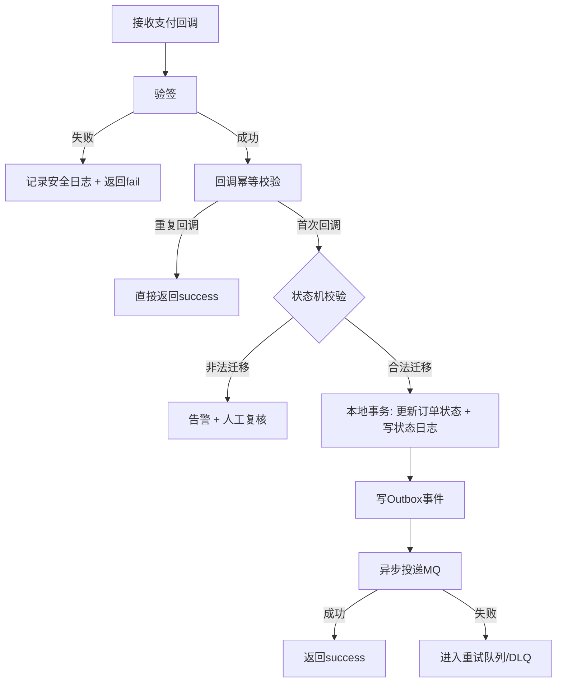

- 触发条件：支付渠道异步通知到达。
- 成功条件：订单状态前进到 `PAID` 且 Outbox 事件可追溯。
- 失败分支：验签失败、非法状态迁移、MQ 投递失败（走重试/DLQ）。

#### 20.1.2 库存补偿流程图

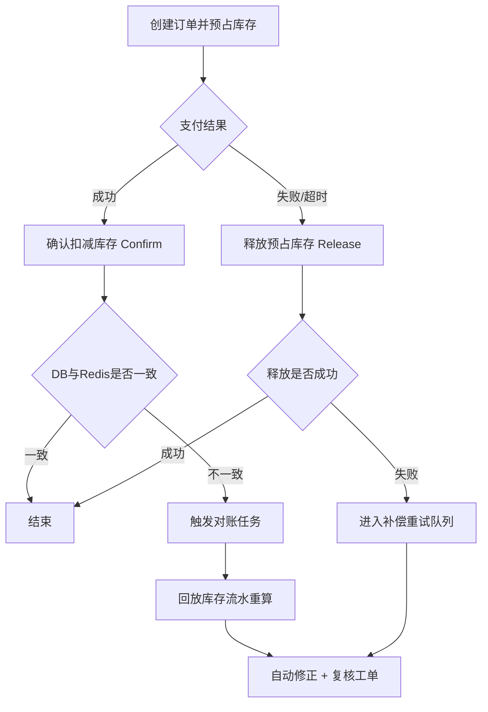

- 触发条件：支付失败/超时、回调异常、对账发现差异。
- 成功条件：库存状态回到可解释的一致状态（可追溯流水）。
- 失败分支：释放失败进入重试，重试后仍失败转人工工单。

#### 20.1.3 发布回滚流程图

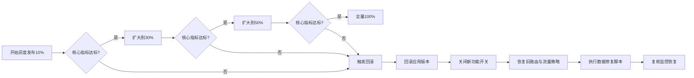

---

### 20.2 架构图落地（逻辑/部署/容灾）

#### 20.2.1 逻辑架构图

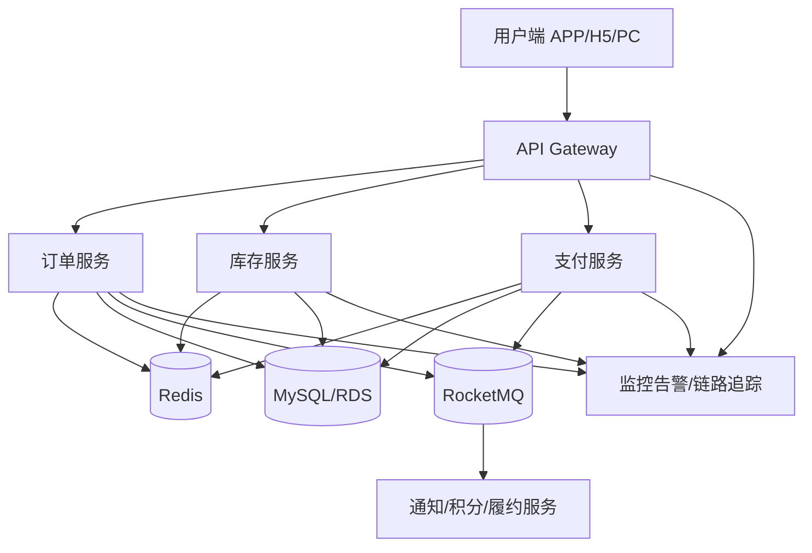

#### 20.2.2 部署架构图（生产）

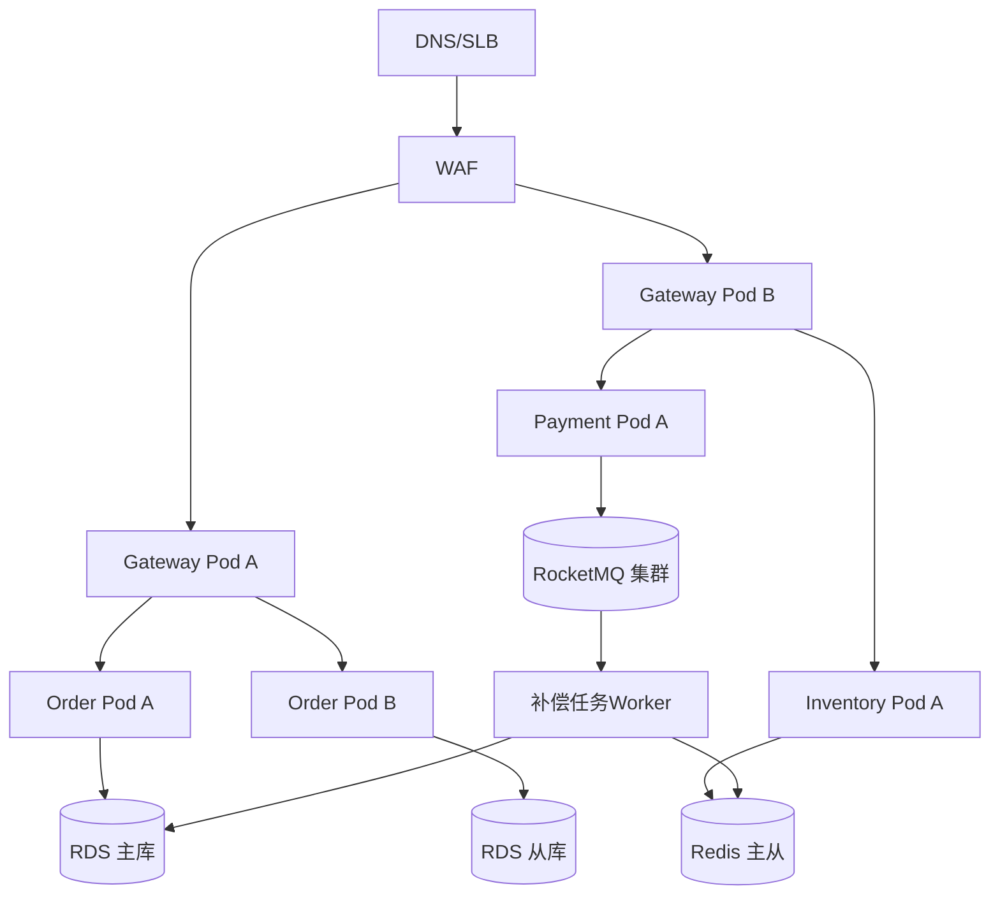

#### 20.2.3 容灾架构图（同城双活）

```mermaid
flowchart LR
    LB[全局流量入口] --> IDC1[机房A]
    LB --> IDC2[机房B]
    IDC1 --> DB1[(RDS A)]
    IDC2 --> DB2[(RDS B)]
    IDC1 --> MQ1[(MQ A)]
    IDC2 --> MQ2[(MQ B)]
    IDC1 --> RED1[(Redis A)]
    IDC2 --> RED2[(Redis B)]
    IDC1 -.故障切换.-> IDC2
```

#### 20.2.4 组件职责表

| 组件 | 职责 | 故障影响 | 降级策略 |
|---|---|---|---|
| Gateway | 鉴权、限流、路由 | 入口不可用 | 静态降级页 + 核心接口白名单 |
| 订单服务 | 建单、状态机推进 | 下单失败率上升 | 仅保留核心下单，关闭非核心扩展 |
| 库存服务 | 预占/确认/释放 | 超卖风险、缺货误判 | 开启强一致模式 + 限流 |
| 支付服务 | 下单支付、回调处理 | 无法确认支付结果 | 切换查询补偿模式 |
| Redis | 热数据、幂等、预占 | 响应变慢、缓存失效 | 降级到DB校验 + 降流 |
| MQ | 异步解耦、削峰 | 异步延迟、堆积 | 临时关闭低优先级消费者 |
| MySQL/RDS | 交易真相源 | 主链路不可写 | 故障切换 + 只读降级 |
| Observability | 指标/日志/追踪 | 可观测盲区 | 启用最小监控与人工巡检 |

---

### 20.3 状态机落地（订单/支付/库存）

#### 20.3.1 订单状态机

```mermaid
stateDiagram-v2
    [*] --> CREATED
    CREATED --> PAYING: start_pay
    PAYING --> PAID: pay_success
    PAYING --> CANCELLED: pay_timeout/pay_fail
    PAID --> FULFILLING: start_fulfill
    FULFILLING --> SHIPPED: ship_done
    SHIPPED --> COMPLETED: user_confirm_or_timeout
    PAID --> REFUNDING: apply_refund
    SHIPPED --> REFUNDING: after_sale_refund
    REFUNDING --> REFUNDED: refund_success
```

#### 20.3.2 支付状态机

```mermaid
stateDiagram-v2
    [*] --> INIT
    INIT --> PROCESSING: submit_pay
    PROCESSING --> SUCCESS: callback_success
    PROCESSING --> FAIL: callback_fail
    PROCESSING --> TIMEOUT: no_callback_timeout
```

#### 20.3.3 退款单（资金侧）状态机与字段状态机（推荐新增，强烈建议）

> 目标：把“退款是否真的退成功”从订单/售后里拆出来，形成资金域的真相源：可幂等、可对账、可补偿。否则线上最容易出现“售后显示已退款，但资金没退/重复退”的争议。

**A. 退款单状态机（最小可用）**

```mermaid
stateDiagram-v2
    [*] --> INIT
    INIT --> APPLYING: submit_refund
    APPLYING --> PROCESSING: channel_accept
    APPLYING --> FAIL: channel_reject
    PROCESSING --> SUCCESS: callback_success_or_query_confirm
    PROCESSING --> FAIL: callback_fail_or_query_confirm
    PROCESSING --> TIMEOUT: no_callback_timeout
```

> 建议默认：退款成功以“**退款回调** + **定时查单兜底**”双保险确认；任何回调/查单都必须幂等去重（同一退款单只成功一次）。

**A.1 退款回调 + 查单兜底：流程图（强烈建议）**

```mermaid
flowchart TD
    A[提交退款 SUBMIT_REFUND] --> B[创建/推进 payment_refund=APPLYING<br/>幂等键唯一]
    B --> C[调用渠道退款接口]
    C --> D{渠道是否回调?}
    D -->|回调到达(可能重复)| E[验签+去重+条件更新<br/>SUCCESS/FAIL]
    D -->|回调延迟/丢失| F[进入 PROCESSING/TIMEOUT]
    F --> G[定时任务扫描<br/>status in PROCESSING/TIMEOUT]
    G --> H[调用渠道退款查询接口]
    H --> I{查询结果}
    I -->|成功| J[条件更新 payment_refund=SUCCESS<br/>success_at 只写一次]
    I -->|失败| K[条件更新 payment_refund=FAIL<br/>记录 fail_reason]
    I -->|仍处理中| L[保持 PROCESSING<br/>等待下次扫描]
    E --> M[发布 REFUND_SUCCESS/FAIL 事件<br/>Outbox/事务消息]
    J --> M
    K --> N[可选：发布 REFUND_FAIL 事件]
```

**B. `payment_refund`（或 `refund_order`）核心字段（最小集合）**

| 字段 | 类型（建议） | 必填 | 用途 |
|---|---|---:|---|
| `refund_no` | varchar(64) | 是 | 退款单号（全局唯一，建议由售后域生成并贯穿） |
| `after_sale_no` | varchar(32) | 否 | 关联售后单（仅退款/退货退款都能关联） |
| `order_no` | varchar(32) | 是 | 关联订单号 |
| `order_item_id` | bigint | 否（推荐是） | 明细维度（部分退款强烈建议） |
| `pay_trade_no` | varchar(64) | 是 | 原支付单号（如渠道 `trade_no`/平台流水号） |
| `channel` | varchar(16) | 是 | 支付渠道：`WECHAT/ALIPAY/...` |
| `refund_amount` | decimal(10,2) | 是 | 本次退款金额 |
| `currency` | varchar(8) | 否 | 币种 |
| `status` | varchar(20) | 是 | 退款状态（见 C） |
| `channel_refund_no` | varchar(64) | 否 | 渠道退款单号（回调后写入） |
| `request_id` | varchar(64) | 否 | 发起退款请求幂等/链路追踪 |
| `idempotency_key` | varchar(128) | 是 | 退款幂等键（建议：`refund_no` 或 `after_sale_no + action`） |
| `apply_at` | datetime(3) | 否 | 提交退款申请时间 |
| `success_at` | datetime(3) | 否 | 退款成功时间（只允许首次写入） |
| `fail_reason` | varchar(256) | 否 | 失败原因（渠道码+可读信息） |
| `created_at`、`updated_at` | datetime(3) | 是 | 扫描/补偿/对账 |

**C. 字段枚举口径（推荐默认）**

| 字段 | 推荐枚举（最小集合） | 备注 |
|---|---|---|
| `status` | `INIT/APPLYING/PROCESSING/SUCCESS/FAIL/TIMEOUT` | `SUCCESS/FAIL` 视为终态（只允许幂等重复事件） |

**D. 事件 → 字段变更规则（强制幂等）**

| 事件 | from（允许状态） | to | 允许更新字段（建议） | 幂等关键点 |
|---|---|---|---|---|
| `SUBMIT_REFUND` | - | `APPLYING` | 首次写入：`refund_no/order_no/pay_trade_no/refund_amount/channel/idempotency_key/apply_at` | `idempotency_key` 唯一，重复请求直接返回同一 `refund_no` |
| `CHANNEL_ACCEPT` | `APPLYING` | `PROCESSING` | `updated_at`（可写渠道受理信息） | 重复事件仅幂等更新，不可回退 |
| `CHANNEL_REJECT` | `APPLYING/PROCESSING` | `FAIL` | `fail_reason` | 一旦 `FAIL/SUCCESS`，后续事件只允许幂等忽略 |
| `REFUND_SUCCESS_CALLBACK/QUERY_CONFIRM_SUCCESS` | `APPLYING/PROCESSING` | `SUCCESS` | `channel_refund_no`、`success_at` | `success_at` 只允许 NULL→非 NULL；并以 `refund_no` 去重回调 |
| `REFUND_FAIL_CALLBACK/QUERY_CONFIRM_FAIL` | `APPLYING/PROCESSING` | `FAIL` | `fail_reason` | 同上 |
| `NO_CALLBACK_TIMEOUT` | `APPLYING/PROCESSING` | `TIMEOUT` | - | 进入 TIMEOUT 后由定时查单推进到 SUCCESS/FAIL（仍需条件更新） |

**E. 建议的数据库约束（资金侧落地必备）**

- **退款幂等唯一约束（必须）**：`idempotency_key` 唯一（最简单直接用 `refund_no` 做幂等键）。
- **渠道回调去重（必须）**：建立去重表（或在 `payment_refund` 上以 `refund_no` 条件更新）确保重复回调不重复生效。
- **关键时间点只写一次（强烈建议）**：`success_at` 只允许 NULL→非 NULL。
- **状态推进必须条件更新（必须）**：例如 `UPDATE payment_refund SET status='SUCCESS' ... WHERE refund_no=? AND status IN ('APPLYING','PROCESSING','TIMEOUT')`。
- **一致性建议（强烈建议）**：库存逆向、售后完成展示、订单聚合态都应以 `payment_refund.status=SUCCESS` 作为“钱已退”的唯一真相源。

#### 20.3.3 库存状态机

```mermaid
stateDiagram-v2
    [*] --> AVAILABLE
    AVAILABLE --> RESERVED: reserve_ok
    RESERVED --> DEDUCTED: pay_success_confirm
    RESERVED --> RELEASED: cancel_or_timeout_release
    RELEASED --> AVAILABLE: release_done
```

#### 20.3.4 订单状态迁移规则表（示例）

| from | event | to | 幂等规则 | 是否允许 |
|---|---|---|---|---|
| CREATED | start_pay | PAYING | 重复事件不重复更新 | 是 |
| PAYING | pay_success | PAID | 仅第一次成功生效 | 是 |
| PAYING | pay_timeout | CANCELLED | 已PAID时禁止回退 | 是 |
| PAID | pay_success | PAID | 视为重复回调忽略 | 是 |
| SHIPPED | pay_timeout | CANCELLED | 禁止已发货回退 | 否 |

---

### 20.4 表结构落地（核心DDL + 索引 + 热查询）

#### 20.4.1 生产最小表集

- `orders`：订单主表（幂等、状态、来源、关单原因）
- `order_items`：订单明细（商品快照）
- `inventory`：库存（可用/预占/版本）
- `inventory_reservation`：库存预占流水（订单级状态机：预占/确认/释放）
- `inventory_refund`：库存逆向流水（退款/退货回补状态机，必须含 action 幂等）
- `order_status_log`：状态变更审计
- `pay_callback_dedup`：支付回调去重
- `payment_refund`：退款单（资金真相源：退款状态机、幂等、对账）
- `after_sale`：售后单（独立状态机，支持“进行中唯一”）
- `message_outbox`：可靠消息事件表
- `consumer_dedup`：消费者去重表（消费幂等落库）

#### 20.4.2 核心 DDL（补齐索引示例）

```sql
CREATE TABLE IF NOT EXISTS orders (
  id BIGINT PRIMARY KEY AUTO_INCREMENT,
  order_no VARCHAR(32) NOT NULL,
  user_id BIGINT NOT NULL,
  status VARCHAR(20) NOT NULL,
  total_amount DECIMAL(10,2) NOT NULL,
  idempotency_key VARCHAR(128) NOT NULL,
  source_channel VARCHAR(16) NOT NULL DEFAULT 'APP',
  risk_level VARCHAR(16) NOT NULL DEFAULT 'LOW',
  closed_reason VARCHAR(32) NULL,
  snapshot_version INT NOT NULL DEFAULT 1,
  created_at TIMESTAMP DEFAULT CURRENT_TIMESTAMP,
  updated_at TIMESTAMP DEFAULT CURRENT_TIMESTAMP ON UPDATE CURRENT_TIMESTAMP,
  UNIQUE KEY uk_order_no (order_no),
  UNIQUE KEY uk_idempotency_key (idempotency_key),
  KEY idx_user_status_time (user_id, status, created_at)
);

CREATE TABLE IF NOT EXISTS inventory (
  id BIGINT PRIMARY KEY AUTO_INCREMENT,
  sku_id BIGINT NOT NULL,
  warehouse_id BIGINT NOT NULL,
  total_stock INT NOT NULL,
  available_stock INT NOT NULL,
  reserved_stock INT NOT NULL DEFAULT 0,
  blocked_stock INT NOT NULL DEFAULT 0,
  sold_count INT NOT NULL DEFAULT 0,
  version INT NOT NULL DEFAULT 0,
  updated_at TIMESTAMP DEFAULT CURRENT_TIMESTAMP ON UPDATE CURRENT_TIMESTAMP,
  UNIQUE KEY uk_sku_wh (sku_id, warehouse_id),
  KEY idx_updated_at (updated_at)
);

CREATE TABLE IF NOT EXISTS inventory_reservation (
  id BIGINT PRIMARY KEY AUTO_INCREMENT,
  reserve_id VARCHAR(64) NOT NULL,
  order_no VARCHAR(32) NOT NULL,
  order_item_id BIGINT NULL,
  sku_id BIGINT NOT NULL,
  warehouse_id BIGINT NOT NULL,
  qty INT NOT NULL,
  status VARCHAR(20) NOT NULL,
  idempotency_key VARCHAR(128) NOT NULL,
  expire_at DATETIME(3) NOT NULL,
  confirmed_at DATETIME(3) NULL,
  released_at DATETIME(3) NULL,
  created_at DATETIME(3) NOT NULL DEFAULT CURRENT_TIMESTAMP(3),
  updated_at DATETIME(3) NOT NULL DEFAULT CURRENT_TIMESTAMP(3) ON UPDATE CURRENT_TIMESTAMP(3),
  UNIQUE KEY uk_reserve_id (reserve_id),
  UNIQUE KEY uk_inventory_reserve_idem (idempotency_key),
  KEY idx_order_no (order_no),
  KEY idx_sku_wh_status_expire (sku_id, warehouse_id, status, expire_at)
);

CREATE TABLE IF NOT EXISTS inventory_refund (
  id BIGINT PRIMARY KEY AUTO_INCREMENT,
  refund_no VARCHAR(64) NOT NULL,
  order_no VARCHAR(32) NOT NULL,
  order_item_id BIGINT NULL,
  sku_id BIGINT NOT NULL,
  warehouse_id BIGINT NOT NULL,
  qty INT NOT NULL,
  action VARCHAR(32) NOT NULL,
  status VARCHAR(20) NOT NULL,
  restore_target VARCHAR(20) NOT NULL DEFAULT 'AVAILABLE',
  idempotency_key VARCHAR(128) NOT NULL,
  stock_restored_at DATETIME(3) NULL,
  created_at DATETIME(3) NOT NULL DEFAULT CURRENT_TIMESTAMP(3),
  updated_at DATETIME(3) NOT NULL DEFAULT CURRENT_TIMESTAMP(3) ON UPDATE CURRENT_TIMESTAMP(3),
  UNIQUE KEY uk_inv_refund_idem (idempotency_key),
  KEY idx_refund_no (refund_no),
  KEY idx_order_no (order_no),
  KEY idx_sku_wh_status (sku_id, warehouse_id, status),
  KEY idx_action_status (action, status)
);

CREATE TABLE IF NOT EXISTS payment_refund (
  id BIGINT PRIMARY KEY AUTO_INCREMENT,
  refund_no VARCHAR(64) NOT NULL,
  after_sale_no VARCHAR(32) NULL,
  order_no VARCHAR(32) NOT NULL,
  order_item_id BIGINT NULL,
  pay_trade_no VARCHAR(64) NOT NULL,
  channel VARCHAR(16) NOT NULL,
  refund_amount DECIMAL(10,2) NOT NULL,
  currency VARCHAR(8) NOT NULL DEFAULT 'CNY',
  status VARCHAR(20) NOT NULL,
  channel_refund_no VARCHAR(64) NULL,
  idempotency_key VARCHAR(128) NOT NULL,
  apply_at TIMESTAMP NULL,
  success_at TIMESTAMP NULL,
  fail_reason VARCHAR(256) NULL,
  created_at TIMESTAMP DEFAULT CURRENT_TIMESTAMP,
  updated_at TIMESTAMP DEFAULT CURRENT_TIMESTAMP ON UPDATE CURRENT_TIMESTAMP,
  UNIQUE KEY uk_refund_no (refund_no),
  UNIQUE KEY uk_refund_idempotency (idempotency_key),
  KEY idx_order_no (order_no),
  KEY idx_pay_trade_no (pay_trade_no),
  KEY idx_status_updated (status, updated_at)
);

-- 售后单（强烈建议独立表，主状态机不被污染）
CREATE TABLE IF NOT EXISTS after_sale (
  id BIGINT PRIMARY KEY AUTO_INCREMENT,
  after_sale_no VARCHAR(32) NOT NULL,
  order_no VARCHAR(32) NOT NULL,
  order_item_id BIGINT NOT NULL,
  type VARCHAR(20) NOT NULL,
  status VARCHAR(20) NOT NULL,
  refund_amount DECIMAL(10,2) NOT NULL,
  currency VARCHAR(8) NOT NULL DEFAULT 'CNY',
  refund_no VARCHAR(64) NULL,
  refund_status VARCHAR(20) NULL,
  refund_success_at TIMESTAMP NULL,
  in_progress TINYINT NOT NULL DEFAULT 1,
  idempotency_key VARCHAR(128) NOT NULL,
  created_at TIMESTAMP DEFAULT CURRENT_TIMESTAMP,
  updated_at TIMESTAMP DEFAULT CURRENT_TIMESTAMP ON UPDATE CURRENT_TIMESTAMP,
  UNIQUE KEY uk_after_sale_no (after_sale_no),
  UNIQUE KEY uk_after_sale_idem (idempotency_key),
  UNIQUE KEY uk_after_sale_item_in_progress (order_item_id, in_progress),
  KEY idx_order_no (order_no)
);

-- 消费去重表（消费者幂等“落库版”）
CREATE TABLE IF NOT EXISTS consumer_dedup (
  id BIGINT PRIMARY KEY AUTO_INCREMENT,
  message_id VARCHAR(64) NOT NULL,
  consumer_group VARCHAR(64) NOT NULL,
  created_at TIMESTAMP DEFAULT CURRENT_TIMESTAMP,
  UNIQUE KEY uk_msg_group (message_id, consumer_group)
);

-- Outbox 表（可靠事件：建议 biz_key 唯一）
CREATE TABLE IF NOT EXISTS message_outbox (
  id BIGINT PRIMARY KEY AUTO_INCREMENT,
  message_id VARCHAR(64) NOT NULL,
  biz_key VARCHAR(128) NOT NULL,
  event_type VARCHAR(32) NOT NULL,
  schema_version INT NOT NULL DEFAULT 1,
  payload_encoding VARCHAR(20) NOT NULL DEFAULT 'json',
  occurred_at TIMESTAMP NULL,
  payload TEXT NOT NULL,
  status VARCHAR(20) NOT NULL DEFAULT 'NEW',
  retry_count INT NOT NULL DEFAULT 0,
  next_retry_at TIMESTAMP NULL,
  last_error VARCHAR(512) NULL,
  created_at TIMESTAMP DEFAULT CURRENT_TIMESTAMP,
  updated_at TIMESTAMP DEFAULT CURRENT_TIMESTAMP ON UPDATE CURRENT_TIMESTAMP,
  UNIQUE KEY uk_message_id (message_id),
  UNIQUE KEY uk_biz_key (biz_key),
  KEY idx_status_next_retry (status, next_retry_at),
  KEY idx_occurred_at (occurred_at)
);
```

**20.4.2.1 关键约束（强烈建议落库，不要只写在代码里）**

> 说明：以下约束以 MySQL 8 为主。若你的 MySQL 版本不支持/不严格执行 CHECK，可用“触发器/生成列 + 约束/应用层校验”兜底，但**唯一索引 + 条件更新**必须保留。

**A. 枚举约束（CHECK，推荐）**

```sql
-- orders.status 枚举约束（可按你最终状态集调整）
ALTER TABLE orders
  ADD CONSTRAINT ck_orders_status
  CHECK (status IN ('CREATED','PAYING','PAID','FULFILLING','SHIPPED','COMPLETED','CANCELLED','REFUNDING','REFUNDED'));

-- payment_refund.status 枚举约束
ALTER TABLE payment_refund
  ADD CONSTRAINT ck_payment_refund_status
  CHECK (status IN ('INIT','APPLYING','PROCESSING','SUCCESS','FAIL','TIMEOUT'));

-- after_sale.type/status 枚举约束（可按你最终状态集调整）
ALTER TABLE after_sale
  ADD CONSTRAINT ck_after_sale_type
  CHECK (type IN ('ONLY_REFUND','RETURN_REFUND'));

ALTER TABLE after_sale
  ADD CONSTRAINT ck_after_sale_status
  CHECK (status IN ('APPLIED','APPROVED','REJECTED','RETURNING','RECEIVED','INSPECTING','DISPUTE','REFUNDING','REFUNDED','REFUND_FAIL','CANCELLED'));

-- message_outbox.status 枚举约束（Outbox 投递状态机）
ALTER TABLE message_outbox
  ADD CONSTRAINT ck_outbox_status
  CHECK (status IN ('NEW','SENDING','SENT','ACKED','RETRYING','DLQ'));

-- message_outbox.payload_encoding 枚举约束（与 19.6.10 对齐）
ALTER TABLE message_outbox
  ADD CONSTRAINT ck_outbox_payload_encoding
  CHECK (payload_encoding IN ('json','gzip+base64','zstd+base64'));

-- message_outbox.event_type 白名单（与 19.6.21 对齐；新增事件类型时同步扩展）
ALTER TABLE message_outbox
  ADD CONSTRAINT ck_outbox_event_type
  CHECK (event_type IN (
    'ORDER_PAID','ORDER_CANCELLED','CHANNEL_PAYMENT_NOTIFY',
    'REFUND_SUCCESS','RETURN_INBOUND_ACCEPTED','RETURN_QA_PASSED',
    'ORDER_SPLIT_DONE','WMS_OUTBOUND_CREATED','SHIPMENT_CREATED',
    'PHARMACY_TASK_CREATE','PHARMACY_TASK_RESULT'
  ));

-- message_outbox.occurred_at 建议不为空（可选：若你要求所有事件必须带业务发生时间）
-- MySQL 里可用 CHECK 或应用层强校验替代
ALTER TABLE message_outbox
  ADD CONSTRAINT ck_outbox_occurred_at
  CHECK (occurred_at IS NOT NULL);

-- inventory_reservation.status 枚举约束
ALTER TABLE inventory_reservation
  ADD CONSTRAINT ck_inv_resv_status
  CHECK (status IN ('RESERVED','CONFIRMED','RELEASED'));

-- inventory_refund.action/status/restore_target 枚举约束
ALTER TABLE inventory_refund
  ADD CONSTRAINT ck_inv_refund_action
  CHECK (action IN ('RESTORE_AVAILABLE','RESTORE_BLOCKED','QA_PASS_MOVE','QA_FAIL_DISCARD'));

ALTER TABLE inventory_refund
  ADD CONSTRAINT ck_inv_refund_status
  CHECK (status IN ('APPLIED','APPROVED','STOCK_PENDING','STOCK_RESTORED','REJECTED','CANCELLED'));

ALTER TABLE inventory_refund
  ADD CONSTRAINT ck_inv_refund_restore_target
  CHECK (restore_target IN ('AVAILABLE','BLOCKED'));

-- inventory_refund：action 与 restore_target 一致性（强烈建议）
-- 说明：把“动作语义”写死，避免 action=RESTORE_BLOCKED 但 restore_target=AVAILABLE 这种脏数据出现。
ALTER TABLE inventory_refund
  ADD CONSTRAINT ck_inv_refund_action_target
  CHECK (
    (action = 'RESTORE_AVAILABLE' AND restore_target = 'AVAILABLE')
    OR (action = 'RESTORE_BLOCKED' AND restore_target = 'BLOCKED')
    OR (action IN ('QA_PASS_MOVE','QA_FAIL_DISCARD'))
  );
```

**B. 时间字段一致性（CHECK，推荐）**

```sql
-- PAID 必须有 paid_at；CANCELLED 必须有 closed_at；COMPLETED 必须有 completed_at
ALTER TABLE orders
  ADD CONSTRAINT ck_orders_time_consistency
  CHECK (
    (status <> 'PAID' OR paid_at IS NOT NULL)
    AND (status <> 'CANCELLED' OR closed_at IS NOT NULL)
    AND (status <> 'COMPLETED' OR completed_at IS NOT NULL)
  );

-- payment_refund 成功必须有 success_at；失败必须有 fail_reason（可选）
ALTER TABLE payment_refund
  ADD CONSTRAINT ck_payment_refund_time_consistency
  CHECK (
    (status <> 'SUCCESS' OR success_at IS NOT NULL)
    AND (status <> 'FAIL' OR fail_reason IS NOT NULL)
  );

-- after_sale：退款成功时间与状态一致（可选但推荐）
ALTER TABLE after_sale
  ADD CONSTRAINT ck_after_sale_refund_time
  CHECK (
    (status <> 'REFUNDED' OR refund_success_at IS NOT NULL)
  );

-- inventory_reservation：终态时间字段一致（可选但推荐）
ALTER TABLE inventory_reservation
  ADD CONSTRAINT ck_inv_resv_terminal_time
  CHECK (
    (status <> 'CONFIRMED' OR confirmed_at IS NOT NULL)
    AND (status <> 'RELEASED' OR released_at IS NOT NULL)
  );

-- inventory_refund：回补完成必须有时间（可选但推荐）
ALTER TABLE inventory_refund
  ADD CONSTRAINT ck_inv_refund_restored_time
  CHECK (
    (status <> 'STOCK_RESTORED' OR stock_restored_at IS NOT NULL)
  );
```

**C. 数量不变量（CHECK，强烈建议）**

```sql
-- inventory 数量列不允许为负；总量不变量（按你的 total_stock 定义）
ALTER TABLE inventory
  ADD CONSTRAINT ck_inventory_non_negative
  CHECK (available_stock >= 0 AND reserved_stock >= 0 AND blocked_stock >= 0 AND sold_count >= 0);

ALTER TABLE inventory
  ADD CONSTRAINT ck_inventory_total_invariant
  CHECK (available_stock + reserved_stock + blocked_stock + sold_count <= total_stock);
```

**D. 幂等与“进行中唯一”（唯一索引，必须）**

> 唯一索引是最强的“防事故装置”：它会在并发/重试下强制你走幂等分支，而不是写出两条数据。

- `orders.uk_idempotency_key(idempotency_key)`：已在 DDL 中给出（建单幂等）。
- `payment_refund.uk_refund_idempotency(idempotency_key)`：已在 DDL 中给出（退款幂等）。
- `inventory_reservation.uk_inventory_reserve_idem(idempotency_key)`：建议必须有（预占幂等）。
- `inventory_refund.uk_inv_refund_idem(idempotency_key)`：建议必须有（逆向幂等，且幂等键必须包含 action）。

售后“进行中唯一”（推荐实现，MySQL 通用）：

```sql
-- after_sale 表建议增加冗余列 in_progress(0/1)，并建唯一索引
-- 进行中定义：APPLIED/APPROVED/RETURNING/RECEIVED/INSPECTING/DISPUTE/REFUNDING
ALTER TABLE after_sale
  ADD COLUMN in_progress TINYINT NOT NULL DEFAULT 1 COMMENT '进行中=1, 终态=0';

ALTER TABLE after_sale
  ADD UNIQUE KEY uk_after_sale_item_in_progress (order_item_id, in_progress);

-- 应用层/触发器在进入终态时把 in_progress 置 0（例如 REFUNDED/REJECTED/CANCELLED）
```

Outbox 与消费者去重（唯一索引，必须）：

- `message_outbox.uk_biz_key(biz_key)`：同一业务事件只入库一次（防重复发事件）。
- `consumer_dedup.uk_msg_group(message_id, consumer_group)`：同一消费者组只处理一次（消费幂等）。

**E. 外键（可选，按性能与分库策略决定）**

> 在高并发交易系统里，外键不是必须；若你有分库分表/跨库，通常不启用外键，改用“应用层一致性 + 对账补偿”。若单库且希望强约束，可选启用：

- `payment_refund(order_no)` → `orders(order_no)`
- `inventory_reservation(order_no)` → `orders(order_no)`
- `inventory_refund(order_no)` → `orders(order_no)`

**F. 必须强调：真正禁止“回退/重复副作用”的约束在 SQL 的 WHERE**

- 任何状态推进必须 `UPDATE ... WHERE status IN (...)`（或 `version=?`），**这比 CHECK 更关键**。

**G. CHECK 不可用/不可靠时的替代落地（务必读）**

> 背景：部分 MySQL 版本/配置下 CHECK 可能不严格生效。此时请遵循：**唯一索引 + 条件更新** 仍是第一优先；其余一致性用“生成列/触发器/应用层强校验 + 告警”兜底。

- **枚举约束替代**：应用层校验 + 统一枚举常量；同时把非法值写入拒绝并告警。
- **时间一致性替代**：在状态推进 SQL 里强制写入时间字段（例如 `SET status='PAID', paid_at=... WHERE status IN (...) AND paid_at IS NULL`）。
- **库存不变量替代**：所有库存变动走单条 UPDATE 条件更新（如 `blocked_stock >= qty`），并在失败时触发告警与对账任务。
- **售后 in_progress 一致性**：若不想用触发器，应用层必须在进入终态时显式 `SET in_progress=0`，并保证这一步与状态推进同事务。

**H. 强制事务模板（库存回补/搬运：务必按模板落地）**

> 目标：把“库存数量变动 + 逆向单推进 + 流水落库”锁死在同一个本地事务里，避免重复回补/流水缺失/对账无法回放。

**H.1 回补到可售（RESTORE_AVAILABLE）事务模板（示例）**

```sql
-- 1) 赢仲裁：必须先把 inventory_refund 从 STOCK_PENDING 推进（条件更新）
UPDATE inventory_refund
SET status = 'STOCK_PENDING',
    updated_at = CURRENT_TIMESTAMP(3)
WHERE idempotency_key = ?
  AND status IN ('APPLIED','APPROVED','STOCK_PENDING');

-- 2) 事务开始（以下三步必须同事务）
-- 2.1 改库存（数量变动）
UPDATE inventory
SET available_stock = available_stock + ?,
    version = version + 1,
    updated_at = CURRENT_TIMESTAMP(3)
WHERE sku_id = ?
  AND warehouse_id = ?;

-- 2.2 写流水（对账真相源）
INSERT INTO inventory_change_log(biz_type, biz_id, sku_id, warehouse_id, delta_available, delta_reserved, delta_sold, delta_blocked, created_at)
VALUES ('REFUND_RESTORE', ?, ?, ?, ?, 0, 0, 0, CURRENT_TIMESTAMP(3));

-- 2.3 推进逆向单到终态（条件更新防重复）
UPDATE inventory_refund
SET status = 'STOCK_RESTORED',
    restore_target = 'AVAILABLE',
    stock_restored_at = CURRENT_TIMESTAMP(3),
    updated_at = CURRENT_TIMESTAMP(3)
WHERE idempotency_key = ?
  AND status = 'STOCK_PENDING';
```

**H.2 隔离池 → 可售搬运（QA_PASS_MOVE）事务模板（示例）**

```sql
-- 事务开始（以下三步必须同事务）
-- 1) 搬运库存（必须校验 blocked_stock >= qty，防负数）
UPDATE inventory
SET blocked_stock = blocked_stock - ?,
    available_stock = available_stock + ?,
    version = version + 1,
    updated_at = CURRENT_TIMESTAMP(3)
WHERE sku_id = ?
  AND warehouse_id = ?
  AND blocked_stock >= ?;

-- 2) 写流水
INSERT INTO inventory_change_log(biz_type, biz_id, sku_id, warehouse_id, delta_available, delta_reserved, delta_sold, delta_blocked, created_at)
VALUES ('RETURN_QA_PASS', ?, ?, ?, ?, 0, 0, -?, CURRENT_TIMESTAMP(3));

-- 3) 推进逆向单终态（条件更新）
UPDATE inventory_refund
SET status = 'STOCK_RESTORED',
    updated_at = CURRENT_TIMESTAMP(3)
WHERE idempotency_key = ?
  AND status = 'STOCK_PENDING';
```

> 失败处理（必须写死）：如果任一步失败，整笔事务回滚；消息不 ACK 让 MQ 重试；超过重试上限进 DLQ 并告警/工单介入。

**I. 强制事务模板（Outbox：业务更新 + 写消息必须同事务）**

> 目标：避免“订单状态更新了但事件没发出去/发重了”。核心原则：**业务表更新与 Outbox 写入在同一个本地事务里**；Outbox 再由 Worker 异步投递到 MQ。

**I.1 订单支付成功：写状态 + 写状态日志 + 写 Outbox（示例）**

```sql
-- 本地事务开始

-- 1) 订单状态推进（条件更新仲裁）
UPDATE orders
SET status = 'PAID',
    paid_at = CURRENT_TIMESTAMP(3),
    updated_at = CURRENT_TIMESTAMP(3),
    version = version + 1
WHERE order_no = ?
  AND status IN ('CREATED','PAYING');

-- 2) 如果 updateCount=0：直接提交事务并返回 success（幂等结束）

-- 3) 写状态日志（可选但强烈建议）
INSERT INTO order_status_log(order_no, from_status, to_status, event_type, operator, occurred_at)
VALUES (?, ?, 'PAID', 'PAY_SUCCESS', 'system', CURRENT_TIMESTAMP(3));

-- 4) 写 Outbox（biz_key 唯一，防重复事件）
INSERT INTO message_outbox(message_id, biz_key, event_type, schema_version, payload_encoding, occurred_at, payload, status, retry_count, created_at, updated_at)
VALUES (?, CONCAT('ORDER_PAID+', ?), 'ORDER_PAID', 1, 'json', ?, ?, 'NEW', 0, CURRENT_TIMESTAMP, CURRENT_TIMESTAMP);

-- 本地事务提交
```

> 注意：Outbox 里的 `biz_key` 一定要能表达“业务幂等”（例如 `ORDER_PAID+order_no`）。只用随机 message_id 做唯一键，无法防“重复写入同一事件”。

**I.2 售后/退款成功：写展示聚合 + 写 Outbox（示例）**

```sql
-- 本地事务开始
UPDATE after_sale
SET status = 'REFUNDED',
    refund_status = 'SUCCESS',
    refund_success_at = COALESCE(refund_success_at, CURRENT_TIMESTAMP),
    in_progress = 0,
    updated_at = CURRENT_TIMESTAMP
WHERE after_sale_no = ?
  AND status IN ('REFUNDING','REFUND_FAIL');

INSERT INTO message_outbox(message_id, biz_key, event_type, schema_version, payload_encoding, occurred_at, payload, status, retry_count, created_at, updated_at)
VALUES (?, CONCAT('REFUND_SUCCESS+', ?), 'REFUND_SUCCESS', 1, 'json', ?, ?, 'NEW', 0, CURRENT_TIMESTAMP, CURRENT_TIMESTAMP);
-- 本地事务提交
```

**J. 售后 in_progress 自动维护（触发器/应用层二选一，必须写死）**

> 背景：你用了 `(order_item_id, in_progress)` 唯一索引来保证“同一明细只能有一个进行中售后”。如果 `in_progress` 不及时置 0，会导致后续无法再发起售后（卡死）。

**J.1 触发器方案（单库场景可用，推荐）**

```sql
DELIMITER $$
CREATE TRIGGER trg_after_sale_in_progress_before_update
BEFORE UPDATE ON after_sale
FOR EACH ROW
BEGIN
  -- 进入终态就自动置 0（终态示例：REFUNDED/REJECTED/CANCELLED）
  IF NEW.status IN ('REFUNDED','REJECTED','CANCELLED') THEN
    SET NEW.in_progress = 0;
  END IF;
END$$
DELIMITER ;
```

**J.2 应用层方案（跨库/分库场景推荐）**

- 在所有把 `after_sale.status` 推进到终态的 SQL 中，**强制同时 `SET in_progress=0`**，并保证与状态推进同事务。
- 若出现“状态已终态但 in_progress=1”的脏数据：必须提供修复脚本 + 定时扫描告警（否则会长期阻塞用户再次售后）。

**K. 回调去重表的生命周期管理（必须写死，否则表会无限膨胀）**

> 目标：去重表（`pay_callback_dedup`/退款回调去重表）属于“技术性热表”，必须有 TTL/分区/清理策略，否则迟早拖慢写入并影响回调成功率。

**K.1 pay_callback_dedup（支付回调去重）清理建议**

- **保留窗口**：30～90 天（覆盖支付渠道最大重放/补发窗口，默认 90 天更稳）。
- **实现建议（二选一）**：
  - **按日分区（推荐）**：按 `created_at` 日分区，定期 `DROP PARTITION` 清理。
  - **按日清理（可选）**：每天执行 `DELETE FROM pay_callback_dedup WHERE created_at < NOW() - INTERVAL 90 DAY LIMIT ...`（注意批量删除要分批，避免大事务）。
- **必备索引**：已经有 `UNIQUE(out_trade_no, trade_status, callback_hash)`；建议补 `KEY idx_created_at(created_at)`（若不分区）。

**K.1.1 pay_callback_dedup 按日分区 DDL 模板（可直接照抄）**

> 说明：分区能让清理变成 `DROP PARTITION`（几乎瞬时），避免大表 DELETE 造成主库抖动。这里给一个“按月创建、按日分区”的示例模板，你可以按你团队的 DBA 规范调整。

```sql
-- MySQL 分区示例：按 created_at 的天分区（使用 TO_DAYS）
-- 注意：分区键必须出现在主键/唯一键中（MySQL 规则），因此 pay_callback_dedup 的唯一键需要包含 created_at 或改造为“去重键 + 分区键”组合。
-- 若你不想改唯一键，可选择不分区，改用分批 DELETE。

-- 示例（仅作模板）：把唯一键改为 (out_trade_no, trade_status, callback_hash, created_at)
-- 或把 created_at 改成 dedup_day(date) 生成列，并把 dedup_day 纳入唯一键与分区键。

-- 方案：生成列 dedup_day + 分区
ALTER TABLE pay_callback_dedup
  ADD COLUMN dedup_day DATE GENERATED ALWAYS AS (DATE(created_at)) STORED;

ALTER TABLE pay_callback_dedup
  DROP INDEX uk_pay_callback,
  ADD UNIQUE KEY uk_pay_callback (out_trade_no, trade_status, callback_hash, dedup_day);

ALTER TABLE pay_callback_dedup
  PARTITION BY RANGE COLUMNS(dedup_day) (
    PARTITION p20260401 VALUES LESS THAN ('2026-04-02'),
    PARTITION p20260402 VALUES LESS THAN ('2026-04-03'),
    PARTITION pmax VALUES LESS THAN (MAXVALUE)
  );

-- 清理：DROP 过期分区（示例）
ALTER TABLE pay_callback_dedup DROP PARTITION p20260401;
```

**K.2 退款回调去重（资金侧）落库策略**

> 你已经把“退款真相源”落在 `payment_refund`，因此退款回调去重可以用两种方式：

- **方式 1（推荐默认：不用单独去重表）**：以 `refund_no` 条件更新 + 终态保护实现去重  
  - `UPDATE payment_refund SET status='SUCCESS', success_at=COALESCE(success_at,?) ... WHERE refund_no=? AND status IN ('APPLYING','PROCESSING','TIMEOUT')`
  - 重复回调命中 `updateCount=0` 直接返回 success（幂等结束）
- **方式 2（更强，但表更多）**：新增 `refund_callback_dedup` 表，唯一键 `refund_no + refund_status + callback_hash`
  - 适合“渠道回调内容变体很多、需要审计回调原文”的团队

**L. 生产修复脚本模板（强烈建议准备好，不要等事故）**

> 原则：修复脚本要能“补漏”，但必须幂等（重复跑不会再次产生副作用），并且每次修复都要写审计日志/工单号。

**L.1 修复售后卡死：终态但 in_progress=1**

```sql
-- 只修复终态：避免误伤进行中
UPDATE after_sale
SET in_progress = 0,
    updated_at = CURRENT_TIMESTAMP
WHERE in_progress = 1
  AND status IN ('REFUNDED','REJECTED','CANCELLED')
LIMIT 5000;
```

**L.2 修复逆向卡单：payment_refund 已 SUCCESS，但 inventory_refund 仍 STOCK_PENDING**

```sql
-- 场景：钱已退但库存逆向未推进（可能消息丢失/消费失败）
-- 做法：生成补发事件或直接触发库存补偿任务（推荐补发事件，保持事件驱动口径一致）
SELECT pr.refund_no, pr.order_no, pr.success_at
FROM payment_refund pr
LEFT JOIN inventory_refund ir
  ON ir.refund_no = pr.refund_no
WHERE pr.status = 'SUCCESS'
  AND (ir.status IS NULL OR ir.status <> 'STOCK_RESTORED')
  AND pr.success_at < NOW() - INTERVAL 10 MINUTE
LIMIT 1000;
```

落地动作（二选一，写死）：
- **补发事件**：往 `message_outbox` 插入 `REFUND_SUCCESS+refund_no`（biz_key 唯一防重复），由 Worker 投递，让库存服务按幂等消费。
- **直连补偿**：调用库存服务的“逆向补偿接口”（必须同样走 `inventory_refund.idempotency_key` 去重）。

**L.3 修复 Outbox 卡 DLQ：重置为 RETRYING（必须带人工审计）**

```sql
-- 仅对已确认“下游已恢复/消息内容正确”的 DLQ 消息操作
UPDATE message_outbox
SET status = 'RETRYING',
    next_retry_at = NOW(),
    last_error = CONCAT('[manual_reset]', COALESCE(last_error,'')),
    updated_at = NOW()
WHERE status = 'DLQ'
  AND biz_key = ?
LIMIT 1;
```

**M. 约束与性能的取舍说明（避免 DBA 争论）**

- **唯一索引（幂等）是必须**：它直接决定并发/重试下是否会写出两条“真相数据”。
- **CHECK 约束是强烈建议但可降级**：当 CHECK 不可靠时，用“条件更新 + 生成列/触发器 + 告警”替代，但不要删唯一索引。
- **外键慎用**：单库可用；分库分表/高并发链路通常不用外键，改用对账补偿保证一致性。

**N. 回调乱序/重放回归用例集（强烈建议写入压测/回放脚本）**

> 用法：把下表做成自动化回放（单测/集成测/压测后回放），每条用例都要验证：最终状态正确 + 副作用只发生一次（Confirm/Release/回补/写 Outbox）。

| 用例 | 输入事件序列（按到达顺序） | 期望最终订单状态 | 期望库存预占 | 期望 Outbox 事件 | 关键断言 |
|---|---|---|---|---|---|
| N1 支付成功 vs 超时关单并发 | `PAY_SUCCESS` 与 `CANCEL_TIMEOUT` 同时到达 | `PAID` 或 `CANCELLED`（二选一，以仲裁为准） | 只允许 `CONFIRMED` 或 `RELEASED` 之一 | 只产生 `ORDER_PAID` 或 `ORDER_CANCELLED` 之一 | 输的一方 `updateCount=0` 必须幂等结束 |
| N2 重复支付成功回调 | `PAY_SUCCESS`×3 | `PAID` | 只 Confirm 一次 | `ORDER_PAID` 只写一次（biz_key 唯一） | 不重复扣减/不重复发事件 |
| N3 关单任务重复执行 | `CANCEL_TIMEOUT`×3（且订单未支付） | `CANCELLED` | 只 Release 一次 | `ORDER_CANCELLED` 只写一次 | 不重复释放库存 |
| N4 退款成功回调重复 | `REFUND_SUCCESS`×3 | `REFUNDED`/售后展示为已退款 | 逆向回补只一次 | `REFUND_SUCCESS` 事件只一次（如有） | `payment_refund.success_at` 只写一次 |
| N5 退货入库先到，退款成功后到（乱序） | `RETURN_INBOUND_ACCEPTED` → `REFUND_SUCCESS` | 订单保持 `REFUNDING/REFUNDED`（按你口径） | 先回补 BLOCKED，再 QA 通过搬运 | 逆向动作各一次 | 不允许因为退款成功再次回补入库数量 |
| N6 退款成功先到，退货入库后到（乱序） | `REFUND_SUCCESS` → `RETURN_INBOUND_ACCEPTED` | 同上 | 先 STOCK_PENDING 不改数量，后入库回补 | 同上 | `inventory_refund.idempotency_key` 去重生效 |
| N7 消费重复投递 | 同一 MQ 消息重复到达 | 不变 | 不变 | 不变 | `consumer_dedup` 唯一索引命中，直接 ACK |

**O. 标准化“补发事件”脚本模板（Outbox 版，推荐）**

> 原则：补发不是“直接改别的服务数据库”，而是**补发事件**让系统按原本的幂等逻辑收敛。Outbox 用 `biz_key` 唯一保证脚本可重复执行。

**O.1 补发订单已支付事件（ORDER_PAID）**

```sql
INSERT INTO message_outbox(message_id, biz_key, event_type, schema_version, payload_encoding, occurred_at, payload, status, retry_count, created_at, updated_at)
VALUES (
  ?, CONCAT('ORDER_PAID+', ?), 'ORDER_PAID', 1, 'json', ?,
  ?, 'NEW', 0, NOW(), NOW()
)
ON DUPLICATE KEY UPDATE
  updated_at = NOW();
```

**O.2 补发退款成功事件（REFUND_SUCCESS）**

```sql
INSERT INTO message_outbox(message_id, biz_key, event_type, schema_version, payload_encoding, occurred_at, payload, status, retry_count, created_at, updated_at)
VALUES (
  ?, CONCAT('REFUND_SUCCESS+', ?), 'REFUND_SUCCESS', 1, 'json', ?,
  ?, 'NEW', 0, NOW(), NOW()
)
ON DUPLICATE KEY UPDATE
  updated_at = NOW();
```

payload 最小字段建议（JSON）：`refund_no/order_no/order_item_id/sku_id/warehouse_id/qty/occurred_at`（让库存服务无需二次查询也能幂等回补）。
#### 20.4.3 热查询 SQL（示例）

```sql
-- 查询用户最近订单
SELECT order_no, status, total_amount, created_at
FROM orders
WHERE user_id = ?
ORDER BY created_at DESC
LIMIT 20;

-- 查询待补偿订单
SELECT order_no, status, updated_at
FROM orders
WHERE status IN ('CREATED','PAYING')
  AND updated_at < NOW() - INTERVAL 15 MINUTE
LIMIT 1000;

-- 查询待查单/待补偿退款单（支付渠道回调可能丢/延迟）
-- 用途：定时任务扫描 TIMEOUT/PROCESSING，调用渠道“退款查询接口”确认最终态
SELECT refund_no, order_no, pay_trade_no, channel, refund_amount, status, updated_at
FROM payment_refund
WHERE status IN ('APPLYING','PROCESSING','TIMEOUT')
  AND updated_at < NOW() - INTERVAL 2 MINUTE
ORDER BY updated_at ASC
LIMIT 1000;

-- 查询退款失败但可重试的退款单（示例：渠道返回“系统繁忙”类错误）
-- 注意：是否可重试必须靠 fail_reason_code（如有）或渠道错误码映射决定
SELECT refund_no, order_no, channel, refund_amount, fail_reason, updated_at
FROM payment_refund
WHERE status = 'FAIL'
  AND updated_at > NOW() - INTERVAL 24 HOUR
ORDER BY updated_at DESC
LIMIT 200;

-- 查询逆向库存单长时间卡在 STOCK_PENDING（可能是“退款成功/入库验收”事件缺失）
SELECT refund_no, order_no, sku_id, warehouse_id, qty, action, status, updated_at
FROM inventory_refund
WHERE status = 'STOCK_PENDING'
  AND created_at < NOW() - INTERVAL 24 HOUR
ORDER BY created_at ASC
LIMIT 1000;

-- 查询订单已显示“退款成功”但库存逆向未完成（排查/对账常用）
-- 说明：实际生产建议做报表/数仓；这里给排查 SQL 思路
SELECT pr.refund_no, pr.order_no, pr.success_at,
       ir.status AS inventory_refund_status, ir.action, ir.updated_at AS inventory_refund_updated_at
FROM payment_refund pr
LEFT JOIN inventory_refund ir
  ON ir.refund_no = pr.refund_no
WHERE pr.status = 'SUCCESS'
  AND (ir.status IS NULL OR ir.status <> 'STOCK_RESTORED')
ORDER BY pr.success_at DESC
LIMIT 500;
```

#### 20.4.4 归档与TTL建议

- `order_status_log`：按月分区，保留 12~24 个月，超期归档到冷存储。
- `message_outbox`：`SENT/ACKED` 记录保留 7~30 天，按日清理。
- `pay_callback_dedup`：按日分区或按日清理，保留 30~90 天（覆盖渠道最大回调重放窗口）。
- `payment_refund`：保留 24~36 个月（财务/审计常见要求）；可按月分区；终态（`SUCCESS/FAIL`）超期归档到冷存储。
- `after_sale`（售后单）：保留 24~36 个月（客服追溯）；可按月分区；终态超期归档。
- `inventory_reservation`：保留 7~30 天（覆盖支付 TTL + 异常补偿窗口）；终态（`CONFIRMED/RELEASED`）可清理或归档到流水表。
- `inventory_refund`：保留 24~36 个月（对账必需）；终态超期归档。对 `STOCK_PENDING` 超过 T（如 24h/72h）必须告警与人工介入。

> 归档原则（建议默认）：交易真相源（订单/售后/资金/库存流水）优先“可追溯”而非“省空间”。真正要省空间，用冷热分层存储，而不是直接删。

---

### 20.5 文档技术应用到项目（实施映射）

#### 20.5.1 能力映射表

| 文档能力点 | 项目实施动作 | 产出物 | 验收标准 | 负责人角色 |
|---|---|---|---|---|
| 请求/建单幂等 | 接口层接入 `request_id` + DB 唯一键 | 幂等中间件 + DDL | 重放1000次无重复单 | 后端 |
| 订单状态机 | 统一状态迁移校验器 | 状态机代码 + 转移表 | 无非法回退 | 后端 |
| 库存一致性 | Reserve/Confirm/Release 三段式 | 库存服务接口 + 补偿任务 | 无负库存 | 后端/DBA |
| 支付回调可靠性 | 验签 + 去重 + 事务更新 | 回调处理器 + 去重表 | 乱序回调结果一致 | 支付后端 |
| MQ可靠消息 | Outbox + 重试 + DLQ | Outbox worker + 告警规则 | 丢消息率可观测且可追溯 | 后端/运维 |
| 对账补偿 | 定时对账 + 差异修复 | 对账任务 + 工单流程 | 差异可自动收敛 | 后端/运营 |
| 可观测性 | 指标/日志/链路三件套 | Dashboard + 告警配置 | P1 告警5分钟内触达 | SRE |
| 发布回滚 | 灰度门禁 + 一键回滚SOP | 发布脚本 + 回滚手册 | 故障5分钟内恢复 | SRE/发布经理 |

#### 20.5.2 里程碑执行清单

- **M1（模型与DDL）**：完成核心表结构、索引、状态定义。
- **M2（主链路）**：完成下单、库存预占、支付发起闭环。
- **M3（异步与补偿）**：完成 Outbox、回调幂等、对账补偿。
- **M4（压测与容灾）**：完成高并发压测与机房切流演练。
- **M5（上线验收）**：按 SLO、可恢复性、安全性清单完成验收。

#### 20.5.3 项目执行建议（文档仓场景）

当前仓库为文档仓，建议按以下方式“应用到项目”：
1. 以本章为蓝本创建业务代码仓实施任务单（按 M1~M5 拆分）。
2. 每个能力点在代码仓落地后回填“实现链接/接口说明/压测结果”。
3. 每次发布后更新本章的“验收标准达成情况”，保持文档与系统同频。

---

### 20.6 上线自检清单（状态机/字段状态机专项，建议验收必过）

> 用法：上线前逐条打勾；若任一条不满足，通常意味着“迟早会出现退款/库存/回调争议单”，必须补齐后再放量。

#### 20.6.1 幂等键与唯一约束

- [ ] **建单幂等**：`orders.idempotency_key` 唯一；重复请求返回同一 `order_no`（不重复建单/不重复预占）。
- [ ] **售后进行中唯一**：同一 `order_item_id` 同时只允许一个“进行中售后”（推荐 `in_progress` 冗余列 + 唯一索引）。
- [ ] **退款幂等**：`payment_refund.idempotency_key` 唯一；同一 `refund_no` 只对应一次资金退款动作。
- [ ] **库存逆向幂等**：`inventory_refund.idempotency_key` 唯一（必须包含 `action`）。
- [ ] **回调去重**：支付/退款回调具备去重表或唯一约束（至少做到“重复回调不重复推进状态机”）。

#### 20.6.2 条件更新与“只前进”

- [ ] **禁止无条件 UPDATE**：订单/售后/退款/逆向单所有状态推进均使用 `WHERE status IN (...)`（或 `version`）做仲裁。
- [ ] **终态保护**：`CANCELLED/COMPLETED/REFUNDED` 等终态收到任何事件只做幂等忽略（返回成功，不再产生副作用）。
- [ ] **关键时间点只写一次**：`paid_at/closed_at/completed_at/refund_success_at/success_at/merchant_received_at` 仅允许 NULL→非 NULL（防重试覆盖）。

#### 20.6.3 回调可靠性（防“钱扣了/钱退了但系统不知道”）

- [ ] **验签**：支付/退款回调验签必做，验签失败必须告警并留审计。
- [ ] **双保险确认**：回调 + 定时查单兜底（扫描 `PROCESSING/TIMEOUT` 推进到终态）。
- [ ] **幂等副作用**：回调推进订单状态与库存 Confirm/逆向回补，必须“同一业务只生效一次”。

#### 20.6.4 补偿任务与对账闭环

- [ ] **补偿扫描**：存在可运行的扫描任务（订单超时关单、退款查单、逆向 STOCK_PENDING 超时告警）。
- [ ] **对账真相源**：库存以 `inventory_change_log` 可回放为准；资金以 `payment_refund` 为真相源；订单以 `orders` 为真相源。
- [ ] **异常可解释**：客服“事实链”能查到：订单状态日志、支付/退款结果、售后单进度、库存预占/逆向记录。

#### 20.6.5 观测与告警（最低配也要有）

- [ ] **核心指标**：下单成功率、支付回调成功率、退款成功率、逆向 pending 数、outbox 堆积、库存对账差异数。
- [ ] **关键告警**：`payment_refund` 卡在 `PROCESSING/TIMEOUT` 超阈值；`inventory_refund` 卡在 `STOCK_PENDING` 超阈值；`outbox` 发送失败超阈值。

## 21. 代码仓实施任务清单（可导入 Jira/禅道）

> 说明：本章按 `M1~M5` 输出可执行任务，字段尽量标准化，便于直接录入任务系统。

### 21.1 导入字段模板（Jira/禅道通用）

| 字段 | 填写规则 | 示例 |
|---|---|---|
| Epic/里程碑 | 使用 M1~M5 | M2 主链路 |
| 标题 | `【模块】动作 + 对象` | 【订单】实现建单幂等校验 |
| 类型 | Story/Task/Bug/Spike | Task |
| 优先级 | P0/P1/P2/P3 | P0 |
| 负责人 | 具体到人 | 张三 |
| 预估 | 人天或工时 | 1.5人天 |
| 依赖 | 上游任务ID | M1-DB-001 |
| 验收标准 | 可量化可验证 | 重放1000次无重复单 |
| 交付物 | PR/DDL/脚本/报告链接 | PR#123, ddl_v3.sql |

### 21.2 任务分解总览（按里程碑）

| 里程碑 | 目标 | 关键输出 |
|---|---|---|
| M1 | 模型与DDL基线 | 表结构、索引、状态枚举、迁移脚本 |
| M2 | 主交易链路可跑通 | 建单、库存预占、支付发起 |
| M3 | 异步与补偿闭环 | Outbox、回调幂等、对账补偿 |
| M4 | 稳定性与容灾达标 | 压测报告、切流演练报告 |
| M5 | 上线验收通过 | 发布记录、回滚演练记录、验收签字 |

### 21.3 详细任务清单（可直接建单）

#### M1（模型与DDL）

| 任务ID | 标题 | 类型 | 优先级 | 依赖 | 验收标准 | 交付物 |
|---|---|---|---|---|---|---|
| M1-DB-001 | 【数据库】新增 orders 幂等与状态扩展字段 | Task | P0 | - | DDL执行成功，回滚脚本可用 | ddl_orders_v1.sql |
| M1-DB-002 | 【数据库】新增 inventory 预占字段与版本控制 | Task | P0 | - | `available/reserved/version` 生效 | ddl_inventory_v1.sql |
| M1-DB-003 | 【数据库】新增 order_status_log 审计表 | Task | P1 | M1-DB-001 | 状态变更全量可追溯 | ddl_status_log.sql |
| M1-DB-004 | 【数据库】新增 pay_callback_dedup 去重表 | Task | P1 | M1-DB-001 | 重复回调可去重 | ddl_pay_dedup.sql |
| M1-DB-005 | 【数据库】新增 message_outbox 事件表 | Task | P0 | M1-DB-001 | Outbox 状态流转可落库 | ddl_outbox.sql |
| M1-ARCH-001 | 【架构】定义订单/支付/库存状态枚举 | Task | P0 | - | 状态值与文档一致，无冲突 | 状态枚举设计文档 |

#### M2（主链路）

| 任务ID | 标题 | 类型 | 优先级 | 依赖 | 验收标准 | 交付物 |
|---|---|---|---|---|---|---|
| M2-ORD-001 | 【订单】实现建单接口幂等（request_id + idempotency_key） | Story | P0 | M1-DB-001 | 幂等重放1000次无重复单 | PR + 压测截图 |
| M2-INV-001 | 【库存】实现 Reserve 预占接口 | Story | P0 | M1-DB-002 | 无负库存，冲突有明确返回码 | PR + 用例 |
| M2-PAY-001 | 【支付】实现支付发起与 PAYING 状态推进 | Story | P0 | M1-ARCH-001 | 状态迁移合法，超时可回收 | PR + 接口文档 |
| M2-API-001 | 【网关】下单入口限流与错误码规范化 | Task | P1 | - | 429/503 语义统一 | 网关配置PR |
| M2-OBS-001 | 【可观测】下单主链路指标埋点 | Task | P1 | M2-ORD-001 | 关键指标可见（QPS/成功率/P95） | Dashboard链接 |

#### M3（异步与补偿）

| 任务ID | 标题 | 类型 | 优先级 | 依赖 | 验收标准 | 交付物 |
|---|---|---|---|---|---|---|
| M3-MQ-001 | 【消息】实现 Outbox 投递 Worker | Story | P0 | M1-DB-005 | NEW->SENT->ACKED 闭环可追踪 | PR + 状态监控 |
| M3-PAY-002 | 【支付】实现回调验签+去重+状态机校验 | Story | P0 | M1-DB-004,M2-PAY-001 | 乱序/重复回调不重复生效 | PR + 回放报告 |
| M3-INV-002 | 【库存】实现 Release 释放与 Confirm 确认 | Story | P0 | M2-INV-001,M2-PAY-001 | 超时订单库存可回补 | PR + 对账截图 |
| M3-JOB-001 | 【补偿】实现超时取消与丢单补偿任务 | Task | P1 | M2-ORD-001,M3-INV-002 | 补偿任务可自动收敛 | Job脚本 + 报告 |
| M3-OBS-002 | 【告警】配置 DLQ/回调延迟/P1 告警 | Task | P1 | M3-MQ-001 | 告警5分钟内可触达 | 告警配置 |

#### M4（压测与容灾）

| 任务ID | 标题 | 类型 | 优先级 | 依赖 | 验收标准 | 交付物 |
|---|---|---|---|---|---|---|
| M4-PERF-001 | 【压测】常规下单与秒杀场景压测 | Story | P0 | M2-*,M3-* | 达到SLO：成功率/时延目标 | 压测报告 |
| M4-CAPA-001 | 【容量】输出 QPS/IOPS/MQ 吞吐容量模型 | Task | P1 | M4-PERF-001 | 扩容阈值明确可执行 | 容量评估文档 |
| M4-DR-001 | 【容灾】同城双活切流演练 | Story | P0 | M3-*,M4-CAPA-001 | RTO/RPO 达标 | 演练记录 |
| M4-ROLL-001 | 【发布】灰度门禁与回滚SOP联调演练 | Task | P1 | M4-DR-001 | 5分钟内可回滚恢复 | SOP + 演练视频/日志 |

#### M5（上线验收）

| 任务ID | 标题 | 类型 | 优先级 | 依赖 | 验收标准 | 交付物 |
|---|---|---|---|---|---|---|
| M5-REL-001 | 【发布】生产发布与观察窗口值守 | Story | P0 | M4-* | 核心指标稳定，无P0故障 | 发布记录 |
| M5-CHK-001 | 【验收】一致性验收（订单/库存/支付） | Task | P0 | M5-REL-001 | 对账差异可收敛 | 验收报告 |
| M5-SEC-001 | 【安全】敏感数据脱敏与权限最小化复核 | Task | P1 | M5-REL-001 | 安全基线检查通过 | 安全检查单 |
| M5-OPS-001 | 【运维】值班手册与应急通讯录更新 | Task | P2 | M5-REL-001 | 故障处理路径清晰 | 值班手册 |

### 21.4 Jira 导入示例（CSV）

```csv
Epic,标题,类型,优先级,负责人,预估,依赖,验收标准,交付物
M2,【订单】实现建单接口幂等（request_id + idempotency_key）,Story,P0,张三,2人天,M1-DB-001,重放1000次无重复单,PR#123
M3,【支付】实现回调验签+去重+状态机校验,Story,P0,李四,2人天,M1-DB-004|M2-PAY-001,乱序/重复回调不重复生效,PR#130
M4,【容灾】同城双活切流演练,Story,P0,王五,1人天,M3-*,RTO/RPO达标,演练记录#7
```

### 21.5 禅道录入建议

- 模块建议：`M1基础建模`、`M2主链路`、`M3补偿闭环`、`M4稳定性`、`M5上线验收`。
- 需求与任务分离：
  - 需求层保留“能力点”（如幂等、状态机、补偿）
  - 任务层落到可执行动作（编码/脚本/压测/演练）
- 关闭标准：必须同时有“代码/脚本交付物 + 验收证据”。

### 21.6 执行节奏建议（两周迭代）

- Sprint 1：完成 M1 + M2（先跑通主链路）。
- Sprint 2：完成 M3（补齐异步与补偿）。
- Sprint 3：完成 M4 + M5（压测、容灾、发布验收）。

> 建议：每个 Sprint 结束时，将“达成结果”回填到第 20.5 能力映射表，保持方案与项目进度同步。

---

## 22. 混沌工程与故障演练（从“可用”到“可恢复”）

> 目标：不是证明系统永不出错，而是证明“出错后可被快速发现、快速止损、快速恢复”。

### 22.1 演练分级

| 级别 | 场景 | 范围 | 触发频率 | 通过标准 |
|---|---|---|---|---|
| L1 | 单实例故障（Pod Kill） | 单服务 | 每周 | 自动拉起 + 业务成功率无明显下降 |
| L2 | 依赖降级（Redis/MQ短抖） | 单链路 | 双周 | 降级策略生效，错误码语义正确 |
| L3 | 区域故障（机房A只读/不可写） | 跨系统 | 每月 | 切流成功，RTO/RPO 达标 |
| L4 | 连锁故障（支付延迟+MQ堆积） | 全链路 | 季度 | 无资金错账，补偿闭环可收敛 |

### 22.2 必练故障注入项（建议默认清单）

- Gateway：限流阈值降低 30%，验证 429 与降级页。
- 订单服务：随机 5% 超时，验证调用方重试与幂等。
- Redis：热点 key 瞬时失效，验证 DB 兜底与读扩散控制。
- MQ：人为降低消费者并发，验证堆积告警与扩容动作。
- 支付回调：乱序 + 重复 + 延迟 10 分钟，验证状态机“只前进”。
- 数据库：主从延迟升高，验证读写分离是否误读造成误判。

### 22.3 演练记录模板（可直接复用）

```markdown
# 演练编号：DRILL-YYYYMMDD-XX
- 演练目标：
- 故障注入方式：
- 影响范围：
- 观测指标：成功率 / P99 / 堆积量 / 差异单数
- 止损动作：
- 恢复动作：
- 根因归档：
- 永久改进项（Owner + 截止日期）：
```

---

## 23. SLO 与错误预算治理（把“稳定性”变成日常经营）

### 23.1 建议 SLI/SLO（按业务价值分层）

| 层级 | SLI | SLO 建议 | 说明 |
|---|---|---|---|
| 核心交易 | 下单成功率 | >= 99.95% | 分钟级监控 |
| 资金链路 | 支付回调处理成功率 | >= 99.99% | 不含渠道异常需分桶 |
| 逆向链路 | 退款终态收敛率（24h） | >= 99.9% | 超时需工单闭环 |
| 一致性 | 订单-库存-资金对账一致率 | >= 99.99% | 日批 + 实时抽样 |

### 23.2 错误预算策略

- 月度错误预算 = `1 - SLO`。
- 当月消耗 > 30%：冻结非关键发布，优先稳定性任务。
- 当月消耗 > 60%：启动“发布闸门”，仅允许 P0/P1 修复。
- 当月消耗 > 90%：进入故障战时机制（每日稳定性例会 + 高层同步）。

### 23.3 发布门禁（建议接入 CI/CD）

- 最近 24h 下单成功率 < 99.9%：禁止扩量发布。
- `payment_refund` 卡单数超过阈值：禁止涉及支付链路变更发布。
- `message_outbox` 堆积持续 15 分钟未下降：禁止异步链路变更发布。

---

## 24. 数据治理与合规（审计/隐私/保留策略）

### 24.1 数据分级矩阵

| 数据类型 | 示例字段 | 分级 | 存储要求 | 展示要求 |
|---|---|---|---|---|
| P0 敏感 | 手机号、身份证号、银行卡号 | 高 | 加密存储（列级） | 全链路脱敏 |
| P1 财务 | 金额、交易单号、退款单号 | 高 | 不可篡改审计 | 仅授权角色可见 |
| P2 业务 | 订单状态、SKU、仓库 | 中 | 正常存储 | 可按角色可见 |
| P3 运维 | trace_id、错误码 | 中 | 日志保留策略 | 可观测平台可见 |

### 24.2 审计事件最小集合

- 登录与鉴权失败（安全审计）。
- 订单状态手工修正（高风险审计）。
- 退款单手工推进终态（资金审计）。
- 库存手工调整（库存审计）。
- 权限变更（权限审计）。

### 24.3 合规留存建议

- 交易核心数据：24~36 个月。
- 审计日志：12~24 个月（按法规要求上调）。
- 敏感日志明文：禁止落盘；脱敏日志按 30~180 天管理。

---

## 25. 成本-性能权衡手册（容量与账单一起优化）

### 25.1 优化优先级（ROI 导向）

1. **先控读放大**：热点读走 Redis，本地缓存防穿透。
2. **再控写放大**：合并非关键写入（日志异步化、批量写）。
3. **最后扩资源**：扩容前先做 SQL/索引/队列并发调优。

### 25.2 成本观测指标（建议纳入周报）

| 指标 | 说明 | 目标 |
|---|---|---|
| 每万单数据库成本 | DB 成本 / 订单量 | 持续下降 |
| 每万单消息成本 | MQ 成本 / 订单量 | 持续下降 |
| Redis 命中率 | 热数据有效性 | > 95% |
| Outbox 重试比 | 异步质量 | < 1% |

### 25.3 常见“省错钱”反模式

- 仅为省 Redis 降低缓存，导致 DB 打爆（总成本更高）。
- 过度压缩消息 payload，换来 CPU 飙升与延迟恶化。
- 盲目降副本数，导致高峰期无冗余可用性风险。

---

## 26. 多租户与隔离策略（平台化场景可选）

### 26.1 隔离层级

| 层级 | 策略 | 适用场景 |
|---|---|---|
| 逻辑隔离 | `tenant_id` + 行级隔离 | 中小体量租户 |
| 资源池隔离 | 连接池/QPS 配额按租户切分 | 头部租户与长尾混部 |
| 物理隔离 | 独立库/独立 Redis 命名空间/独立 Topic | 大客户或合规要求高 |

### 26.2 防止“租户噪声”

- 限流维度加 `tenant_id`。
- 热点租户单独消费者组与重试队列。
- 对账任务按租户分片，避免长任务阻塞全局。

---

## 27. 风控与反作弊（高并发活动必备）

### 27.1 风控决策点

1. 请求入口：设备指纹/IP/User-Agent/行为速率。
2. 下单阶段：地址相似度、账号关联度、异常频次。
3. 支付阶段：渠道风险分、失败重试模式异常。
4. 售后阶段：高频退款、异常金额分布、黑灰名单命中。

### 27.2 风控动作分层

| 风险等级 | 动作 |
|---|---|
| LOW | 放行 |
| MEDIUM | 二次校验（短信/滑块） |
| HIGH | 限速 + 人工复核 |
| CRITICAL | 拒绝并记录审计 |

### 27.3 与主交易链路的边界

- 风控判定应“快返回”，重模型异步化。
- 风控失败要有明确业务码，避免与系统错误混淆。
- 禁止风控服务成为单点：必须可降级（默认保守策略）。

---

## 28. 全链路压测（从“能跑”到“可预测”）

### 28.1 压测场景矩阵

| 场景 | 流量形态 | 关键指标 |
|---|---|---|
| 日常稳态 | 平滑增长 | P95/P99、错误率 |
| 秒杀脉冲 | 10s 突刺 | 限流命中率、库存一致性 |
| 回调洪峰 | 回调集中到达 | 去重命中率、状态推进正确率 |
| 补偿回放 | 历史积压重放 | 补偿收敛速度、二次副作用 |

### 28.2 压测数据准备原则

- 订单号、退款单号、幂等键必须可控且可追踪。
- 构造“重复请求/乱序回调/延迟回调”数据集。
- 预置热点 SKU 与长尾 SKU 混合流量。

### 28.3 压测通过门槛（建议）

- 高峰 2 倍流量下，无负库存、无重复单、无资金错账。
- P99 不超过目标上限 1.2 倍。
- 压测后 30 分钟内堆积归零（或回归稳定阈值）。

---

## 29. 运行手册（Runbook）模板

### 29.1 P1 事件：支付成功但订单未置 PAID

**判定条件**
- 渠道侧成功，系统侧 `orders.status` 仍为 `PAYING/CREATED`。

**排查顺序（固定）**
1. 查回调验签日志（是否被拒）。
2. 查 `pay_callback_dedup`（是否重复被忽略）。
3. 查订单条件更新影响行数（是否被并发仲裁失败）。
4. 查 Outbox 是否已写入且投递成功。

**止损动作**
- 启动“支付结果查单补偿”任务，按条件更新推进状态。

**恢复确认**
- 订单状态正确 + 库存 Confirm + 下游事件送达。

### 29.2 P1 事件：退款成功但库存未回补

**判定条件**
- `payment_refund.status = SUCCESS` 且 `inventory_refund` 非终态。

**排查顺序（固定）**
1. 查 `REFUND_SUCCESS` 事件是否已投递。
2. 查库存消费者去重与消费失败重试。
3. 查 `inventory_refund` 条件更新是否命中。

**止损动作**
- 执行逆向库存补偿脚本（幂等）。

**恢复确认**
- `inventory_refund.status = STOCK_RESTORED` 且库存账实一致。

---

## 30. 上线后 30 天运营闭环（防“上线即结束”）

### 30.1 每日看板（D+1 必看）

- 下单成功率、支付成功率、退款成功率。
- 订单取消率（区分主动取消/超时取消）。
- Outbox 堆积、DLQ 新增、补偿任务处理量。
- 对账差异单量与收敛时长。

### 30.2 每周复盘（W+1）

- Top 3 故障/险情与修复进展。
- 错误预算消耗趋势。
- 成本趋势（每万单 DB/MQ/Redis 成本）。
- 下周发布风险清单与门禁策略。

### 30.3 30 天验收标准（建议）

- 无 P0 资金一致性事故。
- P1 事件平均恢复时间（MTTR）持续下降。
- 对账差异可在 SLA 内自动收敛。
- 稳定性与成本指标同时达成目标区间。

---

## 31. 附录：快速自查 SQL（值班可直接用）

```sql
-- A. 查询最近 1 小时处于 PAYING 的长尾订单（疑似漏回调）
SELECT order_no, user_id, status, updated_at
FROM orders
WHERE status = 'PAYING'
  AND updated_at < NOW() - INTERVAL 15 MINUTE
ORDER BY updated_at ASC
LIMIT 500;

-- B. 查询退款已成功但售后未闭环
SELECT pr.refund_no, pr.order_no, pr.success_at, a.after_sale_no, a.status
FROM payment_refund pr
LEFT JOIN after_sale a ON a.refund_no = pr.refund_no
WHERE pr.status = 'SUCCESS'
  AND (a.status IS NULL OR a.status NOT IN ('REFUNDED'))
ORDER BY pr.success_at DESC
LIMIT 500;

-- C. 查询 Outbox 重试风暴（最近 10 分钟）
SELECT event_type, COUNT(*) AS cnt, MAX(retry_count) AS max_retry
FROM message_outbox
WHERE status IN ('RETRYING','DLQ')
  AND updated_at > NOW() - INTERVAL 10 MINUTE
GROUP BY event_type
ORDER BY cnt DESC;
```
