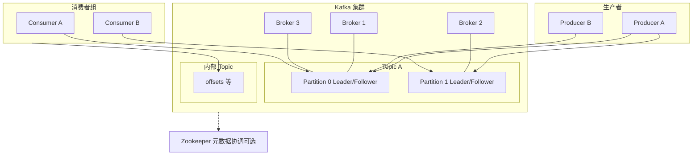

# Apache Kafka 笔记

面向「能打开 Markdown 预览」整理的要点：架构、角色、可靠性与 **Kafka 4.0** 新变化（KRaft、共享组、JDK 要求等）。可与同目录《消息队列》对照阅读。

## 目录

- [一、整体架构（生产者 → 集群 → 消费者）](#一整体架构生产者--集群--消费者)
- [二、协议、特性、推/拉与组件](#二协议特性推拉与组件)（含 [2.5 应用与典型场景](#25-应用与典型场景)）
- [三、核心概念速查](#三核心概念速查)
- [四、落盘、保留策略、ISR 与尽量不丢消息](#四落盘保留策略isr与尽量不丢消息)
- [五、生产者：投递模式、ACK、批量与顺序](#五生产者投递模式ack批量与顺序)
- [六、幂等生产者、事务消息、延时与消费侧实践](#六幂等生产者事务消息延时与消费侧实践)
- [七、Zookeeper 与 KRaft](#七zookeeper-与-kraft)
- [八、Kafka 4.0 要点](#八kafka-40-要点)
- [九、参考图（若已放入仓库）](#九参考图若已放入仓库)

---

## 一、整体架构（生产者 → 集群 → 消费者）

数据从 **生产者（Producer）** 写入 **Kafka 集群**，由多个 **Broker** 承载 **Topic** 与 **分区（Partition）**；**消费者（Consumer）** 以 **消费者组（Consumer Group）** 为单位拉取消息。老架构下由 **Zookeeper** 参与元数据与协调（新版本见 [七、Zookeeper 与 KRaft](#七zookeeper-与-kraft)）。

### 1.1 关系示意（Mermaid）



### 1.2 图上要点（对照理解）

| 方向 | 说明 |
| --- | --- |
| **生产者 → 分区** | 可带 **key**；对 key 做 hash 可让同一 key 落到同一分区，从而在 **分区内** 实现顺序消息。 |
| **Broker 与副本** | 每个分区有 **Leader** 与 **Follower**；副本分布在不同 Broker，用于容灾与 **Leader 选举**。 |
| **ISR 与选举** | 配置上常强调：避免「非 ISR 副本」被选出为主（例如 `unclean.leader.election.enable=false`），减少数据不一致风险。 |
| **消费者组** | **组内** 多消费者常对分区做 **负载均衡**（大致「一个消费者对接若干分区」）；**不同组** 订阅同一 Topic 时，各组各自消费一份，接近 **广播/多订阅**。 |
| **Offset** | 消费进度可提交到内部 **offsets** 相关 Topic；是否「算消费成功」与 **提交 offset 的时机** 强相关。 |

---

## 二、协议、特性、推/拉与组件

### 2.1 协议

**Producer、Broker、Consumer** 之间走 **Kafka 自定义的、基于 TCP 的二进制协议**，完全围绕 Kafka 的日志、分区、消费位点等模型设计；**不是** 为了做一套类似 **Protocol Buffers** 那种与中间件无关的「通用应用层协议」（PB 更常作为序列化格式，与这里的传输协议不是同一层概念）。

### 2.2 特性（摘要）

- **高吞吐**：顺序写盘、批量、零拷贝等（实现随版本演进）。
- **多分区、多副本**：水平扩展 + 容错。
- **持久化在磁盘**（原笔记「文档」多为笔误）：消息按 **日志 + offset** 存取，可当作 **持久化日志流 / 事件存储** 使用；是否类比「数据库」取决于业务（一般强调顺序读、高吞吐而非复杂查询）。

### 2.3 推 / 拉

| 链路 | 方式 | 说明 |
| --- | --- | --- |
| **Producer → Broker** | **推（发送）** | 生产端主动把消息发到 Broker。 |
| **Consumer ← Broker** | **拉（Pull）** | 消费者主动请求拉取；Broker 一般不向客户端持续推送数据流。 |

### 2.4 组件

#### Producer（生产者）

负责向指定 **Topic**（及可选 **key / 分区**）发送消息。

#### Topic（主题）

- 逻辑上的消息类别；生产和消费通常只需指定 **Topic**。
- 一个 Topic 下挂 **多个 Partition**。

#### Broker

- Kafka 集群中的节点；**Topic 的分区日志**分布在 Broker 集群里（多机、多目录）。

#### Partition（分区）

- **物理上的拆分单元**（笔记里可类比：接近 **RocketMQ 分片 + 队列** 合在一起的理解方式）。
- Topic 的存储空间拆成 **n 个分区**；新消息按策略进入其中一个分区，**同一条业务消息只存在于一个分区**（不会在多个分区各复制一份同内容来并行消费）。
- **副本**：开启 **`replication.factor`** 后，**同一分区日志**在集群里可有 **多份物理副本**（Leader / Follower），用于容错，与「一条消息进多个分区」不是一回事。

**消费者组与分区的关系**

- 订阅该 Topic 的 **每个 Consumer Group**，会把 Topic 下 **各分区** 在 **组内** 分配给不同 Consumer，实现 **组内并行**。
- **组内**：同一分区通常同一时刻只归 **一个** Consumer（rebalance 后可能换人），**同组内一条消息只被消费一次**（按 offset 推进）。
- **组间**：**多个 Group** 订阅同一 Topic 时，**每个 Group 各自从头跟踪 offset**，彼此独立，效果接近 **广播给不同订阅方**。

**分区数粗估（实践口诀）**

- 若每秒要从该 Topic **写入 + 读出约 1GB**，而单个消费者大约只能处理 **50MB/s**，可粗算需要约 **20～25** 个消费并行度（常对应分区与消费者规模，还要考虑生产端、磁盘、网络和下游，**仅作量级**）。
- 无脑启发式：**分区数 ≈ Broker 数量的 2～3 倍**；真实环境需结合顺序性、文件句柄、运维与再均衡成本调整。

**分区写入策略**

| 策略 | 说明 |
| --- | --- |
| **轮询** | 默认；消息依次轮到各分区，较均匀。 |
| **随机** | 随机选分区。 |
| **按 key** | 指定 **key** → 算 hash（如 hashCode）→ **固定落到某分区**。**同一 key 同分区** → **分区内有序**，适合做 **顺序消息**；不需要顺序的数据用不同 key，可同时享受 **多分区并行**。 |

#### Replication（副本）

- 副本主要做 **冗余与容灾**；生产与消费 **通常只跟分区的 Leader 打交道**（Follower 做同步，不是给多个消费者各读一遍同一条）。
- **Leader 选举**：经典集群依赖 **Controller + Zookeeper（或 KRaft）** 等机制；**写**先到 Leader，再复制到 ISR 内 Follower（细节见 [五、生产者：ACK](#五生产者投递模式ack批量与顺序)）。
- 副本粒度是 **分区**，且 **跨 Broker** 分布。
- **`replication.factor = N`** 时，在同步满足配置的前提下，常表述为大致可容忍 **N-1 台 Broker** 级别的故障（仍取决于 ISR、是否 unclean 选举等，不能死记公式）。

#### Consumer Group（消费者组）

- Consumer 必须属于某个 **Consumer Group**。
- **开发习惯**：一个业务线/应用常对应 **一个 Group**；多实例部署时，多个进程使用 **同一个 `group.id`**，即 **一个 Group 多个 Consumer**，由 Kafka **自动做分区再均衡**，自带 **负载均衡**。
- **与「广播」的关系**：**广播**一般指 **多个不同的 Group** 各收一份；**不是** 指同一 Group 里每个 Consumer 都收到全量同一条消息。

#### Consumer（消费者）

从 Broker **拉取**消息，按分配到的分区与 **offset** 顺序处理。

### 2.5 应用与典型场景

| 方向 | 说明 |
| --- | --- |
| **数据管道（Data Pipeline）** | 采集与分发之间搭 **可扩展的流式管道**，做 **实时处理与分析**。例如：埋点采集、**日志聚合**、**链路/网络追踪**、**用户行为流** 等。 |
| **数据存储 / 日志型存储** | 把 Kafka 当 **高吞吐持久化日志** 使用，沉淀大量事件供后续 **批处理、离线分析**（数据挖掘、机器学习、报表等）。读取时可结合 **指定分区 + offset（或时间）** 控制 **拉取条数与范围**（与 Consumer API / `seek` 等配合）。 |
| **实时流处理** | 与 **Flink**、**Storm**、**Samza** 等低延迟引擎对接，做 **实时计算、CEP、实时大屏**；是很多 **实时分析 / 日志处理** 的主路径之一。**Spark Streaming** 等也可从 Kafka 读流（技术栈随时代演进，以当前选型为准）。 |
| **系统日志与排障** | 各系统日志 **统一进 Kafka**，集中存储与检索，便于 **关联分析、审计、快速定位** 线上问题。 |
| **企业级日志总线** | 多服务 log **统一接入**，Kafka 作为 **标准出口** 对接 **Hadoop、HBase、Solr/ES** 等消费者；大流量场景（课程举例 **每天约 20TB** 级）需单独做 **分区、集群、保留与下游吞吐** 设计。 |
| **消息系统** | **解耦** 生产与消费、**削峰**、异步协作；Topic 多订阅者各用自己的 Group。 |
| **用户活动跟踪** | Web/App **浏览、搜索、点击** 等写入 Topic；订阅方做 **实时监控**，或落 **Hadoop / 数仓** 做 **离线挖掘**。 |
| **运营与监控指标** | 汇聚分布式应用 **运行数据**、操作反馈，支撑 **告警、报表、看板**。 |
| **事件源（Event Sourcing）** | 把业务变更记为 **不可变事件流**；Kafka 作 **事件日志**，下游可 **重放** 重建状态（需与领域模型、快照策略等一起设计）。 |

---

## 三、核心概念速查

| 概念 | 一句话 |
| --- | --- |
| **Topic** | 逻辑上的消息类别。 |
| **Partition** | Topic 的水平拆分单元；**分区内** 消息有序（按 offset），跨分区无序。 |
| **Broker** | Kafka 进程/节点，存分区日志。 |
| **Producer** | 发送消息；可用 **PID + 序列号** 等机制做发送侧幂等（与版本/配置有关）。 |
| **Consumer Group** | 组内协调分配分区；组与组之间彼此独立。 |
| **Offset** | 分区内的消费位点。 |

**模式对照（口语化）：**

- **发布/订阅感**：一个 Topic 上挂 **多个消费者组**，每组都能拿到全量（各组各算一份）。
- **队列感**：一个 Topic 若只有 **一个消费者组** 且组内协作消费，更接近「任务被组内瓜分」。

---

## 四、落盘、保留策略、ISR 与尽量不丢消息

### 4.1 落盘：追加写与顺序 I/O

- 每条消息 **append** 到对应 **Partition** 的日志末尾，属于 **顺序写磁盘**；配合页缓存、批量发送等，吞吐很高。
- 课程/分享里常说：**顺序写磁盘** 的吞吐可以 **高于随机写内存**（与 **工作集大小、是否命中缓存、块设备与内核调优** 强相关）。这句话用来建立直觉即可，**不要当成绝对定律**；Kafka 高吞吐还依赖 **批量、零拷贝、分区并行** 等。

### 4.2 可靠性：Topic、Broker、Producer 如何配合

| 位置 | 参数 | 笔记含义 |
| --- | --- | --- |
| **Topic** | **`replication.factor`** | 建议 **> 1**（常见 **≥ 3**），即每个分区有 **多副本**（Leader + Follower），Leader 故障时可切换。 |
| **Broker** | **`min.insync.replicas`** | 建议 **> 1**：`acks=all` 时，**至少要有这么多副本在 ISR 里** 同步到位，才允许算「提交」；避免「只剩 Leader 自己」也算成功。 |
| **Producer** | **`acks=all`（或 `-1`）** | 写入需满足 **ISR + `min.insync.replicas`** 规则后才返回成功；**不是** 字面意义「磁盘上每一个副本都写完」（**掉队副本**会先退出 ISR）。 |

### 4.3 「分区溢出」在实践里常指什么

Kafka 的分区 **没有** 像数组那样的固定「容量上限」字段；笔记里的 **分区溢出** 多指：

- **Broker 磁盘被写满** 或 **单节点磁盘配额** 打满，导致 **无法继续 append**；
- **保留策略配置不当**，日志无限涨，最终占满盘或拖垮 IO；
- 单分区 **数据量过大** 带来的 **恢复慢、迁移慢、文件句柄与运维压力** 等「撑爆」体感。

后果可能是 **写入失败、延迟飙升、副本跟不上** 等，需要从 **磁盘规划、保留策略、分区数、副本分布** 一起治理。

### 4.4 消息保留与删除策略

- **按时间**：`retention.ms`（等）控制 **最长保留多久**。
- **按大小**：`retention.bytes`（等）控制 **分区日志上限**（超过则删最老 segment）。
- **扩容思路（对比「当数据库」）**：需要更高吞吐或分散数据时，常 **加分区、加机器、调保留**；**不要** 把「为了腾地方而删消息」当成常规扩容手段——是否可删由 **业务是否仍要消费历史** 决定。

### 4.5 ISR 与 `unclean.leader.election.enable=false`

- **ISR（In-Sync Replicas）**：与 Leader **同步进度在阈值内** 的副本集合；掉队的会被移出 ISR。
- **`unclean.leader.election.enable=false`**：**禁止** 在 **非 ISR** 副本里选出新 Leader。这样能减少 **数据落后副本当选** 带来的 **丢数据 / 不一致** 风险。
- **代价**：极端情况下（例如 ISR 全挂）可能出现 **分区短时间不可写/不可用**，属于 **可靠性 vs 可用性** 的取舍。

### 4.6 保证 Broker 侧「尽量不丢消息」：配置清单

1. **`unclean.leader.election.enable=false`**：避免非 ISR 当选 Leader，降低「用旧数据当主」的风险。
2. **`replication.factor >= 3`**：多副本，Leader 宕机后仍有 Follower 可升为 Leader 继续服务（视 ISR 与同步情况而定）。
3. **`min.insync.replicas > 1`**：强制 **至少多个 ISR 副本** 确认后才算提交，提高持久性。
4. **`replication.factor > min.insync.replicas`**：若二者 **相等**，任意 **一个副本异常** 就可能导致 ISR 缩到低于 `min.insync.replicas`，在 **`acks=all`** 下容易出现 **整分区无法写入**。实践上常取 **`replication.factor = min.insync.replicas + 1`**，在 **持久性** 与 **容忍一台副本故障仍可读写的空间** 之间更稳。

**说明**：以上保证的是 **Broker 日志侧** 尽量不丢；端到端还要 **消费确认 offset、业务落库** 等配合（见第六节）。

---

## 五、生产者：投递模式、ACK、批量与顺序

### 5.1 消息投递模式（与客户端写法）

| 模式 | 常见做法 | 说明 |
| --- | --- | --- |
| **至多一次** | `producer.send(record)` **不等待**结果（fire-and-forget） | 发完即认为结束，**可能丢消息**；不关心 Broker 是否真正落盘。 |
| **至少一次** | **同步**：`producer.send(record).get()`，阻塞直到拿到结果；异常即视为本次发送失败 | 可结合 **重试**；可能 **重复**（需幂等或下游去重）。 |
| **至少一次** | **异步**：`send(record, callback)`，在回调里根据 `Exception == null` 判断成功 | 同样可能因重试产生重复；回调里注意线程安全。 |

### 5.2 消息发送确认（`acks`）

**每个分区只有一个 Leader**，其余为 Follower；不要用「所有 leader」这种表述。

| `acks` | 含义 |
| --- | --- |
| **0** | **不等** Broker 确认；吞吐高、最易丢。 |
| **1** | **Leader** 写入成功即返回；Follower 未同步完时 Leader 宕机仍可能 **丢数据**。 |
| **all** 或 **-1** | Leader 写入后，需 **ISR（同步副本集合）** 内副本按规则 **复制确认** 后再应答生产者，**更强防丢**（仍非 100%，取决于 ISR、选举等）。 |

**与 `min.insync.replicas` 配合（笔记）**

- `acks=all` 时常同时配置 **`min.insync.replicas`**（例如副本数为 N 时设为 **N-1** 或按 SLA 调整），避免「只剩 Leader 在 ISR 里」时仍返回成功、实际容错为 0。
- 直观理解：**Follower 同步达标后**，Leader 才会对生产者返回「写成功」（具体以 ISR 与协议为准，勿简化为「每个 follower 各回一条 ack 给 leader」的机械模型）。

### 5.3 副本与投递语义（小结）

- Topic **`replication.factor`**、Broker **`min.insync.replicas`**、Producer **`acks=all`** 及 **`unclean.leader.election.enable`** 的详细说明与 **防丢清单**，见 **[第四节](#四落盘保留策略isr与尽量不丢消息)**。
- 端到端常见是 **至少一次**；**精确一次**要生产（幂等/事务）+ 消费 + 外部状态一起设计。

### 5.4 批量发送（机制）

Producer 默认会把发往 **同一分区** 的消息 **攒批**：**批次达到 `batch.size`** 或 **`linger.ms` 超时** 再真正发出，换 **更高吞吐**。

- 需要 **更低延迟** 或 **更强「逐条」可控性** 时，可调小 `linger.ms`、调小批次等（笔记里写「禁止」多指 **特定场景下不要依赖默认大批次**，并非 Kafka 禁止批量）。
- 与 **顺序、排查问题** 冲突时，结合业务调参。

### 5.5 顺序消息

- **同一 key** → 同一分区 → **分区内** 按 offset **有序**；不需要顺序的用不同 key，兼顾 **多分区并行**。
- **注意**：**Broker / Leader 故障、重试、多分区** 等仍可能导致你观测到 **乱序或重复**（例如切换 Leader、客户端重试）；要严格顺序需 **单分区 + 单消费者** 等更强约束，并接受 **可用性与吞吐** 的取舍。

---

## 六、幂等生产者、事务消息、延时与消费侧实践

### 6.1 幂等生产者（可选但常用）

在 **重试** 场景下，Broker 可能 **成功写入了但 ACK 没到 Producer**，Producer 重试会导致 **同分区同内容重复写入**。开启幂等后，Broker 用 **ProducerId（PID）+ 序列号（SequenceNumber）** 去重（**单分区、单 Producer 会话** 语义，非全局跨所有分区/所有进程）。

| 项 | 说明 |
| --- | --- |
| **配置** | `enable.idempotence=true`（Spring：`spring.kafka.producer.enable-idempotence: true`）。 |
| **ProducerId** | 新 Producer 实例初始化时由 Broker 分配，**对业务代码通常不可见**。 |
| **SequenceNumber** | 每个 PID 下，按 **Topic + 分区** 维护 **从 0 单调递增** 的序号。 |
| **重复场景** | 消息已追加到日志，**回 ACK 时网络异常** → Producer 认为失败 **自动重试** → 相同 PID + 序号被 Broker 识别为重复，**日志中不重复落两条**。 |
| **自动重试** | 发送失败会按 **`retries`** 等配置重试，直到上限。 |
| **作用范围** | **单分区**内防重复发送；**单会话**（一般对应 **一个 Producer 进程生命周期**），**重启 Producer** 后 PID 会变，**不继承**跨进程的幂等承诺。 |

### 6.2 事务消息（发送事务 + 消费端隔离）

**发送事务（概念链路）**：业务准备 → **Broker 持久化** → **Broker 对 Producer 的 ACK** → Producer 收到 ACK；期间异常需按 API **中止事务** 才会 **回滚** 已参与事务的消息（以官方事务语义为准）。

**Producer 端**

- `enable.idempotence=true`
- 设置 **`transactional.id`**（事务性 Producer 标识，集群内用于幂等与 fencing，勿随意复用冲突）

**Consumer 端（读事务性写入时的隔离）**

| `isolation.level` | 含义 |
| --- | --- |
| **read_uncommitted**（默认） | 事务未提交的消息也可被读到。 |
| **read_committed** | 只读 **事务 Producer 已提交** 的消息；**非事务 Producer** 写的消息 **照常可见**。 |

### 6.3 延时消息（非原生能力，慎用）

Kafka **没有**像 RocketMQ 那样标准的 **延时级别**；常见 **曲线救国**：

- 利用 **消息时间戳**：生产端把 **`timestamp`** 设为「希望开始处理的时间」，消费端 **拉到后判断** 若未到点则 **跳过、睡眠再处理或重新入队** 等（实现杂乱，易堆积）。
- **缺点**：延时 **不精确**，受 **消费延迟、堆积、时钟** 等影响。

**替代思路（笔记）**：用 **调度系统**（如 **XXL-JOB**）到点执行；执行成功后 **调 API 关闭该任务**，避免重复触发。

### 6.4 消费者：Pull、Offset、`__consumer_offsets`、回溯与 Rebalance

**Pull 模式**  
消息由 Consumer **主动向 Broker 拉取**；Broker **不**像推送模型那样把消息逐客户端推过去。

**Offset**  
Partition 内消息 **顺序排列**，用 **offset** 标识每条消息的位置；消费进度用 **已提交（committed）的 offset** 表示「该组在该分区读到哪里」。

**`__consumer_offsets`（内部 offsets topic）**  
Consumer **提交**的位点会写入集群内部主题（常记为 **offsets topic**，实现上多为 **`__consumer_offsets`**）。笔记里一种业务口径是：**只有 offset 提交成功后**，才认为「消费侧已确认处理进度」；监听器/客户端 **按最新已提交 offset** 决定默认从哪里继续拉。

**Broker「无状态」说法怎么理解（不要绝对化）**  
- Broker **不在内存里**为每条消息维护「被谁取走、是否 ack」这类 **逐条投递状态**；Partition 日志主要是 **追加 + 保留策略**。  
- **由 Consumer 控制**拉取位点；**同组内分区分配**由协调协议完成，**不是**对每条消息加锁。  
- 但 **已提交 offset** 会 **持久化** 在 `__consumer_offsets` 等内部 topic 上，**不是**「完全不存任何消费状态」。课程里强调的重点是：**无推送、无逐消息锁**，有利于 **高吞吐**。

**消息回溯**  
- 提交 offset **不会**立刻删除业务 Topic 数据；在 **保留未过期** 的前提下，可 **重复消费** 尚未被清理的消息。  
- 若 **第一条未提交、第二条先提交** offset，则对「总是从已提交位点继续」的消费方式来说，**第一条可能再也不会被自动拉到**，除非 **按第一条的 offset 手动 seek** 或调整策略。  
- 支持 **手动指定 offset**（如 `seek`、重置位点）做重放或补偿。

**Rebalance（重平衡）**  
Consumer Group 内 **实例挂掉、扩容缩容、订阅变更** 等会触发 **分区在存活实例间重新分配**。期间可能 **短暂停读**；若 **提交 offset 与业务处理** 搭配不当，容易叠加 **丢消息或重复消费**（与 6.5、6.7 一起看）。

---

### 6.5 自动提交与手动提交

**自动提交（高可靠场景常关闭）**  
- **`enable.auto.commit`** 默认 **true**：按 **`auto.commit.interval.ms`**（默认约 **5000** ms）**周期性提交**，提交的是客户端维护的位点，**与业务处理完成时刻无原子绑定**。

**「处理业务」与「提交 offset」非原子带来的典型问题**

| 情况 | 后果（笔记示意） |
| --- | --- |
| **消费失败** | 消息还在处理，已到周期 **自动提交了** 例如 offset 1～10，进程宕机 → 重启从 **11** 拉 → **1～10 未处理却跳过**（**丢**）。 |
| **重复消费** | 已处理完但 **未到提交周期** 宕机；或 **处理完尚未手动提交** 宕机；或 **Rebalance** 后分区换实例 → **再拉同一批**（**重复**）。 |

Kafka **消费失败没有统一的自动重试**；要靠 **重试表、死信队列、定时补偿** 等自建。

**应对思路（与幂等）**  
- 严控场景：**不要依赖自动提交**；**poll 批量不要过大**（见 6.7）；**业务成功后再提交 offset**。  
- **消费幂等**：**消费事件表** + **业务主键**，成功记「已消费」再提交；失败记状态并 **带 offset** 供补偿。

**手动提交：`enable.auto.commit=false`**  
- 关闭后 **`auto.commit.interval.ms` 不再参与自动提交**。  
- 若从未成功提交过 offset，重启后常按 **`auto.offset.reset`** 行为消费，可能表现为 **大量重放**（见 6.6）。

**异步提交**  
调用后 **不等结果**；可能出现 **小 offset 提交失败、大 offset 先成功**，后续补提交小 offset 导致 **位点回拨** → **重复消费**。要谨慎，关键路径更常用 **同步提交**。

**同步提交**  
**阻塞**到 Broker 确认提交结果，语义更易推理。

---

### 6.6 Spring Kafka：`AckMode`、同步提交与 `auto.offset.reset`

**容器侧（示例配置思路）**  
- `enable.auto.commit=false`  
- `factory.getContainerProperties().setSyncCommits(true)`：**同步提交**（与异步提交按需求二选一，以所用 **spring-kafka** 版本 API 为准）。  
- `factory.getContainerProperties().setAckMode(AbstractMessageListenerContainer.AckMode.MANUAL_IMMEDIATE)`（或按下表选用）。

**常用 `AckMode`**

| 模式 | 含义（摘要） |
| --- | --- |
| **RECORD** | **每条**处理完即提交 offset。 |
| **BATCH** | 本轮 **`poll()` 返回的一批** 全部处理完后提交（常见默认）。 |
| **TIME** | 批处理完且距上次提交超过 **`ackTime`**。 |
| **COUNT** | 批处理完且自上次提交已处理 **`ackCount`** 条。 |
| **COUNT_TIME** | **TIME** 与 **COUNT** **任一**满足即提交。 |
| **MANUAL** | 使用 **`Acknowledgment`** 手动 ack；与批次的组合语义接近 BATCH 一侧（以当前版本文档为准）。 |
| **MANUAL_IMMEDIATE** | 调用 **`Acknowledgment.acknowledge()`** 时 **立即提交**。 |

**Lag 直觉**  
生产持续写入时 **log end** 会涨；**只有提交后** committed offset 才前进——**务必在业务处理成功后再 `acknowledge()`**。

**手动 Ack 三件套（要点）**  
- `ConsumerConfig.ENABLE_AUTO_COMMIT_CONFIG = false`  
- `AckMode = MANUAL_IMMEDIATE`（或 `MANUAL`）  
- 监听方法增加 **`Acknowledgment ack`**，成功执行 **`ack.acknowledge()`**。  
- **不 ack**：相当于暂不确认进度（需关注 **`max.poll.interval.ms`**、会话过期等，否则可能被踢出组触发 rebalance）。

**`auto.offset.reset`（无已提交 offset 时从哪开始）**

| 值 | 行为 |
| --- | --- |
| **none** | 找不到已提交 offset 时 **抛异常**，强制显式处理位点。 |
| **earliest** | **有** 已提交 offset → 从该位点继续；**没有** → 从 **最早** 可用消息开始。 |
| **latest** | **有** 已提交 offset → 从该位点继续；**没有** → 从 **最新** 开始（历史积压可能被跳过）。 |

---

### 6.7 批量消费（批量拉取）

- **`max.poll.records`** 等控制 **单次 `poll` 最多返回条数**：批 **越大** 往往 **吞吐越高**，但 **单批处理时间越长**，越容易触碰 **`max.poll.interval.ms` / 会话心跳** 导致 **Rebalance**；且 **提交粒度变粗**，一旦出问题 **影响条数更多**。  
- **高可靠**：倾向 **较小批量 + 手动提交 + 下游幂等**；**高吞吐** 可加大批量并接受 **至少一次** 与补偿设计。

---

## 七、Zookeeper 与 KRaft

| 阶段 | 说明 |
| --- | --- |
| **经典模式** | Zookeeper 存集群元数据、协助 Controller 等；图上常见「ZK 记录谁是 Leader」这类描述。 |
| **演进** | **Kafka 2.8+** 起可逐步 **脱离 ZK**（KRaft）；**Kafka 4.0** 默认走向 **KRaft**（见下节）。 |

---

## 八、Kafka 4.0 要点

### 8.1 默认 KRaft（Kafka Raft），去掉 ZK 依赖

1. **元数据自管理**：基于 **Raft**；元数据落在内置的 **`__cluster_metadata`** 主题中，由 **Controller**（选举产生）统一管理。
2. **日志复制**：各 Broker 作为 Raft 中的 Follower，**复制 Controller 的元数据日志**，追求元数据侧一致性。
3. **快照与恢复**：定期 **元数据快照**，避免日志无限膨胀；故障恢复从 ZK 时代常见的 **分钟级** 优化到更偏 **秒级**（与规模与实现有关）。

### 8.2 共享组（Share Group）与「队列语义」

Kafka 4.0 通过 **共享组** 让 **多个消费者可同时处理同一分区** 的消息（突破「消费并行度受分区数限制」的传统印象），关键技术点：

| 点 | 说明 |
| --- | --- |
| **多消费者协同** | 同一分区消息可被多消费者并行处理。 |
| **记录级锁** | 消费时对消息加锁，**TTL** 控制锁时长，降低重复处理窗口。 |
| **ACK / NACK** | 支持按条确认；可走向 **精确一次** 或配合重试的 **至少一次**（以官方语义与配置为准）。 |

### 8.3 其他新变化（笔记摘录）

- **动态配置**：例如 **`num.io.threads`** 可按 **CPU 核数** 更动态地利用 IO 线程。
- **按时间定位消费**：支持从某个 **时间点**（如「24 小时前」）开始消费，而不只依赖固定 offset（能力与客户端/API 版本相关）。

### 8.4 Java 版本要求（4.0）

| 组件 | JDK |
| --- | --- |
| **客户端、Kafka Streams** | **Java 11** |
| **Broker、Connect、工具** | **Java 17** |

---

## 九、参考图（本地配图）

若你把原架构图/4.0 笔记图放在与预览工具一致的 **assets** 目录下，可取消注释或改成实际文件名：

```markdown
<!-- 架构示意图


-->
```

（若工具导出的 png 文件名较长，可统一放进本篇使用的 **assets** 目录，与上方注释块中的文件名保持一致即可。）

---

*文档由笔记图整理，部署参数与精确语义以对应版本的 [Apache Kafka 官方文档](https://kafka.apache.org/documentation/) 为准。*
