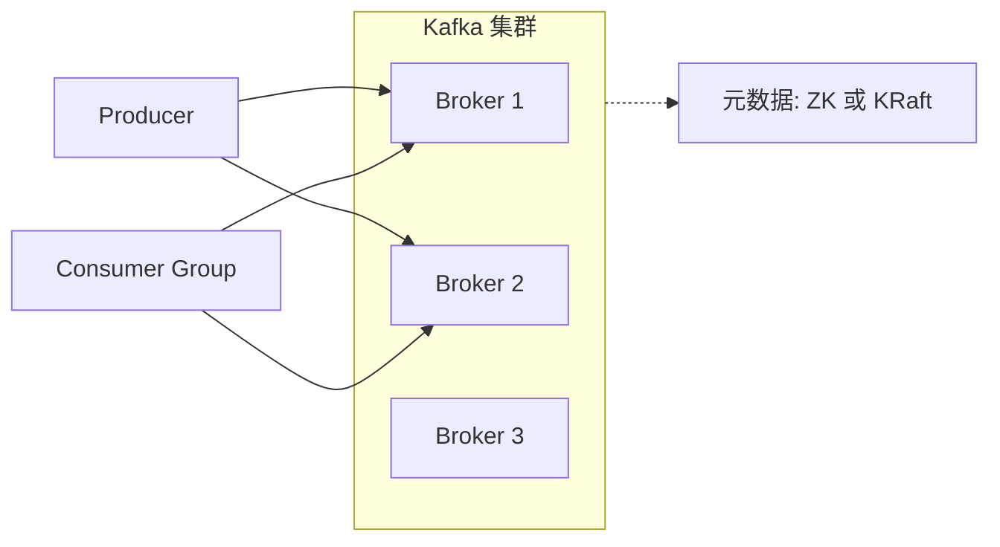
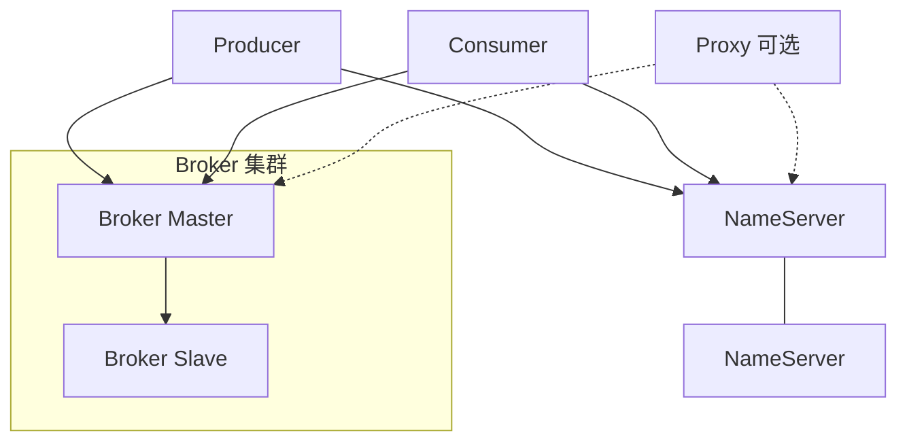
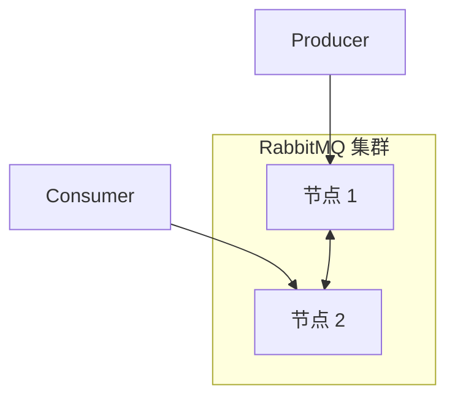

# MQ 物理架构对比（Kafka / RocketMQ / RabbitMQ）

**你在做的事**：把三款常见 MQ 从**「机器上跑什么、谁连谁、数据落在哪」**的角度放在一起看，方便和《MQ 选型》里的业务选型对照；**不是**替代各产品专项笔记里的协议与 API 细节。

**本文怎么用**：先看 [一、一页总表](#一一页总表) 建立直觉，再按需展开 [二～五节](#二物理拓扑一句话)；落地仍以官方文档与压测为准。

**建议搭配阅读**

- 选型与场景：《MQ 选型》 · 《消息队列》
- 专项笔记：《Kafka》 · 《RocketMQ》 · 《RabbitMQ》

---

## 目录

- [一、一页总表](#一一页总表)
- [二、物理拓扑一句话](#二物理拓扑一句话)
- [三、协调与元数据组件](#三协调与元数据组件)
- [四、存储与扩展单元](#四存储与扩展单元)
- [五、高可用与容灾（物理视角）](#五高可用与容灾物理视角)
- [六、对照示意图（Mermaid）](#六对照示意图mermaid)
- [七、运维与规划时的差异](#七运维与规划时的差异)

---

## 一、一页总表

| 维度 | Kafka | RocketMQ | RabbitMQ |
| --- | --- | --- | --- |
| **典型进程/角色** | **Broker**（多实例）；**Controller**（KRaft 模式下一组控制器） | **NameServer**（可多实例）；**Broker**（常主从）；**Proxy**（5.x / 云原生接入常见） | **RabbitMQ 节点**（Erlang 进程），集群内多 **Broker 节点** 概念上等同「多机」 |
| **客户端先找谁** | **Bootstrap brokers**（一串地址，再拉全量元数据） | **NameServer** 查路由，再连 **Broker**（或经 **Proxy**） | **任一集群节点**（AMQP 连接），集群内路由由 **Erlang 分布式** 与插件完成 |
| **逻辑↔物理映射** | **Topic** 逻辑；**Partition** 物理（每分区多副本跨 Broker） | **Topic** 逻辑；**MessageQueue** 在 **Broker** 上；Topic 可跨多 Broker | **Exchange / Queue** 多在**集群元数据**中声明；队列主所在节点存消息（镜像/仲裁另说） |
| **独立协调集群** | **ZooKeeper**（老架构）或 **无 ZK：KRaft**（控制器法定人数） | **无 ZK**；**NameServer** 轻量、彼此**最终一致** | **无** 类似 NameServer / ZK 的独立组件；依赖 **Erlang 集群** 与 **插件** |
| **副本/高可用粒度** | **分区副本**（Leader / Follower，ISR） | **Broker 主从**（CommitLog 等同步；主挂时写入语义需查版本） | **队列策略**：经典**镜像队列**、**仲裁队列（Quorum）** 等，与版本选型强相关 |
| **存储形态（典型）** | 每分区 **日志段（segment）** 顺序追加 | **CommitLog** 统一追加 + **ConsumeQueue** 索引 + **Index** | **队列索引 + 消息体**（持久化消息落盘）；大量路由在 **内存** 中完成 |

---

## 二、物理拓扑一句话

### 2.1 Kafka

- 多台机器各跑一个 **Broker**；每个 **Topic** 被切成多个 **Partition**，每个分区在集群中有 **replication.factor** 份副本，**分散在不同 Broker**。
- 生产、消费通常只与分区的 **Leader Broker** 打交道；Follower 做同步与容灾。
- 集群级元数据与控制器选举：传统依赖 **ZooKeeper**，新集群多用 **KRaft**（一组 **Controller** 节点或 Broker 兼任，以实际部署为准）。

### 2.2 RocketMQ

- **NameServer** 可部署多台（无强一致主从），各 Broker 向**每一台** NameServer 注册路由；客户端从 NameServer **拉路由表**，再直连 **Broker**。
- **Broker** 常 **Master / Slave** 成对或成组部署；消息体默认在 Broker 本机磁盘的 **CommitLog** 中顺序写，消费索引在 **ConsumeQueue**。
- **5.x / 云原生**形态下，外围常有 **Proxy**：客户端连 Proxy，由 Proxy 再与 NameServer、Broker 协作（细节见《RocketMQ》专项）。

### 2.3 RabbitMQ

- 每台机器一个 **RabbitMQ 服务节点**；多节点组成 **集群** 时，共享**元数据**（交换机、绑定、队列信息等），但**队列消息**默认以**主队列所在节点**为落点（未镜像时）。
- 客户端通过 **TCP + AMQP** 连到某一节点；集群内可能将客户端重定向或转发（与客户端与集群配置有关）。
- **高可用**多在**队列层**选策略（镜像、仲裁等），而不是像 Kafka 那样「每个分区自带多副本日志」的同构模型。

---

## 三、协调与元数据组件

| 产品 | 组件 | 物理含义（通俗说） |
| --- | --- | --- |
| **Kafka** | **ZooKeeper** 或 **KRaft** | 存 Topic/分区/ISR/Controller 等**集群元数据**与选举；KRaft 下用内置 Raft 日志替代外部 ZK。 |
| **RocketMQ** | **NameServer** | **只关心路由**（Broker、Topic、队列在哪），**不存消息**；设计轻、可水平扩；各实例间**无强一致同步**。 |
| **RabbitMQ** | （无独立第三方协调器） | **集群内部**通过 Erlang 机制同步**拓扑与策略**；队列 HA 由**镜像/仲裁**等策略在集群内实现。 |

**对比记忆**：Kafka 的「协调」更重（分区、选举、ISR）；RocketMQ 的 NameServer **刻意做轻**；RabbitMQ 把很多复杂度放在 **AMQP 路由与队列策略** 上，而不是单独拆一个「路由中心进程」。

---

## 四、存储与扩展单元

| 产品 | 主要扩展/分片单元 | 磁盘上典型长什么样 |
| --- | --- | --- |
| **Kafka** | **Partition**（+ 副本） | `topic-partition` 目录下 **segment** 文件链，顺序追加。 |
| **RocketMQ** | **MessageQueue**（在 Broker 上，与 Topic 规划相关） | 全 Topic **共用 CommitLog** 追加写；按队列的 **ConsumeQueue** 做消费索引；可选 **IndexFile** 按 Key 查。 |
| **RabbitMQ** | **Queue**（长度、惰性队列、持久化策略影响落盘与内存） | 持久化消息进 **Mnesia/消息存储**（实现随版本变化）；**交换机路由表**偏内存。 |

**读扩展时的直觉**：Kafka 加吞吐常**加分区、加 Broker**；RocketMQ 常**加 Broker、规划队列数**；RabbitMQ 常**加节点 + 调队列类型与镜像**，并注意**单队列热点**。

---

## 五、高可用与容灾（物理视角）

| 产品 | 常见做法 | 要接受的行为（口语） |
| --- | --- | --- |
| **Kafka** | 分区 **多副本** + **Leader 切换**；配合 `acks`、`min.insync.replicas` 等 | 网络分区或 ISR 收缩时，可能出现**短暂不可写**或需理解 **unclean 选举** 风险。 |
| **RocketMQ** | **Broker 主从**、同步/异步复制、同步/异步刷盘 | Master 故障时，**写入能力**与**是否可从 Slave 读**依赖部署模式与版本说明。 |
| **RabbitMQ** | **集群多节点** + **镜像队列** 或 **仲裁队列** | 镜像有**同步开销**；仲裁队列与经典队列在**一致性语义、性能**上取舍不同，升级前要读发行说明。 |

三者都不是「插上电源就永不丢消息」：**副本/刷盘/确认/业务幂等**要一起看。

---

## 六、对照示意图（Mermaid）

### 6.1 Kafka（概念）

要点：**分区 Leader 分散在各 Broker**；元数据由 **ZK/KRaft** 维护（图略去分区细节）。

### 6.2 RocketMQ（概念）

要点：客户端**先问路由**再连 Broker；**Proxy** 为可选接入层。

### 6.3 RabbitMQ（概念）

要点：**无独立 NameServer**；交换机路由在节点内（及集群同步的元数据）完成；**队列 HA** 由策略配置，不在此图展开。

---

## 七、运维与规划时的差异

| 关注点 | Kafka | RocketMQ | RabbitMQ |
| --- | --- | --- | --- |
| **扩容第一印象** | 加 Broker、调分区、再均衡 | 加 Broker、注册到 NameServer、Topic 队列规划 | 加集群节点、调整**镜像/仲裁**与队列落点 |
| **网络分区** | Controller/ISR 行为要专项预案 | NameServer 与 Broker 注册关系要监控 | 集群**脑裂**与队列可用性依赖版本与策略 |
| **磁盘** | 分区数 × 副本 × 保留 = 规划核心 | CommitLog 与磁盘水位、清理策略 | 持久化队列堆积、惰性队列、内存高压 |
| **和「日志管道」亲缘** | 极强（分区日志一等公民） | 强（CommitLog 模型） | 弱一些（队列 + 路由为中心） |

---

*本文与《mq 选型》互补：选型回答「业务上选谁」；本文回答「机房/进程/磁盘上长什么样」。细节修订请以各专项笔记与官方文档为准。*
