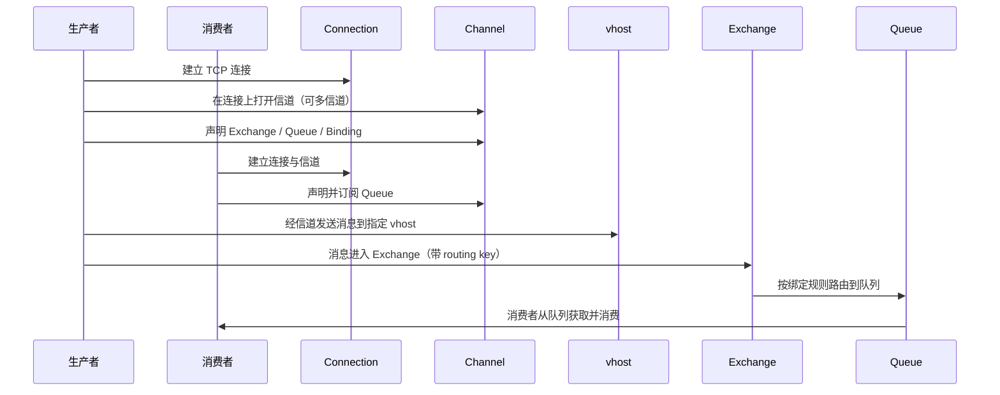

# RabbitMQ 笔记

面向「能打开 Markdown 预览」整理的要点：**AMQP、虚拟主机、交换器与路由（含交换机类型）**、连接与信道、生产消费流程、**发送确认（事务 / Confirm）**、**延迟队列**与**顺序消费**、**持久化 / 内存与惰性队列**、**TTL 过期规则**、**消费确认 / 重试 / 死信 / 幂等与 QoS**，以及 **Spring Boot / Spring AMQP 用法**。可与同目录《消息队列》《Kafka》《RocketMQ》对照阅读。

## 目录

- [一、关系与模型速览](#一关系与模型速览)
- [二、协议与适用场景](#二协议与适用场景)
- [三、特性摘要](#三特性摘要)
- [四、核心组件](#四核心组件)
- [五、角色与概念对照](#五角色与概念对照)
- [六、执行流程（连接 → 生产 → 路由 → 消费）](#六执行流程连接--生产--路由--消费)
- [七、使用步骤（实操顺序）](#七使用步骤实操顺序)
- [八、参考图（若已放入仓库）](#八参考图若已放入仓库)
- [九、Spring / Spring Boot 中的 AMQP 用法](#九spring--spring-boot-中的-amqp-用法)
- [十、交换机类型与路由（direct / fanout / topic / headers / 延时插件）](#十交换机类型与路由direct--fanout--topic--headers--延时插件)
- [十一、典型消息模型（点对点、广播/发布订阅、路由、主题）](#十一典型消息模型点对点广播发布订阅路由主题)
- [十二、发送确认、延迟队列与顺序消费](#十二发送确认延迟队列与顺序消费)
- [十三、持久化、内存压力与TTL](#十三持久化内存压力与ttl)
- [十四、消费确认、重试、死信、幂等与预取](#十四消费确认重试死信幂等与预取)

---

## 一、关系与模型速览

| 维度 | 说明 |
| --- | --- |
| **用户与 vhost** | 用户通常被指派至少一个 **vhost**；只能访问被指派 vhost 内的队列、交换器与绑定。**vhost 之间完全隔离**。 |
| **交换器 + 路由键 → 队列** | 消息先到 **Exchange**，再按 **routing key** 与 **Binding** 规则路由到一个或多个 **Queue**；同一业务键可对应多个队列（发布订阅等模式）。 |
| **队列** | **队列名称在 vhost 内唯一**；消息最终被投递到这里，由消费者取走，消费后从队列移除。**RabbitMQ 的队列没有 Kafka 那种「分片 + 多副本」的同一套模型**（高可用靠镜像队列、仲裁队列等机制，另文可细写）。 |

---

## 二、协议与适用场景

- **协议**：使用 **AMQP** 实现（RabbitMQ 以 AMQP 0-9-1 为主）。
- **AMQP 特征**：面向 **消息、队列、路由、可靠性、安全**。
- **常见定位**：更多用在 **企业系统内**，对 **数据一致性、稳定性、可靠性** 要求高的场景；对 **极致性能与吞吐量** 的优先级往往次于上述目标（与 Kafka 等偏吞吐的场景可对比理解）。

---

## 三、特性摘要

- **可靠性**：持久化、确认机制、死信等（具体配置在实战章节展开）。
- **灵活路由**：Exchange 类型 + Binding + RoutingKey，支持多种消息模式。
- **集群与高可用**：主备、远程、**镜像**、多活等部署形态（按版本与架构选型）。
- **多协议**：除 AMQP 外，还可通过插件支持 **STOMP、MQTT** 等。
- **多语言客户端**与 **插件机制**，便于扩展。

---

## 四、核心组件

### Virtual host（vhost）

- **多租户与安全隔离**：每个用户在自己的 vhost 内创建 exchange / queue 等。
- 每个 RabbitMQ **Broker** 上可建多个 vhost；每个 vhost 相当于一个 **迷你版 RabbitMQ**，拥有独立的队列、交换器、绑定与 **权限体系**。
- **AMQP 要求连接时指定 vhost**；默认存在 vhost **`/`**，可用默认用户 **`guest` / `guest`** 访问（生产环境务必改默认账号与权限）。
- 在**集群**上创建 vhost 时，会在**整个集群**可见该 vhost，避免为每一层单独搭一套 Broker 或集群。
- 管理：可用 **`rabbitmqctl`** 等工具管理 vhost。

### Broker

消息中间件的**服务节点**；一般可把**一台 RabbitMQ 服务器**理解为一个 Broker（集群下为多 Broker）。

### Connection

**Publisher / Consumer** 与 **Broker** 之间的 **TCP 连接**。连接主要负责建链；**读写消息通常在 Channel 上完成**。

### Channel（信道）

- 建立在 Connection 之上的**虚拟连接**，**多路复用**一条 TCP：可开多个信道，每个信道代表一类会话任务。
- **消息的发布、消费、声明队列/交换器等 AMQP 命令多在信道里执行**，减轻频繁建 TCP 的开销。

### Exchange（交换器）

消息到达 Broker 后的**第一站**；根据类型与 **routing key**、**Binding** 表，将消息分发到 **Queue**（路由不到时可能退回生产者或直接丢弃，取决于 **mandatory** 等设置）。**AMQP 内置常用四类**：`direct`、`fanout`、`topic`、`headers`；延时场景可用插件类型 **`x-delayed-message`**。详见 [第十节](#十交换机类型与路由direct--fanout--topic--headers--延时插件)。

### Queue（队列）

- **存储消息**的容器；消费者从这里取消息，消费后消息从队列移除。
- 一条消息可进入一个或多个队列（取决于交换器与绑定关系）。

### Binding（绑定）

- Exchange 与 Queue 之间的**逻辑关联**；可带 **routing key**（及头路由等，视交换器类型而定）。
- Binding 信息参与 Exchange 的**路由查询**，决定消息进哪些队列。
- **路由键**：业务上常把 routing key 当**业务主键或主题**；同一业务可把消息投到多个「订阅了该键」的队列，实现**发布订阅**等模式。

### Producer / Consumer

- **Producer**：向**交换器**发布消息的应用（一般不直接写队列，除非用默认交换器等特殊用法）。
- **Consumer**：从**队列**请求并处理消息的应用。

---

## 五、角色与概念对照

| 概念 | 作用（一句话） |
| --- | --- |
| **Channel** | 在连接上多路复用的会话；消息的读写与声明多在信道完成。 |
| **Exchange** | 接消息并按规则路由到一个或多个队列；无合适路由时可丢弃或退回（依配置）。 |
| **RoutingKey** | 生产者发给交换器时携带的路由信息，配合 Binding 决定进哪个队列。 |
| **Binding** | 交换器与队列的虚拟连接，可含一个或多个 routing key（依类型与用法）。 |
| **vhost** | 隔离的命名空间与权限边界；连接时必须指定。 |

---

## 六、执行流程（连接 → 生产 → 路由 → 消费）



文字版：

1. **连接**
   - 生产者连接 Server，建立 **Connection**，再开启 **Channel**（可多信道并发不同任务）。
   - 生产者 **声明** Exchange、Queue 及属性，并用 **routing key** 做 **Binding**。
   - 消费者同样建立 Connection / Channel，以便收消息。
2. **生产**  
   生产者发消息到 Broker 上指定的 **vhost**（经信道）。
3. **路由**  
   vhost 内 **Exchange** 根据 **routing key** 与绑定规则，将消息投递到对应 **Queue**。
4. **消费**  
   订阅该队列的 **Consumer** 取走消息并完成业务处理。

---

## 七、使用步骤（实操顺序）

1. **创建队列**  
2. **创建交换器**  
3. **交换器绑定队列**（指定 binding key / 参数，与交换器类型一致）  
4. **发送消息**：带 **routing key** 发到指定 **Exchange**，由路由进队列  
5. **消费端监听**指定 **Queue**

---

## 八、参考图（本地配图）

若本地已有示意图，将文件放在本主题配图目录后，在正文中用标准 Markdown 图片语法嵌入即可（路径按你本地实际目录填写）。

---

## 九、Spring / Spring Boot 中的 AMQP 用法

### 9.1 三种常见接入方式

| 方式 | 依赖与要点 |
| --- | --- |
| **方式 1（推荐，Spring Boot）** | **`spring-boot-starter-amqp`**：发送侧可开启 **发布确认**、实现 **`ConfirmCallback`**，配合 **`RabbitTemplate`**；接收侧用 **`@RabbitListener`**。 |
| **方式 2（原生客户端）** | **`amqp-client`**：自行管理 **`ConnectionFactory` → `Connection` → `Channel`**，完全贴近 AMQP API，灵活但样板代码多。 |
| **方式 3（Spring 整合、非 Boot 或细粒度控制）** | **`spring-rabbit`**：**`MessageListenerContainer`**、**`RabbitTemplate`**、**`RabbitAdmin`** 等，在 Spring 容器里装配监听与模板。 |

Starter 已包含 RabbitMQ 所需的 Spring AMQP 整合，一般无需再单独引 `spring-rabbit`（Boot 会通过 starter 传递依赖）。

### 9.2 Maven 依赖（AMQP，含 RabbitMQ）

```xml
<dependency>
    <groupId>org.springframework.boot</groupId>
    <artifactId>spring-boot-starter-amqp</artifactId>
</dependency>
```

### 9.3 `AmqpTemplate` 与 `RabbitTemplate`

| 类型 | 说明 |
| --- | --- |
| **`AmqpTemplate`** | 接口，定义发送 / 接收消息的**基本操作**；常见写法：`@Autowired AmqpTemplate amqpTemplate;` |
| **`RabbitTemplate`** | **`AmqpTemplate` 的实现类**；常见写法：`@Autowired RabbitTemplate rabbitTemplate;`。典型发送：**`rabbitTemplate.convertAndSend(...)`** —— 把 Java 对象转成消息体（如 JSON）并发到指定 **交换机 / routing key**（或队列名等重载）。 |

**原笔记中的「延时」现象**：教材里有时会写「注入 `AmqpTemplate` 延时生效、直接用 `RabbitTemplate` 延时不生效」之类对比。**在 Spring Boot 默认配置下，注入的 `AmqpTemplate` 通常就是同一个 `RabbitTemplate` Bean**，是否「延时」取决于你是否用了 **延迟插件（如 `x-delayed-message`）**、**TTL + 死信**、**消息头 `x-delay`** 等机制，而不是接口名与实现类名的区别。若遇到「延时不生效」，优先查：交换机类型、插件是否安装、发送时是否设置了延迟相关属性。

### 9.4 与声明、自动创建相关的共性

在 Spring AMQP 中，对队列 / 交换机做 **声明（declare）** 时，若配置了 **自动声明**，**不存在时往往会按声明创建**（仍受权限与参数一致性的约束；与已有对象参数冲突时会报错）。具体行为以 **`RabbitAdmin`、`declareExchange` / `declareQueue`、监听器上的注解** 为准。

### 9.5 `@RabbitListener` 与 `@QueueBinding`

- 使用 **`@RabbitListener`** 时，可配合 **`@QueueBinding`**，其内再写 **`@Queue`**、**`@Exchange`**（及 key 等）。
- **作用**：在**定义监听器**时一并描述绑定关系；若 Broker 上尚无对应交换机 / 队列（且允许自动声明），**可按注解创建**。
- **发送端**：一般只需关心发到**哪个交换机**、带什么 **routing key**；**绑定关系**多在**消费端或配置类**声明即可，发送代码不必重复「再绑一次」（除非你在管理端或代码里单独维护绑定）。

---

## 十、交换机类型与路由（direct / fanout / topic / headers / 延时插件）

Java 客户端（如 `com.rabbitmq.client.BuiltinExchangeType`）或 Spring 中常见字符串常量：

| 常量 / 类型 | 典型字符串 | 摘要 |
| --- | --- | --- |
| **DIRECT** | `direct` | 精确匹配 **binding key** 与消息的 **routing key**（默认交换机见下表）。 |
| **FANOUT** | `fanout` | **忽略 routing key**，发到该交换机的消息进所有绑定队列（发布订阅）。 |
| **TOPIC** | `topic` | 按 **`.` 分段**的 routing key，配合 `*`（单段）、`#`（多段）做模式匹配。 |
| **HEADERS** | `headers` | 按 **消息头（headers）** 匹配，而非 routing key；语义接近「按头匹配的定向」，**开销更大**，现网很少用。 |
| **SYSTEM** | `system` | 非业务四类之一；多见于**客户端或内部约定**，日常业务少用，以官方/当前版本文档为准。 |

### 10.1 默认交换机（点对点常用写法）

- Broker 预置 **默认交换机**，名称为 **空字符串 `""`**，类型等价于 **direct** 行为。
- **每个队列在声明时都会隐式绑定到默认交换机**，binding key **等于队列名**。
- **寻址**：`exchange = ""` + `routingKey = 队列名`。消息的 **routing key 与队列名须完全一致**（不是「前缀匹配」；若教材写前缀，以 RabbitMQ 实际规则为准）。
- **routing key** 在 direct 下可以是**一个单词**，也可以是**带点号的多个段**（字符串形式），只要与绑定键**全字匹配**即可。

**点对点（direct）与「交换机 / 路由键」是否为空**（对应原笔记表格）：

| 场景 | 交换机类型 | 交换机名 | routing key | 说明 |
| --- | --- | --- | --- | --- |
| 直发某队列 | direct（默认交换机） | **空 `""`** | **非空** | 与 **队列名相同** 的 routing key，消息进入该队列。 |
| 自定义直连交换机 | direct | **非空** | **非空** | 与队列绑定时的 **binding key** 完全一致则入队。 |

### 10.2 Fanout（发布订阅）

- **寻址**：主要指定**交换机名称**即可；**routing key 被忽略**（可传空字符串）。
- **发布订阅**典型表：

| 交换机类型 | 交换机 | routing key |
| --- | --- | --- |
| fanout | 非空 | 空（忽略） |

### 10.3 Topic（主题）

- **寻址**：**交换机名 + routing key**。
- routing key 习惯写成 **多个单词（段）用 `.` 分隔**，如 `order.created`、`user.eu.signup`；绑定侧用 `*`、`#` 做通配。
- **主题**典型表：

| 交换机类型 | 交换机 | routing key |
| --- | --- | --- |
| topic | 非空 | 非空（多为 `.` 分隔的多段） |

### 10.4 Headers

- 路由依据是 **AMQP 消息的 header** 与绑定时的 **x-match** 等参数，**不是** routing key。
- 与 direct 在「选一个或多个队列」的思路上有相似处，但**性能较差**，**目前几乎不用**。

### 10.5 `x-delayed-message`（延时消息，插件）

- 非内置类型，需安装 **rabbitmq_delayed_message_exchange** 插件后声明该类型交换机。
- **延时消息**：消息可先暂存在交换机侧（插件实现），到期再按 **direct 类似规则**路由到队列。
- **寻址**：仍是 **交换机名称 + routing key**（与绑定一致）。
- 教材里写 **routing key 为「一个单词」**：多是为了区别于 **topic** 的多段主题风格；实际仍须与 **队列绑定键**一致，**单段无点号**最常见。

---

## 十一、典型消息模型（点对点、广播/发布订阅、路由、主题）

先分清两种「多个消费者」：

| 情况 | 行为 | 常见说法 |
| --- | --- | --- |
| **同一个队列** 上挂多个消费者 | Broker **轮询分发**，每条消息只会交给**其中一个**消费者 | **竞争消费 / 负载均衡**（看起来像「点对点投递到组内某一人」） |
| **Fanout 绑定多个队列**，每队列各有消费者 | 每个队列各拿**一份完整副本**，不同消费者各收自己的队列 | **广播 / 多订阅**（同一条业务消息在系统里有多份，分别在多个队列里） |

### 11.1 点对点（工作队列）

- **含义**：一条消息最终只被**一个**消费者处理（在「共享同一队列」的前提下）。
- **实现**：多个消费者**共同订阅同一个队列**时，RabbitMQ 在它们之间做**负载均衡**（默认轮询等策略可调）。
- **注意**：这是**队列级**语义；若要做「严格全局只处理一次」还要靠业务**幂等**、**去重**或外部协调（与 Kafka 消费者组类似但机制不同）。

### 11.2 广播与发布订阅（Publish / Subscribe）

- **你要的效果**：**同一条消息**要被**多路下游**各自处理一遍（例如既要**异步发短信**，又要**异步发邮件**）。
- **实现要点**：使用 **Exchange（交换机）**，常见是 **`fanout`**：交换机把收到的消息**复制**到**每一个**绑定的 **queue**；短信服务、邮件服务各监听自己的队列，**互不影响**。
- **寻址**：发送时主要指定**交换机名称**即可；**routing key 可忽略**（见上文 **10.2 Fanout**）。
- **与「分布式锁」**：在**微服务多实例**下，若多个实例会**抢同一类资源**（同一订单、同一库存），除了靠 MQ 路由，有时还要在业务里用**分布式锁**或**幂等设计**，避免重复处理导致数据错乱——MQ 解决的是「投递与解耦」，锁解决的是「并发下的一致性」。

### 11.3 Routing 路由模型（常称默认/直连思路）

- 消息仍发到**交换机**（常用 **`direct`**），再按**路由规则**进指定队列。
- **`direct`**：消息的 **routing key** 与绑定的 **binding key** **完全一致**的队列会收到消息。
- **routing key**：可以是**一个单词**，也可以是**多个段**（如带 `.` 的字符串），只要与绑定键**逐字匹配**即可（与上文 **10.1 默认交换机** 中 direct 规则一致）。

### 11.4 Topics 主题模型

- 消息发到 **`topic`** 类型交换机；交换机根据 **routing key** 与队列绑定上的**模式**做**模糊匹配**，匹配的队列才收消息。
- **routing key**：习惯为 **多个段，用 `.` 分隔**（如 `order.created`、`user.signup.eu`）。
- **绑定键中的通配符**（只用在**绑定**上，不是随便写在消息里）：
  - **`*`**：**恰好一个**段。例：绑定 `user.*` 可匹配消息的 `user.age`、`user.xxx`，**不匹配** `user` 或 `user.a.b`。
  - **`#`**：**零个或多个**段，且 **`#` 必须在绑定串末尾**（中间用法有规则限制，初学记「结尾用 `#` 表前缀下所有子主题」即可）。例：绑定 `user.#` 可匹配 `user`、`user.age`、`user.xxx.yyy`。
- **示例（纠正笔误写法）**：教材里若写 `".error"`、`"user."`，在 RabbitMQ 里通常应写成**完整模式**，例如：
  - **`*.error`**：匹配 `pay.error`、`api.error` 等「两段且第二段为 error」的 routing key。
  - **`user.*`**：匹配 `user.age`、`user.profile` 等「user 下一段子主题」。

---

## 十二、发送确认、延迟队列与顺序消费

### 12.1 发送后如何「确认」：事务 vs 信道确认模式

| 方式 | 要点 | 建议 |
| --- | --- | --- |
| **AMQP 事务** | `channel.txSelect()` / `txCommit()` / `txRollback()`，**同步**等待 Broker 落盘语义，吞吐低、延迟大。 | **不推荐**（仅作了解或极简单场景）。 |
| **Publisher Confirm（确认模式）** | 将信道设为 **confirm 模式**，Broker 以 **`deliveryTag`**（投递序号，**在信道内递增、用于对账**）异步回复 **ACK / NACK**。 | **生产环境推荐**（与 **Publisher Return** 配合可覆盖「不可路由」等情况）。 |

**`deliveryTag`**：由 Broker 在 confirm 模式下分配，**同一信道**上每条发布对应一个 tag；回调里用 **tag** 确认「哪一批发送」已被 Broker 确认或拒绝。**不要跨信道假设 tag 连续或全局唯一**。

### 12.2 事务消息（同步，课堂流程）

1. 发送前 **`channel.txSelect()`** 开启事务。  
2. **`basicPublish`** 发送消息。  
3. 若 Broker **未正常接收**（通道异常等），生产者侧会**抛错**，可 **`channel.txRollback()`** 再重试。  
4. 若确认无误，**`channel.txCommit()`** 提交。  

代价：每次发送路径都要**往返同步**，性能明显差于 Confirm。

### 12.3 应答（异步）：Publisher Confirm 与 Publisher Return

下面按**教材式**归纳（与 **mandatory / immediate** 等标志组合时细节以官方文档为准）：

- **能连上交换机并成功投递到 Broker 侧逻辑**  
  - **Confirm ACK**：表示 Broker **已受理**该次发布（具体是否已路由入队见下）。  
  - **路由成功、入队成功**  
    - **非持久化**消息：进入队列后，可通过 **Publisher Confirm** 收到 **ACK**，表示投递成功。  
    - **持久化**消息：在**完成持久化**（落盘语义满足配置）后，**Publisher Confirm** 返回 **ACK**。  
    - **其它失败路径**（资源不足、内部错误等）：可能收到 **NACK**，表示本次发布未被 Broker 正常确认。  
  - **路由失败**（例如没有绑定、routing key 对不上，且你开启了 **`mandatory`** 等需要退回的场景）  
    - **Publisher Return**：触发 **return callback**，带回**不可路由**等原因；教材里常同时还会讲到 **Confirm** 一侧仍可能对「Broker 已收到这条 publish」给出 **ACK**——含义是「Broker 收到了你的发布请求」，与「是否进目标队列」分层理解。  
- **连交换机阶段就失败**（连接/权限/交换机不存在等）  
  - 往往表现为 **NACK** 或通道异常，而不是正常 ACK。

**消费端 ACK**（`basicAck` / `basicNack`）与 **发布端 Confirm** 是两套机制：前者保证「消费者是否处理完」，后者保证「发布者是否被 Broker 确认」。

### 12.4 延迟队列

#### 方式 1（推荐）：`rabbitmq_delayed_message_exchange` 插件

- 声明 **`x-delayed-message`** 类型交换机；消息可先**暂存在交换机侧**，到期再路由到绑定的目标队列。  
- **routing key**：与 **direct** 类似，教材常要求 **单个词**（无 `.` 多段），与绑定键一致即可。  
- **延迟上限**：常用实现里延迟毫秒数有 **32 位无符号上限**（约 **`2^32 - 1` 毫秒**，约 **49.7 天**）。若传入**超过上限**的值，可能出现**按 0 或极大值处理**等**未定义/实现相关**行为，表现为**几乎立刻被消费**，看起来像「延时失效」——以当前插件版本说明为准。

#### 方式 2（不推荐作精确延时）：死信交换机 + TTL

典型绕法（与课堂图画一致，名称仅作示意）：

| 环节 | 角色（示例名） | 说明 |
| --- | --- | --- |
| 业务发送 | 带 **TTL** 的消息，`routing key = blue` 等 | 先进 **延时队列**（或带 TTL 的队列）。 |
| 到期后 | **死信交换机**（`dead-letter-exchange`） | 消息因过期/拒收等进入 DLX。 |
| 路由 | 如 **`ttl.fanout`** → **`ttl.queue`**，再接到 **`dragon.direct`** → **`directt.queue`** | 仅示例链路，实际按你的拓扑声明。 |
| 最后 | **消费者** 监听真正业务队列 | |

**为何不当作「精确延迟」**：

- RabbitMQ 对**队列内消息过期**的检查，很大程度上依赖**消息是否接近队首**（与**队列堆积**强相关）：**队尾消息的 TTL 到了，也可能要等前面消息被消费或丢弃后才会被处理**。  
- 因此：**非实时**、**堆积大时延迟会漂**；你设的 TTL **不等于**「 wall-clock 上一定准时进死信队列」。

**结论**：要**可预期延迟**，优先 **延迟插件**；DLX+TTL 更适合「超时丢弃 / 粗略兜底」类需求。

### 12.5 顺序队列（顺序消费）

RabbitMQ **不保证跨多个消费者**的全局顺序。常见做法：

- **单队列 + 单消费者**（或该队列在任一时刻只有一个活跃消费者），顺序与入队顺序一致。  
- **按业务键拆队列**：例如同一 `orderId` 永远进同一队列，每队列单消费者，实现**分区内顺序**。  
- 避免：**同一队列挂很多消费者**仍要求**严格全序**——竞争消费下顺序会交错。

---

## 十三、持久化、内存压力与TTL

### 13.1 为什么要持久化

默认情况下，很多配置下消息主要驻留**内存**以换**低延迟**；Broker **重启**或异常时，**未持久化**的对象可能丢失。要提高可靠性，通常要同时关心三层：

| 对象 | 常见做法 | 含义（摘要） |
| --- | --- | --- |
| **Exchange** | 声明时 `durable = true` | 交换机元数据在 Broker 重启后仍存在（**持久化交换机**）。 |
| **Queue** | 声明时 `durable = true` | 队列元数据重启后仍存在（**持久化队列**）。 |
| **Message** | `deliveryMode = 2`（持久化消息） | 消息体尽量落盘（仍受刷盘策略、队列类型等影响）。 |

**集群与磁盘节点（教材说法）**：在**集群**场景里，往往至少需要**具备磁盘能力**的节点来承担**元数据与同步**相关职责（历史上曾有 **RAM / Disk 节点**之分；新版本与**仲裁队列（Quorum）**等模式下细节不同）。实操以**当前版本的集群文档**为准：核心是**不要假设「全是内存节点」仍能扛住重启与元数据一致性**。

### 13.2 持久化与性能：批量落盘与发布确认

- Broker **不会**对每条消息都立刻做一次「单独 fsync 式」的 IO；内部往往**批量、定时**刷盘（教材常写**约百毫秒量级**），以换吞吐。  
- 副作用：**持久化语义下的 Publisher Confirm ACK** 可能相对**异步、略有延迟**。  
- **建议**：发布端确认尽量用 **Confirm 异步回调**（见第十二节），而不是用**事务**硬同步扛确认延迟。

### 13.3 内存堆积、Page Out 与阻塞

即使做了持久化，**在途与积压**仍可能大量占内存：

- **消费者宕机 / 网络抖动**、**生产远大于消费**、**消费端业务阻塞**等 → **消息堆积**。  
- 内存涨到**告警阈值**附近时，Broker 可能把部分内存中的数据**换页到磁盘**，常称为 **Page Out**。  
- **Page Out 耗时**，且可能**阻塞队列相关进程**；此阶段**新消息处理变慢**，生产者侧可能感受到**反压 / 阻塞**（表现依版本与负载而异）。

### 13.4 惰性队列（Lazy Queue）

为缓解「海量堆积占满内存」一类问题，**3.6.0** 起引入 **Lazy Queues（惰性队列）**：

- 消息**尽量直接以磁盘为主**存放，**消费时再读盘加载**（理解成**懒加载**）。  
- 可支撑**百万级**消息堆积（仍受磁盘与配置限制）。

**关于「3.12 起默认为 Lazy」**：教材常总结为 **3.12 之后默认队列更偏磁盘友好 / 惰性取向**。实际以 **RabbitMQ 官方 Release Notes** 为准：**经典队列（Classic）**与**仲裁队列（Quorum）**的存储模型并不相同，升级前应对照当前版本的**默认队列类型与 `queue-mode` 策略**。

**实践建议**：大堆积场景显式评估 **`lazy` / 队列类型 / 仲裁队列**；并配合**限流、扩容消费者、拆分队列**等治理手段。

### 13.5 过期（TTL）与队首检查

- **队列 TTL** 与 **单条消息 TTL** 同时存在时：**更短的那个生效**（取更严格的过期时间）。  
- **队首检查**：Broker **不会**为了过期而**全表扫描**整条队列；对**队列内过期**的判断，往往与**消息是否接近队首**有关。  
- 结果：队列里**后面**可能早已「逻辑过期」的消息，在**前面消息被消费或丢弃之前**，**不会被当作过期处理**——与第十二节 **DLX + TTL** 的「延迟不准」是同一类机理。

---

## 十四、消费确认、重试、死信、幂等与预取

### 14.1 为什么投递成功≠消费成功

消息到了消费者进程，仍可能：

- **网络抖动**导致投递状态不明；  
- 消费者**宕机**；  
- 业务代码**异常**或**处理不当**。  

因此需要 **Consumer Acknowledgement（消费者确认）**：处理有结果后，由消费者**显式或框架代劳**告诉 Broker 如何处理这条消息。

### 14.2 AMQP 回执：ack / nack / reject

| 回执 | 常见含义 | 说明 |
| --- | --- | --- |
| **ack** | 处理成功 | Broker **从队列删除**该消息（在对应队列上的副本）。 |
| **nack** | 处理失败 | 常配合 **`requeue`**：`true` 则**重新入队**再投递；`false` 则**丢弃或转入死信**（若配置了 DLX）。 |
| **reject** | 拒绝单条 | 类似 nack 但一次一条；**`requeue=false`** 时多当作「别再给我」；**格式错误/无法解析**等「开发问题」类场景教材里常提 **reject**，实际工程里也要配合监控。 |

**实践**：业务代码外包一层 **`try / catch`**：**成功**走 **ack**；**可恢复失败**走 **nack（是否 requeue 看策略）**；** poison message**（永远修不好）不要无限 requeue。

### 14.3 Spring AMQP 的三种 ACK 模式

配置项（常见）：`spring.rabbitmq.listener.simple.acknowledge-mode`（或 `listener.direct`，视容器而定）。

| 模式 | 行为 | 建议 |
| --- | --- | --- |
| **none** | 消息一到消费者就**自动 ack**，相当于「**at-most-once**」、极易丢处理 | **不建议**（仅本地 demo）。 |
| **manual** | **手动**在代码里 `channel.basicAck` / `basicNack` / `basicReject`（或通过 `ChannelAwareMessageListener`） | **灵活**，但有样板代码。 |
| **auto** | 由容器 **AOP 环绕**：业务正常结束 → **自动 ack**；异常时按类型处理 | **最常用**；异常细分以**当前 Spring AMQP 版本**为准。 |

**auto 模式（教材说法）**：

- **业务异常**（如 `RuntimeException`）→ 往往 **nack**，并可能触发**重试**配置。  
- **消息转换 / 校验类异常**（反序列化失败等）→ 往往 **reject**，避免坏消息打爆重试。

示例（故意抛业务异常）：

```java
@RabbitListener(queues = "simple.queue")
public void listenSimpleQueueMessage(String msg) throws InterruptedException {
    log.info("spring 消费者接收到消息：【{}】", msg);
    if (true) {
        throw new RuntimeException("故意的");
    }
    log.info("消息处理完成");
}
```

> 具体映射到 **ack / nack / reject** 与 **requeue** 的组合，以你项目里的 **Spring Boot / spring-rabbit 版本**与 **ErrorHandler / Retry** 配置为准；上表保留课堂结论。

### 14.4 ack / nack 与「删除、重试、死信」

- **ack 成功**：消息从该队列的**待投递集合**中移除（理解成**消费一次即删除**其在队列中的占位；持久化队列则配合落盘策略）。  
- **nack + requeue**（重试语义）：适合**瞬时故障**（如**网络闪断**、依赖短暂不可用）。  
- **重试队列 + TTL**：失败消息可转发到**重试队列**并带 **TTL** 作**退避间隔**；超过重试次数 → **丢弃**或进**死信队列**集中处理。  
- **业务逻辑错误**（参数合法但规则不允许）：无限重试无意义，教材常建议 **日志 + 定时巡检 + 人工补偿**，而不是死磕 MQ 自动重试。

### 14.5 死信（Dead Letter）

在声明队列时可通过参数指定：

- **`x-dead-letter-exchange`**  
- **`x-dead-letter-routing-key`**  

消息成为 **死信（dead letter）** 的常见情况包括：

- **`basic.reject` / `basic.nack`** 且 **`requeue=false`**；  
- **TTL 过期**仍未被消费；  
- **队列长度超限**被挤出策略触发（视配置）。  

**死信队列侧**：一般仍要**绑定消费者**做**有限重试**、**告警**或**人工处理**，避免死信堆积无人管。

### 14.6 重试耗尽后：`MessageRecovery`（Spring）

Spring 允许自定义**重试次数用尽**后的策略，实现 **`MessageRecovery`**，常见三种：

| 实现 | 行为 |
| --- | --- |
| **`RejectAndDontRequeueRecoverer`**（常作默认） | 重试耗尽 → **reject 且不 requeue**，消息**丢弃**（或进 DLX，若队列配置了死信）。 |
| **`ImmediateRequeueMessageRecoverer`** | 重试耗尽 → **nack 并 requeue**，消息**回到队列头附近**再次投递（小心**死循环**与**热点**）。 |
| **`RepublishMessageRecoverer`** | 重试耗尽 → **重新发布**到指定交换机（如**错误交换机 / 死信交换机**），便于**集中人工处理**。 |

### 14.7 幂等处理（与课堂缩写「crd / u」）

消息**至少一次（at-least-once）** 投递时，消费端**幂等**很重要。你笔记里的 **「crd 不用 / u 需要」** 多为**课堂缩写**，这里按**可落地理解**写成（**若老师定义不同，以讲义为准**）：

| 理解方式 | 幂等侧重点 |
| --- | --- |
| **只读、可重复执行无副作用** | 通常**不必**为每条消息建「消费流水表」。 |
| **写库、扣款、改状态、发外部请求** 等**有副作用** | **建议做幂等**：**唯一消息 ID**、**消费记录表**、或 **业务唯一键去重**。 |

**唯一消息 ID**：

- **框架生成**：Spring AMQP 的 **`MessageConverter`** 等可配合 **`MessageProperties.getMessageId()`**（需在发送端/配置侧**开启与传递**）。  
- **自定义**：业务发消息时带 **业务幂等键**（订单号 + 事件类型等）。  

另可做 **业务状态判断**：用**业务主键**查库是否已处理过。

### 14.8 消息预取（Prefetch）与 QoS / 流控

- **Prefetch（预取）**：在**未 ack 前**，Broker 最多**预投递**多少条给消费者 —— 避免**一条未确认就灌满客户端**。  
- **QoS**：`channel.basicQos(prefetchCount)`（或 Spring 中 `prefetch` 配置）；通常在 **非 auto ack（manual/auto 且需限制未确认数）** 场景更有意义。  
- **流控（Flow Control）**：Broker **内存 / 磁盘**达到阈值时**主动降速**接收发布，整体吞吐变慢 —— 属于**服务端自我保护**，与消费端 prefetch 是不同层面的「控流」。

---

*可与《消息队列》总览及 Kafka / RocketMQ 笔记对照：RabbitMQ 强调 AMQP 模型与灵活路由；Kafka 强调分区日志与高吞吐；RocketMQ 则接近 Topic + 队列的另一种工程折中。*
