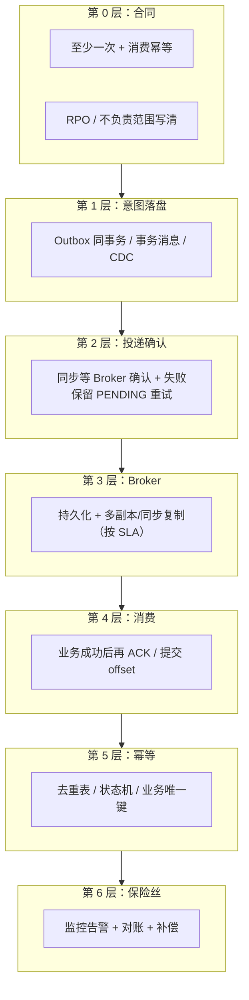

# 消息「100% 不丢失」方案（端到端最强实践）

**你在做的事**：把「不漏消息」落实成 **可写进方案/可验收** 的全链路清单——在 **约定的基础设施、运维规范与故障模型** 内，把「该发的业务通知」丢失概率压到 **工程上可视为没有**，并用 **监控与对账** 兜住残余风险。

**关于标题里的「100%」**：分布式系统里 **不存在** 无条件、数学意义上的「绝对永不丢」（例如整集群被误删、配置全错、灾难级长时间双活皆毁等）。本文所说的「100%」，指团队在 **书面 SLA 范围内** 同时做到：**意图必落盘 → Broker 可靠收 → 消费侧正确处理后再确认 → 重复可幂等 → 异常可观测可对账**，从而在 **进程崩溃、网络抖动、单机 Broker 故障** 等常见场景下 **不出现「库成了但消息没了」**；若仍出现数据不一致，应能通过 **告警与对账** **被发现并补偿**。

**建议搭配阅读**：《消息队列》 · 《分布式事务》 · 《接口幂等性处理》 · 《Kafka》 · 《RocketMQ》 · 《RabbitMQ》

---

## 目录

- [一、端到端「六层防线」](#一端到端六层防线)
- [二、主路径：默认选这套](#二主路径默认选这套)
- [三、每层失守时的典型后果（速查）](#三每层失守时的典型后果速查)
- [四、验收与运维：怎样算「到位」](#四验收与运维怎样算到位)

---

## 一、端到端「六层防线」

把「消息不丢」从口号拆成 **六层可分工的责任**，缺一层就可能出现 **静默丢消息** 或 **逻辑上等于丢了**（例如位点提交了业务没做）。

| 层级 | 解决什么问题 | 典型落地 |
| --- | --- | --- |
| **0 合同** | 团队对「丢到什么程度算事故」没有共识 | 默认 **至少一次**；消费与接口 **幂等**；写清 **RPO** 与 **第三方回调** 等边界 |
| **1 意图落盘** | 业务已提交，但「要发 MQ」只存在内存里，进程一挂就没了 | **Outbox** 与业务 **同一本地事务**；或 **事务消息 + 反查**；或 **CDC**（运维更重） |
| **2 投递确认** | 表里有 PENDING，但从未确认 Broker 真的收到 | 投递器 **同步发送并等确认**；失败 **不删记录**、退避重试、告警 |
| **3 Broker** | Broker 副本/刷盘策略太弱，宕机丢已应答前的数据 | **持久化** + **同步复制/ISR** 等与 RPO 对齐（产品参数见各专项笔记） |
| **4 消费顺序** | offset 先走了，业务失败 → **逻辑丢失** | **先处理成功** 再 **ACK / commit**；失败走重试/DLQ 策略 |
| **5 幂等** | 至少一次必然带来 **重复投递** | 去重表、状态机、天然幂等操作；与《接口幂等性处理》一致 |
| **6 保险丝** | 前面全做对仍可能有 **漏网之鱼**（脏数据、未知 Bug） | **Outbox 堆积、生产失败率、消费滞后、DLQ** 告警；**业务对账** 与 **补偿任务** |

**结论**：所谓「100% 不丢」，在工程上 = **前 5 层在故障模型内把丢失压到极低** + **第 6 层保证「真出了问题也能看见并补上」**。

---

## 二、主路径：默认选这套

**默认组合拳**为：

**Outbox（数据库消息表）+ 同步确认投递 + 高可用 Broker + 先处理后 ACK + 消费幂等 + 监控对账**。

| 环节 | 要点（一句话） |
| --- | --- |
| 业务写库 | 同一事务内写 **业务表 + Outbox（PENDING）** |
| 投递器 | 扫 PENDING → **同步发 MQ 并等确认** → 成功标 SENT/删除；失败保留并重试 |
| Broker | **持久化 + 副本策略** 与 RPO 一致；禁止默认「未确认就当成功」 |
| 消费者 | **处理成功后再** ACK/offset |
| 业务 | 按 **至少一次** 做 **幂等** |
| 运维 | **监控 + 对账**，明确「不负责」范围（如仅努力通知的外部 HTTP） |

不用 Outbox 时的等价路径（事务消息、CDC）与 **不推荐** 的做法，见上文 **第 1 层（意图落盘）** 与《分布式事务》中写库与发 MQ 相关小节。

---

## 三、每层失守时的典型后果（速查）

| 若缺失或做错 | 用户侧可能看到的现象 |
| --- | --- |
| 无 Outbox/无事务消息，仅靠内存或 fire-and-forget | 订单已生成，下游永远收不到通知 |
| 投递不等待确认 | 以为发了，Broker 实际没落盘 |
| 消费先 ACK 再处理 | 处理失败也「丢」了这次业务效果 |
| 无幂等 | 重复扣款、重复发货 |
| 无监控/对账 | 长期静默不一致，只能靠客诉发现 |

---

## 四、验收与运维：怎样算「到位」

**测试环境故障注入**（此处强调「全链路」）：

1. **杀进程**：业务与 Outbox 已提交后杀 API/投递器 → 重启后 **PENDING 最终被发出**。  
2. **杀消费**：处理中途崩溃 → **未 ACK 消息再次投递**，且 **幂等** 不重复副作用。  
3. **Broker 单机故障**：行为符合既定 **RPO**。  
4. **对账**：抽样或全量核对「应发事件数 vs 下游落账数」，有 **自动化报表或任务**。

**文档层面**：书面写明 **默认语义 = 至少一次 + 消费幂等**，以及 **第 6 层** 的告警负责人与补偿流程。

---

*本文用「六层防线」框定「100%」在工程上的含义与验收；Outbox 建表、投递与幂等细节可与《消息队列》《分布式事务》《接口幂等性处理》交叉对照。*
