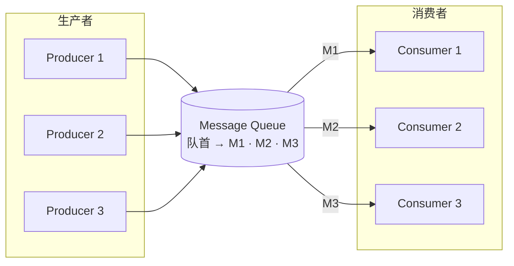
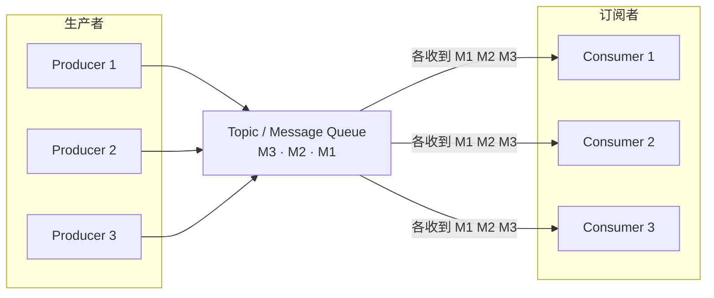

# 消息队列（MQ）

## 目录

- [一、应用场景](#一应用场景)
- [二、削峰的本质](#二削峰的本质)
- [三、消息协议](#三消息协议)
- [四、通讯方式：点对点 vs 发布/订阅](#四通讯方式点对点-vs-发布订阅)
- [五、异步消息队列（设计口诀）](#五异步消息队列设计口诀)
- [六、常见问题与解决思路](#六常见问题与解决思路)
- [七、消息队列的基本要求](#七消息队列的基本要求)
- [八、总结：优先级与取舍](#八总结优先级与取舍)
- [九、跨 Topic 事务与 2PC](#九跨-topic-事务与-2pc)
- [十、顺序消息、延时消息与事务消息（概览）](#十顺序消息延时消息与事务消息概览)
- [十一、消费侧：模式、消费者组、幂等与应答](#十一消费侧模式消费者组幂等与应答)
- [十二、Kafka / RocketMQ / RabbitMQ / ActiveMQ 对照（粗表）](#十二kafka--rocketmq--rabbitmq--activemq-对照粗表)

---

## 一、应用场景

- **异步处理**：把耗时、非关键路径的工作从主链路挪到后台慢慢做。
- **解耦**：生产者与消费者不直接依赖；服务之间通过“推/拉”消息协作，边界更清晰。
- **流量削峰**：高峰时先把请求变成消息排队，系统按能力消费，保护数据库与下游。
- **日志收集**：多实例、多服务统一投递到日志/分析管道。
- **事务最终一致性**：常配合 **本地事件表（Outbox）**、可靠投递与幂等消费，实现跨系统的最终一致（详见同目录《分布式事务》相关笔记）。
- **消息推送**：通知、营销、站内信等广播或定向投递。
- **用户行为采集**：埋点、行为流异步上报，避免阻塞页面或接口。

---

## 二、削峰的本质

削峰从本质上说是：**更多地把用户请求“延缓”处理，并在各层过滤真实落到核心存储的需求**，遵循一条原则：

**最终写入数据库（或核心存储）的请求数量要尽量少、尽量可控。**

例如：秒杀时先排队、再扣库存；或先记消息、再异步落库，避免瞬时打爆数据库。

---

## 三、消息协议

| 协议 | 要点 |
| --- | --- |
| **AMQP** | **Exchange** 在 Broker 内将消息路由到 **Queue**；**Binding** 用路由键等规则把 Exchange 与 **Queue** 关联起来。 |
| **MQTT** | 面向遥测与物联网，多平台、**低带宽**、轻量。 |
| **STOMP** | 流文本定向协议，简单易用。 |
| **XMPP** | 基于 XML 的流式即时通讯扩展。 |
| **JMS** | Java 消息服务 **API 规范**（接口层面；具体实现依赖各厂商/中间件）。 |

---

## 四、通讯方式：点对点 vs 发布/订阅

### 4.1 对照速记

| 维度 | 点对点（Point-to-Point） | 发布/订阅（Pub/Sub） |
| --- | --- | --- |
| **消息与消费者** | 每条消息通常只被 **一个** 消费者处理；同一**消费者组**内多消费者常做 **负载均衡** | 一条消息可被 **多个订阅者** 各自消费一份（广播/扇出） |
| **应答** | 一般有 **ACK**，确认处理完成 | 课程笔记里常强调“不强调单订阅者应答”；**实际产品里**仍可能有 offset/游标确认（以具体中间件为准） |
| **顺序** | 较易在 **单队列 / 单分区 + 单消费者** 等模型下讨论 **顺序消息** | **全局严格顺序**通常更难；多订阅者并行时更弱（可按 key/分区在部分系统里保证分区内有序） |

#### 点对点（或同组负载均衡）

每条消息趋向于**只被一个消费者**处理（图中为 M1→C1、M2→C2、M3→C3 的负载均衡示意）。

**图片**

**Mermaid（可预览）**

#### 发布/订阅（Pub/Sub）

同一 **Topic** 上的消息会**广播**给多个订阅者；每位订阅者都会收到**同一批消息**的副本（示意）。

**Mermaid（可预览）**

### 4.2 负载均衡的主要层次

从「谁发、谁收、数据落在哪、集群怎么扛、能不能伸缩」几层看，常见做法如下（**点对点 / 分区消费**场景最典型；**Pub/Sub** 下「多订阅者各收一份」与「同组竞争消费」要分开理解）。

| 层次 | 做法（要点） |
| --- | --- |
| **生产者侧** | 发送时把流量**分散到多个队列或分区**（如按 **key/hash** 选分区、轮询、多队列绑定等），避免单通道打满，**发送负载**在逻辑目的地之间更均匀。 |
| **消费者侧** | 用**多个消费者实例**并行处理不同分区或不同队列；**同一逻辑服务**（如一个微服务）常对应**一个消费者组**，**该服务多个实例共用同一消费者组**时，**组内竞争**分配分区/消息，实现**处理负载**均衡（Kafka、RocketMQ 等常见；JMS **Queue** 也是多消费者抢同一队列，语义相近）。 |
| **队列 / 分区与节点** | 队列或分区**分布在集群多个 Broker 节点**上，由中间件做分片、副本与 Leader 等，把**存储与 IO** 摊到多机。 |
| **集群整体** | 多节点集群分担**连接、读写与副本同步**；配合路由与元数据服务，从整体上做**容量与请求的横向扩展**（产品细节各异）。 |
| **动态扩缩** | 按负载**增删消费者实例**最常见；部分系统还可**调整分区数、队列与 Broker 规模**（分区数常**不宜频繁大改**，且与顺序、键分布策略相关，需查具体产品约束）。 |

### 4.3 生产端与消费端：与 Broker 之间是推（Push）还是拉（Pull）

这里的推/拉指**谁主动发起这一次传送**（Producer→Broker、Broker→Consumer），与负载均衡、点对点/Pub/Sub 是不同维度，可对照理解。

#### Producer → Broker

| 方式 | 说明 |
| --- | --- |
| **Broker 拉、Producer 被动等待（Pull，极少作为通用 MQ 主形态）** | 若由 Broker **来拉取**，Producer 往往要在本地**长期保存**待拉消息；可靠性与持久化**更依赖每个 Producer**，工程负担大，**主流中间件一般不这么设计**。 |
| **Producer 推给 Broker（Push，主流）** | Producer **主动发送**到 Broker；**落盘、多副本、发送确认**等主要由 Broker（及客户端协议）承担，Producer 在确认策略满足业务后，**不必再为「等 Broker 来拉」而本地攒日志**。Kafka、RabbitMQ、RocketMQ、ActiveMQ 等常见产品均为**生产端推送**到 Broker。 |

#### Consumer ← Broker

| 方式 | 要点 | 常见产品（粗分，以具体 API/版本为准） |
| --- | --- | --- |
| **拉（Pull）** | 消费者**主动请求**消息：起始位点、条数、频率**自控**，易做**反压**；Broker 多数时候只负责存。代价：可能有**轮询延迟**，空队列时易**空转**，工程上常配合**长轮询、退避**。 | **Kafka**（fetch/长轮询）、**RocketMQ**（底层多为拉取；部分 PushConsumer 实为**封装后的循环拉取**）。RabbitMQ 的 **basic.get** 属拉取，**高吞吐场景通常不推荐**为主路径。 |
| **推（Push）** | Broker **主动投递**，**实时性好**、使用相对简单；Broker 要做**流控**（如 prefetch/credit），否则可能出现**推送快于消费**导致堆积甚至拖垮消费者；**回溯**是否方便依赖产品与客户端。 | **RabbitMQ** 常规 **`basic.consume` 流式消费**偏推；**ActiveMQ** 的 **`MessageListener`** 等异步回调也常归为推。 |

**易混点**：提纲里若写「拉（push）」，一般应改为 **推（Push）**。消费端**不宜把 Kafka 归在 Push 一类**——Kafka 消费侧主流是 **Pull/长轮询**，与 RabbitMQ 的主流投递形态不同。

---

## 五、异步消息队列（设计口诀）

**一个事件 / 一个表 / 一个目的地 / 一个队列**（便于落地 Outbox、对账与重试边界清晰）。

### 5.1 异步链路与「调用完成」的边界

**课件式表述**：调用方只需把请求转化成**异步事件（消息）**发给中间代理（Broker）；在约定的意义上**发送成功**，即可认为**调用方这一侧**的异步链路已结束，后续由中间代理尽量把事件投递到下游，由下游系统执行实际任务。

调用方把请求转化成**异步事件（消息）**发给中间代理（Broker）后，**何时算「从调用方看这条异步调用已完成」**，取决于约定的**发送确认**与投递语义，而不是天然等于「下游已执行完」：

- 若只要求**尽快把发送动作做完**（例如不等待 Broker 回执的 **Oneway**，见 **7.4**），调用方可以很快返回；**后续由 Broker 与消费者**（加重试、死信、补偿等）尽量把事件送达并处理。
- 若要求 **Broker 已按策略接管**（如持久化 + **生产者确认**成功），则「发送成功」更严，仍建议在关键业务用 **Outbox / 对账** 兜住生产端与 Broker 同时故障等极端情况。

**要点**：调用方返回 ≠ 下游任务已完成；后者依赖**投递语义、消费 ACK、幂等与补偿**等闭环。

---

## 六、常见问题与解决思路

| 问题 | 思路 |
| --- | --- |
| **消息丢失** | 持久化到磁盘、关键链路配合 **消息投递/事件表** 记录与补偿 |
| **消息持久化介质** | 内存、本地文件、数据库等（按可用性与性能选型） |
| **消息堆积** | 监控与 **阈值**、扩容消费者、**惰性队列**（如 RabbitMQ）、限流与降级 |
| **可靠投递** | 生产者确认、Broker 落盘策略、消费者 **ACK**、失败 **重放** / 死信队列 |
| **重复消息** | 可靠投递与重试会带来重复 → 消费端 **幂等**（业务幂等键、去重表、唯一约束等） |
| **严格有序** | **顺序消息**：单通道串行、或按 **业务键分区** 保证分区内有序（全局全序成本高） |
| **消息过期 / 长期积压** | 区分 **TTL/过期时间** 与 **无过期堆积**；治理手段：**直接丢弃**、**落库后删**、**转死信**（见下 **6.1**） |

### 6.1 消息过期与积压处理

**两类情形**

| 情形 | 常见行为（依产品与配置而定） |
| --- | --- |
| **设置了过期时间（TTL 等）** | 消息在 Broker 侧**到期后**按策略**丢弃或转入死信队列**等，**不会无限占着队列**；具体是否删、是否进 DLQ、是否通知，以中间件文档为准。 |
| **未设置过期时间** | 若**消费者长期不消费**或极慢，消息会在队列里**一直积压**，**不会**因「过期」自动消失；需靠**监控、容量与业务治理策略**处理。 |

**业务侧「过期规则」示例（自定义）**

课件式写法举例：**任务在一天内没有消费者连接，且队列里消息数据已积压满 5 天**，则触发一批治理逻辑。  
这是**业务或运维规则**，不是 MQ 默认值；实现上多为**定时任务 / 运维脚本 / 流控平台**扫队列深度、消费滞后、最后活跃时间等再决策。

**触发后的处理思路**

| 做法 | 适用与注意 |
| --- | --- |
| **直接从消息队列删除，不做数据库持久化** | **最简单**，释放 Broker 资源；**不可恢复**，适合明确可丢、无审计要求的堆积。 |
| **先持久化到数据库，再从队列删除** | 留**审计与人工补救**依据；注意落库与删队列的**顺序与幂等**（避免只删没落库或重复落库）。 |
| **转存到死信队列（DLQ）** | 与 [六、可靠投递](#六常见问题与解决思路) 中死信呼应；便于**单独消费、重放或人工处理**。若仍需长期留存，可在进 DLQ 或消费 DLQ 时再 **落库** 后清理原队列。 |

**小结**：**TTL** 管的是「单条消息在 Broker 上的寿命」；**积压治理**管的是「队列整体是否失控」。需要留痕时优先 **落库或 DLQ**，允许丢弃时再考虑**直接删**。

---

## 七、消息队列的基本要求

整体围绕：**一致性、可靠性、幂等性**。

### 7.1 事务消息里常说的“事务”

常指 **一致性** 语境下的：

- **生产者客户端与 Broker** 侧数据一致（例如事务消息、半消息等机制，依产品而定）。
- 要保证：**生产者发出的消息能可靠到达 Broker**；往往需要 **重放投递** 等兜底。
- 工程上常配合 **消息投递记录表 / 本地消息表（Outbox）** 做可恢复、可对账。

### 7.2 消息可靠性（至少一次）

- **至少一次（At Least Once）**：在中间件「入站不丢、可重试投递」的前提下，**严格语义**通常指消息**至少被投递到消费者侧一次**（或可再次被拉取/消费），**并不等价于**「业务逻辑恰好成功执行一次」。
- **业务上「最终成功处理至少一次」** 是常见工程目标，往往要靠 **重放消费** 逼近；因此 **重复不可避免**，需要 **消费记录/去重** 与 **幂等**。

### 7.3 消息投递模式（语义速查）

| 模式 | 含义（速记） |
| --- | --- |
| **至少一次（At Least Once）** | 可**重试发送**直至 Broker（或协议约定点）**成功接收**；投递与消费侧都可能出现**重复**，需 **幂等 / 去重**。 |
| **最多一次（At Most Once）** | **只尝试发送**，不因失败无限重试（或不保证重试）；**可能丢失**，但**不刻意制造重复**。 |
| **精确一次（Exactly Once，端到端理想）** | 语义上希望**发送与消费都不重复**；纯中间件层**端到端精确一次**代价极高，工程上常靠 **幂等 + 去重 + 事务消息/幂等生产者** 等在**业务可接受范围内逼近**（与 [7.2](#72-消息可靠性至少一次)、[九](#九跨-topic-事务与-2pc) 呼应）。 |

三者与**生产者确认是否等待、是否重发**直接相关，配置不同则「调用完成」的含义也不同。

### 7.4 发送确认、持久化与 Oneway

- **持久化（Broker）**：Broker 按**消息的持久化/转发策略**决定是否**落盘、多副本**等，从而在**宕机重启**后仍可能恢复消息（非持久化则主要驻留内存，风险更高）。
- **发送确认（Producer ← Broker）**：Broker 按**生产者确认模式**向发送方返回**成功或失败**（含超时），用于降低「Broker 已挂或丢包但发送方误以为已发出」的风险。
  - **确认成功**：发送方认为本条已按约定交给 Broker（是否已落盘仍看具体 **acks** 语义，如 Kafka 的 `acks`、RabbitMQ 的 confirm 等）。
  - **确认超时或失败**：发送方可**重发**，从而走上 **至少一次** 路径（可能重复）。
- **Oneway（单向发送）**：**只发请求、不等待应答**。实现上往往只是写入本机 **socket 发送缓冲区**（一次或数次系统调用），**延迟极低（常微秒级）**，但**不保证**已到 Broker 或已持久化；适合**可丢、要低延迟**的场景（如部分**日志采集**）。语义上接近**弱化确认**甚至**最多一次**取向，与「发送成功即算异步完成」的**宽松**定义搭配时，要接受下游可能收不到的风险。

**对照**：通常「完整发送」是：客户端请求 → 服务端处理 → **服务端应答**；总耗时含三段。Oneway **省掉等待应答**，换吞吐与延迟，换可靠性边界。

---

## 八、总结：优先级与取舍

按常见工程优先级理解（可随业务调整）：

1. **尽量不丢消息**（持久化、可靠投递、可重放）。
2. **在可靠前提下控制重复**（幂等、去重）。
3. **保证发送侧能落到 Broker**（与业务库同事务的 Outbox 等模式）。
4. **消费成功**在分布式里往往无法“绝对保证一次就成功”，但要具备：**消费应答、失败可追踪、可重试、可进死信、可人工处理**。

---

## 九、跨 Topic 事务与 2PC

### 9.1 典型事务场景

- **多条消息**：一次业务处理可能对应多条入站/出站消息。
- **多个主题**：入站与出站分布在不同 **Topic**。
- **管道式处理**：应用**先消费 Topic-A** → 业务计算/落库 → **再发送到 Topic-B**（读–处理–写）。

若不约束中间状态，可能出现：消费已确认但下游消息未发出、或只发出一半等，导致**下游缺数据**或**重复、乱序**更难排查。工程上要么接受**最终一致 + 补偿 / Saga / Outbox**，要么使用**支持事务语义的产品能力**（如部分场景下的 **Kafka Transactions**），把多步尽量绑成**可提交或可中止**的单元。

### 9.2 实现方式里的核心概念

| 概念 | 作用（速记） |
| --- | --- |
| **2PC（两阶段提交）** | **一阶段 Prepare**：各参与方先落盘、占住资源，对外仍不可见或处于“未决”；**二阶段 Commit/Abort**：协调者决定全员提交或全员回滚，避免“只成功一半”。 |
| **事务协调者** | 驱动 2PC：发 Prepare、收集投票、写最终决定并通知各方；常由 **Broker 内建逻辑**或**独立组件**承担（依产品而定）。 |
| **事务日志** | 持久记录每个 **事务 ID** 的状态与关键步骤；**崩溃恢复**时据此补全 **Commit/Abort**，防止事务悬在半空。 |
| **事务状态** | 如：`进行中` → `已准备（Prepared）` → **`已提交` / `已中止`**；与日志配合保证**可恢复、可对账**。 |
| **事务 ID（TxID）** | **整笔**“多消息、多 Topic”操作的**同一编号**，用于关联一次原子单元内的所有消息与 offset 等元数据。 |
| **生产者 ID（如 PID / transactional.id 生态）** | 标识**发送端会话或实例**，用于**幂等发送**、防止**僵尸实例**乱提交（具体语义以中间件文档为准）。 |
| **消息 ID** | **单条消息**的唯一标识，用于**去重、追踪、死信与对账**；一笔事务内可包含**多条**消息，每条各有 **Message ID**。 |

关系概括：**TxID** 管“这一整笔”，**Message ID** 管“每一条”，**Producer ID** 管“谁在发、如何防旧实例捣乱”。

### 9.3 与《分布式事务》笔记的衔接

跨 Topic 若还涉及**业务数据库**与 MQ 同事务，多数团队用 **Outbox、本地消息表、重试与幂等**落地**最终一致**；本节侧重 **MQ 侧**对 **2PC、协调者、日志与各类 ID** 的**概念对齐**。详细表结构与补偿闭环见同目录 **《分布式事务》**。

---

## 十、顺序消息、延时消息与事务消息（概览）

### 10.1 顺序消息

| 方式 | 思路 | 备注 |
| --- | --- | --- |
| **方式 1：单通道有序** | 发送与消费涉及的 **Queue/分区只有一个**（且通常 **单消费者** 或等价串行），可得到**全局（该通道内）有序**。例：**同一订单 ID** 对应**固定一个队列/分区**，该订单多条状态变更消息都进**同一队列**，避免跨队列乱序。 | 与 [4.2](#42-负载均衡的主要层次)「多实例竞争消费」矛盾时，需**按业务键分区**而不是无限加消费者抢同一有序队列。 |
| **方式 2：业务侧排队与状态机** | 在 **MQ 到真正业务处理**之间加**业务排队/编排**（或统一入口），消费前按**状态机顺序**校验：未到合法前序状态则**暂不收、重入队或延迟处理**。 | 适合无法单队列承载或顺序规则很复杂的情况；实现成本在应用层。 |

与 [六、常见问题](#六常见问题与解决思路) 中「严格有序」一条互补：**单队列/单分区 + 单消费** 与 **按 key 分区保序** 是方式 1 的常见落地；方式 2 是补充手段。

### 10.2 延时消息

**能力因产品而异**（延迟队列、定时 Topic、插件、死信 + TTL 等），语义上多为「到点或到期再变为可消费」。选型时对照官方文档看**精度、上限、是否持久、是否集群安全**。

### 10.3 事务消息

**能力因产品而异**（半消息、本地事务 + 提交/回查、Kafka Transactions 等），多与 [7.1](#71-事务消息里常说的事务)、[九](#九跨-topic-事务与-2pc) 一起看；涉及**业务库与 MQ 一致**时，仍常回到 **Outbox** 等模式。

---

## 十一、消费侧：模式、消费者组、幂等与应答

与第四节 **4.3**（Broker 侧推/拉）区分：本节侧重**应用怎么写消费代码**、**组与重复**、**应答与重试**。

### 11.1 消费模式：拉取 vs 监听

| 模式 | 要点 |
| --- | --- |
| **拉取模式** | 业务代码按**队列/分区积压、自身处理能力**控制 **pull 的频率、批量与间隔**（自主反压、可休眠退避）。 |
| **监听模式（回调 / 监听器）** | 对业务像「被动等消息」；实现上常见 **SDK 内守护线程循环拉取**，或 **Broker 推送到连接**（见 **4.3**）。本质是**封装好的拉或推**，不是「不用拉」。 |

### 11.2 手动控制消费

不少客户端提供 **pause / resume**（或等价开关），用于**发布窗口、限流、短暂停消费**等，而不必销毁消费者进程。

### 11.3 消费者组（再述）

多个消费者实例配置为**同一消费者组**时，**同组竞争**分配分区/消息，实现**消费端负载均衡**（与 [4.2](#42-负载均衡的主要层次) 一致）。

### 11.4 「消费几次」：RabbitMQ 与 Kafka（粗分）

| 产品 | 课件式对比（非绝对，以配置为准） |
| --- | --- |
| **RabbitMQ** | 在**手动 ACK**、连接稳定、无 NACK/重回队等前提下，单条常表现为「**处理并确认一次**」；一旦**断连、拒收、重回队列**，同一条可能被**再次投递**。 |
| **Kafka** | 常见为 **至少一次**；**消费者上下线、扩缩容、重平衡（rebalance）** 过程中，可能出现**少量重复消费**，需下游幂等。 |

### 11.5 幂等是否「必须」

- **并非所有场景都必须**（例如**可重复、无副作用**的统计类处理）。
- 在 **至少一次、重试、重平衡** 下，**重复投递客观存在**；课件结论：**消费者上下线、服务端扩缩容**等会触发**短暂重分配**，可能出现**少量重复**，下游宜做 **幂等 / 去重**（与 [7.2](#72-消息可靠性至少一次)、[六、重复消息](#六常见问题与解决思路) 一致）。

若要逼近「**成功处理至少一遍**」，往往依赖 **消费重试** + 去重策略，而不是假定「天然只一次」。

### 11.6 幂等落地：消息 ID 与「事务 + 消费表」

**唯一消息 ID**

- **MQ/框架生成** 或 **业务自定义**；配合 **消息消费表**（或处理记录表）判断是否已处理。

**单库事务 + 主键/唯一约束防重（常见写法）**

1. 开启数据库事务。  
2. **插入消费记录表**：以 **业务幂等键**（如 **订单 ID + 业务状态**）作主键或唯一键；**冲突**表示重复消费 → 回滚或短路返回，**避免只用框架消息 ID**（生产者重发可能产生**不同消息 ID、同一业务**）。  
3. 执行原业务（如更新订单）。  
4. 提交事务。

**局限性（提纲要点）**

- 消费逻辑强依赖 **关系型数据库事务** 才易「一滚全滚」；中途改 **Redis** 等**难与 DB 同事务**的数据源时，需单独设计**补偿或对账**。  
- **单库**内好做；**跨库**无法靠这一条 SQL 事务兜住，要换 **分布式事务 / Saga / 幂等键跨库去重** 等方案。

**业务状态判断**

- 不建单独消费表时，也可根据 **业务主键 + 状态** 判断是否已处理过（与状态机配合）。

### 11.7 跨系统链路中的「三性」

多系统用消息协作时，宜默认每条都可能 **重复、乱序、晚到**，在各自消费逻辑里保证 **一致性、可靠性、幂等性**（按业务能接受的粒度）。

**链式举例（课件）**：库存服务消费消息 A → 锁库存并发消息 B → 订单服务消费 B 落库并发消息 C → 下游消费 C 处理后再发消息 D → 订单服务消费 D 更新状态。每一环都要考虑 **重试与重复投递**。

### 11.8 消费应答与失败处理

**应答成功**

- 业务完成后 **ACK / 提交位移**，表示「这一段处理结束」。

**应答失败 / 消费抛异常**

| 思路 | 说明 |
| --- | --- |
| **消费侧事件表** | 在业务库用表记录 **重试次数、失败原因、待处理状态**；与「是否启用 Broker **DLQ**」可组合设计——避免 **DLQ 与业务表两套状态** 打架时，可**弱化或不用** MQ 自带 DLQ，改由**事件表驱动重试**（依团队规范而定）。 |
| **再次投递到同组实例** | Broker **重投**时，实际消费者可能是**同组任意实例**（分区/队列分配决定），不是手工「点名将消息送给某台机器」。 |
| **重试队列 + TTL** | 失败消息发到 **延迟重试队列**（设 **TTL/延迟** 作间隔），到期再回业务队列；**超过上限**则 **丢弃或进 DLQ**。 |

**要不要重试**

- **偏瞬时故障（如网络抖动）**：适合 **有限次重试**；示例：多次失败后进 **DLQ**，由**专门消费者**写入 **数据库日志** 或 **持久化**，供后续策略或**人工处理**。  
- **明确业务错误（如参数非法）**：盲目重试无意义 → **日志 + 定时巡检/健康检查 + 人工补偿**。

**MQ 整体不可用**

- 对 **高时效、高重要** 业务，不宜只依赖 MQ：辅以 **定时扫描业务库、补偿任务** 等，避免「队列挂了业务全停」。

---

## 十二、Kafka / RocketMQ / RabbitMQ / ActiveMQ 对照（粗表）

**说明**：以下为**课件式横向对照**，便于选型入门；**TPS、延时、副本行为**以**实际压测与官方文档、版本**为准。原表「**文档型**」按语义改为 **日志型**（append-only 分区日志）；「**TPS W/s**」按常见量级补为 **万级** 等表述。

### 12.1 核心指标与可靠性（粗）

| 维度 | Kafka | RocketMQ | RabbitMQ | ActiveMQ |
| --- | --- | --- | --- | --- |
| **定位** | 主流 | 主流（国内业务常见） | 主流 | **遗留系统多见**，新选型较少 |
| **吞吐（量级印象）** | 常见讨论可达 **~百万级 TPS**（依赖分区数、磁盘与网络） | 常见 **~十万级 TPS** 量级讨论 | 多为 **万级～十万级**（极高吞吐需精细调优） | 多为 **万级** 量级 |
| **时效** | **ms 级**常见 | **ms 级** | **低延时**场景多，课件常写 **μs～ms 级**（与同机房、协议有关） | **ms 级** |
| **高可靠（典型配法）** | 同步发送、`acks=all`、**≥3 副本**、**手动提交 offset** | 同步发送、多副本、同步复制、**手动提交消费位点** | **持久化队列**、**镜像/仲裁队列**、发布确认等 | 持久化、网络复制等（依版本与存储） |
| **异步/缓冲** | 异步副本或未刷盘窗口内**可能丢** | 类似 | 异步刷盘/确认有**丢失窗口** | 持久化策略依实现；**不宜简单写死「不支持异步」** |

### 12.2 消费语义与协调组件

| 维度 | Kafka | RocketMQ | RabbitMQ | ActiveMQ |
| --- | --- | --- | --- | --- |
| **消费与位点** | **日志型**：**可移动 offset**，可回溯；**至少一次**下会**重复消费** | 类似 **位点** 管理，可重复消费 | **队列型**：**非** Kafka 式全局消费位移；**ACK/NACK、重回队**带来**再投**（不是「绝对不能重复」） | JMS **再投递**常见，**不宜**概括成严格「只一次」 |
| **注册 / 元数据** | **经典：ZooKeeper**；**新版本可用 KRaft**（无 ZK） | **NameServer** | **无**独立注册中心（集群自洽机制） | **无**（或内嵌） |

### 12.3 集群与数据分布（类比仅助记）

| 维度 | Kafka | RocketMQ | RabbitMQ | ActiveMQ |
| --- | --- | --- | --- | --- |
| **集群类比（粗）** | 分片 + 副本可类比 **ES / MongoDB 分片副本** | 分片主从类似 **MySQL 主从**思路 | 多节点 + 路由，可类比 **接入层 + 多实例**（非严谨等同） | — |
| **副本粒度** | **分区（Partition）** | 常落到 **Broker/队列** 维度（依版本） | **队列**镜像/仲裁等 | 依架构 |
| **主从** | **分区 Leader/Follower**，选举与 ISR | 主从/同步复制等 | **经典镜像队列有主副本**；仲裁队列另有模型 | 因模式而异 |
| **节点是否全量数据** | **否**，按分区打散；**副本数=节点数且每分区全副本**才是「每节点都有该分区副本」 | **否** | 通常**否**（队列在节点间分布/复制） | 依部署 |

### 12.4 协议与特性速查

| 维度 | Kafka | RocketMQ | RabbitMQ | ActiveMQ |
| --- | --- | --- | --- | --- |
| **协议** | TCP（自有协议） | TCP、**OpenMessaging** 等 | **AMQP**、MQTT、STOMP 等 | OpenWire、STOMP、AMQP、MQTT、JMS |
| **一级模型** | **Topic + 分区** | **Topic**（下挂队列等） | **Exchange + Queue + Binding** | JMS **Destination**（Queue/Topic） |
| **路由 / 键** | **key**（分区与顺序） | **Tag / Key** 等过滤（非「无键」） | **routing key** + binding | 依协议 |
| **典型场景** | 日志、流式、数据管道、异构同步 | **业务消息**、顺序、事务消息 | **低延时**、灵活路由、多协议 | 遗留集成 |
| **延时消息** | 非主打（常靠外置/连接器） | **原生能力较强** | **插件/延迟队列** 等 | 非主打 |
| **顺序消息** | **key hash → 分区内有序** | **FIFO 主题 / MessageType** 等 | **单队列**保序较直接 | 支持 |
| **事务消息** | **生产者事务 / EOS（有限语义，≠ 数据库 ACID）** | **事务消息**（半消息、回查等，课件常对应 **2PC 思路**） | **AMQP 事务窄**；可靠投递多靠 **confirm + 业务幂等** | JMS **事务性会话** 等 |
| **消费失败重试** | **不自带**业务重试队列（多自建） | **内置**较多 | **内置** DLQ、重试等 | 依客户端与配置 |

---

## 与《分布式事务》笔记的关系

若涉及 **跨服务最终一致性**，建议结合同目录 **《分布式事务》** 中 **Outbox、重试、幂等、死信** 等章节一起阅读，MQ 是手段，**表结构与补偿闭环**是落地关键。

