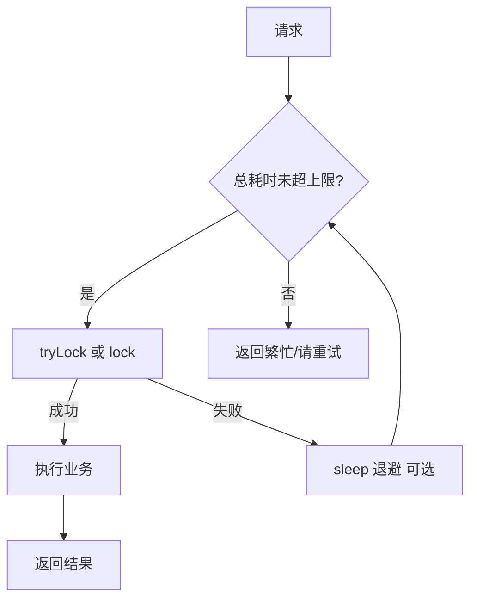
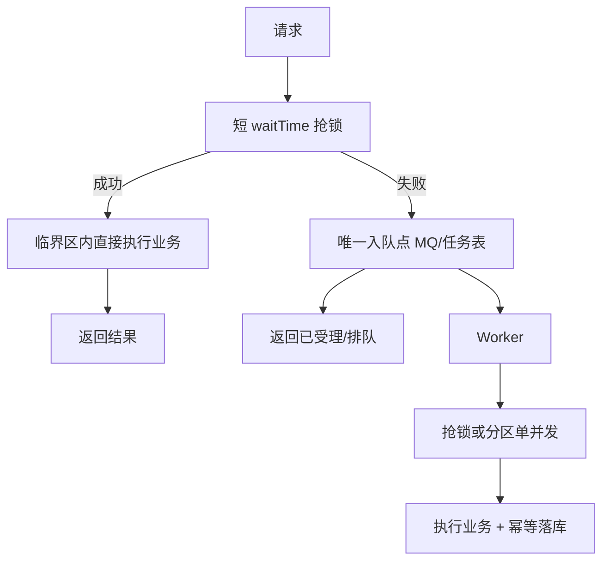
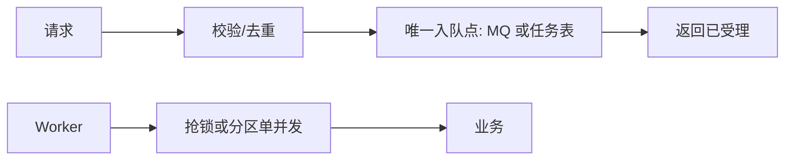

# 请求抢分布式锁：100% 上锁 · 100% 受理方案

**你在做的事**：高并发下，请求先进来「抢分布式锁」；你要在工程上对齐两件事——**被接受的请求最终会进入持锁（或等价互斥）执行路径而不被「抢一次失败就丢」**，以及**在系统承诺范围内得到可验收的「受理」结果**（同步办结，或入队/落任务表并返回凭证）。**「受理」≠ 第三方/下游一定当场成功**；办成终态靠幂等、重试与死信，见第六节。本文**不**把「全链路严格顺序」当作承诺目标；互斥写靠 **lockKey、持锁段、MQ 分区 + 幂等** 等体现。

**本文目标**：给出一套可落地的架构模板（同步抢锁、**无队列时重试抢锁**、有队列时的单一入队、消费侧执行业务、幂等与补偿），并说明监控指标与常见误区。

**建议搭配阅读**

- 《分布式锁》（抢锁/持锁超时、Redisson、锁 + MQ 组合）
- 《消息队列》（投递语义、顺序、幂等）
- 《接口幂等性处理》

---

## 目录

- [零、备注：方案是否「100% 上锁」「100% 受理」](#零备注方案是否100上锁100受理)
- [一、「两个 100%」分别指什么（先对齐口径）](#一两个-100分别指什么先对齐口径)
- [二、为什么同步链路里不存在「tryLock 永远 true」](#二为什么同步链路里不存在trylock-永远-true)
- [三、推荐总架构：入队 vs 不入队](#三推荐总架构入队-vs-不入队)
- [四、落地形态（含无队列重试抢锁）](#四落地形态含无队列重试抢锁)
- [五、互斥键（lockKey）粒度怎么选](#五互斥键lockkey粒度怎么选)
- [六、可靠性清单：如何保证「最终处理」](#六可靠性清单如何保证最终处理)
- [七、指标与告警（可验收）](#七指标与告警可验收)
- [八、常见误区](#八常见误区)

---

## 零、备注：方案是否「100% 上锁」「100% 受理」

写进 PPT/需求里的「100%」建议都带**前提**；下面直接回答「这套方案**能不能**自称两个 100%」。

| 问法 | 结论（工程可写进方案的表述） |
| ---- | ------------------------------ |
| **是不是 100% 上锁？** | **不是数学绝对**。含义是：对已**受理**且进入执行链路的任务，在**约定时限 + 锁设施可用**的前提下，会**至少一次**进入持锁或等价互斥区；**单次短 `tryLock` 失败**不等于丢单，应重试/入队。若总超时仍拿不到锁、或 Redis/MQ 全挂，则**不能保证**「这一刻一定上锁」。 |
| **是不是 100% 受理？** | **不是数学绝对**。含义是：通过**入口校验**的请求，在**容量与策略**允许时，应得到**明确结果**：同步成功/失败，或**异步已受理**（入队/任务表写入成功 + 可追踪凭证）；**不因一次抢锁失败就静默丢弃**。**限流直拒、队列满、磁盘满、写库失败**仍可拒受理或失败返回，需在容量与降级里单独设计。 |
| **模型丙（无队列）** | 同步线程内重试抢锁；**总超时仍失败** → 本次可记为**未受理成功**（或明确返回繁忙），**不能**在口径上写「永不失败」。 |
| **模型甲 / 乙（有队列）** | **入队/任务持久化成功**后，可对调用方称**已受理**；后续 Worker 上锁与办结属于**履约阶段**，用指标（积压、死信、终态覆盖率）验收。 |
| **与「办完业务」** | **受理**只保证**进入可追踪处理闭环**；**最终成功/可人工介入的失败终态**见第六节，仍依赖幂等、重试上限与死信，不要混成同一个「100%」口号。 |

---

## 一、「两个 100%」分别指什么（先对齐口径）

| 口号 | 建议的工程含义（可写进需求/测试用例） | 反例（不要这样承诺） |
| ---- | -------------------------------------- | -------------------- |
| **100% 上锁** | 每个**已受理**的请求/任务，在**有限时间**内都会进入「持锁执行或等价互斥区」一次（含异步排队后由 Worker 执行）；不因**单次**抢锁失败而**从处理闭环里消失**。 | 同步 API 里 `tryLock` 每次必成功、永不返回 false。 |
| **100% 受理** | 通过入口校验的流量，在**容量与 SLA 假设**内，都得到**明确受理结果**：同步结果、或**持久化入队/落任务表成功**并取得可追踪凭证；**不因一次抢锁失败就无声丢弃**。 | 把「受理」偷换成「下游第三方一定成功」；或基础设施故障时仍承诺绝不拒单。 |

**一句话**：**不引入队列**时，抢锁失败就在**当前请求里重新抢锁**（长 `waitTime`、或短等待 + 退避、直至总超时）；**引入队列**时，失败用**唯一入队**换线程与削峰。把「进互斥、可追踪」交给 **lockKey / 队列模型**；把「**办完**」交给 **幂等 + 上限 + 可观测**（第六节）；是否需要**同一资源的严格先后次序**另见《高并发请求顺序执行方案》。

---

## 二、为什么同步链路里不存在「tryLock 永远 true」

分布式锁依赖网络、Redis/ZK、时钟与过期；竞争存在时，**一定存在**某次调用在 `waitTime` 内拿不到锁。

因此：若产品说「这个接口绝不能失败」，应翻译成：**要么**在**总时限内**同步重试抢锁直至成功，**要么**返回「已受理/排队中」（异步队列）；而不是「单次短 `tryLock` 失败就丢」。

---

## 三、推荐总架构：入队 vs 不入队

**先选基础设施**：**不引入 MQ/任务表**时，没有「持久化排队」，抢锁失败后的正经做法就是**在同一线程里继续抢**——即**重新抢锁**（一次长等待，或多次短等待 + 间隔）。**引入队列**时，失败分支才把「等」交给 **MQ/任务表**（异步、不占请求线程）。

**严谨前提（仅在有队列时）**：「入队」只能有一个业务含义、一条主路径。  
若「抢到锁」分支里再写 MQ/任务表、「抢不到」分支也写 MQ/任务表，等于**两处入队**：顺序、重复投递、幂等键口径容易分裂。有队列时下面**模型甲/乙**二选一；**无队列时走模型丙**，不要假装「无队列」却又写库排队（除非明确把 DB 当队列，那已属于持久化排队语义）。

### 模型丙：不引入队列——抢锁失败后只「重新抢锁」（同步域内）

- **做法**：第一次 `tryLock` 失败 → **不入队**，在当前请求内继续：`tryLock(更长 waitTime)`、`lock()` 阻塞、或 **for 循环 + 短 tryLock + `Thread.sleep` 退避**，直到**拿到锁**或**总超时**返回失败/友好提示。
- **本质**：排队发生在**线程与时间里**，不是 Kafka/RocketMQ；**不占额外中间件**，但占**网关/应用线程**与 **Redis QPS**。
- **边界**：必须设**总等待上限**（或有限重试次数），否则等同「无限 `lock()`」，高并发下会拖垮线程池（见《分布式锁》Redisson 一节）。

### 模型甲：同步直办 / 失败才入队（唯一异步入口）

**前提：已引入 MQ 或任务表。**

- **抢到锁**：在持锁**临界区内直接做完**业务（或只做极短的 DB 条件更新），**不再发业务 MQ / 不再写业务任务行**——异步侧只消费「没抢到锁」时写入的那一类任务。
- **抢不到锁**：**仅此一处**写入 MQ 或任务表，由 Worker 抢锁（或按你设计的分区策略）后完成业务。

### 模型乙：统一先入队，锁只在消费侧（唯一持久化入口）

- **入口**：只做鉴权、校验、去重，**每一次受理对应一次且仅一次**写 MQ/任务表（没有「先抢锁再决定是否写队列」的分叉）。
- **Worker**：抢分布式锁（或依赖分区单并发）后执行业务。请求线程**不抢业务锁**，若需要限流可在入口用令牌桶等与队列解耦。

**要点**：

1. **模型丙**：**无队列** → 失败只意味**继续 tryLock / 退避**，直到**总超时**；必须设上限，避免线程池与 Redis 被打满。
2. **模型甲**：有队列时入口可短 `tryLock`；**入队只发生在抢锁失败**；成功路径与异步路径**互斥**，避免双管道。
3. **模型乙**：**全量异步**时不要在入口再叠一层「抢锁后发 MQ」，否则和「直接入队」重复。
4. **互斥写**：若业务要求同一资源不能并发写，用 **lockKey、持锁段、或 MQ 分区单并发** 等收口；模型丙主要靠锁，模型甲/乙在 Worker 侧收口。
5. **完成**：幂等键、重试/总超时上限、（有队列时）死信，**全路径统一**。

---

## 四、落地形态（含无队列重试抢锁）

### 形态 0：仅 Redis 锁 + 同步重试（对应第三节「模型丙」）

- **做法**：无 MQ、无任务表；`tryLock` 失败则在**当前请求**内重试（Redisson 等待期内重试、自写循环 + 退避、或受控的 `lock()`）。
- **效果**：实现简单；**互斥段**由锁保证；**吞吐**受线程数与锁竞争制约。
- **适用**：并发中等、必须**同步返回结果**、暂不上 MQ 的场景；务必配置**总等待上限**与监控。

### 形态 A：MQ 按互斥键分区 + 顺序消费（对应第三节「模型乙」）

- **做法**：入口**只做校验后入队**（唯一持久化），以 `shardingKey = 互斥键` 将消息路由到**固定分区/队列**；该分区**并发度设为 1**（或等价单消费实例），用于收口同一键上的写冲突。
- **效果**：同一键上**同时只有一个消费者在跑**；可减轻消费端抢 Redis 锁的压力（仍建议在写库处保留幂等）。
- **适用**：异步可接受、已有 MQ、业务允许「受理后异步完成」。

### 形态 B：对应第三节「模型甲」——抢锁成功直办，失败才入队

- **做法**：HTTP 侧短 `tryLock`；**成功**则在持锁内**直接**改库存/账务（**不再**为同一业务再发 MQ）；**失败**则写入**唯一**任务表/MQ，由 Worker 再 `tryLock` + 合理 `leaseTime`（或看门狗 + 最大持锁上限）在互斥下执行。
- **效果**：异步侧只有**一条**入队来源；请求侧**100% 可受理**（在系统容量内）；执行侧**可重试**，互斥由锁/分区策略保证。
- **适用**：希望入口「先试同步、挤不进来再排队」，且已有 Redis 锁体系。

### 形态 C：数据库「任务队列」+ `SKIP LOCKED`（偏强一致与审计）

- **做法**：任务行 `FOR UPDATE SKIP LOCKED` 由有限个 Worker 拉取；同一 `biz_key` 上通过**唯一索引**或**状态机**保证互斥。
- **效果**：锁在 DB 侧，易审计；性能依赖 DB 与队列设计。
- **适用**：已以数据库为中心、或 Redis 不可用的环境。

---

## 五、互斥键（lockKey）粒度怎么选

- **过粗**：全系统一把锁 → 吞吐差、无关请求互相阻塞。
- **过细**：同一行/同一聚合根被多把锁拆开 → 可能出现**并发写冲突**（超卖、重复入账等），除非下游用强幂等 + 条件更新兜住。
- **建议**：只把「会写同一临界资源」的请求归到**同一把锁或同一分片**；读多写少时配合缓存与**条件更新**减负。

**例子**：秒杀库存 → `lockKey = activityId` 或 `skuId` 分段；用户余额扣减 → `lockKey = userId`。

---

## 六、可靠性清单：如何保证「最终处理」

- **幂等**：请求 ID / 业务单号唯一约束；消费端「至少一次」语义下可安全重试。
- **去重表或状态机**：`INIT → PROCESSING → SUCCESS | FAIL`，禁止从终态回退到可重复扣款状态。
- **重试**：指数退避 + 最大次数；区分**可重试错误**与**不可重试错误**。
- **死信与补偿**：超限进入 DLQ/死信表，对接告警与人工工单。
- **持锁安全**：解锁前校验 token（Lua）；续期只认持锁者；设置**最大持锁时间**防止卡死续期。

---

## 七、指标与告警（可验收）

| 指标 | 说明 |
| ---- | ---- |
| 入队成功率 | （有队列时）被接受请求中成功写入队列/任务表的比例 |
| 队列积压深度 | （有队列时）按 `lockKey` 或分区的 lag |
| 同步抢锁总耗时 P99 / 超时率 | （无队列时）重试抢锁是否过长、是否大量触顶失败 |
| 消费成功率 / 重试率 / 进死信率 | 反映业务与下游健康度 |
| 锁等待 P99 | 抢锁阶段是否过长 |
| 业务终态覆盖率 | 是否大量卡在中间态 |

---

## 八、常见误区

1. **把「100% 上锁 / 100% 受理」写成「同步永不失败、第三方一定成功」**——高并发下会拖垮线程池或 Redis；**受理**也不等于下游当场办结，见零节备注。
2. **两处入队（成功分支写 MQ、失败分支也写 MQ）**——同一笔业务两条管道，顺序与幂等键容易不一致；应改为第三节「模型甲/乙」之一。
3. **只在入口加锁，消费端多线程乱写同一行且无分区/无幂等**——互斥收口落空，数据可能被并发写坏。
4. **有锁无幂等**——重试或重复消息会把数据写坏。
5. **无限 `lock()` 等待**——以为保证了「100%」，实际保证了「100% 宕机风险」。
6. **无队列却「失败入队」到某张表**——若持久化排队，本质已引入队列语义；与「只重试抢锁」要二选一、口径写清。

---

**结语**：**不引入队列**时，抢锁失败就应落在**重新抢锁（有总上限）**上；**引入队列**时，用**唯一入队**换线程与削峰。两侧都要：**互斥收口（锁或等价手段）+ 幂等到终态**。
