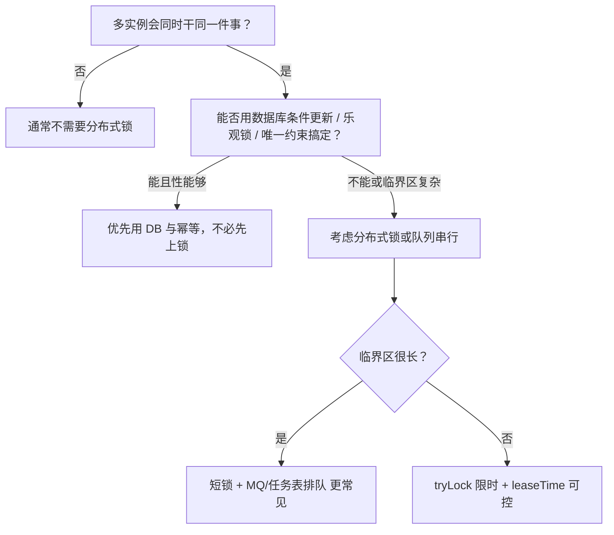

# 分布式锁使用场景

**本文目标**：把「分布式锁适合解决什么问题」按业务场景拆开说明，并标出**常见替代方案**与**踩坑点**，方便选型、写方案或面试前快速复习。实现细节（Redis/Redisson、看门狗、参数）仍以《分布式锁》为主。

**建议搭配阅读**

- 《分布式锁》：原理、特性、Redisson 参数与高并发实践
- 《接口幂等性处理》：锁往往要和幂等、唯一约束一起用
- 《消息队列》：削峰、排队、异步与投递语义
- 《高并发接口限流 → 降级 → 队列 → 分布式锁 → 行锁方案》：整条链路的组合思路

---

## 目录

- [一、先想清楚：你在解决哪一类问题](#一先想清楚你在解决哪一类问题)
- [二、典型使用场景（按业务）](#二典型使用场景按业务)
- [二点五、与「限流」配合的场景（锁不是限流器）](#二点五与限流配合的场景锁不是限流器)
- [二点六、需要「串行」的场景（锁与队列、行锁）](#二点六需要串行的场景锁与队列行锁)
- [三、不太适合单靠分布式锁的场景](#三不太适合单靠分布式锁的场景)
- [四、场景速查表](#四场景速查表)
- [五、上线前检查清单](#五上线前检查清单)

---

## 一、先想清楚：你在解决哪一类问题

分布式锁解决的是 **多进程/多实例之间** 的 **互斥**：同一时刻只有一个执行者能进入某段逻辑或操作某个「逻辑资源」。

**个人观点（工程上的「常见实践」）**：锁更适合包住 **短临界区**（读改写、占坑、去重标记）；若业务必须「最终办成」且耗时长，往往要 **队列 / 异步 / 补偿**，锁只守入口或关键一步。

---

## 二、典型使用场景（按业务）

### 1）热点资源「读改写」互斥（库存、余额、券码、名额）

**问题**：多个请求同时扣减同一行/同一 key，仅靠应用内锁无法跨实例互斥，可能出现超卖、超扣、重复发放。

**常见做法**

- 在「查库存 → 判断 → 更新」这段外包一层锁，**或**把正确性下沉到数据库：`update ... where stock > 0`（条件更新）+ 幂等。
- 高并发下更常见组合：**短分布式锁**（占坑/串行化关键一步）+ **DB 条件更新/唯一约束** 双保险；避免长时间持锁。

**注意**

- 锁过期、续期失败时仍可能重叠执行，**最终正确性**不要只依赖锁，要依赖 **幂等、状态机、DB 约束**。
- 持锁尽量短；热点 key 易把 Redis QPS 打满，需配合 **限流、排队**。

---

### 2）分布式定时任务：多实例只跑一份

**问题**：定时任务不经过网关，多实例部署时可能 **每台都执行**，导致重复打款、重复推送、重复对账等。

**常见做法**

- 任务入口抢锁：抢到执行，抢不到 **跳过**（或按业务选择短暂等待）。
- 锁 key 建议带 **任务名 + 业务日期/分区**，避免不同任务互相影响。

**注意**

- 任务执行时间若很长，评估 **leaseTime** 与是否拆分；避免看门狗无限续期拖死排查。
- 仍需 **幂等**：实例崩溃可能导致「执行了一半」，重试或另一实例补跑不能写坏数据。

---

### 3）防重复提交 / 防双击（配合幂等）

**问题**：用户连点、重试、网关重放导致同一业务被处理多次。

**常见做法**

- 用锁包住「创建订单」「领取优惠券」等入口，结合 **业务唯一键**（用户+活动+券类型等）做锁粒度。
- 更稳的长期方案往往是：**去重表 / 唯一索引 / 幂等 token**，锁可作为 **短期防抖** 而非唯一手段。

**注意**

- 锁粒度太粗会降低吞吐；太细要实现成本与 key 设计要一致。

---

### 4）与消息队列组合：入口短锁 + 异步排队

**问题**：同步链路里若用锁包住整个长流程，线程堆积、Redis 压力、尾延迟都会恶化。

**常见做法**（与《分布式锁》中「锁 + MQ」一致）

- **同步段**：只做校验、占坑、写一条「待处理」状态，用 **短锁** 保证互斥。
- **异步段**：发 MQ，由 **少量 consumer** 限速/按 key 分区串行处理，配合 **幂等消费**。

**注意**

- MQ 带来 **重复消息、乱序** 风险，锁不能替代消费端幂等。

---

### 5）缓存击穿：互斥重建（singleflight 思路）

**问题**：热点 key 过期瞬间，大量请求同时穿透到 DB。

**常见做法**

- 只允许一个实例/线程回源加载缓存，其余等待或快速失败；可用分布式锁实现 **互斥回源**。

**注意**

- 要设置 **等待超时**，避免所有线程挂在锁上。
- 一般也会用「本地锁 + 分布式锁」双层，或直接用成熟组件/框架的 singleflight；按团队栈选型。

---

### 6）全局限流开关、配置发布、一次性迁移

**问题**：希望「同一时刻只有一个执行者在改全局状态」或「迁移任务只跑在一个节点」。

**常见做法**

- 用锁标记 **leader** 或 **迁移进行中**，其它实例看到锁存在则跳过或只读。

**注意**

- 区分 **「互斥」** 与 **「分布式协调」**：复杂选主、长期会话有时更适合 **ZooKeeper/etcd** 或协调组件，而不是长期 Redis 锁。

---

### 7）跨服务对同一业务实体的「短临界区」

**问题**：多个服务都可能触发对同一用户/同一订单的互斥更新（相对少见，通常已收敛到单一写服务）。

**常见做法**

- 若确实多写入口，可用 **以业务主键为粒度的分布式锁** 统一互斥；更干净的做法往往是 **单一写入口 + 领域服务**，锁只在过渡或遗留架构中使用。

---

## 二点五、与「限流」配合的场景（锁不是限流器）

**先把概念分开（事实）**

| 手段 | 主要解决什么 | 典型失败表现 |
| ---- | ------------ | ------------ |
| **限流** | 控制**入口吞吐**、保护全站与下游（线程、Redis、DB） | 超阈值直接拒答 / 排队 / 降级 |
| **分布式锁** | 多实例间对**同一逻辑资源**的 **互斥** | 抢不到锁（`tryLock` 为 false）、持锁等待 |

二者可同一条链路里前后出现，但 **不要用分布式锁代替限流**：高并发下大量线程卡在「等锁」，会把应用线程池和 Redis QPS 一起打爆，效果像「慢速限流」，却**不可控、不公平、难调参**。《高并发接口限流 → 降级 → 队列 → 分布式锁 → 行锁方案》里写的顺序 **先限流、后短锁**，就是为了先便宜后贵。

**常见「限流 + 锁」组合场景**

1. **热点写接口（秒杀、抢券、抢名额）**  
   - **外层**：网关 / 接入层 **令牌桶、漏桶、用户级/接口级限流**，把明显过量的请求挡在应用外。  
   - **内层**：进入应用后，对 **同一 SKU / 同一活动** 再用 **短 `waitTime` 的分布式锁**（或 DB 条件更新）做互斥。  
   - **目的**：限流管「总量」；锁管「同一资源上的并发写」——少人进来以后，锁才不会被挤爆。

2. **抢锁失败当作「软拒绝」**（副作用，不是专业限流）  
   - `tryLock` 超时返回失败，对用户表现为「请稍后再试」，客观上减少了进入临界区的并发。  
   - **局限**：阈值随竞争情况波动，**不能像限流器那样按 QPS/并发精确配置**；仍应在更外层做正规限流。

3. **下游脆弱时的保护**  
   - 若锁内会打 **慢 RPC / 外部 API**，先在入口限流，再缩短持锁临界区，避免「持锁线程」堆积拖垮线程池。

**注意**

- 若发现 **Redis 因抢锁/重试 QPS 过高**，优先：**加大重试间隔、缩短 wait 窗口、入口限流、削峰入队**，而不是无限加机器扛锁。
- **个人观点**：把「最多允许多少人同时抢锁」当成限流目标时，更宜用 **信号量（Redisson 等）/ 专用限流组件 / 网关规则**，语义比「大家一起 tryLock」清晰。

---

## 二点六、需要「串行」的场景（锁与队列、行锁）

**「串行」在这里指**：对 **同一业务维度**（同一订单、同一用户钱包、同一库存行、同一任务分片）的更新，在时间上 **一笔接一笔** 执行，避免并发交织导致状态错乱。

### 1）为什么会和分布式锁扯上关系

锁的副作用就是把 **并行** 收成 **互斥**：同一锁 key 下，任意时刻只有一个持有者执行临界区——这就是 **粗粒度上的串行**（仅在该 key 范围内）。

### 2）典型串行业务场景

| 场景 | 串行维度（锁 key / 分区键 常怎么取） | 说明 |
| ---- | ------------------------------------ | ---- |
| 同一订单状态机推进 | `orderId` | 避免并发改状态跳过合法流转 |
| 同一用户余额/积分入账扣款 | `userId` 或账户号 | 多笔流水依次落账，配合账务幂等 |
| 同一 SKU 库存扣减 | `skuId`（或活动+SKU） | 与条件更新常一起用 |
| 定时/批处理分片 | `shardId`、日期+任务名 | 一片内串行或单 leader 执行 |
| 回调、Webhook 重复投递 | 业务幂等键 | 串行处理同一外部事件 id，避免乱序双写 |

### 3）实现串行的几条路（怎么选）

| 方式 | 适合什么情况 | 简要对比 |
| ---- | ------------ | -------- |
| **分布式锁** | 同步链路里 **短** 串行段、多实例互斥 | 实现快；热点 key 压力大时要配 **短 wait、短 lease** + 外层限流 |
| **MQ 单分区 / 按 key 分区顺序消费** | 可异步、允许排队、吞吐由 consumer 控 | 串行语义在 **消费侧**；要处理 **重复消息** |
| **DB 事务 + 行锁** | 更新已落在同一行、希望引擎兜底 | 与 `WHERE` 条件、乐观锁搭配；《分布式锁》与链路文档中的「行锁」层 |
| **单线程 worker（单写者）** | 强顺序、量可控 | 扩展性靠 **多分片**，每分片内串行 |

**常见组合**：接口同步段用 **短锁** 占坑或校验，真正长耗时处理放进 **MQ**，由 consumer **按 `orderId` 分区** 串行消费——和《分布式锁》里「锁 + MQ」一致。

### 4）和「100% 上锁 · 100% 受理」专项的关系

若产品要求 **请求侧既要抢锁又要把单接进可追踪闭环**（受理 / 入队 / 重试口径），可对照专题 **分布式锁-请求侧上锁与受理方案**：其零节备注写清 **是否真能叫「100% 上锁」「100% 受理」**；「办结」与幂等、死信见该文第六节。

**注意**

- 串行 **粒度越粗**（例如全局一把锁），**正确性简单、吞吐越差**；尽量 **只锁必须互斥的最小维度**。  
- **全局严格顺序** 且 QPS 高时，单靠一把大锁往往不够，应 **分片 + 每片内串行**（锁、队列分区或单写者三选一或组合）。

---

## 三、不太适合单靠分布式锁的场景

下列情况**优先**考虑别的手段，或把锁只作为辅助，避免「为锁而锁」。

| 情况 | 更常见的替代/补充 |
| ---- | ----------------- |
| 正确性可由 **单行条件更新、乐观锁版本号** 保证 | 数据库层保证 + 幂等 |
| 需要 **严格全局顺序** 且吞吐大 | **MQ 分区键顺序消费**、专用串行通道 |
| 临界区很长（调用多个外部系统、人工审核） | **状态机 + 异步 + 补偿**，锁只守极短步骤 |
| 读多写少、允许最终一致 | 缓存、CQRS、定时校准，不必强互斥 |
| 极低延迟、极高 QPS 的热点 | **限流、排队、分片**，锁容易成瓶颈 |
| 「绝对不能丢、绝对不能重复」的账务 | **事务、对账、幂等、Outbox**，锁不是唯一支柱 |

**事实边界**：分布式环境下不存在「永不失败、永不重叠」的锁语义；业务上「不允许失败」通常指 **最终结果可补偿且一致**，而不是 `tryLock` 永远为 `true`。详见《分布式锁》中「抢锁 / 持锁是否一定允许失败」一节。

---

## 四、场景速查表

| 场景 | 是否常用锁 | 常与什么搭配 |
| ---- | ---------- | ------------ |
| 扣库存 / 抢名额 | 常见（短锁） | DB 条件更新、幂等、限流 |
| 限流保护下的热点写 | 常见（短锁） | 网关/令牌桶限流 → 再进锁 |
| 同一实体串行更新 | 常见 | 按业务 key 粒度；或 MQ 分区替代 |
| 定时任务单跑 | 很常见 | 幂等、监控告警 |
| 防连点提交 | 较常见 | 唯一约束、去重表 |
| 缓存击穿回源 | 常见 | 本地锁、超时、降级 |
| 长流程业务 | 慎用长锁 | MQ、状态机、补偿 |
| 纯查询、报表 | 一般不需要 | 只读副本、异步任务 |

---

## 五、上线前检查清单

- [ ] 锁的 **key 粒度** 是否与业务主键一致，避免误伤无关请求？
- [ ] 是否显式考虑 **waitTime / leaseTime**（高并发避免无界等待）？
- [ ] 解锁是否 **校验持锁者身份**（token + 原子脚本），避免误删他人锁？
- [ ] 锁失效或超时后，业务是否仍 **安全**（幂等、唯一约束、状态机）？
- [ ] 是否有 **监控**：抢锁失败率、持锁耗时、Redis 延迟？
- [ ] **限流** 是否在更外层先挡住过量流量，避免用「等锁」冒充限流？
- [ ] **串行粒度** 是否已缩到最小必要维度（避免全局大锁）？异步链路是否已考虑 **MQ 分区 / 单写者**？
- [ ] 是否已读《分布式锁》中与 **看门狗、续期、高并发模板** 相关的实践？

---

*文档类型：场景索引与选型备忘；实现与参数以各中间件当前版本文档为准。*
