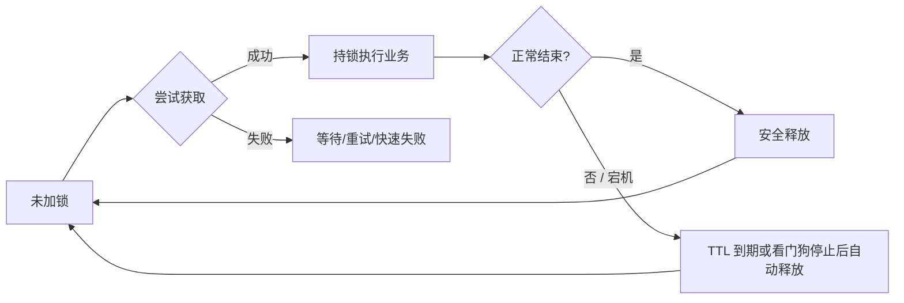

# 分布式锁功能

**本文目标**：用「功能清单 + 生命周期 + 使用模式」把分布式锁能提供的**能力边界**说清楚，方便做方案评审、接口设计和自测对照。原理细节、Redis/Redisson 参数与坑位见《分布式锁》。

**建议搭配阅读**

- 《分布式锁》（特性、实现、Redisson 看门狗与超时）
- **分布式锁-请求侧上锁与受理方案**（受理 vs 办结、是否「两个 100%」见该文零节备注；含队列/补偿、无队列重试抢锁与指标）
- 《高并发接口限流 → 降级 → 队列 → 分布式锁 → 行锁方案》（限流与锁的先手顺序）
- 《高并发请求顺序执行方案》（**请求顺序**由 MQ 单分区/单队列物理保障；锁主责互斥，不主保顺序）

---

## 目录

- [一、核心功能（能力矩阵）](#一核心功能能力矩阵)
- [二、锁的生命周期与操作](#二锁的生命周期与操作)
- [三、对业务暴露的常见「使用模式」](#三对业务暴露的常见使用模式)
- [四、与周边能力的分工](#四与周边能力的分工)
- [五、限流相关能力（澄清与配合）](#五限流相关能力澄清与配合)
- [六、串行能力](#六串行能力)
- [七、公平性（是否公平锁）](#七公平性是否公平锁)
- [八、Redisson（与本文功能的对照）](#八redisson与本文功能的对照)
- [九、功能验收与自查清单](#九功能验收与自查清单)

---

## 一、核心功能（能力矩阵）

| 功能 | 要解决什么问题 | 典型表现 / 参数语义 |
| ---- | -------------- | ------------------- |
| **互斥** | 同一资源同一时刻只允许一个执行者进入临界区 | 只有一个客户端/线程 `hold` 成功 |
| **可辨识的持锁者** | 防止「别人解了你的锁」、防止误续期 | 锁 value 存唯一 token，解锁/续期前校验 |
| **获取锁（阻塞）** | 必须等到拿到锁再执行业务 | `lock()` 类语义，可能无限等（需谨慎） |
| **获取锁（非阻塞 / 限时等待）** | 高并发下避免线程堆积，允许降级 | `tryLock(waitTime, …)`，超时返回失败 |
| **释放锁** | 业务结束或异常路径上主动归还 | 仅持锁者可删；建议 Lua 原子「校验 + 删除」 |
| **锁自动过期（TTL）** | 进程宕机、网络断开导致无法解锁时避免死锁 | `EX`/`PX` 或等价过期；与业务最长耗时需匹配 |
| **自动续期（看门狗）** | 业务耗时 > 初始 TTL 时避免锁提前失效 | 仅持锁者续期；需上限与监控（防卡死一直续） |
| **可重入（可选）** | 同一线程嵌套调用同一把锁不自我死锁 | 由中间件/封装层实现（如 Redisson） |
| **公平锁 / 非公平（可选）** | 多竞争者时是否「先等先得」，避免长期饿死 | 依实现而定；见[七、公平性](#七公平性是否公平锁) |
| **锁粒度与命名** | 按用户、订单、任务等隔离，避免「一把大锁」 | key 设计：`业务:资源类型:资源ID` 等 |
| **同资源串行化** | 同一资源上的并发写/临界区「一个接一个」执行，避免竞态 | 同一 key 下互斥；不同 key 仍可并行（见[六、串行能力](#六串行能力)） |
| **限流相关（配合语义）** | 锁**不是**全局限流器，但常与限流组合，并产生「单资源极低并发」效果 | 入口限流保护全站；`tryLock` 失败快速拒保护线程与 Redis（见[五、限流相关能力](#五限流相关能力澄清与配合)） |

---

## 二、锁的生命周期与操作

用一条时间线理解「功能」如何串起来：

| 阶段 | 应具备的功能点 |
| ---- | ---------------- |
| **获取前** | key 设计、超时策略（wait）、是否允许重试与退避、是否需要公平排队（见第七节） |
| **持锁中** | 临界区尽量短；可选续期；业务超时与熔断 |
| **释放时** | 身份校验 + 原子删除；finally/try-with-resources 等防漏释 |
| **异常与边界** | TTL 到期后的幂等与数据一致性（不能假设「永远持锁」） |

---

## 三、对业务暴露的常见「使用模式」

工程上常把底层锁封装成少数几种**对外功能**，业务只关心「包一段代码」：

| 模式 | 行为摘要 | 适用 |
| ---- | -------- | ---- |
| **executeWithLock** | 抢到锁则执行 Runnable/Supplier，结束自动释锁 | 大多数同步互斥场景 |
| **tryExecuteWithLock** | 限时抢锁，失败走降级或返回错误码 | 高并发接口、热点资源 |
| **scheduleWithLock** | 定时任务入口：抢到才跑，避免多实例重复跑 | 分布式定时任务 |
| **分段锁 / 多 key** | 按分片 key 降低单点热点 | 高 QPS 同类型资源 |

封装层建议从配置读取默认 `waitTime`、`leaseTime`、重试间隔，与《分布式锁》中「统一封装」一节一致。

---

## 四、与周边能力的分工

分布式锁**不是**万能；从「功能」上把它和邻居划清，避免重复造轮子或漏兜底：

| 能力 | 主要解决的「功能」 | 与锁的关系 |
| ---- | ------------------ | ---------- |
| **DB 条件更新 / 乐观锁** | 单行/单表上的并发正确性 | 很多场景可减锁或替代部分锁 |
| **幂等 / 去重** | 重复请求、重复消费不造成重复副作用 | 锁失效、重试时必须配合 |
| **消息队列** | 削峰、排队、异步最终一致 | 抢锁失败或要「最终办成」时常组合使用 |
| **限流** | 保护系统与 Redis QPS | 锁之前先限流，避免锁成为新瓶颈 |

---

## 五、限流相关能力（澄清与配合）

分布式锁解决的是**跨进程/跨实例互斥**；**全局限流、按接口 QPS 限流**一般由网关、Sentinel、令牌桶等承担。二者常同栈出现，但语义不同（可对照《高并发接口限流 → 降级 → 队列 → 分布式锁 → 行锁方案》）。

### 5.1 锁本身「不是」限流器，但会带来限流相关效果

| 点 | 说明 |
| ---- | ---- |
| **不等于全局限流** | 锁按 **key** 生效；没有 key 维度时谈不上「限住全站 QPS」。 |
| **单资源维度上的极强「限并发」** | 同一 key 互斥 → 该资源上同时只有 **1** 个执行者进入临界区，等价于该资源上的并发度被压到 1（是**串行**语义，不是每秒允许多少次的令牌桶）。 |
| **同步链路上的「减压」** | `tryLock` + 短 `waitTime` + 快速失败：大量请求在抢锁阶段就返回「繁忙」，**不会全部堆进临界区**，从而减轻线程占用与下游（含 Redis 抢锁重试）压力——这是**配合降级**，不是锁在替你算 QPS。 |

### 5.2 推荐配合顺序（功能视角）

1. **先限流（入口）**：先挡住明显超量的请求，便宜、可预测。
2. **再抢锁（短临界区）**：只让「已通过限流」的流量参与互斥，避免锁成为全站瓶颈。
3. **抢锁失败再排队/降级**：入 MQ、返回稍后再试、读缓存等，与《分布式锁》中「抢锁超时」处理一致。

### 5.3 常见误区

- **用一把全局锁当限流**：所有请求抢同一把锁 → 全系统串行，吞吐崩溃；限流应仍在接入层或资源维度分开设计。
- **无限等待 + 高并发**：没有限流也没有短 `waitTime` 时，线程与 Redis 压力会叠加放大。

### 5.4 抢锁失败后写入 MQ：与同步持锁路径的关系

为保障**最终一定会执行**，抢锁失败时常把任务投递到消息队列。此时存在**两条互不相干的执行通道**：

- **通道 1**：某请求在同步链路里**抢到锁**，在接口线程（或同进程内持锁线程）里执行业务。
- **通道 2**：某请求**抢锁失败**，消息进入 MQ，由 **Consumer 在另一套线程/时机**里执行业务。

通道 1 与通道 2 **可以并行**：例如 A 正持锁执行的同时，B 对应的 Consumer 也可能在处理消息（若未再做互斥设计）。因此「最终业务**完成**的先后顺序」**通常既不是公平排队，也不等价于「只存在一把锁时的全局串行」**。公平锁、同步串行只约束**仍在抢同一把锁的那批调用**；**已进入 MQ 的请求**不再参与该锁的排队语义。展开见第七节 **7.4**（同章下文小标题「抢锁失败走 MQ 与同步持锁：双路径下的公平与串行」）。

---

## 六、串行能力

**串行功能**指：在**某个锁 key** 所标识的范围内，同一时刻最多只有一个执行者运行被锁保护的代码，多个并发请求在该范围内表现为**一个接一个**进入临界区（**并发重叠**被禁止）。注意：「一个接一个」的**先后顺序**未必是公平的，见[第七节](#七公平性是否公平锁)。

### 6.1 与「互斥」的关系

- **互斥**是机制（只有一个能持有锁）。
- **串行**是业务可感知的效果：对**同一资源**的写路径、读改写路径不再并行执行。

### 6.2 粒度：谁和谁串行

| 粒度 | 效果 |
| ---- | ---- |
| **细粒度 key**（推荐） | 例如 `lock:order:123`：只有订单 123 的请求互斥；订单 456 可与 123 **并行**。 |
| **粗粒度 key** | 例如全表、全业务一把锁：所有请求在该锁下**全局串行**，一般仅用于运维/迁移等特殊场景。 |

### 6.3 与其它「串行」手段的对比（功能级）

| 手段 | 串行范围 | 典型用途 |
| ---- | -------- | -------- |
| **分布式锁（按 key）** | 跨实例、按你定义的 key 维度 | 短临界区、防重复执行、与 Redis/ZK 等协调 |
| **DB 行锁 / 事务** | 数据库引擎内、通常按行/索引 | 更新同一行时的强语义，常与条件更新配合 |
| **MQ 单分区 / 单消费者线程** | 分区内消息顺序消费 | 削峰、异步最终一致、按业务主键分区时常可替代部分锁 |

### 6.4 使用串行能力时的代价与设计要点

- **吞吐**：同一 key 上 QPS 上限大致受「单次临界区耗时」约束，过长的持锁会直接拉低该资源的处理能力。
- **延迟**：后续请求要等待锁释放；需合理设置 `waitTime`、降级与排队，避免线程堆积（详见《分布式锁》高并发建议）。
- **正确性兜底**：锁可能提前过期或抢不到；**幂等、唯一约束、状态机**仍要有，不能把「串行」当成唯一防线。

### 6.5 串行顺序与「公平」的关系

同一 key 上虽然**不会并发重叠**，但**谁先拿到下一把锁**仍可能是**非公平**的：早就在等的请求未必先于刚到的请求获得锁。是否需要「排队公平」见[七、公平性](#七公平性是否公平锁)。

---

## 七、公平性（是否公平锁）

**公平锁（fair）**：多个竞争者阻塞等待时，大致按**进入等待的先后顺序**获得锁（先等先得），减少「老请求一直抢不到」的**饥饿**风险。  
**非公平锁（unfair / 默认常见）**：释放锁后，**刚到达**或**重试更勤快**的竞争者可能比已等待更久的更早抢到锁；实现更简单，**吞吐通常更好**。

### 7.1 和「互斥 / 串行」的区别

| 概念 | 回答的问题 |
| ---- | ---------- |
| **互斥** | 同一时刻是否只有一个持锁者？ |
| **串行** | 同一 key 下业务是否不会并行执行？ |
| **是否公平** | 多个等待者之间，获得锁的**先后顺序**是否可预期、是否避免长期饿死？ |

互斥与串行**不蕴含**公平：即使完全串行，仍可能是「谁运气好谁先上」的非公平调度。

### 7.2 常见实现侧向哪一边

| 实现思路 | 公平性倾向 | 备注 |
| -------- | ---------- | ---- |
| **Redis + 简单 SET NX + 自旋/重试** | 多为**非公平** | 通常没有中心化「等待队列」语义，谁先 `SET` 成功谁拿锁。 |
| **Redisson `getFairLock`** | **公平锁** | 与 `getLock`（默认非公平）成对记忆；开销与行为以 Redisson 文档为准。 |
| **Redis + 其它带排队的公平锁封装** | 可接近**公平** | 是否在服务端维护队列、释放时是否按队首移交；以各库文档为准。 |
| **ZooKeeper / etcd 等：临时顺序节点** | 常更易做**有序、相对公平**的排队 | 谁排在前面谁先成为持锁者；仍要读所用框架（如 Curator）的锁类型说明。 |

### 7.3 选型建议（功能视角）

- **高并发、短临界区、只要求正确互斥**：多数场景**非公平**即可，延迟与实现成本更低。
- **长等待、强诉求「先到先得」、怕尾部请求饿死**：评估**公平锁**或**MQ 按序消费**等带明确排队语义的方案；公平锁往往增加协调开销，需压测。
- **验收**：若产品承诺「严格排队」，不能仅依赖「未声明为公平」的 Redis 抢锁实现，须在需求里写明并选对 API。

### 7.4 抢锁失败走 MQ 与同步持锁：双路径下的「公平」与「串行」

你提到的典型模式是：**抢锁失败 → 发 MQ → 消费者异步兜底执行**，以保证「最终会办」。这里要特别分清三层语义：

| 层次 | 往往能保证什么 | 往往不能保证什么 |
| ---- | -------------- | ---------------- |
| **同步抢锁** | 同一时刻只有一个持锁者进入临界区（互斥） | 多个等待者之间的顺序是否公平（取决于是否公平锁） |
| **MQ 投递** | 削峰、异步、**最终**处理到（在消费成功且不丢消息的假设下） | 与「同步持锁刚执行完的那条请求」谁先谁后；与**另一条**同步请求的执行顺序 |
| **双路径并存** | 两条路各自可正确实现幂等/一致 | **「全链路按请求到达顺序完成业务」**；也**不**自动等价于「同一资源永远只有一个执行者在干活」 |

**为何最终业务执行并非公平**：Consumer 处理消息与「别的请求在同步链路里持锁执行」**时间上重叠、并行推进**。谁先跑完取决于持锁时长、队列积压、消费并发度、网络延迟等，**与「谁先发起 HTTP 请求」无简单对应关系**。公平锁只排序**还在同一把锁上阻塞/重试抢锁**的调用者；**已经变成 MQ 里的一条消息**后，顺序由 **topic/分区、重试、多消费者并行** 等规则决定，与锁的公平性**不是同一套队列**。

**若仍要求同一资源「串行 + 相对有序」**，需要在架构上显式收口，例如（根据业务选一种或组合）：

- Consumer **消费同一业务资源时再次抢同一把分布式锁**（或同一 `lease key`），使「同步执行」与「异步兜底」在**资源维度**仍互斥；**有序**还要配合 **按业务主键分区 + 单线程/单消费位点** 或业务层序号。
- 或 **同一资源只走一条主路径**（例如全部异步化），避免「同步持锁」与「MQ 异步」对同一临界区**无协调地双轨并行**。

**一句话**：MQ 解决的是**最终办成**与**削峰**；若不额外设计，**不**解决「与同步持锁任务并行时仍全局公平、全局串行」的问题。

**顺序性主责（与锁分工）**：若业务要强 **请求按序处理（如 FIFO）**，不宜把「顺序」主要压在分布式锁（尤其非公平锁）上；应见《高并发请求顺序执行方案》——由 **MQ 分区键 + 同一分区顺序消费** 等形成**单管道**来物理保障顺序，分布式锁仍用于 **互斥、短临界区** 及双路径下 **Consumer 与同步链路同 key 收口**，**不替代** MQ 的顺序语义。

---

## 八、Redisson（与本文功能的对照）

**Redisson** 是面向 Java 的 **Redis 客户端**，在普通命令之外提供一批**分布式对象**（对象名常以 `R` 开头），其中与锁最相关的是 **`RLock`**：在 Redis 上实现互斥、可重入、安全解锁等，并内置**看门狗续期**、**抢锁等待**等语义。更细的参数默认值、坑位与「两类重试」见《分布式锁》中 Redisson 各小节。

> 以下 API 名称以常见用法为纲；**具体重载、默认值与行为以你项目使用的 Redisson 版本官方文档为准**。

### 8.1 锁对象怎么拿：非公平 vs 公平

| API（典型） | 功能语义（本文对应） |
| ----------- | -------------------- |
| `redisson.getLock(name)` | **默认可重入、非公平**的 `RLock`；高并发场景最常见 |
| `redisson.getFairLock(name)` | **公平锁**（排队倾向更强）；与[第七节](#七公平性是否公平锁)对照选型 |

`name` 即业务上的锁 key 字符串（Redisson 内部会按规则映射到 Redis key，无需手写 `SET NX`）。

### 8.2 获取 / 释放与看门狗（和第一节矩阵对齐）

| 本文功能 | Redisson 侧怎么理解 |
| -------- | ------------------- |
| **互斥 + 可重入** | `RLock` 同一 JVM 线程可多次 `lock`，需对应次数 `unlock` |
| **限时等待** | `tryLock(waitTime, leaseTime, unit)`：`waitTime` 为抢锁最长等待 |
| **持锁时长 / TTL** | `tryLock(..., leaseTime, ...)` 传入**正**的 `leaseTime`：一般表示固定租约，**通常不启看门狗**（与无参 `lock()` 不同） |
| **看门狗自动续期** | 无参 `lock()`，或 `leaseTime = -1` 的 `tryLock`：持锁期间由看门狗按策略续期，避免业务未结束锁先过期 |
| **非阻塞试一把** | `tryLock()`（无等待或零等待语义，以文档为准） |
| **安全释放** | `unlock()` 由客户端用 **Lua** 等保证「只解自己的锁」，对应本文「token + 原子删除」思路 |

### 8.3 高并发下与本文第五、六节的衔接

- **限流**：Redisson 不提供「按接口 QPS」限流；应在网关 / Sentinel 等先做，再进入 `tryLock`。
- **串行**：同一 `name` 的 `RLock` 将多实例对该锁名的访问**串行化**；不同 `name` 互不阻塞。
- **推荐**：核心同步链路多用 `tryLock(较短 waitTime, 明确 leaseTime, …)`，避免无界 `lock()` 线程堆积；理由见《分布式锁》「高并发场景」一节。

### 8.4 与「原生 Redis」手写锁的关系

Redisson 把 **SET NX EX、Lua 解锁、续期、可重入计数** 等封装在客户端与约定好的 key 结构里。功能评审时仍可对照本文第一节「应具备的能力」，只是实现细节由 Redisson 代劳，减少手写脚本出错面。

---

## 九、功能验收与自查清单

上线或 Code Review 时可对照：

- [ ] **互斥**：同一资源并发压测下，临界区内是否最多只有一个成功者（或符合产品语义）。
- [ ] **串行语义**：是否明确「哪些 key 会互相串行、哪些 key 仍可并行」；是否误用全局锁导致全站串行。
- [ ] **公平性**：业务是否要求「先等先得」；若要求，所选实现是否为公平锁/有序排队，而非默认非公平抢锁。
- [ ] **抢锁失败 + MQ**：是否清楚「同步持锁执行」与「Consumer 执行」可**并行**，端到端完成顺序**通常不公平**；若业务仍要同资源串行/有序，Consumer 是否再抢同锁或单分区顺序消费等。
- [ ] **限流配合**：入口或接口级限流是否在抢锁之前；高并发路径是否避免无界 `lock()` 等待。
- [ ] **安全释放**：是否只能删除自己的锁（token + 原子脚本）。
- [ ] **超时**：`waitTime`、`leaseTime` 是否有明确默认值与上限；无限等待是否被禁止在核心链路。
- [ ] **续期**：若使用看门狗，续期是否校验持锁者；是否有最大持锁时间或业务超时。
- [ ] **异常路径**：业务异常、超时、进程 kill 是否仍能在 TTL 内或逻辑上恢复一致（幂等、补偿）。
- [ ] **可观测**：锁等待时间、失败率、持锁耗时是否有日志或指标。
- [ ] **Redisson**：若使用看门狗，是否清楚「无参 `lock` / `leaseTime=-1`」与「正 `leaseTime`」的差异；公平需求是否用了 `getFairLock` 而非默认 `getLock`。

---

**说明**：具体中间件（如 Redisson API）的参数组合与默认值以当前版本文档为准；本篇「第八节」为功能速查，《分布式锁》为原理与排错主文。
