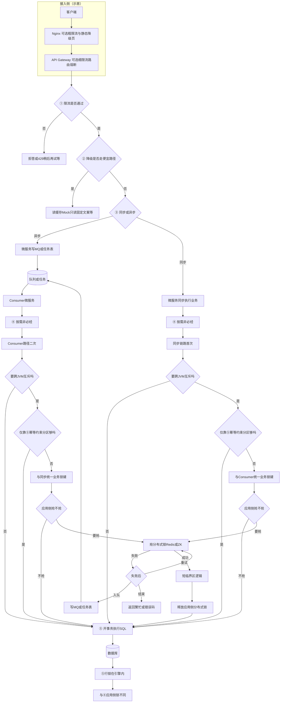

# 高并发接口：限流 → 降级 → 队列 → 分布式锁 → 行锁方案

**本文目标**：给高并发接口设计一条**从外到内**的防护链，说明每一层的职责、典型落点、与下一层的衔接，以及何时可以省略某一层。读完能按链路自查：入口是否先挡流量、异步是否削峰、锁是否够短、数据库是否最终兜底。

**建议搭配阅读**

- 《分布式锁》（互斥语义、TTL、看门狗、工程现实）
- 《消息队列》（投递语义、顺序、幂等）
- 《接口幂等性处理》（去重与最终一致）

---

## 目录

- [一、总原则：先便宜后贵](#一总原则先便宜后贵)
- [二、分层方案与先手顺序](#二分层方案与先手顺序)
- [二点五、环节与 Nginx / Gateway / 微服务 / DB](#二点五环节与-nginx--gateway--微服务--db)
- [三、请求路径对照](#三请求路径对照)
- [四、各层要点速查](#四各层要点速查)
- [五、常见误区](#五常见误区)
- [六、落地检查清单](#六落地检查清单)

---

## 一、总原则：先便宜后贵

1. **越靠外**：越早拒绝或排队，消耗越少（线程、CPU、Redis、DB），**失败越快越好**。
2. **越靠内**：越贴近数据与强一致，**成本越高**，应缩短持锁时间与事务范围。
3. **分布式锁 ≠ 限流**：锁解决**跨实例互斥**；限流解决**吞吐与公平**。二者可同栈，但语义不同（详见《分布式锁》与下文）。
4. **最终正确性**：分布式环境下锁可能抢不到、持不住；**幂等、唯一约束、条件更新**常与行锁/事务一起构成最后防线。
5. **分布式锁在多实例、高并发下仍非必须**：**多副本部署**和**高 QPS**本身**推不出**「一定要用 Redis/ZK 分布式锁」。只有当你确实需要**跨 JVM 的互斥**（同一时刻只有一个实例能执行某段应用层逻辑），且用 **DB 行锁+条件更新/唯一约束、幂等、MQ 按业务键分区单写** 等更贴近存储或更便宜的手段**仍不够表达或更不合算**时，才在链路④启用「要抢」；否则可走图中 **「不抢」** 直抵 **⑤**。

---

## 二、分层方案与先手顺序

从**最先出手**到**最后出手**的推荐顺序如下（同步与异步在「队列」处略有分叉）。

| 顺序  | 手段          | 典型位置                   | 职责（一句话）                 |
| --- | ----------- | ---------------------- | ----------------------- |
| ①   | **限流**      | 网关、接入层、接口维度            | 超阈值快速拒/延迟，保护全站与下游       |
| ②   | **降级**      | 入口旁路、依赖熔断后             | 过载或故障时走便宜路径（缓存、只读、关非核心） |
| ③   | **队列**      | 异步入 MQ/任务表；同步场景可为线程池排队 | 削峰填谷，把「必须办成」延后由消费者处理    |
| ④   | **分布式锁（按需）** | 应用进程内、**短**临界区         | **非必经**：仅当要**跨实例互斥**且更便宜手段不足时；否则可省略，靠⑤与幂等/分区等      |
| ⑤   | **行锁**（含事务） | 数据库引擎内                 | 同一行冲突更新的强语义，配合条件更新/约束   |

### 流程示意（Mermaid）

> **说明**：下图仅为**帮助记忆顺序与分支**的示意，真实部署里限流/熔断可能分散在 Nginx、Gateway、Sidecar、应用多处；节点可省略或合并，**不当作严谨架构图**使用。图中 **「分布式锁」** 均指 **应用侧**（Redis、ZK 等）互斥；**「行锁」** 指 **数据库引擎内** 与事务相伴的锁——**两把不同的锁**，勿混称。  
> **是否必须（结论）**：**微服务多实例 + 高并发下，分布式锁不是必选项。** 图中 **「不抢」** 路径是**常态合法路径**：直接 **⑤ 事务 + 行锁/约束/幂等** 往往即可；**「要抢」** 仅服务于**明确的跨副本应用层互斥**场景。  
> **是否要抢锁（图中逻辑）**：先问 **要不要跨 JVM 互斥**（**S1/T1**）；若 **否**，直接 **⑤**，**不经过**应用侧抢锁。再问 **仅靠⑤（幂等、唯一约束、条件更新、MQ 分区单写等）能否收口**（**S2/T2**）；若 **够**，仍 **不抢** 直走 **I**。仅当 **要互斥** 且 **⑤ 侧手段仍不够** 时，才进入 **H1n/H2n** 与 **是否抢应用侧锁**（**H1/H2**）。  
> **渲染提示**：节点一律单行、不用 ` `，避免部分预览把 HTML 当纯文本；④ 同步链 **H1t→H1m→S1→S2→H1n→H1**，异步 Consumer 链 **H2t→H2m→T1→T2→H2n→H2**。  
> **闭环**：抢锁 **失败** 后必须三选一（或组合策略）：**回到 J 重试**、**写队列经 Q 再被 F 消费**、或 **Jend 直接结束**；抢锁 **成功** 经 **K→Ku** 释应用侧锁后再 **I→DB**，与「不抢」直走 **I** 区分。

**与上图对应的「粗糙」对照**（非一一映射实现）：

| 图里大块 | 常见落在 |
| --- | --- |
| Nginx / Gateway | 接入层，限流与部分降级前移 |
| ①② | 网关 + 应用都可能参与 |
| ③ 异步 | 接入服务写队列，与 Consumer 拆开 |
| ④ | **非必须**；**S1/T1** 无跨 JVM 互斥则直 **I**；**S2/T2** ⑤ 侧已够用则直 **I**；否则 **H1n/H2n** 约定与对侧 **同键**，**H1/H2** 定是否上应用侧锁 |
| ⑤ | 微服务发起事务；**行锁**在库内，与 ④ 不是同一把锁；图中 **DB→DBl→DBe** 为圆柱下补充说明，避免一行过长 |
| 抢锁失败 | **Jf** 三向：**重试** 回 **J**，**入队** 经 **Jq→Q→F** 形成异步闭环，**结束** 到 **Jend** |
| 抢锁成功 | **K→Ku→I**：短临界区后 **释放应用侧锁** 再开事务；**不抢** 则 **H1/H2→I** 不经 **Ku** |

---

## 二点五、环节与 Nginx / Gateway / 微服务 / DB

**你在对齐的事**：五个环节分别主要由 **Nginx（七层接入）**、**API Gateway（统一路由与治理）**、**微服务（业务进程）**、**数据库** 哪一层来做；避免「全堆在应用里」或「以为网关万能」。

**说明**：下表是**最常见的第一落点**。同一能力可以**多层叠加**（例如 Nginx 做全站粗限流 + Gateway 做按路由/用户细限流），以实际架构为准。Service Mesh Sidecar（如 Envoy）的能力常与 Gateway 类似，此处归入 **Gateway/边车** 一类理解即可。

| 环节 | Nginx | API Gateway（如 Spring Cloud Gateway、Kong、APISIX 等） | 微服务 | 数据库 |
| --- | --- | --- | --- | --- |
| **① 限流** | **常见**：`limit_req` / `limit_conn`、OpenResty Lua、商业模块 | **常见**：路由级限流、解析 Token 后按用户/租户限流、全局限流插件 | **可选补强**：Sentinel、Resilience4j、注解/过滤器级限流（保护本服务线程池） | — |
| **② 降级** | **偶发**：维护页、`error_page`、静态兜底、跳转备用域名 | **常见**：熔断、超时/重试策略、路由到降级后端、返回固定 JSON | **核心**：读缓存、Mock、关闭非核心接口、同步改异步提示、业务开关 | — |
| **③ 队列** | 一般不直连 MQ | **少数**：网关异步化模式（不普遍）；多数团队仍由服务发消息 | **核心**：生产消息 / 写任务表、线程池排队；**Consumer 也是微服务** | — |
| **④ 分布式锁（按需）** | — | — | **仅此且非必经**：Redis / ZooKeeper 等在**应用代码**中调用；多实例高并发仍可省略 | — |
| **⑤ 行锁（事务）** | — | — | **发起**：在微服务里开事务、执行 SQL | **持有**：InnoDB 等引擎在**库进程内**加行锁 |

**图例**：**常见** = 多数团队默认放这里；**可选补强** = 有则用、不强制；**核心** = 业务语义主要在这里实现；**—** = 通常不承担该职责。

**从外到内一句话**：`客户端 → Nginx（可选粗限流/静态降级）→ Gateway（细限流、路由、熔断）→ 微服务（业务降级、入队、按需分布式锁、开事务）→ 数据库（行锁）`。

---

## 三、请求路径对照

### 3.1 同步接口（用户等待结果）

**常见链路**：`限流 →（必要时降级）→ 业务逻辑 →（可选）短分布式锁 → 单库事务内更新`

- 用户路径上**不宜**长时间占分布式锁；高并发下优先 **短 waitTime + 显式 leaseTime**（见《分布式锁》）。
- 强一致且范围极小：可侧重 **事务 + 行锁 / 条件更新**，减少锁层级数。

### 3.2 异步接口（快速返回 + 最终一致）

**常见链路**：`限流 → 降级（可选）→ 写入队列 → Consumer →（可选）分布式锁 → DB 事务`

- 队列承担**削峰**；Consumer **并发度可控**，与限流目标一致。
- 消息可能重复：需 **幂等**（搭配《接口幂等性处理》）。

### 3.3 降级与限流的先后

**常见实践**：先**限流**（数字闸门），再在系统不健康或触顶时触发**降级**；也可将「限流拒答」视为用户体验上的一种降级表现。不必机械争论一字先后，关键是**都在重逻辑之前**完成决策。

---

## 四、各层要点速查

### 4.1 限流

- **维度**：全站、接口、用户、IP、租户等；热点 key 可单独配置（**常见实践**）。
- **算法**：令牌桶、漏桶、滑动窗口等；参数以容量与业务为准（**以所用中间件/网关文档为准**）。
- **与下游**：限流在**最前**，避免无效请求打满线程池与 DB。
- **落点**：优先 **Nginx / Gateway**；需要按复杂业务维度限流时 **Gateway 或微服务** 更常见。

### 4.2 降级

- **触发**：错误率、超时、限流触顶、人工开关（**常见实践**）。
- **手段**：读缓存、返回简化结果、关闭非核心功能、同步改异步提示。
- **注意**：降级路径也需**限流**，防止缓存被打穿。
- **落点**：**熔断/路由级**多在 **Gateway**；**读缓存、Mock、业务开关**在 **微服务**；**维护页/静态页**可在 **Nginx**。

### 4.3 队列

- **作用**：吸收突发、解耦、重试与死信策略（见《消息队列》）。
- **顺序与分区**：强顺序需求时按业务键分区；注意单分区吞吐上限。
- **与锁**：Consumer 内若多实例竞争同一资源，可短锁；或依赖 **分区内单线程 + 幂等** 减少锁依赖。
- **落点**：**生产与消费**一般在 **微服务**（含独立 Consumer 服务）；**Nginx/Gateway** 通常不直接写 MQ。

### 4.4 分布式锁

- **是否必须**：**不是。** 多实例、高并发**不**构成充分理由；可先评估 **⑤ + 幂等/唯一约束/条件更新、MQ 分区单写** 是否已解决争用。仅在需要 **跨副本应用层互斥** 且上述手段不够或更不合算时再上锁。
- **适用**：跨 JVM/多实例的短临界区；定时任务单跑；与 MQ 组合的「入口短锁 + 排队」模式（《分布式锁》）。
- **避免**：长事务、大临界区、把锁当唯一正确性保证。
- **高并发**：`tryLock(waitTime, leaseTime)`、监控 Redis、失败降级或入队。
- **落点**：仅在 **微服务（应用进程）**；**Nginx / Gateway** 不做分布式锁。

### 4.5 行锁（数据库）

- **出现场景**：事务中 `UPDATE`/`SELECT ... FOR UPDATE` 等触及同一行时的引擎行为（因隔离级别与引擎实现而异，**以所用数据库文档为准**）。
- **配合**：`WHERE` 条件（库存扣减等）、唯一索引、乐观锁版本号，减少对「锁时长」的依赖。
- **位置**：链路**最内层**，与事务同生命周期，比分布式锁更贴近存储语义。
- **落点**：事务与 SQL 由 **微服务** 发起；**行锁**由 **数据库引擎**在库内持有（不在 Nginx/Gateway）。

---

## 五、常见误区

| 误区         | 说明                                    |
| ---------- | ------------------------------------- |
| 只用分布式锁扛高并发 | 易导致线程堆积、Redis 压力；应先 **限流/队列**。        |
| 把分布式锁当限流   | 锁是**互斥**；限流是**速率/并发度**控制，目标不同。        |
| 链路上只有行锁    | 入口无保护时，DB 会先被打满；外层仍要 **限流/队列**。       |
| 认为锁保证绝对串行  | 分布式锁存在 TTL、续期失败等窗口；需 **DB 约束与幂等** 兜底。 |
| 多实例高并发就必须分布式锁 | **错误**。多副本与 QPS 高**不**推出必须用 Redis/ZK 锁；很多场景 **⑤ + 幂等/唯一约束/分区串行** 已够，锁是 **按需** 层。 |

---

## 六、落地检查清单

- **入口**：是否对接口/用户/全站做了限流？**Nginx / Gateway / 微服务**哪几层在做、是否重复或缺口？阈值是否可配置、可观测？
- **降级**：依赖故障或过载时是否有明确 fallback？是否会被放大流量打挂？
- **异步**：峰值是否可通过 MQ/任务表消化？Consumer 并发与重试/死信是否定义？
- **分布式锁**：是否**确需**跨实例互斥？若否，是否已用 **⑤+幂等/约束** 或 **队列分区** 收口？若需，是否仅用于短逻辑？`waitTime`/`leaseTime` 是否合理？失败是否有退路（快速失败或入队）？
- **数据库**：事务是否尽量短？是否用条件更新/唯一约束/幂等防止重复写？
- **全链路**：监控与告警是否覆盖拒答率、队列积压、锁等待、慢 SQL？

---

*本文为知识库中的方案提纲与复习用整理；具体中间件参数与数据库隔离级别以实现与官方文档为准。*