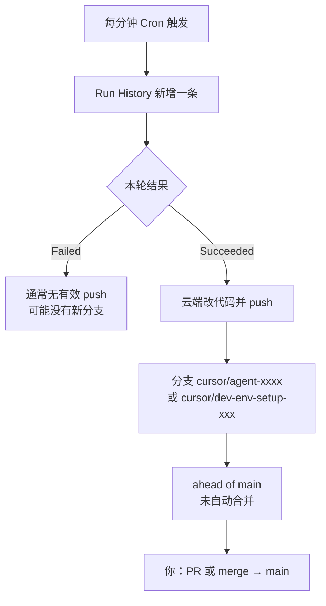

# SCM 波次推进：运行历史与 Git 仓库分支

> **本项目只采用一种 Git 模式：远程开发的「个人工作分支」。** 多个 Run 只提交到 **`cursor/scm-wave`**，波次结束再由人合并到 `main`。**禁止**「一个 Run 一个 `cursor/agent-*` 分支」。

---

## 1. 一句话结论（唯一模式）

| 概念 | 约定 |
|------|------|
| **main** | 主线；Automation **不**直接 push、不自动 merge |
| **cursor/scm-wave** | 云端的「你的分支」；从 `main` 拉出，**全波次共用** |
| **Run** | 多轮开发；每轮成功 → **同一分支** 上 commit + push |
| **运行历史** | 只看跑没跑成功；**不等于**新建分支 |
| **你收尾** | 波次结束 → **1 次** PR 或 merge：`cursor/scm-wave` → `main` |

配置与验收：第 **2.3、2.9** 节。本机 push / 云端先 pull：第 **2.4、2.5** 节。历史 `cursor/agent-*`：附录 A。

---

## 2. 推荐心智模型：个人分支 = 云端一条工作分支

### 2.1 和以前本机开发怎么对应

| 以前（本机） | 云端 Automation（应对齐成这样） |
|--------------|----------------------------------|
| 新任务：从 `main` 拉代码 | 从 `main` 检出，在 **固定工作分支** 上改 |
| 在自己的分支上写代码 | 多个 **Run** = 多轮写代码，**同一分支** 上多次 commit |
| 写的过程可能分很多天/很多次保存 | 每分钟一次 Run ≈ 多次保存，**不**应为每次 Run 新建分支 |
| Run/保存成功 → `git push` 到 **自己的分支** | 成功 → push 到 **`cursor/scm-wave`**（或你定的分支名），**不是** `cursor/agent-xxxx` |
| 任务做完 → 自己 merge / PR 到 `main` | 波次（如 W37）做完 → **你** 开 1 个 PR 或本地 merge 到 `main` |
| `main` 保持干净 | `main` **仍不**被每分钟自动 merge；只有你觉得可以收口才合 |

**一句话：** Run History 记的是「今天改了几轮」；Git 上应只有 **一条待合并的工作分支** 在长高，而不是「一个 Run 一条分支」。

### 2.2 和当前默认行为的差别

| | 推荐（个人分支模型） | Cloud 默认（未改配置） |
|--|---------------------|------------------------|
| 分支数量 | **1 条**工作分支（整个波次） | 每 Run 常新建 **`cursor/agent-*`** |
| push 目标 | 固定如 `cursor/scm-wave` | 自动生成的 `cursor/agent-xxxx` |
| 你合并到 main | **1 次** PR/merge | 要从很多 agent 分支里挑 |

### 2.3 在 Cursor / GitHub 上怎么配（固定工作分支）

目标：API 行为等价于 **`workOnCurrentBranch: true`**，且 **`startingRef`** 指向你的工作分支（不是每次新建）。

| 步骤 | 做什么 |
|------|--------|
| 1 | 远程已有 **`cursor/scm-wave`**（已从 `main` 创建并 push）。若无：`git checkout -B cursor/scm-wave main` → `git push -u origin cursor/scm-wave` |
| 2 | Cloud Agents 仪表盘 / Automation：开启 **在当前分支上工作**（英文多为 *Work on current branch*）；若只有 API，则 `workOnCurrentBranch: true` |
| 3 | 把 **起始分支 / startingRef** 设为 `cursor/scm-wave`（不要只写 `main` 却又默认 `workOnCurrentBranch: false`） |
| 4 | Instructions 末尾增加（与仪表盘一致时）：见下方引用块 |
| 5 | 波次结束：GitHub **1 个 PR** `cursor/scm-wave` → `main`，或本机 `git merge` 后 `git push` |

Instructions 建议追加（与上表同时生效）：

```text
## Git（固定工作分支，禁止每 Run 新建分支）
- 工作分支名：cursor/scm-wave（全波次共用；若检出已在该分支则不要 git checkout -b 新分支）。
- 每轮成功：git add → commit → git push origin cursor/scm-wave。
- 禁止创建 cursor/agent-* 或任何新的 agent 随机分支。
- 禁止 push 到 main，禁止自行 merge 到 main；合并由人在波次结束后做。
- 推送前：git pull --rebase origin cursor/scm-wave（减少与同事/本机冲突）。
```

**Instructions 正文：** 与 Automation 流程文档第 5 节、`.cursor/automations/scm-wave-minute.instructions.txt` **保持一致**（改一处同步两处）。

### 2.4 本机提交与推送（协作同一工作分支）

```powershell
cd E:\note\开发-note
git checkout cursor/scm-wave
git pull origin cursor/scm-wave
git add .cursor docs 提示词 scm-platform    # 先 add，再 commit
git status                                     # 确认有 Changes to be committed
git commit -m "说明"
git push origin cursor/scm-wave
```

| 现象 | 处理 |
|------|------|
| `nothing added to commit` | 未 `git add`；或改动已在上一提交里，直接 `git push` |
| `ahead of origin/cursor/scm-wave by N` | 本地已 commit，执行 `git push origin cursor/scm-wave` |
| `unmerged files` / pull 失败 | 合并未完成；解决冲突后 `commit`，或 `git merge --abort` |
| `unknown option trailer`（commit 失败） | 用 `D:\dev\Git\cmd\git.exe commit --no-verify -m "说明"` |
| 未跟踪的 `target/**/*.class` | **不要 add**；属 Maven 编译产物 |

### 2.5 本机 push 后，云端 Run 必须先拉再改（重要）

同一分支 **`cursor/scm-wave`** 上，本机与云端轮流提交。正确顺序：

```
本机 Cursor：改代码 → commit → push origin cursor/scm-wave
                    ↓
GitHub 远程：cursor/scm-wave 更新
                    ↓
下一分钟 Automation Run：
  ① 仓库根 git fetch + checkout cursor/scm-wave + pull --rebase  ← 必须先做
  ② 再 cd scm-platform 读 AGENTS/progress、改代码、mvn test
  ③ 结束后再 commit + push 回 cursor/scm-wave
```

| 若云端不做步骤 ① | 后果 |
|------------------|------|
| 直接改代码 | 基于**旧快照**，看不到你本机刚 push 的文档/配置/代码 |
| 再 push | 易产生冲突或覆盖，Run 结果与预期不一致 |

Instructions 已要求每轮 **步骤 2** 在改业务文件前执行 pull；Automations 须粘贴最新 `scm-wave-minute.instructions.txt`。

**本机习惯：** push 后等 **1～2 分钟** 再看 Run History，让下一轮有机会先 pull 再跑。

### 2.6 本机与云端同时开发时

- 本机 checkout `cursor/scm-wave`；**push 前** `pull --rebase`，避免与云端提交冲突。
- 若本机仍在 `feat/xxx`，与 `cursor/scm-wave` 是两套线，合并前要想好以哪条为准。
- 波次合并进 `main` 后，可删除或保留 `cursor/scm-wave`；下一波次可从最新 `main` 再拉或 rebase 继续用。

### 2.7 不推荐的做法（对照）

| 做法 | 为何不符合你的模型 |
|------|-------------------|
| 每个成功 Run 一个 `cursor/agent-*` | 等于「每次保存新建仓库副本」，无法对应「个人分支」 |
| 每分钟自动 merge 到 `main` | 跳过「任务做完再合」的审查节奏 |
| 只靠 Instructions 写 push、仪表盘仍是默认 | 仍会悄悄新建 `cursor/agent-*` |

### 2.9 仪表盘逐项对照（按界面勾选）

Cursor 界面会改版，下列为 **2026-06 前后** 常见英文文案及可能的中文含义。找不到某一项时，在 Automations 编辑器里展开 **Advanced / Git / Agent options**，或对照本节末尾「验收」。

#### A. 先做一次（GitHub 网页）

| 步骤 | 操作 |
|------|------|
| A1 | 打开仓库 `achinaben/dev-note` → **Branches** → **New branch** |
| A2 | **base:** `main` → **name:** `cursor/scm-wave` → Create |
| A3 | 确认远程已有 `cursor/scm-wave`（**2026-06 已创建**；与 main 同起点即可） |

#### B. Cloud Agents 总设置（浏览器）

打开：https://cursor.com/dashboard?tab=cloud-agents

| 界面文案（英） | 可能中文 | 应填 / 应选 | 不要 |
|----------------|----------|-------------|------|
| **Default repository** | 默认仓库 | `achinaben/dev-note` | 留空 |
| **Base branch** | 基础分支 | `main`（PR 的对比基准）或留空用仓库默认 | 填 `cursor/scm-wave` 当「基础分支」易混淆 |
| **Branch prefix** / 分支前缀 | 若可见 | 可保留 `cursor/`；配好「在当前分支工作」后通常 **不再** 每 Run 新建 `agent-*` | 以为只改前缀就能固定一条工作分支 |
| **Privacy** | 隐私 | 允许 Cloud Agent（非 Legacy 隐私） | Privacy Mode (Legacy) |
| **Environments** | 环境 | 已保存 **dev-note** 环境，且绑定本仓库 | No environments |

说明：**Base branch** 在官方文档里指「从哪条线拉出 / PR 对比 main」，**不是** Agent 每天 push 的目标分支。你的工作分支名在 **Automations 的 Branch** 与 **workOnCurrentBranch** 里配。

#### C. IDE → Automations →「SCM 波次推进」编辑器

| 界面文案（英） | 可能中文 | 应填 / 应选 | 不要 |
|----------------|----------|-------------|------|
| **Active** / 开关 | 启用 | **开（绿色）** | 关 |
| **Trigger → Custom schedule** | 自定义计划 | Cron：`* * * * *` | 无触发器 |
| **Repository** | 仓库 | `achinaben/dev-note` | No Repository |
| **Branch** | 分支 | **`cursor/scm-wave`** | 仅填 `main` 且未开「当前分支工作」→ 易每 Run 一条 `cursor/agent-*` |
| **Environment** | 环境 | 选已保存的 **dev-note** | 未选环境 |
| **Agent Instructions** | 代理指令 | 粘贴仓库内 **scm-wave-minute** 指令全文（含 Git 固定分支段） | 旧版「push 到 main」 |
| **Tools → Open or update PRs** (`gitPr`) | 打开/更新 PR | **关闭**（波次结束你自己开 1 个 PR 即可） | 开着 → 可能每轮自动动 PR |
| **Tools → 其它** | | 按需；与 Git 无关的可保留 | 不必为合 main 开一堆 PR 工具 |
| **Work on current branch** | 在当前分支上工作 / 不创建新分支 | **开启（true）** | 关（默认 false）→ 每 Run 新 `cursor/agent-*` |
| **Auto-create PR** | 自动创建 PR | **关** | 开 → 每分钟可能多 PR |
| **Model** | 模型 | 任选支持 Cloud 的模型 | — |

**若编辑器里没有「Work on current branch」：**

1. 先把 **Branch** 设为 `cursor/scm-wave`，保存跑 2～3 轮做验收（见下）；  
2. 仍出现新的 `cursor/agent-*` → 需用 **Cloud Agents API** 建/改 Automation：`workOnCurrentBranch: true`，`repos[].startingRef: "cursor/scm-wave"`；  
3. 或到 Cursor 论坛/支持确认 Automations UI 是否已暴露该字段。

API 字段与界面大致对应：

| API（给维护者） | 界面（若存在） | 你的目标值 |
|-----------------|----------------|------------|
| `gitConfig.repo` | Repository | `achinaben/dev-note` |
| `gitConfig.branch` | Branch | `cursor/scm-wave` |
| `workOnCurrentBranch` | Work on current branch | `true` |
| `autoCreatePR` | Auto-create PR | `false` |
| `startingRef`（cloud.repos） | 常与 Branch 同源 | `cursor/scm-wave` |

#### D. 验收（改完后 3～5 分钟自测）

| 检查 | 通过 | 未通过 → 可能原因 |
|------|------|-------------------|
| Run History 有 Succeeded | ✓ | Automation 未 Active / Cloud 未启用 |
| GitHub **Branches** | 仅 **`cursor/scm-wave`** 在长高（commit 时间更新） | 仍出现新 `cursor/agent-xxxx` → **Work on current branch** 未生效 |
| `main` | **一段时间不变**（你未手动 merge 前） | Agent 直接推了 main → 改 Instructions + 关推 main |
| 最新 commit 所在分支 | `cursor/scm-wave` | 看 Run 日志里的 `git push` 目标分支名 |

**请你反馈时最有用的截图区域（若仍不对）：** Automations 里 **Repository / Branch / Tools / Advanced** 整块；Cloud 仪表盘 **Defaults** 一块。不必全屏。

#### E. 波次结束后（你手动，与仪表盘无关）

| 步骤 | 操作 |
|------|------|
| E1 | GitHub → **New pull request**：base `main` ← compare `cursor/scm-wave` |
| E2 | 看 **Files changed**（主要在 `scm-platform/`）→ Merge |
| E3 | 本机 `git checkout main && git pull` |

---

## 3. 三个概念对照

| 名称 | 在哪里看 | 含义 |
|------|----------|------|
| **Run（运行）** | Automations → SCM 波次推进 → **Runs / Run History** | 一次定时触发的 Cloud Agent 会话 |
| **main** | GitHub → Branches → Default | 仓库主线，最终应在这里收敛代码 |
| **cursor/agent-xxxx** | GitHub → Branches → Active | 某次（或某几次）Agent 的工作分支，**领先 main** |

**仓库：** `achinaben/dev-note`  
**业务代码目录：** 子目录 `scm-platform/`（Agent 应先 `cd scm-platform`）

---

## 4. 运行历史与分支的关系



### 4.1 不是严格「一条 Run = 一个分支」

| Run 状态 | 常见 Git 表现 |
|----------|----------------|
| **Failed**（<1 分钟） | 空目录、未检出仓库、`mvn` 失败等 → **常无新分支**或分支无有效提交 |
| **Succeeded**（数分钟） | 有 commit → 多出现 **`cursor/agent-<id>`**，显示 *N commits ahead of main* |
| **Running** | 尚未结束，结束后可能多一个新分支 |

### 4.2 为什么分支叫 `cursor/` 开头？

Cloud Agents 默认 **Branch Prefix** 常为 `cursor/`。  
目的是：**每分钟推进不直接冲垮 `main`**，由你审核后再合并。

### 4.3 和本地 `E:\note\开发-note` 的关系

| 位置 | 可能状态 |
|------|----------|
| 本机 `main` | 你若很久没 `pull`，会 **落后于** 云端多个分支 |
| GitHub `main` | 合并 PR 后才会包含 Agent 的改动 |
| GitHub `cursor/agent-*` | 云端已 push 的「待合并」工作 |

---

## 5. 典型截图解读（对照自检）

### 5.1 Run History

- **Trigger: Scheduled `* * * * *`** → 每分钟触发，配置正确。
- **Succeeded 18 / Failed 5（24h）** → 自动化在工作；失败需点进该 Run 看日志。
- **Running 数分钟** → 当前轮未结束，勿急着 merge。

### 5.2 GitHub Branches

示例：

| 分支 | 含义 |
|------|------|
| `main` | 默认分支；可能显示 *unprotected*，与合并流程无关 |
| `cursor/agent-a6c1` | 某次 Agent 工作分支，*2 commits ahead* |
| `cursor/agent-1344` | 另一次运行分支 |
| `cursor/dev-env-setup-1344` | 环境 setup 分支，可能有 **PR #1** 已开 |

**ahead of main** = 该分支有 `main` 还没有的提交；**0 behind** = 基于较新的 main 拉出（或已同步）。

---

## 6. 合并到 main 的三种方式

### 6.1 方式 A：GitHub 网页 PR（推荐）

适合：不熟悉命令行、要看清改了什么。

1. 打开 `achinaben/dev-note` → **Pull requests** → **New pull request**
2. **base:** `main` ← **compare:** `cursor/agent-a6c1`（换成你要合的分支名）
3. 查看 **Files changed**，确认主要是 `scm-platform/` 下合理改动
4. **Create pull request** → 检查 CI（若有）→ **Merge pull request**
5. 可选：合并后 **Delete branch**

**已有 PR #1（dev-env-setup）时：** 可先合环境 setup，再合业务类 `cursor/agent-*`，避免重复改同一文件。

### 6.2 方式 B：本机命令行 merge

适合：已配置好 SSH/HTTPS，要在本地解决冲突。

```powershell
cd E:\note\开发-note
git fetch origin

# 查看该分支比 main 多哪些提交
git log origin/main..origin/cursor/agent-a6c1 --oneline

# 查看改了哪些文件
git diff origin/main...origin/cursor/agent-a6c1 --stat

# 合并进 main
git checkout main
git pull origin main
git merge origin/cursor/agent-a6c1

# 若有冲突：按提示改文件后
# git add .
# git commit

git push origin main
```

推送若报 **Permission denied (publickey)**：需配置 GitHub SSH 公钥，或改用 HTTPS + Token。

### 6.3 方式 C：多分支只合一条（未改固定分支时的权宜之计）

每分钟一轮可能产生多个 `cursor/agent-*`，内容可能重叠。

建议：

1. 在 GitHub 上逐个对比各分支与 `main` 的 diff；
2. 选 **最完整、符合当前波次（如 W37）** 的一条做 PR/merge；
3. 其余分支 **不合并**，合并后删除远程分支即可。

**说明：**「合上百个分支」不等于「保留上百次 Run 的全部成果」。很多 Run 改的是同一批文件，后面某条分支往往已包含前面几轮的内容；目标是 **所有成功 Run 的改动都出现在 `main` 上**，通常 **1～2 次合并** 即可，不必开 100 个 PR。

### 6.4 方式 D：分支上百条时批量收口（历史欠债）

适合：已堆积大量 `cursor/agent-*`，希望尽快把改动并进 `main`。

#### D1 先合「最全」的一条（最快）

在本机仓库根目录执行，找出相对 `main` 提交最多、且较新的分支：

```powershell
cd E:\note\开发-note
git fetch origin

$branches = git branch -r | Where-Object { $_ -match 'origin/cursor/agent-' }
$rows = foreach ($b in $branches) {
  $name = $b.Trim() -replace '^\*?\s*', ''
  $count = (git rev-list --count "origin/main..$name" 2>$null)
  if ($count -match '^\d+$' -and [int]$count -gt 0) {
    $date = git log -1 --format='%ci' $name
    [PSCustomObject]@{ Branch = $name; Ahead = [int]$count; Date = $date }
  }
}
$rows | Sort-Object Ahead, Date -Descending | Select-Object -First 15
```

取 **Ahead 最大、Date 最新** 的分支，按 6.1 或 6.2 合并进 `main`（**只开 1 个 PR** 即可）。

合并后检查是否还有「只在别的分支里、main 还没有」的提交：

```powershell
git fetch origin
$main = git rev-parse origin/main
foreach ($b in (git branch -r | Where-Object { $_ -match 'origin/cursor/agent-' })) {
  $name = $b.Trim()
  $only = git log --oneline "$main..$name" 2>$null
  if ($only) { Write-Host "`n=== $name ==="; $only }
}
```

若无输出，说明其余 agent 分支多为重复，可批量删除（见第 9 节）。

#### D2 集成分支一次 PR（分叉严重时）

新建 `integrate/all-agents`，按时间顺序把各 `cursor/agent-*` 依次 merge，冲突集中解决一次，再 **1 个 PR** 合进 `main`：

```powershell
cd E:\note\开发-note
git fetch origin
git checkout -B integrate/all-agents origin/main

$list = git branch -r |
  Where-Object { $_ -match 'origin/cursor/agent-' } |
  ForEach-Object { $_.Trim() } |
  Sort-Object { git log -1 --format='%ct' $_ }

foreach ($b in $list) {
  Write-Host "Merging $b ..."
  git merge $b --no-edit
  if ($LASTEXITCODE -ne 0) {
    Write-Host "CONFLICT on $b — 解决后: git add -A; git commit --no-edit; 再继续循环"
    break
  }
}
git push -u origin integrate/all-agents
```

在 GitHub 开 PR：`integrate/all-agents` → `main`。上百个分支时冲突可能很多，**优先用 D1**，D2 仅作备选。

#### D3 批量删除已合并的远程 agent 分支

确认已并入 `main` 后：

```powershell
git fetch origin --prune
git branch -r --merged origin/main |
  Where-Object { $_ -match 'cursor/agent-' } |
  ForEach-Object {
    $n = ($_ -replace 'origin/','').Trim()
    git push origin --delete $n
  }
```

执行前先用 `git branch -r --merged origin/main` 肉眼看一遍，避免误删未合并分支。

---

## 7. 云端 Run 成功后能否自动合并到 main

### 7.1 能力对照（Cursor 官方行为）

| 能力 | 是否支持 |
|------|----------|
| Run 成功后 **自动 merge 进 `main`**（先 PR 再合并） | **无** 仪表盘一键开关；合并默认由人或 GitHub 规则完成 |
| Run 成功后 **自动开 PR** | API 支持 `autoCreatePR`；Automations UI 是否暴露以仪表盘为准 |
| Run 成功后 **直接 push 到 `main`**（不新建 `cursor/*`） | API 支持 `workOnCurrentBranch: true` + `startingRef: main`；效果接近「立刻进主线」 |
| 只看 PR 列表、不管分支 | **不够**；仍须看 Run 是否成功；默认改动在 `cursor/agent-*` |

### 7.2 为什么 `gitConfig.branch: main` 仍出现 `cursor/agent-*`

| 配置项 | 实际含义 |
|--------|----------|
| Automation 里 Branch / `gitConfig.branch: main` | 从 **`main` 检出 / 作为 PR 的 base**，不等于 push 目标 |
| Cloud 默认 `workOnCurrentBranch: false` | 每次推到 **新分支** `cursor/agent-xxxx` |
| Instructions 写「可 push 到 main」 | 须与仪表盘/API **一致** 才会真推 `main` |

### 7.3 进 main 的几种做法（与第 2 节的关系）

**推荐（与个人分支一致）：固定工作分支 + 你手动合 `main`**

- 即第 2 节：`cursor/scm-wave`（或自定名）+ `workOnCurrentBranch: true`。
- 多个 Run 只堆在这条分支；**不**自动 merge `main`；波次结束 **1 个 PR** 即可。
- 这与「以前拉自己的分支、写完再合 main」完全一致。

**做法 A：直接推 `main`（一般不如固定工作分支）**

- Cloud Agents API：`workOnCurrentBranch: true`，`startingRef: "main"`。
- 效果：提交落在 `main`，本机定期 `git pull` 即可。
- 风险：每分钟多 Run 可能 **同时改 `main` 冲突**；无 PR 审查门槛。适合单人、低并发。

Instructions 在 A 生效时可加一句（与仪表盘一致时）：

```text
提交并 push 到当前检出分支（应为 main）；不要创建 cursor/agent-* 新分支。
```

**做法 B：仍走 PR，由 GitHub 自动合并**

- Cursor 继续 `cursor/*` + `autoCreatePR`（若已开）。
- 在 GitHub 配置：检查全绿后 **自动 squash merge**（Actions、Merge Queue 等）。
- 对你：主要盯 PR/`main`；合并由 GitHub 触发，**不是** Cursor Run 结束瞬间 merge。

**做法 C：固定工作分支 + GitHub 定时自动合 `main`**

- 仍用 `cursor/scm-wave` 累积各 Run，但用 Action 每小时 merge 进 `main`。
- 你少点一次合并，但 `main` 会变频繁；与「波次结束再合」略有不同。

**不建议：** 在 Instructions 里让 Agent 自行 `git merge main && git push`（易与默认 `cursor/*` 流程冲突，且无原生保障）。

### 7.4 与「只盯 PR」的关系

- 配好第 2 节后：平时看 **Run History + 一条 `cursor/scm-wave`**；波次末开 **1 个 PR** 到 `main`。
- 不要期待「每个 Run 一个 PR」；那是默认 `cursor/agent-*` 模式下的噪音。
- 长期省心：**第 2 节固定分支** 优先于「每 Run 新分支」或「每分钟推 main」。

---

## 8. 合并后本地同步

合并只发生在 **GitHub 的 main** 之后，本机要拉取：

```powershell
cd E:\note\开发-note
git checkout main
git pull origin main
```

此时本机才能看到：

- `scm-platform/progress.md` 云端写的运行日志；
- `scm-platform/AGENTS.md`、代码等更新。

---

## 9. 合并策略建议（按波次）

| 场景 | 建议 |
|------|------|
| 已按第 2 节固定 `cursor/scm-wave` | 波次结束 **1 次** PR/merge 到 `main`；Run 再多也只盯这一条分支 |
| 每天很多 Succeeded（仍是一 Run 一分支） | **每天 1 次** 挑 1 个 agent 分支合 `main`，不要每个都合 |
| 同一文件多分支都改 | 只合 **最新 / 最全** 的一条，或手动 cherry-pick |
| 仅 progress 日志更新 | 可单独合「只改 progress/AGENTS」的分支 |
| 大改（JWKS、compose 等） | 先看 diff，再 PR，必要时本地跑 `mvn test` 再合 |
| Failed 的 Run | **不必**为它找分支；看日志修 Automation 即可 |

---

## 10. 清理远程分支（可选）

合并 PR 后，GitHub 可勾选删除 compare 分支。  
或本机：

```powershell
git push origin --delete cursor/agent-a6c1
```

保持分支列表清爽，避免误以为还有未合并工作。

---

## 11. 常见问题

### Q1：Automation 在跑，为什么 main 没变？

**A：** 改动在 `cursor/agent-*` 上。必须 **PR 或 merge** 后 `main` 才变。

### Q2：Run 成功但 Branches 里没新分支？

**A：** 可能只改了环境未 push、或 push 到已存在分支、或 Run 显示成功但 push 步骤失败。点进该 Run 日志查 `git push`。

### Q3：多个分支都是 2 commits ahead，合哪个？

**A：** 看 **提交时间与 diff 内容**，选覆盖当前波次目标的一条（见 scm-platform 的 AGENTS「下一步」）。

### Q4：合并冲突怎么办？

**A：** 在 PR 页面或本地 merge 时解决冲突文件，保留正确逻辑后完成 merge commit，再 push。

### Q5：能否让 Agent 直接推 main？

**A：** 取决于 Cursor Cloud/Automation 设置（Branch Prefix、Create PR 等）。直接推 main 会让每分钟提交都进主线，**一般不推荐**；若需要，须在仪表盘与 Instructions 中统一改为推 `main` 并承担冲突风险。

### Q6：progress.md 在哪个分支？

**A：** 若已按第 2 节固定分支，在 **`cursor/scm-wave`**（或你设的工作分支）上，合并该分支后 `main` 才有最新日志。未改配置时在 **`cursor/agent-*`** 上。直接推 `main` 时在 `main` 上（见第 7 节）。

### Q7：云端能否每次 Run 成功就马上合并到 main？

**A：** **没有**自动 merge 到 `main` 的原生开关。推荐：**固定工作分支**（第 2 节），波次结束你再合 `main`；而非每个 Run 新建分支或直接推 `main`。

### Q8：上百个成功 Run 是否每个都要单独 merge？

**A：** **不必。** 若已用第 2 节固定分支，所有成功 Run 已在同一条分支上。若仍是 agent 洪水，按 6.4 D1 收口。目标是 **改动进 main**，不是 **每个 Run 一个 merge 提交**。

### Q9：我想像以前一样用自己的分支，云端该怎么理解？

**A：** 把 **`cursor/scm-wave`（可改名）当作「云端的你的分支」**；Run = 多次 commit；**不要**每个 Run 一个 `cursor/agent-*`；波次结束你再 **手动** 合 `main`。配置见第 2.3 节。

---

## 12. 与「SCM 波次推进」Automation 配置的对应

| Automation 配置项 | 与分支的关系 |
|-------------------|----------------|
| Repository: `achinaben/dev-note` | 检出整仓，含 `scm-platform/` |
| Branch / gitConfig.branch | **`cursor/scm-wave`**（prefill 已改；勿填 `main` 作工作分支） |
| workOnCurrentBranch | **true**（Automations 里 **Work on current branch** 须开启） |
| Cron: `* * * * *` | 每分钟一条 Run History（多轮提交，**同一分支**） |
| Branch Prefix + 默认 false | 易生成 **每 Run 一条** `cursor/agent-*`（应避免） |
| Instructions | 须写明 **只 push 固定分支、禁止新建 agent 分支** |

---

## 13. 推荐工作流（每日，仅个人分支模式）

```
1. Run History：看 Succeeded / Failed（不数分支条数）
2. GitHub：只盯 cursor/scm-wave 是否在长高
3. 本机协作：git fetch && git checkout cursor/scm-wave && git pull
4. 波次结束：1 个 PR（cursor/scm-wave → main）或本地 merge
5. 合并后：git checkout main && git pull
```

若出现新的 `cursor/agent-*` → **配置错误**，按 2.9 节改仪表盘，不要用「每 Run 一分支」流程。

---

## 14. 关系总图（唯一模式）

```
Automations 每分钟 → Run History（多轮）
                    → cursor/scm-wave 上多次 commit/push
                    → 你：波次结束 1 次 PR/merge → main → 本机 pull
```

---

## 附录 A：历史「一 Run 一分支」（已废弃，仅清理用）

曾用 Cloud 默认时，每 Run 可能产生 `cursor/agent-xxxx`。**本项目不再采用。** 若远程仍有多条 agent 分支：按 **6.4 方式 D** 收口一次后删除；并立即按 **2.9** 固定 `cursor/scm-wave` + **Work on current branch**。

---

*文档版本：2026-06-02（2.5 本机 push 后云端先 pull；与 instructions.txt / prefill 同步），适用于 achinaben/dev-note + SCM 波次推进。*
