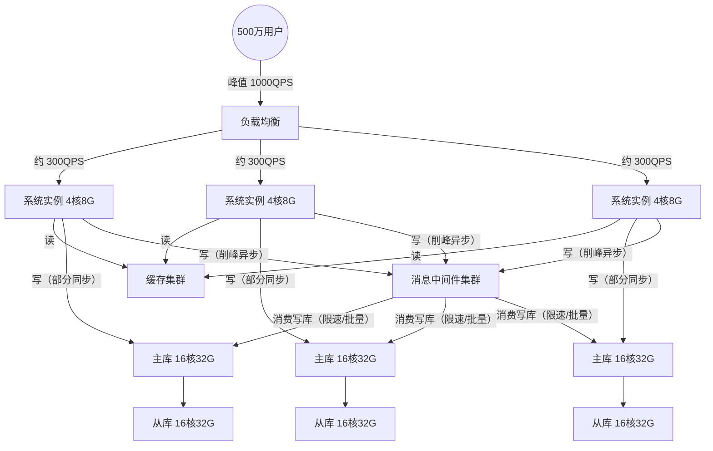
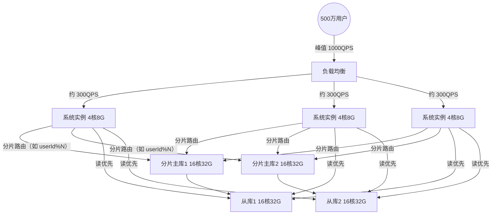

## 高可用通用架构手段速记

### 一、系统拆分

- **微服务架构 + DDD 拆分**
  - 按领域驱动设计（DDD）将复杂业务拆成多个子系统
  - 每个子系统负责专属业务功能，垂直建设
  - 子系统之间边界清晰，降低故障蔓延范围

### 二、解耦

- **目标：高内聚、低耦合**
  - 小到接口抽象、MVC 分层，大到 SOLID 原则、设计模式
  - 目的都是降低模块间耦合，避免一处改动牵一发动全身
- **典型手段**
  - 开闭原则：对扩展开放、对修改关闭
  - AOP（面向切面编程）：通过动态代理拦截方法调用，在前后织入额外逻辑
  - 事件机制（发布-订阅）：新增需求订阅事件即可，减少对原有代码的侵入修改

### 三、异步

- **核心思路：削峰 + 解耦 + 提升吞吐**
  - 使用线程池（`ThreadPoolExecutor`）、消息队列等，将耗时操作异步化
  - 调用方快速返回，耗时逻辑在后台慢慢处理

### 四、重试与幂等

- **重试场景**
  - 远程 RPC 调用受网络抖动、线程阻塞等影响，出现超时/失败
- **幂等常见方案**
  - 插入前先查询是否存在
  - 增加唯一索引约束
  - 建防重表记录请求唯一键
  - 引入状态机（例如订单状态），更新前增加条件判断
  - 加分布式锁
  - Token 机制：服务端校验 token，确保同一请求只被受理一次

### 五、补偿机制

- **适用前提：业务能接受短时间内数据不一致**
- **方向分为两类**
  - 正向补偿：最大努力推动失败任务走向成功状态
  - 逆向补偿：对已经成功的部分执行反向操作，回滚到初始状态
- **常见实现方式**
  - 本地建表记录补偿任务 + 定时任务扫描 + 反射调用补偿逻辑
  - 使用消息中间件承载补偿消息，由消费者执行；失败可依赖 MQ 重试机制

### 六、备份

- **目的：防止单点故障导致数据不可恢复**
  - 服务器、磁盘都有宕机风险，一旦有状态数据，必须有备份
  - 容灾备份是互联网系统的基础能力

### 七、多活策略

- **应对极端灾难场景**
  - 如机房断电、火灾、地震、山洪等不可抗力导致整机房不可用
- **常见多活方案**
  - 同城双活、两地三中心、三地五中心、异地双活、异地多活
  - 目标是保证核心业务 7x24 小时可用

### 八、隔离

- **物理与逻辑双重隔离**
  - 系统低耦合设计，独立代码库、独立部署、独立运维
  - 单个子系统故障不影响其他系统
  - 存在依赖时，通过默认值或异常降级在业务层处理
  - 微服务之间通过 RPC 调用，相互独立、职责清晰

### 九、限流

- **目标：在流量洪峰时保护系统，宁可舍弃部分请求，也要保证核心服务可用**
- **限流定义**
  - 限制到达系统的并发/请求速率
  - 超过阈值的请求直接拒绝，保证存量请求能被正常处理
- **限流维度**
  - 整个系统一定时间内处理多少请求
  - 单个接口的 QPS/QPM
  - 针对 IP、城市、渠道、设备 ID、用户 ID 等的访问频率限制
  - 开放平台可按 appKey 维度配置独立速率
- **常见限流算法**
  - 计数器
  - 滑动窗口
  - 漏桶
  - 令牌桶

### 十、熔断

- **目的：防止故障扩散，避免级联雪崩**
  - 当某资源/依赖出现不稳定（超时、异常比例升高）时，快速失败，不再持续压垮下游
- **断路器三种状态**
  1. **关闭（Closed）**：正常转发请求，同时统计失败次数；超过阈值后进入打开状态
  2. **打开（Open）**：直接拒绝请求并快速失败，不再访问后端；到达超时时间后进入半打开
  3. **半打开（Half Open）**：放行少量请求探测；若成功率达标则转为关闭并重置计数，否则回到打开
- **典型实现**
  - 阿里开源的 Sentinel，提供 Dashboard 控制台定义资源和规则

### 十一、降级

- **本质：舍弃次要，保护核心**
  - 在压力过大或依赖故障时，暂时关闭部分非核心功能
  - 例如关闭推荐、统计、部分报表，只保留下单、支付等关键路径

### 十二、典型高可用架构组合（配图 + Cursor 可预览版）

#### 图 1：MQ 异步削峰填谷 + 读写分离 + 缓存

**Mermaid（Cursor 可预览）**

- **适用场景**
  - 写入有突发洪峰（秒杀/抢购/活动报名/批量导入），数据库峰值扛不住
  - 业务允许“最终一致”，能接受短时间延迟（例如 1~数秒内生效）
- **核心思路**
  - “写请求先排队（进 MQ）”，由消费端按数据库承受能力稳定落库，实现削峰填谷
- **优点**
  - **削峰**：入口写峰值被队列缓冲，数据库按稳定吞吐规划
  - **解耦**：写链路更可控，可扩展多消费者（日志/风控/统计）
  - **抗抖动**：下游慢了先堆积在 MQ，不会立刻拖垮上游
- **代价/风险**
  - **一致性复杂**：需要处理“已返回但未落库”的状态
  - **幂等必做**：重复投递/重复消费不可避免（唯一键/防重表/状态机）
  - **积压必须监控**：堆积是风险信号，需要告警与扩容预案
- **落地注意事项**
  - 可靠投递（至少一次）+ 消费幂等；失败用死信队列 + 补偿
  - 消费端写库要限流/批处理，避免把主库打爆
  - 读路径尽量走缓存/从库，减少主库读压力

#### 图 2：分库分表 + 读写分离（数据库水平扩展）

**Mermaid（Cursor 可预览）**

- **适用场景**
  - 单库容量到瓶颈（表太大/索引太大/备份太慢）
  - 单库吞吐到瓶颈（CPU/IO/连接数吃紧），需要数据库层横向扩容
- **核心思路**
  - 把一个大库拆成多个分片小库；写走主库，读走从库；应用侧做分片路由
- **优点**
  - **容量可扩展**：数据量与请求量可通过“加分片”扩展（一定范围内近似线性）
  - **读能力强**：从库可扩容，读吞吐明显提升
- **代价/风险**
  - **研发复杂度上升**：跨分片查询/排序/分页/聚合更麻烦
  - **分片键选错代价极高**：后续迁移/再分片是重工程
  - **事务能力下降**：跨库事务通常要用最终一致/补偿来替代
- **落地注意事项**
  - 一般建议先做“读写分离 + 缓存”，再做“分库分表”（分片是重工程）
  - 分片键优先选：高基数、稳定、读写都常用（如 userId）
  - 预留扩容：分片数量尽量可平滑扩容（预分片/一致性哈希思路）

### 十三、常用中间件高可用架构（速记）

> 下列为业界常见形态；具体以所用**版本与厂商文档**为准，参数与组件名会随发行版变化。

| 中间件 | 典型 HA 形态 | 核心要点（面试/选型一句话） |
|--------|--------------|----------------------------|
| **MySQL / 主流关系库** | 一主多从 + 半同步/异步复制；或 MGR / Galera 类多主写入集群；云上多为 **多 AZ 主备/只读副本** | 复制延迟与脑裂要可控；自动故障转移靠 **MHA、Orchestrator、云切换** 等；跨 AZ 注意 **RPO/RTO** 与切换演练 |
| **Redis** | **主从复制 + Sentinel** 故障转移；或 **Redis Cluster** 分片多主 | Sentinel 解决「谁升主」；Cluster 解决 **水平扩展与单点**；持久化策略（RDB/AOF）影响 **丢数窗口** |
| **Kafka** | 多 **Broker** 集群；Topic **分区** 多副本（`replication.factor`）；**ISR** 内选 Leader | 可用性靠 **副本 + Controller**；生产端 `acks`、最小同步副本数与 **ISR** 共同决定 **不丢消息与可用性** 的权衡 |
| **RabbitMQ** | **镜像队列 / 仲裁队列（Quorum Queue）** + 多节点集群；前置 **LB** 或客户端多地址 | 经典镜像有同步开销；新版本倾向 **仲裁队列** 做共识复制；磁盘与 **内存流控** 要监控，避免集群雪崩 |
| **RocketMQ** | **多 NameServer**（无状态路由）+ **Broker 主从 / Dledger**（依版本）+ 多副本 | NameServer 可平行扩展；Broker 侧关注 **同步刷盘/同步复制** 与 **消息可靠** 的配置边界 |
| **Elasticsearch** | 多节点集群；索引 **主分片 + 副本分片**；专用 **Master 候选** 与 **数据节点** 角色分离（大规模时） | 副本提供 **读扩展与节点故障容错**；分片数与单分片大小影响 **恢复时间与均衡**；脑裂风险靠 **discovery 与最小主节点数** 等约束 |
| **ZooKeeper / etcd** | **奇数节点** 部署（3/5/7）；跨机架/机房时调 **超时与选举** 参数 | 共识协议（ZK 的 ZAB、etcd 的 Raft）要求 **多数派存活**；不适合当大容量存储或高频写库 |
| **Nginx / API 网关** | 多实例 + 前置 **四层/七层 LB** 或 **Keepalived + VIP**；`upstream` 健康检查与重试 | 网关自身要 **无单点**；注意 **长连接、超时、熔断** 与证书热更新；与 K8s **Ingress** 组合时理解一层 LB 的职责边界 |
| **MongoDB** | **副本集（Replica Set）** 自动选举主节点；大数据量再上 **分片集群（Sharded Cluster）** | 副本集满足大多数场景 HA；分片集群要设计好 **片键** 与 **Config Server** 高可用 |

- **共性归纳**
  - **多副本 / 多节点**：用冗余换可用；副本越多，**一致性成本与运维复杂度**通常越高。
  - **自动故障转移**：要有明确 **选主规则、隔离（fence）、脑裂防护**，并定期 **演练切换**。
  - **观测与容量**：磁盘、网络、连接数、复制/消费 **滞后** 是常见「先慢后挂」的前兆，需告警与预案。
  - **与业务契约**：中间件 HA 只解决「基础设施少宕机」；业务仍要 **幂等、超时、重试、降级**（见上文限流/熔断/补偿）。
