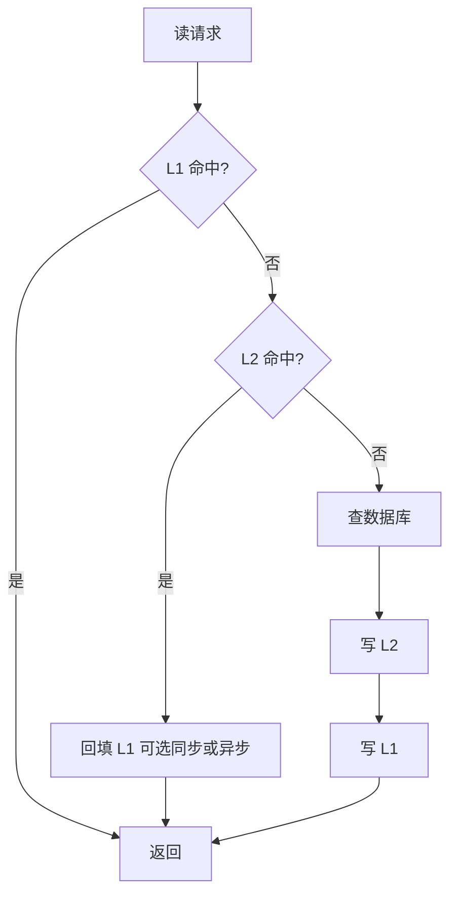

# 双级缓存（L1 本地 + L2 分布式）

**本文目标**：说清楚「为什么用两层、数据怎么读怎么写、多实例下怎么尽量一致、热点怎么进 L1」，便于方案设计或面试前快速复盘。

**术语**：L1 指进程内本地缓存；L2 指 Redis 等分布式缓存；数据源通常指 MySQL 等数据库。

---

## 目录

- [一、为什么要双级](#一为什么要双级)
- [二、典型分层与组件](#二典型分层与组件)
- [三、读取流程（Cache-Aside）](#三读取流程cache-aside)
- [四、写入与更新流程](#四写入与更新流程)
- [五、一致性怎么保](#五一致性怎么保)
- [六、热点发现与下沉](#六热点发现与下沉)
- [七、速查与检查清单](#七速查与检查清单)

---

## 一、为什么要双级

- **L1**：命中时无网络、延迟可做到亚毫秒级，适合「极热、读多」的小块数据。
- **L2**：全实例共享，避免每台机器各自打穿数据库；也是广播失效、统一回源的枢纽。
- **组合**：用 L1 扛峰值读，用 L2 扛共享与部分一致性手段；数据库仍是最终持久化与复杂查询的归宿。

> **边界**：具体延迟、容量、淘汰算法以所选组件与压测为准；下文为常见工程实践，不是唯一标准答案。

---

## 二、典型分层与组件

| 层次 | 作用 | 常见技术（示例） |
|------|------|------------------|
| L1 本地缓存 | 最热数据，进程内读写 | Java：Caffeine、Guava Cache（W-TinyLFU 等淘汰策略） |
| L2 分布式缓存 | 共享缓存、回源枢纽 | Redis |
| 数据源 | 持久化与权威数据 | MySQL 等 |

---

## 三、读取流程（Cache-Aside）

自上而下查询，未命中则向下，命中后视情况回填上层。

**要点简述**

1. 先查 L1；命中则直接返回（最快路径）。
2. L1 未命中则查 L2；命中则返回，并将数据**回填 L1**（同步或异步均可，需权衡一致性与实现复杂度）。
3. L2 未命中则查库；取到后一般**先写 L2 再写 L1**（也可根据团队规范调整顺序，但要与失效策略一致），再返回。

---

## 四、写入与更新流程

常见思路：**先更新数据库，再删缓存**（避免「先删缓存再写库」在并发下更容易出现长时间脏读的路径，具体仍以业务并发模型为准）。

推荐顺序（常见写法）：

1. **更新数据库**（权威数据先落地）。
2. **删除 L2** 中对应 key（而不是盲目覆盖为「可能未完整」的值，视业务也可采用双写 + 版本号等更强方案）。
3. **失效所有实例的 L1**：单进程内可直接删本地 entry；多实例需配合广播（见下一节）。

---

## 五、一致性怎么保

**难点**：L1 在每个进程里各有一份，更新发生后若只清本机 L1，其他机器仍可能读到旧数据。

**常见方案：基于 Redis 的发布/订阅（Pub/Sub）**

- 某实例完成「删 L2」后，向约定 **Channel** 发布一条「某 key / 某前缀失效」消息。
- 其他实例 **Subscribe** 该频道，收到后删除自己内存里对应条目。

**能到什么程度**

- 多为 **最终一致性**：消息在途的极短时间内，不同节点 L1 可能短暂不一致，随后趋于一致。
- 这是在高 QPS 与强一致之间的常见折中；若业务要求强一致，需引入版本号、读写路由、分布式锁或更重的协调机制，成本显著上升。

**补充（实践中会碰到）**

- Pub/Sub **不持久化**：订阅方短时断连可能漏消息，要有兜底（例如较短 TTL、定时对账、或改用 Redis Stream / 可靠消息总线等，按体量选型）。
- **雪崩与击穿**：热点 key 过期时的保护（互斥回源、逻辑过期、随机 TTL 等）在双级场景同样要考虑，且 L1、L2 TTL 建议分层设计。

---

## 六、热点发现与下沉

「下沉」指把识别到的热点主动放进 L1（或延长 L1 寿命），减少反复访问 L2/DB。

常见做法：

1. **访问计数**：对 key 维护计数（进程内或借助 L2 的轻量结构，视规模而定）。
2. **滑动时间窗口**：只统计最近 N 秒/分钟，避免「曾经很热、现在已冷」仍占 L1。
3. **阈值触发**：窗口内超过阈值则判为热点，执行预热（异步加载进 L1）或调整策略（如更长本地 TTL，需谨慎与失效广播配合）。

---

## 七、速查与检查清单

**读路径口诀**：L1 → L2 → DB；回程按需回填 L1。

**写路径口诀（常见）**：更新 DB → 删 L2 → 广播失效各节点 L1。

**上线前可自问**

- [ ] L1、L2 的 **TTL** 与 **淘汰策略** 是否区分清楚？是否避免大面积同时过期？
- [ ] 多实例下 **L1 失效** 是否覆盖（Pub/Sub 或其它）？断连是否有兜底？
- [ ] **大 key、热 key** 是否单独治理（拆分、本地限流、监控）？
- [ ] 是否与 **Cache-Aside** 之外的模式（如 Read-Through、Write-Through）混用？混用时顺序是否全团队统一？

**延伸阅读（主题关键词）**

- 缓存穿透、击穿、雪崩
- Redis Pub/Sub 与 Stream 的差异与选型
- Caffeine 配置与统计 API（命中率、驱逐原因）

---

*本文为常见架构归纳；具体中间件版本与参数以官方文档与压测结果为准。*
